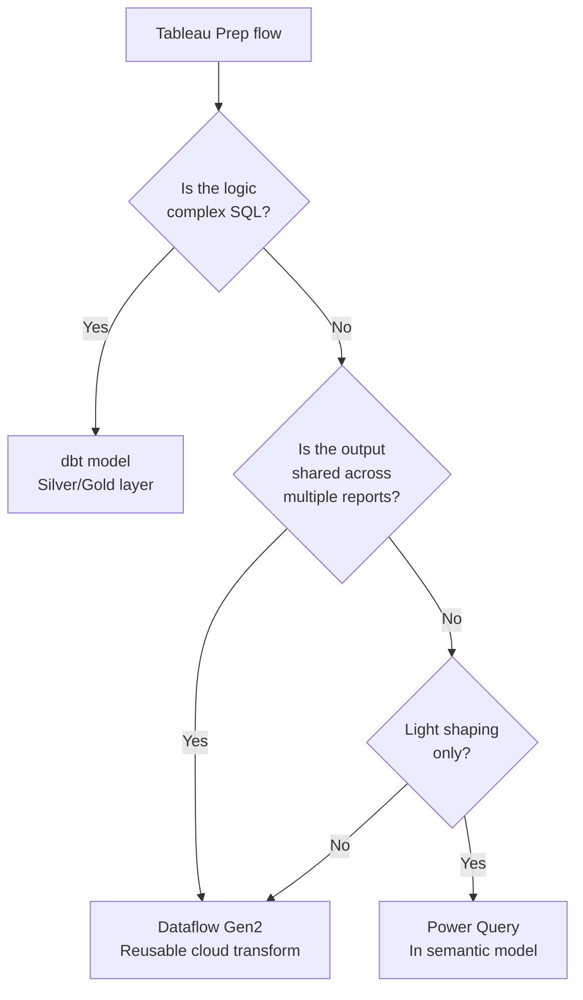

# Prep Migration: Tableau Prep to Power Query / Dataflows / dbt

**A comprehensive guide for migrating Tableau Prep Builder flows to Power Query M, Dataflow Gen2, or dbt models.**

---

## Overview

Tableau Prep Builder provides a visual, node-based data preparation experience. Power BI offers three alternatives, each suited to different scenarios:

1. **Power Query (M language)** — built into Power BI Desktop, good for light-to-medium transforms
2. **Dataflow Gen2** — cloud-based, reusable, shareable Power Query with scheduled refresh
3. **dbt (data build tool)** — SQL-based transformation in the data warehouse layer

This guide maps every Tableau Prep step type to its equivalent in each tool and provides guidance on which tool to choose.

---

## 1. When to use which tool

### 1.1 Decision matrix

| Scenario | Recommended tool | Why |
|---|---|---|
| Light transforms (rename, filter, type cast) | Power Query in semantic model | Fastest; stays in the Power BI workflow |
| Reusable transforms shared across reports | Dataflow Gen2 | Cloud-based; multiple reports consume the output |
| Complex business logic (multi-table joins, aggregations) | dbt on csa-inabox | SQL-based; version-controlled; testable; runs in the data warehouse |
| Data scientists / advanced analysts | Fabric notebooks (Python/Spark) | Full programming language for complex preparation |
| Simple file unions (monthly CSV files) | Power Query in semantic model | Folder connector handles this natively |
| ETL replacing Prep Conductor scheduling | Dataflow Gen2 or dbt + ADF/Fabric pipeline | Both support scheduled execution |

### 1.2 The csa-inabox recommendation



!!! tip "Prefer dbt for transformation logic"
    With csa-inabox, transformation logic should live in dbt models, not in Power Query or Dataflows. dbt models are version-controlled, testable, and produce Delta tables that Power BI can read via Direct Lake. Power Query should handle only the last mile of shaping between Gold tables and the semantic model.

---

## 2. Step-by-step mapping: Tableau Prep to Power Query

### 2.1 Input step

| Tableau Prep | Power Query equivalent | M code example |
|---|---|---|
| Connect to database table | Get Data → Database connector | `= Sql.Database("server", "database")` |
| Connect to CSV file | Get Data → Text/CSV | `= Csv.Document(File.Contents("path"))` |
| Connect to Excel file | Get Data → Excel | `= Excel.Workbook(File.Contents("path"))` |
| Connect to Tableau Extract | Not applicable | Extract data does not exist in Power BI; connect to source |
| Connect to published data source | Live connection to semantic model | Use "Power BI datasets" connector |
| Wildcard union (multiple files) | Folder connector | `= Folder.Files("folder_path")` then combine |

**Example: Folder connector for multiple CSV files**

```m
// Tableau Prep: Input → Wildcard Union → *.csv from folder

// Power Query M:
let
    Source = Folder.Files("\\server\data\monthly"),
    FilteredCSV = Table.SelectRows(Source, each [Extension] = ".csv"),
    CombinedData = Table.Combine(
        Table.AddColumn(FilteredCSV, "Data",
            each Csv.Document([Content], [Delimiter=",", Encoding=65001])
        )[Data]
    )
in
    CombinedData
```

### 2.2 Clean step

| Tableau Prep operation | Power Query equivalent | M code |
|---|---|---|
| **Rename column** | Right-click → Rename | `= Table.RenameColumns(Source, {{"old", "new"}})` |
| **Remove column** | Right-click → Remove | `= Table.RemoveColumns(Source, {"ColName"})` |
| **Change data type** | Transform → Data Type | `= Table.TransformColumnTypes(Source, {{"Col", type number}})` |
| **Filter rows** | Home → Keep Rows / Remove Rows | `= Table.SelectRows(Source, each [Col] > 100)` |
| **Replace values** | Transform → Replace Values | `= Table.ReplaceValue(Source, "old", "new", Replacer.ReplaceText, {"Col"})` |
| **Split column** | Transform → Split Column | `= Table.SplitColumn(Source, "Col", Splitter.SplitTextByDelimiter("-"))` |
| **Merge columns** | Add Column → Custom Column | `= Table.AddColumn(Source, "Full", each [First] & " " & [Last])` |
| **Remove duplicates** | Home → Remove Rows → Remove Duplicates | `= Table.Distinct(Source, {"KeyCol"})` |
| **Remove nulls** | Home → Remove Rows → Remove Blank Rows | `= Table.SelectRows(Source, each [Col] <> null)` |
| **Calculate field** (row-level) | Add Column → Custom Column | `= Table.AddColumn(Source, "NewCol", each [Price] * [Qty])` |
| **Group & Replace** (manual mapping) | Replace Values or conditional column | `= Table.AddColumn(Source, "Group", each if [Region] = "NY" then "Northeast" else [Region])` |

### 2.3 Join step

| Tableau Prep join | Power Query merge | Notes |
|---|---|---|
| **Inner join** | Merge Queries → Inner | `JoinKind.Inner` |
| **Left join** | Merge Queries → Left Outer | `JoinKind.LeftOuter` |
| **Right join** | Merge Queries → Right Outer | `JoinKind.RightOuter` |
| **Full outer join** | Merge Queries → Full Outer | `JoinKind.FullOuter` |
| **Left anti join** (not in right) | Merge Queries → Left Anti | `JoinKind.LeftAnti` |
| **Right anti join** | Merge Queries → Right Anti | `JoinKind.RightAnti` |
| **Multi-key join** | Merge on multiple columns | Select multiple columns in the merge dialog |

**Example: Left outer join**

```m
// Tableau Prep: Join Step → Left Join on CustomerID

// Power Query M:
let
    Orders = ...,
    Customers = ...,
    Merged = Table.NestedJoin(
        Orders, {"CustomerID"},
        Customers, {"CustomerID"},
        "CustomerDetails",
        JoinKind.LeftOuter
    ),
    Expanded = Table.ExpandTableColumn(Merged, "CustomerDetails",
        {"CustomerName", "Region", "Segment"})
in
    Expanded
```

### 2.4 Union step

| Tableau Prep union | Power Query append | Notes |
|---|---|---|
| Union two tables | Append Queries | `= Table.Combine({Table1, Table2})` |
| Union multiple tables | Append Queries (three or more) | Select multiple tables in the Append dialog |
| Wildcard union (files) | Folder connector | Combine files from a folder |
| Mismatched columns | Append handles automatically | Columns not in both tables get null values |

### 2.5 Pivot and unpivot

| Tableau Prep pivot | Power Query equivalent | Notes |
|---|---|---|
| **Pivot (rows to columns)** | Transform → Pivot Column | Select value column, choose aggregation |
| **Unpivot (columns to rows)** | Transform → Unpivot Columns | Select columns to unpivot |
| **Unpivot other columns** | Transform → Unpivot Other Columns | Select columns to keep, unpivot the rest |

**Example: Unpivot monthly columns**

```m
// Tableau Prep: Pivot Rows to Columns on month columns
// Source table: Product, Jan, Feb, Mar, Apr, ...

// Power Query M:
let
    Source = ...,
    Unpivoted = Table.UnpivotOtherColumns(Source, {"Product"}, "Month", "Sales")
in
    Unpivoted
// Result: Product | Month | Sales (one row per product per month)
```

### 2.6 Aggregate step

| Tableau Prep aggregate | Power Query Group By | Notes |
|---|---|---|
| Group by dimensions, aggregate measures | Transform → Group By | `= Table.Group(Source, {"Dim"}, {{"Total", each List.Sum([Amount])}})` |
| Multiple aggregations | Group By with multiple columns | Add multiple aggregation columns in the dialog |
| Count distinct | Group By → Count Distinct Rows | `each Table.RowCount(Table.Distinct(_))` |

**Example: Group by with multiple aggregations**

```m
// Tableau Prep: Aggregate → Group by Region, SUM(Sales), AVG(Profit)

// Power Query M:
let
    Source = ...,
    Grouped = Table.Group(Source, {"Region"}, {
        {"Total Sales", each List.Sum([Sales]), type number},
        {"Avg Profit", each List.Average([Profit]), type number},
        {"Order Count", each Table.RowCount(_), Int64.Type}
    })
in
    Grouped
```

### 2.7 Output step

| Tableau Prep output | Power Query equivalent | Notes |
|---|---|---|
| Published data source | Semantic model (dataset) | Publish to Power BI Service |
| Hyper file extract | Import mode dataset | Data stored in Power BI |
| CSV file | Not applicable in Power Query | Use Power Automate or ADF for file output |
| Database table | Dataflow Gen2 → Lakehouse table | Dataflow outputs to Fabric Lakehouse |

---

## 3. Step-by-step mapping: Tableau Prep to dbt

### 3.1 When to use dbt instead of Power Query

Use dbt when:

- The transformation involves complex SQL joins across multiple tables
- The logic should be version-controlled and tested
- Multiple consumers (Power BI, APIs, notebooks) need the same output
- The transformation is part of the csa-inabox Silver/Gold layer

### 3.2 Prep steps to dbt equivalents

| Tableau Prep step | dbt equivalent | Example |
|---|---|---|
| **Input** | `source()` macro | `{{ source('raw', 'orders') }}` |
| **Clean** (filter, rename) | SQL SELECT with aliases | `SELECT col AS new_name FROM source WHERE condition` |
| **Join** | SQL JOIN | `FROM orders LEFT JOIN customers ON ...` |
| **Union** | SQL UNION ALL | `SELECT * FROM table1 UNION ALL SELECT * FROM table2` |
| **Pivot** | SQL PIVOT or CASE WHEN | Use conditional aggregation |
| **Unpivot** | SQL UNPIVOT or UNION | Stack columns with UNION ALL |
| **Aggregate** | SQL GROUP BY | `SELECT dim, SUM(measure) FROM ... GROUP BY dim` |
| **Output** | dbt materialization (table/view) | `{{ config(materialized='table') }}` |

### 3.3 Example: Complete Prep flow as dbt model

```sql
-- Tableau Prep flow:
-- Input: raw_orders + raw_customers
-- Join: LEFT JOIN on customer_id
-- Filter: order_date >= '2024-01-01'
-- Calculate: total_amount = quantity * unit_price
-- Aggregate: by region, SUM(total_amount)
-- Output: regional_sales

-- dbt model: models/gold/regional_sales.sql
{{ config(materialized='table') }}

WITH orders AS (
    SELECT * FROM {{ ref('stg_orders') }}
    WHERE order_date >= '2024-01-01'
),

customers AS (
    SELECT * FROM {{ ref('stg_customers') }}
),

joined AS (
    SELECT
        o.*,
        c.region,
        c.segment,
        o.quantity * o.unit_price AS total_amount
    FROM orders o
    LEFT JOIN customers c ON o.customer_id = c.customer_id
),

aggregated AS (
    SELECT
        region,
        SUM(total_amount) AS total_sales,
        COUNT(DISTINCT customer_id) AS customer_count,
        AVG(total_amount) AS avg_order_value
    FROM joined
    GROUP BY region
)

SELECT * FROM aggregated
```

---

## 4. Prep Conductor to Dataflow/dbt scheduling

### 4.1 Scheduling comparison

| Tableau Prep Conductor | Power BI / Fabric equivalent | Notes |
|---|---|---|
| Linked task (run flow after extract) | Dataflow refresh → Dataset refresh chain | Configure dataset to refresh after dataflow |
| Schedule (time-based) | Scheduled refresh | Configure in dataset/dataflow settings |
| Ad-hoc run | Manual refresh button | "Refresh now" in Power BI Service |
| Flow failure notification | Refresh failure email | Configure in dataset settings |
| Flow run history | Refresh history | View in dataset/dataflow settings |
| Prep Conductor license | Included in Fabric/Premium | No additional license needed |

### 4.2 Refresh chain example

```
// Tableau: Prep flow runs → publishes data source → extract refreshes → workbook updated

// Power BI / Fabric:
// 1. Fabric Pipeline runs dbt models (updates Gold tables)
// 2. Dataflow Gen2 refreshes (if used for additional shaping)
// 3. Semantic model refresh triggers (Import mode) or data is immediately available (Direct Lake)
// 4. Subscriptions send updated reports

// Configuration:
// - Fabric Pipeline: scheduled via Fabric or ADF
// - Dataflow: scheduled in workspace settings
// - Dataset: "Refresh after dataflow" option or scheduled independently
```

---

## 5. Migration checklist for Prep flows

For each Tableau Prep flow:

- [ ] Document the flow structure (input, clean, join, aggregate, output steps)
- [ ] Identify the source systems and connection details
- [ ] Determine the appropriate target tool (Power Query, Dataflow Gen2, or dbt)
- [ ] Rebuild the transformation logic in the target tool
- [ ] Validate output by comparing row counts and key measures
- [ ] Configure scheduling (refresh frequency, chaining)
- [ ] Set up failure notifications
- [ ] Update dependent reports to use the new data source
- [ ] Decommission the Tableau Prep flow
- [ ] Remove the Prep Conductor schedule from Tableau Server

### 5.1 Effort estimation

| Prep flow complexity | Characteristics | Estimated migration effort |
|---|---|---|
| Simple | 1-2 inputs, filters, renames, single output | 2-4 hours |
| Medium | 2-3 inputs, joins, calculated fields, pivots | 4-8 hours |
| Complex | 4+ inputs, multiple joins, aggregations, conditional logic | 8-16 hours |
| Very complex | Complex with parameterized queries, LOD-like logic, custom SQL | 16-32 hours |

---

## 6. Power Query M quick reference

### 6.1 Essential M functions for Prep migrants

```m
// Connect to SQL Server
= Sql.Database("server.database.windows.net", "mydatabase")

// Filter rows
= Table.SelectRows(Source, each [Amount] > 0 and [Date] >= #date(2024, 1, 1))

// Add calculated column
= Table.AddColumn(Source, "Revenue", each [Qty] * [Price], type number)

// Rename columns
= Table.RenameColumns(Source, {{"old_name", "new_name"}, {"old2", "new2"}})

// Change data types
= Table.TransformColumnTypes(Source, {{"Date", type date}, {"Amount", type number}})

// Remove columns
= Table.RemoveColumns(Source, {"UnneededCol1", "UnneededCol2"})

// Replace values
= Table.ReplaceValue(Source, null, 0, Replacer.ReplaceValue, {"Amount"})

// Merge (join) tables
= Table.NestedJoin(Orders, {"CustID"}, Customers, {"CustID"}, "Cust", JoinKind.LeftOuter)

// Expand merged table
= Table.ExpandTableColumn(Merged, "Cust", {"Name", "Region"})

// Append (union) tables
= Table.Combine({Table1, Table2, Table3})

// Group by (aggregate)
= Table.Group(Source, {"Region"}, {{"Total", each List.Sum([Amount]), type number}})

// Unpivot columns
= Table.UnpivotOtherColumns(Source, {"Product"}, "Month", "Sales")

// Pivot column
= Table.Pivot(Source, List.Distinct(Source[Month]), "Month", "Sales", List.Sum)

// Conditional column
= Table.AddColumn(Source, "Tier", each if [Amount] > 1000 then "High" else "Low")

// Remove duplicates
= Table.Distinct(Source, {"KeyCol"})

// Sort
= Table.Sort(Source, {{"Date", Order.Descending}})
```

---

**Last updated:** 2026-04-30
**Maintainers:** CSA-in-a-Box core team
**Related:** [Data Source Migration](data-source-migration.md) | [Feature Mapping](feature-mapping-complete.md) | [Migration Playbook](../tableau-to-powerbi.md)
