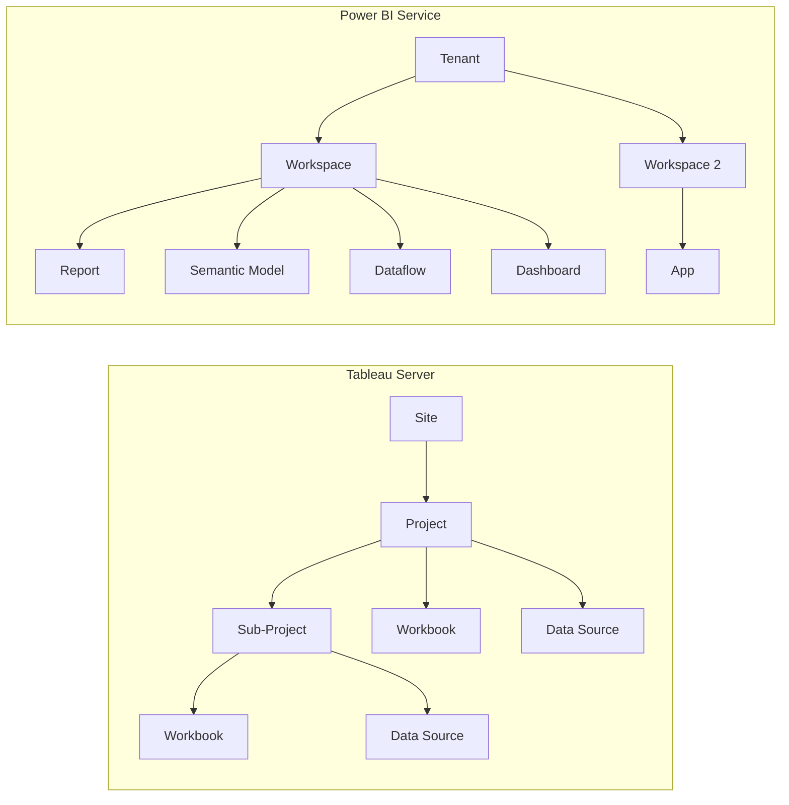

# Server Migration: Tableau Server to Power BI Service

**A comprehensive guide for migrating Tableau Server (or Tableau Cloud) infrastructure — sites, projects, workbooks, permissions, schedules, subscriptions, and monitoring — to Power BI Service.**

---

## Overview

Server migration covers the infrastructure and administration layer: how content is organized, who has access, how data refreshes, and how administrators monitor the environment. This guide maps every Tableau Server concept to its Power BI Service equivalent and provides step-by-step migration procedures.

---

## 1. Architecture comparison

### 1.1 Tableau Server vs Power BI Service

| Aspect | Tableau Server | Power BI Service |
|---|---|---|
| **Deployment** | On-premises VMs or Tableau Cloud (SaaS) | SaaS only (cloud); Report Server for on-prem |
| **Infrastructure management** | Customer-managed (patching, backups, scaling) | Microsoft-managed |
| **Scalability** | Add nodes manually | Automatic (within capacity SKU) |
| **High availability** | Multi-node cluster configuration | Built-in (SaaS) |
| **Disaster recovery** | Customer-managed (backup/restore) | Built-in with geo-redundancy |
| **Upgrades** | Scheduled maintenance windows | Rolling updates by Microsoft |
| **Multi-tenancy** | Sites (isolated environments) | Tenants + Fabric capacities |

### 1.2 Content hierarchy mapping



---

## 2. Sites to workspaces

### 2.1 Concept mapping

| Tableau concept | Power BI concept | Migration guidance |
|---|---|---|
| **Site** (isolated content boundary) | Workspace or separate Fabric capacity | Use separate capacities for strict isolation; workspaces for team separation |
| **Default site** | Default workspace ("My workspace") | My workspace is personal; do not use for shared content |
| **Project** (folder structure) | Workspace | Create one workspace per project or team |
| **Sub-project** (nested folders) | Workspace + naming convention | Power BI workspaces are flat; use naming: `Team - Project` |
| **Personal space** | "My workspace" | Each user has a personal workspace |

### 2.2 Workspace design patterns

**Pattern 1: Workspace per team** (most common)

```
Workspace: "Sales Analytics"
  - Sales Semantic Model (shared)
  - Sales Dashboard Report
  - Sales Detail Report
  - Sales Monthly Report

Workspace: "Finance Analytics"
  - Finance Semantic Model (shared)
  - Budget vs Actual Report
  - P&L Report
```

**Pattern 2: Workspace per lifecycle stage** (for ALM)

```
Workspace: "Sales Analytics [Dev]"
Workspace: "Sales Analytics [Test]"
Workspace: "Sales Analytics [Prod]"
// Use deployment pipelines to promote content
```

**Pattern 3: Shared semantic model workspace** (for governance)

```
Workspace: "Enterprise Semantic Models"
  - Sales Semantic Model (Certified)
  - Finance Semantic Model (Certified)
  - HR Semantic Model (Certified)

Workspace: "Sales Reports"
  - Sales Dashboard (live connection to Sales Semantic Model)
  - Sales Detail (live connection to Sales Semantic Model)
```

!!! tip "Separate semantic models from reports"
    For large organizations, consider separating semantic models into dedicated workspaces with restricted access. Reports in other workspaces connect via live connection. This mirrors Tableau's published data source pattern and provides better governance.

### 2.3 Workspace naming conventions

| Tableau hierarchy | Power BI workspace name | Example |
|---|---|---|
| Site: Default, Project: Sales | `Sales` or `Sales Analytics` | `Sales Analytics` |
| Site: Default, Project: Finance, Sub: Budget | `Finance - Budget` | `Finance - Budget` |
| Site: Marketing, Project: Campaign Analytics | `Marketing - Campaign Analytics` | `Marketing - Campaign Analytics` |
| Site: Executive, Project: Board Reports | `Executive - Board Reports` | `Executive - Board Reports` |

---

## 3. Groups and permissions

### 3.1 Tableau groups to Entra ID security groups

| Tableau concept | Power BI concept | Migration steps |
|---|---|---|
| Local group | Entra ID security group | Create security groups in Entra ID matching Tableau groups |
| Active Directory group | Entra ID security group | Existing AD groups sync to Entra ID automatically |
| Group membership | Entra ID group membership | Add users to groups; groups assigned to workspace roles |
| Guest users | Entra ID B2B guests | Invite external users via Entra B2B; assign to groups |

### 3.2 Tableau site roles to Power BI workspace roles

| Tableau site role | Power BI workspace role | Capabilities |
|---|---|---|
| **Site Administrator / Creator** | **Admin** | Full control: settings, membership, delete workspace |
| **Creator** | **Member** | Publish, manage, share content; manage refresh; cannot delete workspace |
| **Explorer (Can Publish)** | **Contributor** | Publish and update content; cannot manage membership |
| **Explorer** | **Viewer** (via App) | View and interact with published App content |
| **Viewer** | **Viewer** (via App or shared link) | View-only access |

### 3.3 Content-level permissions

| Tableau permission | Power BI equivalent | How to configure |
|---|---|---|
| **Project permissions** (default for contents) | Workspace role | Workspace role applies to all content in the workspace |
| **Workbook permissions** (override project) | App audience + per-item sharing | Share specific reports via links or Apps with audiences |
| **Data source permissions** | Semantic model permissions + Build permission | Grant "Build" permission for users who need to create reports on the model |
| **View permission** | Viewer role or App access | Viewers access through Apps or direct sharing |
| **Download/export** | Export settings in admin portal | Admin can control export formats globally |

### 3.4 Permission migration steps

1. **Export Tableau groups** — use Tableau REST API to list all groups and members
2. **Create Entra ID security groups** — mirror Tableau groups in Entra ID
3. **Map members** — ensure Tableau users exist in Entra ID (usually already the case for AD-synced environments)
4. **Assign workspace roles** — add security groups to workspaces with appropriate roles
5. **Configure App audiences** — for consumer-facing content, create Apps with audience groups
6. **Test access** — validate that each user group can access the same content they had in Tableau

---

## 4. Row-level security (RLS)

### 4.1 Tableau user filters to Power BI RLS

Tableau user filters (e.g., `[Region] = USERNAME()`) map to Power BI row-level security (RLS) roles.

**Tableau approach:**

```
// Data source filter: [Region] = USERNAME()
// Or calculated field: IF ISMEMBEROF("East Team") THEN "East" END
```

**Power BI approach:**

```dax
// Step 1: Create RLS role in Power BI Desktop
// Modeling → Manage Roles → New Role
// Role name: "RegionFilter"
// Table: Sales
// DAX filter expression:
[Region] = USERPRINCIPALNAME()
```

### 4.2 Group-based RLS with mapping table

For organizations with complex security (users see data for multiple regions), use a security mapping table:

```dax
// Security mapping table (in the semantic model):
// UserEmail          | Region
// user1@company.com  | East
// user1@company.com  | Central
// user2@company.com  | West

// RLS role DAX expression on the Sales table:
CONTAINS(
    SecurityMapping,
    SecurityMapping[UserEmail], USERPRINCIPALNAME(),
    SecurityMapping[Region], Sales[Region]
)
```

### 4.3 Dynamic RLS patterns

| RLS pattern | DAX implementation | Use case |
|---|---|---|
| User-to-dimension mapping | `USERPRINCIPALNAME()` matched to mapping table | Users see their assigned regions/departments |
| Manager hierarchy | `PATH` function with parent-child hierarchy | Managers see their direct reports' data |
| Data-driven roles | Mapping table maintained by business users | Self-service security assignment |
| Cross-filter RLS | RLS on dimension table, cross-filters to fact | Single security table controls all fact tables |

### 4.4 RLS migration validation

After configuring RLS:

1. **Test with "View as" role** — in Power BI Desktop, Modeling → View as → select role
2. **Test with specific users** — in Power BI Service, use "Test as" with real user identities
3. **Compare results** — validate that the same user sees the same data in both Tableau and Power BI
4. **Test edge cases** — users with multiple roles, users with no mapping, new users

---

## 5. Subscriptions and alerts

### 5.1 Subscriptions

| Tableau subscription | Power BI subscription | Notes |
|---|---|---|
| Email subscription (PNG/PDF of view) | Email subscription (PNG/PDF of page) | Similar capability; configure per-report or per-page |
| Subscription schedule (daily, weekly) | Subscription schedule (daily, weekly, after refresh) | Power BI adds "after data refresh" trigger |
| Subscription to specific view | Subscription to specific page | Select pages within a report |
| Subscription with filters | Subscription with slicer state | Subscriber can save filter state before subscribing |
| Custom email message | Subject line customization | Limited customization in Power BI |

### 5.2 Data alerts

| Tableau alert | Power BI alert | Notes |
|---|---|---|
| Conditional alert on dashboard | Data alert on dashboard tile | Set threshold on a KPI card or gauge |
| Alert notification | Email + mobile notification | Power BI sends to email and mobile app |
| Alert frequency | Configurable (hourly, daily) | Configure check frequency |

### 5.3 Data Activator (advanced alerting)

Power BI Data Activator extends basic alerts with automated actions:

- Trigger Power Automate flows when data conditions are met
- Send Teams messages to specific channels
- Create ServiceNow tickets automatically
- Trigger Azure Functions for custom logic
- Monitor data in real-time, not just on refresh

Tableau has no equivalent to Data Activator.

---

## 6. Scheduled refresh

### 6.1 Tableau extract schedules to Power BI refresh schedules

| Tableau schedule concept | Power BI concept | Notes |
|---|---|---|
| Extract refresh schedule | Dataset refresh schedule | Configure in dataset settings |
| Full extract refresh | Full refresh (default) | Replaces all data |
| Incremental extract refresh | Incremental refresh policy | Define partition key (date column), rolling window |
| Background task (extract) | Refresh history | Monitor in dataset settings |
| Refresh frequency | Up to 48/day (Premium) or 8/day (Pro) | Premium/Fabric capacity unlocks higher frequency |
| Subscription-triggered refresh | "After data refresh" subscription | Emails sent only after successful refresh |

### 6.2 Configuring scheduled refresh

```
Step 1: Publish semantic model to Power BI Service
Step 2: Navigate to Dataset Settings
Step 3: Expand "Scheduled refresh"
Step 4: Set refresh frequency (daily, weekly) and times
Step 5: Configure data source credentials (if not already set)
Step 6: Configure gateway connection (for on-prem sources)
Step 7: Enable "Send refresh failure notification"
Step 8: Test with "Refresh now"
```

### 6.3 Incremental refresh (for large datasets)

```
// Power BI incremental refresh replaces Tableau incremental extract:
// 1. Create Power Query parameters: RangeStart and RangeEnd (DateTime type)
// 2. Filter source table by date column between RangeStart and RangeEnd
// 3. In Power BI Desktop: right-click table → Incremental refresh
// 4. Configure:
//    - Archive data starting: 3 years ago
//    - Incrementally refresh data starting: 30 days ago
//    - Only refresh complete days: checked
```

---

## 7. Admin monitoring and governance

### 7.1 Tableau Server admin tools to Power BI admin

| Tableau admin tool | Power BI equivalent | Notes |
|---|---|---|
| **Admin views** (background tasks, traffic) | **Admin portal** + **Usage metrics** | Admin portal for tenant-wide; Usage metrics per workspace |
| **Status page** (server health) | **Fabric Capacity Metrics App** | Monitor capacity utilization, throttling, performance |
| **Resource Monitoring Tool** (RMT) | **Capacity Metrics App** + **Log Analytics** | Detailed performance monitoring |
| **Content Migration Tool** | **Deployment pipelines** | Promote content across Dev/Test/Prod |
| **User activity log** | **Activity log** + **Audit log** | Track user actions; integrate with Sentinel for security |
| **Site settings** | **Tenant settings** (Admin portal) | Global policies for the Power BI tenant |
| **Tableau Metadata API** | **Scanner API** + **XMLA endpoints** | Programmatic metadata access |

### 7.2 Usage metrics migration

Tableau Server tracks views, users, and data source usage. Power BI provides similar telemetry:

| Metric | Tableau source | Power BI source |
|---|---|---|
| Report views | Admin views → traffic | Usage metrics report (per workspace) |
| Unique users | Admin views → users | Usage metrics or Activity log |
| Last accessed date | Admin views → content | Usage metrics or Scanner API |
| Data source usage | Admin views → data sources | Dataset usage in Admin portal |
| Performance (render time) | Admin views → performance | Performance analyzer (Desktop) + Capacity metrics |
| Stale content | Last accessed > 90 days | Usage metrics → filter by date range |

### 7.3 Admin portal key settings

After migration, configure these tenant settings in the Power BI Admin portal:

| Setting | Recommended value | Why |
|---|---|---|
| Allow users to create workspaces | Specific security groups | Prevent workspace sprawl |
| Export to Excel | Enabled for all (or specific groups) | Match Tableau export permissions |
| Embed content in apps | Enabled for specific groups | Control embedded analytics access |
| Publish to web (public) | Disabled | Prevent accidental public exposure |
| Allow XMLA endpoints | Premium/Fabric only | Enable external tools (DAX Studio, Tabular Editor) |
| Certification | Specific groups (data stewards) | Control who can certify semantic models |
| Featured content | Enabled | Highlight important reports on the Power BI Home |

---

## 8. Tableau REST API to Power BI REST API

### 8.1 API mapping

| Tableau REST API operation | Power BI REST API | Endpoint |
|---|---|---|
| Sign in | OAuth 2.0 / service principal | Entra ID token acquisition |
| List sites | N/A (single tenant) | Tenant-level operations |
| List workbooks | List reports in workspace | `GET /groups/{groupId}/reports` |
| Get workbook | Get report | `GET /reports/{reportId}` |
| Download .twbx | Export .pbix | `POST /reports/{reportId}/Export` |
| Publish workbook | Import .pbix | `POST /groups/{groupId}/imports` |
| List data sources | List datasets | `GET /groups/{groupId}/datasets` |
| Refresh extract | Trigger refresh | `POST /datasets/{datasetId}/refreshes` |
| List users | Microsoft Graph API | `GET /users` |
| List groups | List workspaces | `GET /groups` |
| Add user to group | Add user to workspace | `POST /groups/{groupId}/users` |
| Query views | Get pages | `GET /reports/{reportId}/pages` |
| Metadata API | Scanner API | `POST /admin/workspaces/getInfo` |

### 8.2 Automation migration

For organizations with Tableau REST API automation:

1. **Inventory all API calls** — document every automated process that uses the Tableau REST API
2. **Map to Power BI API** — use the table above to find equivalent endpoints
3. **Update authentication** — replace Tableau PAT/credentials with Entra ID service principal
4. **Update scripts** — rewrite automation scripts to use Power BI REST API
5. **Test thoroughly** — validate that automated processes produce the same results

---

## 9. Migration execution checklist

### Phase 1: Workspace setup

- [ ] Design workspace hierarchy (based on Tableau site/project structure)
- [ ] Create workspaces in Power BI Service
- [ ] Create Entra ID security groups matching Tableau groups
- [ ] Assign workspace roles to security groups
- [ ] Configure tenant settings in Admin portal

### Phase 2: Security configuration

- [ ] Implement RLS roles in semantic models
- [ ] Create security mapping tables (for dynamic RLS)
- [ ] Test RLS with representative users
- [ ] Configure data source credentials in Power BI Service
- [ ] Set up on-premises data gateway (if replacing Tableau Bridge)

### Phase 3: Refresh and automation

- [ ] Configure scheduled refresh for all Import-mode datasets
- [ ] Set up incremental refresh for large datasets
- [ ] Recreate subscriptions
- [ ] Configure data alerts
- [ ] Migrate API automation scripts

### Phase 4: Monitoring and governance

- [ ] Deploy Capacity Metrics App
- [ ] Set up usage metrics reports per workspace
- [ ] Configure audit log integration (Sentinel or Log Analytics)
- [ ] Enable deployment pipelines for Dev/Test/Prod promotion
- [ ] Document admin procedures and runbooks

---

**Last updated:** 2026-04-30
**Maintainers:** CSA-in-a-Box core team
**Related:** [Data Source Migration](data-source-migration.md) | [Embedding Migration](embedding-migration.md) | [Migration Playbook](../tableau-to-powerbi.md)
