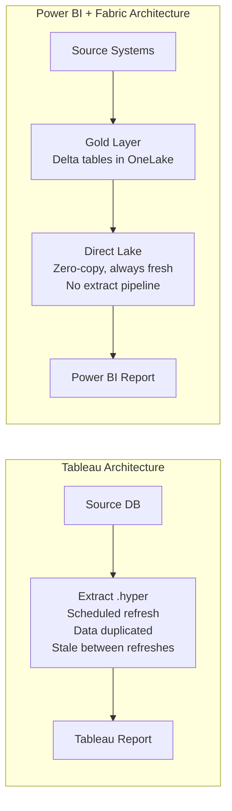

# Why Power BI over Tableau

**A strategic brief for CIOs, CDOs, CFOs, and enterprise decision-makers evaluating their analytics platform.**

---

## Executive summary

Tableau is a respected analytics platform with a powerful visual grammar, intuitive drag-and-drop experience, and a loyal community. However, for organizations already invested in the Microsoft ecosystem, Power BI offers a structurally superior value proposition across seven dimensions: licensing economics, Microsoft 365 integration, Fabric convergence, embedded analytics, AI and Copilot capabilities, self-service data preparation, and paginated reporting. This document presents each advantage with evidence, quantifies the differences where possible, and provides an honest assessment of areas where Tableau retains an edge.

---

## 1. Licensing economics

### The cost gap is structural, not promotional

Tableau's licensing model is built around three tiers: Creator ($75/user/month), Explorer ($42/user/month), and Viewer ($15/user/month). Every user who interacts with Tableau in any capacity requires a paid license. The Data Management add-on is an additional $5.50/user/month.

Power BI Pro is $10/user/month. Power BI Premium Per User is $20/user/month. For organizations on Microsoft 365 E5, Power BI Pro is included at no additional cost. Data governance through Microsoft Purview is included in the platform, not an add-on.

### What the numbers look like at scale

| Organization size | Tableau annual cost | Power BI annual cost | Annual savings |
|---|---|---|---|
| 50 users (10 Creator, 15 Explorer, 25 Viewer) | ~$62,100 | ~$6,000 (all Pro) | ~$56,000 |
| 200 users (30 Creator, 70 Explorer, 100 Viewer) | ~$244,200 | ~$24,000 (all Pro) | ~$220,000 |
| 500 users (60 Creator, 140 Explorer, 300 Viewer) | ~$529,200 | ~$60,000 (all Pro) | ~$469,000 |
| 2,000 users (150 Creator, 450 Explorer, 1,400 Viewer) | ~$2,019,600 | ~$240,000 (Pro) + capacity | ~$1,500,000+ |

!!! tip "E5 changes the equation entirely"
    If your organization is on Microsoft 365 E5, every user already has a Power BI Pro license included. The incremental cost of Power BI is zero. This single fact has driven more Tableau-to-Power BI migrations than any technical feature comparison.

### Beyond per-user licensing

Tableau Server (on-premises) requires VM infrastructure, storage, patching, backups, and dedicated DBA/admin time. Power BI Service is SaaS — Microsoft manages the infrastructure. For organizations that want reserved capacity, Fabric F-SKUs provide a fixed monthly cost that scales with compute needs, not user counts.

For the full cost breakdown, see [Total Cost of Ownership Analysis](tco-analysis.md).

---

## 2. Microsoft 365 integration

### The single-ecosystem advantage

Power BI is not a standalone tool — it is a native component of the Microsoft 365 ecosystem. This integration surface creates compounding value for organizations already on Microsoft 365.

**Teams integration.** Power BI reports embed directly in Teams channels and chats. Teams tabs host live reports. Users view analytics without switching applications, without a separate login, without a second browser tab. Tableau requires embedding via URL or iframe with separate authentication.

**SharePoint integration.** Power BI reports embed in SharePoint Online pages with the Power BI web part. SharePoint document libraries can host .pbix files. No equivalent exists for Tableau without custom development.

**Excel integration.** Analyze in Excel connects directly to Power BI semantic models. Finance teams create PivotTables on governed data without leaving Excel. Data flows from the semantic model to the spreadsheet with live refresh. Tableau offers export-to-Excel, which creates a disconnected static copy.

**Outlook integration.** Power BI subscriptions deliver report snapshots directly to Outlook. Users can pin reports to Outlook for quick access. Tableau subscriptions send PDFs or PNGs but without native Outlook integration.

**Copilot integration.** Microsoft 365 Copilot can reference Power BI data in Word documents, PowerPoint presentations, and Teams conversations. An executive can ask Copilot "summarize last quarter's sales performance" and Copilot can pull data from a Power BI semantic model. This cross-application AI layer does not exist for Tableau.

**OneDrive and SharePoint storage.** .pbix files stored in OneDrive or SharePoint integrate with Power BI Service auto-refresh. The collaboration, versioning, and sharing features of OneDrive extend to Power BI content.

### What this means for adoption

When analytics lives inside the tools people already use (Teams, Excel, Outlook, SharePoint), adoption friction drops. Users do not need to learn a new application, manage a new bookmark, or remember a new URL. The report is in the channel where the decision happens.

---

## 3. Fabric convergence and Direct Lake

### The end of the extract pipeline

Microsoft Fabric unifies data engineering, data science, real-time analytics, and BI on a single platform with a single capacity model. Power BI is the native BI layer in Fabric. This architectural convergence creates a capability that Tableau cannot replicate: **Direct Lake**.

**Direct Lake** connects Power BI to Delta tables in OneLake with zero data movement. No import. No extract. No scheduled refresh. Power BI reads Delta Parquet files directly with Vertipaq-like performance.

### Why this matters

With Tableau, every workbook faces a trade-off:

- **Extract mode:** Fast query performance, but data is duplicated, stale between refreshes, consumes server storage, and extracts can fail.
- **Live connection:** Fresh data, but slow for large datasets, puts load on the source system, and does not support all features.

Direct Lake eliminates this trade-off. Data is always fresh, always fast, and never duplicated.

### The csa-inabox advantage

Organizations using csa-inabox land data in Delta Lake format on ADLS Gen2 / OneLake through a Bronze-Silver-Gold medallion architecture. Power BI semantic models connect to Gold-layer Delta tables via Direct Lake. The entire extract pipeline — which is a significant operational burden with Tableau — simply does not exist.

---

## 4. Power BI Embedded

### Capacity-based pricing for external analytics

Tableau Embedded Analytics uses per-user pricing. Every external user (customer, partner, citizen) who views an embedded dashboard needs a Tableau license. For a portal serving 5,000 external users, the licensing cost is substantial.

Power BI Embedded uses capacity-based pricing (A-SKUs or F-SKUs). You purchase compute capacity, and an unlimited number of users can consume embedded content within that capacity. For ISVs, federal portals, and customer-facing analytics, Power BI Embedded is typically 3-5x cheaper than Tableau at scale.

| Scenario | Tableau Embedded cost | Power BI Embedded cost | Savings |
|---|---|---|---|
| 1,000 external viewers | ~$180,000/year | ~$60,000/year (F64 capacity) | ~$120,000 |
| 5,000 external viewers | ~$900,000/year | ~$60,000/year (F64 capacity) | ~$840,000 |
| 10,000 external viewers | ~$1,800,000/year | ~$120,000/year (F128 capacity) | ~$1,680,000 |

### Developer experience

Power BI Embedded provides a JavaScript SDK for iframe-based embedding with full programmatic control: filters, page navigation, event handling, theming. Tableau's JavaScript API offers similar functionality but without the capacity-based cost advantage.

For a complete comparison, see [Embedding Migration](embedding-migration.md).

---

## 5. Copilot in Power BI

### AI-native analytics

Copilot in Power BI is a generative AI assistant that operates across the report authoring and consumption experience:

**For report creators:**

- Generate DAX measures from natural language descriptions
- Create report pages from a description of the analysis needed
- Suggest visualizations based on the data model
- Explain existing DAX measures in plain language
- Build narrative summaries of visual data

**For report consumers:**

- Ask questions of a report in natural language
- Get AI-generated summaries of dashboard data
- Receive anomaly explanations
- Create ad-hoc analyses without DAX knowledge

### Tableau's AI capabilities

Tableau offers Ask Data (natural language querying) and Tableau Pulse (automated metric monitoring). These are competent features, but they are point solutions. Copilot in Power BI is part of the broader Microsoft 365 Copilot experience, which means the AI assistant can reference Power BI data in Word documents, PowerPoint slides, and Teams conversations. The cross-application AI surface is unique to Microsoft.

### What this means for the migration

Copilot reduces the DAX learning curve for Tableau refugees. Users who are accustomed to Tableau's intuitive drag-and-drop can use natural language to create measures and visuals while they learn DAX. This is a genuine adoption accelerator.

---

## 6. Paginated Reports

### A capability Tableau cannot match

Power BI Paginated Reports (built on SSRS technology) produce pixel-perfect, print-ready, multi-page documents: invoices, regulatory filings, statements, operational reports with hundreds of rows. They support:

- Precise page layout with headers, footers, page numbers
- Subreports and nested data regions
- Export to PDF, Word, Excel, PowerPoint, CSV
- Parameterized delivery via subscriptions
- Row-level security

Tableau has no equivalent. Tableau dashboards are designed for interactive screen consumption, not print-ready document generation. Organizations that need both interactive dashboards and formatted operational reports must use Tableau plus a separate reporting tool (Crystal Reports, SSRS, etc.). With Power BI, both needs are served by a single platform.

---

## 7. Self-service data preparation

### Dataflows and datamarts

Power BI includes self-service data preparation capabilities that Tableau charges extra for:

**Power Query** is included in every Power BI license. It provides a visual, code-optional data transformation experience for connecting, cleaning, shaping, and combining data. The M language underneath provides full programmatic control.

**Dataflow Gen2** (in Fabric) enables reusable data preparation logic that runs in the cloud, independent of any report. Multiple reports can consume the output of a single dataflow. This replaces Tableau Prep Conductor (which requires additional licensing).

**Datamarts** provide self-service relational databases with a SQL endpoint. Analysts who prefer SQL over DAX can query a datamart directly. Tableau offers no self-service database capability.

**Tableau Prep Builder** is included only in the Creator license ($75/month). Explorers and Viewers have no data preparation capability. Power Query is available to all Power BI Pro users ($10/month).

---

## 8. Honest assessment: where Tableau is stronger

This is a migration guide, not a marketing document. Acknowledging Tableau's genuine strengths helps you plan a realistic migration and set appropriate expectations with your team.

### Visual grammar flexibility

Tableau's mark-based rendering model is fundamentally more flexible than Power BI's field-based visual model. In Tableau, you place any field on any shelf (Rows, Columns, Color, Size, Shape, Detail, Tooltip) and the marks respond. Power BI visuals have defined wells (Axis, Values, Legend, Tooltips) and each visual type constrains what goes where. Certain Tableau visualizations — especially those that use the Detail shelf for disaggregation or combine multiple mark types — require creative reimagining in Power BI rather than direct translation.

### Ad-hoc exploration UX

For non-technical users who want to drag fields and immediately see results, Tableau's "Show Me" paradigm is more intuitive. Power BI is improving rapidly with Copilot and Q&A, but the drag-and-drop experience of Tableau Desktop remains best-in-class for ad-hoc visual exploration.

### LOD expression conciseness

Tableau's Level of Detail (LOD) expressions — FIXED, INCLUDE, EXCLUDE — provide a concise syntax for calculations at a different grain than the visualization. The equivalent in Power BI requires DAX CALCULATE with ALL/ALLEXCEPT modifiers, which is more verbose and requires understanding of filter context. LOD expressions are not simpler conceptually, but the syntax is more compact.

### Tableau Prep UX

Tableau Prep Builder's visual, node-based data preparation interface is friendlier than Power Query for users who think visually about data transformation. Power Query is more powerful (the M language is Turing-complete), but Prep's drag-and-drop UX is more approachable for some personas.

### Community and training content

Tableau has invested heavily in community (#DataFam, Tableau Public, Iron Viz) and there is a deep library of community-created training content. Power BI's community is growing rapidly and Microsoft Learn is excellent, but Tableau's community culture has a multi-year head start.

---

## 9. Decision framework

Use this framework to determine if a Power BI migration is right for your organization.

### Migrate to Power BI if

- Your organization is on Microsoft 365 (especially E5)
- You need to reduce BI licensing costs
- You are building on Microsoft Fabric or csa-inabox
- You need embedded analytics at scale (external portals)
- You need paginated/operational reports
- You want AI-assisted analytics (Copilot)
- You need Teams/SharePoint/Excel integration
- You are consolidating vendors to reduce platform sprawl

### Stay on Tableau (or evaluate carefully) if

- Your team is deeply invested in LOD expressions and Tableau Prep
- Ad-hoc visual exploration is the primary use case
- You are not on the Microsoft stack
- You are on Tableau Cloud and satisfied with the cost
- Retraining cost exceeds 2+ years of licensing savings
- Your Tableau investment is < 2 years old and ROI is not yet realized

### Hybrid approach

Some organizations run both platforms during transition, with Power BI as the strategic direction for new content and Tableau maintained for legacy workbooks on a deprecation schedule. This is a valid approach when the workbook estate is large (500+) and the migration timeline would otherwise exceed 12 months.

---

## 10. The Microsoft 365 Copilot multiplier

The most forward-looking reason to choose Power BI is not a feature comparison — it is the platform trajectory. Microsoft is investing billions in AI integration across the entire Microsoft 365 surface. Power BI is a first-class citizen in this AI ecosystem:

- Copilot in Power BI generates DAX and visuals
- Copilot in Excel analyzes Power BI semantic models
- Copilot in Teams summarizes Power BI reports in meeting contexts
- Copilot in Word pulls Power BI data into documents
- Copilot in PowerPoint creates data-driven slides from Power BI
- Data Activator triggers automated actions based on Power BI data changes

Tableau, as a Salesforce product, integrates with the Salesforce AI ecosystem (Einstein). For organizations on Microsoft 365, the Microsoft AI investment is the one that compounds. Every Copilot improvement across the Microsoft stack benefits Power BI users automatically.

---

## Conclusion

The strategic case for Power BI over Tableau is built on seven pillars: licensing economics, ecosystem integration, Fabric convergence, embedded analytics, Copilot AI, paginated reporting, and self-service data preparation. The case is strongest for organizations already on Microsoft 365, building on Azure/Fabric, and scaling to hundreds or thousands of BI consumers.

Tableau's visual grammar and ad-hoc exploration remain competitive strengths. A well-planned migration acknowledges these trade-offs, invests in DAX training, and redesigns for Power BI's strengths rather than replicating Tableau layouts pixel-for-pixel.

For the financial details, see [Total Cost of Ownership Analysis](tco-analysis.md). For the feature-level mapping, see [Complete Feature Mapping](feature-mapping-complete.md). For the end-to-end migration playbook, see [Migration Playbook](../tableau-to-powerbi.md).

---

**Last updated:** 2026-04-30
**Maintainers:** CSA-in-a-Box core team
**Related:** [TCO Analysis](tco-analysis.md) | [Feature Mapping](feature-mapping-complete.md) | [Migration Playbook](../tableau-to-powerbi.md)
