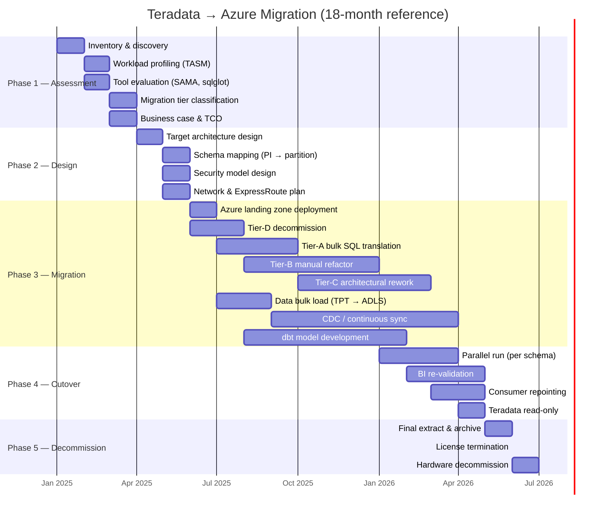

# Teradata to Azure Migration — Complete Package

> **Audience:** Enterprise data teams running Teradata (on-prem appliances or VantageCloud) evaluating or executing a migration to Azure (Synapse, Databricks, Fabric). This hub page links every artifact in the package and provides a decision matrix for choosing your migration path.

---

## Quick-start decision matrix

| Your situation | Recommended starting point | Primary Azure target |
| --- | --- | --- |
| Executive asking "should we migrate?" | [Why Azure over Teradata](why-azure-over-teradata.md) then [TCO Analysis](tco-analysis.md) | N/A — strategic read |
| Need a business case with numbers | [TCO Analysis](tco-analysis.md) | N/A — financial read |
| Architect mapping Teradata features | [Feature Mapping](feature-mapping-complete.md) | Depends on feature |
| DBA converting SQL scripts | [SQL Migration](sql-migration.md) | Synapse / Databricks |
| ETL team replacing TPT/BTEQ | [Data Migration](data-migration.md), [Tutorial — TPT to ADF](tutorial-tpt-to-adf.md) | ADF + ADLS + Delta |
| Data engineer converting BTEQ to dbt | [Tutorial — BTEQ to dbt](tutorial-bteq-to-dbt.md) | Databricks / Fabric |
| Platform team mapping TASM workloads | [Workload Migration](workload-migration.md) | Synapse / Databricks |
| Security / compliance team | [Security Migration](security-migration.md) | Entra + Purview + Monitor |
| Performance validation team | [Benchmarks](benchmarks.md) | Synapse / Databricks |
| Migration lead planning phases | [Best Practices](best-practices.md) then this page (Gantt) | All |

---

## Package contents

### Strategic and financial

| Document | Lines | Purpose |
| --- | --- | --- |
| [Why Azure over Teradata](why-azure-over-teradata.md) | ~400 | Strategic rationale, market position, honest pros/cons |
| [TCO Analysis](tco-analysis.md) | ~350 | 5-year cost model: on-prem appliance vs Azure vs VantageCloud |

### Technical migration guides

| Document | Lines | Purpose |
| --- | --- | --- |
| [Feature Mapping (Complete)](feature-mapping-complete.md) | ~400 | 40+ Teradata features mapped to Azure equivalents |
| [SQL Migration](sql-migration.md) | ~450 | 25+ SQL conversion patterns with before/after examples |
| [Data Migration](data-migration.md) | ~400 | TPT export, ADF ingestion, validation frameworks |
| [Workload Migration](workload-migration.md) | ~350 | TASM classes to Azure workload management |
| [Security Migration](security-migration.md) | ~300 | Access logging, RLS, roles, encryption mapping |

### Hands-on tutorials

| Document | Lines | Purpose |
| --- | --- | --- |
| [Tutorial — BTEQ to dbt](tutorial-bteq-to-dbt.md) | ~350 | End-to-end: convert a BTEQ script to a tested dbt model |
| [Tutorial — TPT to ADF](tutorial-tpt-to-adf.md) | ~350 | End-to-end: replace TPT pipeline with ADF + ADLS + dbt |

### Validation and planning

| Document | Lines | Purpose |
| --- | --- | --- |
| [Benchmarks](benchmarks.md) | ~300 | Performance, concurrency, cost-per-query comparisons |
| [Best Practices](best-practices.md) | ~300 | Schema assessment, phased cutover, common pitfalls |

### Original guide

| Document | Lines | Purpose |
| --- | --- | --- |
| [Teradata Migration Overview](../teradata.md) | ~205 | Foundational guide covering architecture, 5 phases, cost, pitfalls |

---

## Typical migration timeline (12-24 months)

The Gantt chart below shows a representative timeline for a mid-to-large Teradata estate (50-500 TB, 2,000-10,000 tables). Adjust durations to your specific environment.

---

## Migration tiers (from original guide)

Every workload should be classified before migration begins.

| Tier | Description | Typical percentage | Action |
| --- | --- | --- | --- |
| **A** Direct migrate | Pure SQL, standard ANSI features | 30-40% | Automated translation via SAMA / sqlglot |
| **B** Refactor required | Teradata-specific SQL (QUALIFY, RECURSIVE, MERGE) | 20-30% | Manual rewrite to Spark SQL or T-SQL |
| **C** Architectural rework | TASM-dependent, custom Java UDFs, QueryGrid | 10-20% | Redesign in dbt + Databricks / Synapse |
| **D** Decommission | Zombie workloads, unused tables, dead ETL | 20-40% | Archive output, delete |

---

## Recommended reading order

**For executives (2-hour read):**

1. [Why Azure over Teradata](why-azure-over-teradata.md)
2. [TCO Analysis](tco-analysis.md)
3. [Benchmarks](benchmarks.md) — executive summary section

**For architects (4-hour read):**

1. [Feature Mapping](feature-mapping-complete.md)
2. [SQL Migration](sql-migration.md)
3. [Workload Migration](workload-migration.md)
4. [Security Migration](security-migration.md)
5. [Best Practices](best-practices.md)

**For hands-on engineers (full day):**

1. All of the above, plus:
2. [Data Migration](data-migration.md)
3. [Tutorial — BTEQ to dbt](tutorial-bteq-to-dbt.md)
4. [Tutorial — TPT to ADF](tutorial-tpt-to-adf.md)

---

## Related resources

- [Teradata Migration Overview](../teradata.md) — the original 205-line guide this package expands
- [Migrations — Hadoop / Hive](../hadoop-hive.md) — similar phased pattern
- [Migrations — Snowflake](../snowflake.md) — sister cloud DW migration
- [Reference Architecture — Fabric vs Synapse vs Databricks](../../reference-architecture/fabric-vs-synapse-vs-databricks.md)
- [Patterns — Power BI & Fabric Roadmap](../../patterns/power-bi-fabric-roadmap.md)
- Microsoft SAMA: <https://aka.ms/sama>
- Azure for Teradata customers: <https://learn.microsoft.com/azure/architecture/databases/idea/teradata-migration>
- sqlglot: <https://github.com/tobymao/sqlglot>

---

**Maintainers:** csa-inabox core team
**Last updated:** 2026-04-30
