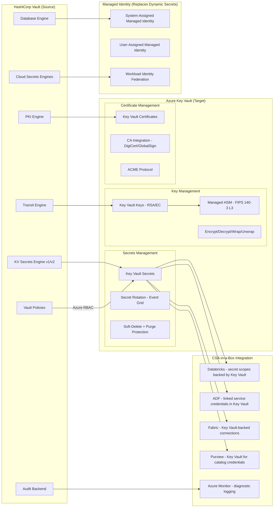

# Migrating from HashiCorp Vault to Azure Key Vault

**Status:** Authored 2026-04-30
**Audience:** Platform Engineers, Security Architects, CISOs, DevOps Teams, Federal Security Leadership
**Scope:** Full migration from HashiCorp Vault (OSS/Enterprise) to Azure Key Vault with CSA-in-a-Box secrets management integration.

---

!!! tip "Expanded Migration Center Available"
This playbook is the concise migration reference. For the complete Vault-to-Key Vault migration package -- including executive briefs, TCO analysis, feature mapping, PKI migration, federal guidance, and tutorials -- visit the **[Vault to Key Vault Migration Center](vault-to-key-vault/index.md)**.

    **Quick links:**

    - [Why Key Vault over Vault (Executive Brief)](vault-to-key-vault/why-key-vault-over-vault.md)
    - [Total Cost of Ownership Analysis](vault-to-key-vault/tco-analysis.md)
    - [Complete Feature Mapping (40+ features)](vault-to-key-vault/feature-mapping-complete.md)
    - [Secrets Migration Guide](vault-to-key-vault/secrets-migration.md)
    - [PKI Migration Guide](vault-to-key-vault/pki-migration.md)
    - [Dynamic Secrets to Managed Identity](vault-to-key-vault/dynamic-secrets-migration.md)
    - [Encryption Migration (Transit to Key Vault Keys)](vault-to-key-vault/encryption-migration.md)
    - [Federal Migration Guide](vault-to-key-vault/federal-migration-guide.md)
    - [Tutorials & Walkthroughs](vault-to-key-vault/index.md#tutorials)
    - [Best Practices](vault-to-key-vault/best-practices.md)

    **Migration guides by domain:** [Secrets](vault-to-key-vault/secrets-migration.md) | [PKI](vault-to-key-vault/pki-migration.md) | [Dynamic Secrets](vault-to-key-vault/dynamic-secrets-migration.md) | [Encryption](vault-to-key-vault/encryption-migration.md) | [Policy](vault-to-key-vault/policy-migration.md)

---

## 1. Executive summary

IBM's $6.4 billion acquisition of HashiCorp, announced in April 2024 and completed in late 2024, has created strategic uncertainty for organizations that built their secrets management and encryption infrastructure on HashiCorp Vault. License model changes -- particularly the 2023 shift from MPL to BSL (Business Source License) -- had already unsettled the community. The IBM acquisition compounds concern about Vault's future pricing trajectory, product independence, and alignment with cloud-native patterns.

Azure Key Vault is the Azure-native secrets management, key management, and certificate management service. It eliminates infrastructure management (no Consul backend, no auto-unseal HSM appliances, no cluster operations), provides FIPS 140-3 Level 3 HSM backing (Premium/Managed HSM), and integrates with every Azure service through managed identity -- a pattern that eliminates static secrets entirely for Azure-to-Azure communication.

**CSA-in-a-Box extends the migration story.** Azure Key Vault is the secrets management layer for all CSA-in-a-Box components. Databricks secret scopes back to Key Vault. Azure Data Factory linked service credentials are stored in Key Vault. Microsoft Fabric connections use Key Vault-backed credentials. Purview governance metadata references Key Vault for catalog access. The migration is not just Vault to Key Vault; it is Vault to an integrated, managed identity-first secrets platform that powers the entire CSA-in-a-Box analytics landing zone.

---

## 2. Why migrate now

| Driver                                  | Detail                                                                                                                                                                                                    |
| --------------------------------------- | --------------------------------------------------------------------------------------------------------------------------------------------------------------------------------------------------------- |
| **IBM acquisition uncertainty**         | Vault is now an IBM product. IBM has a history of acquiring infrastructure software and increasing enterprise licensing costs (Red Hat, Turbonomic). Long-term Vault OSS/Enterprise pricing is uncertain. |
| **BSL license change**                  | HashiCorp shifted Vault from MPL to BSL in August 2023, restricting competitive use. The community forked OpenBao, but enterprise support options remain limited.                                         |
| **Infrastructure overhead**             | Vault Enterprise requires Consul backend, dedicated compute (3-5 nodes minimum), auto-unseal HSM appliances, TLS certificate management, and specialized admin staff. Key Vault eliminates all of this.   |
| **Managed identity eliminates secrets** | Azure's managed identity pattern eliminates stored credentials entirely for Azure-to-Azure communication. Vault's dynamic secrets engine was innovative; managed identity supersedes the need.            |
| **FIPS 140-3 Level 3 HSM**              | Key Vault Premium and Managed HSM provide FIPS 140-3 Level 3 HSM backing natively. Vault requires external HSM appliances (Luna, nCipher) for equivalent protection.                                      |
| **Cost structure**                      | Vault Enterprise is per-node licensed with Consul infrastructure costs on top. Key Vault is per-operation priced with no infrastructure to manage.                                                        |
| **Entra ID RBAC**                       | Key Vault uses Entra ID for authentication and Azure RBAC for authorization. No separate auth backend (AppRole, Kubernetes, LDAP) to configure and maintain.                                              |

---

## 3. Migration architecture overview

---

## 4. Migration phases

### Phase 0 -- Discovery and inventory (Weeks 1-2)

Inventory the Vault environment:

- **Secrets engines:** KV v1/v2 mounts, mount paths, total secret count, version history
- **Transit engine:** key names, key types (AES, RSA, EC), rotation schedule, applications using encrypt/decrypt APIs
- **PKI engine:** root CAs, intermediate CAs, issued certificate count, certificate lifetimes, OCSP/CRL configuration
- **Database engine:** configured database connections, role definitions, TTLs, applications consuming dynamic credentials
- **Cloud secrets engines:** AWS, Azure, GCP dynamic credential configurations
- **Policies:** all Vault policies, path patterns, capabilities
- **Auth methods:** AppRole, Kubernetes, LDAP, OIDC, token -- map to Entra equivalents
- **Audit backends:** syslog, file, socket destinations -- map to Azure Monitor
- **Namespaces:** Vault Enterprise namespace hierarchy

**Artifacts:** Vault inventory export, secrets-engine-to-Key-Vault mapping, auth-method-to-Entra mapping, policy-to-RBAC mapping.

### Phase 1 -- Key Vault deployment (Weeks 3-4)

1. Deploy Key Vault instances using Bicep (CSA-in-a-Box `infra/modules/key-vault/` templates)
2. Choose tier: Standard (software-backed), Premium (HSM-backed), or Managed HSM
3. Enable soft-delete and purge protection (mandatory for production)
4. Configure private endpoints for network isolation
5. Enable diagnostic logging to Azure Monitor / Log Analytics workspace
6. Configure RBAC roles: Key Vault Secrets Officer, Key Vault Crypto Officer, Key Vault Certificates Officer
7. Deploy managed identities for application workloads

### Phase 2 -- Static secrets migration (Weeks 5-8)

1. Export secrets from Vault KV v1/v2 using API or CLI
2. Import secrets to Key Vault using migration script (see [Tutorial](vault-to-key-vault/tutorial-secret-migration.md))
3. Set expiration dates and rotation policies on imported secrets
4. Update application configurations to reference Key Vault (SDK, CSI driver, or App Configuration reference)
5. Validate applications can read secrets from Key Vault
6. Configure Event Grid-triggered rotation for secrets that require automated rotation

### Phase 3 -- Dynamic secrets to managed identity (Weeks 9-14)

1. Identify all Vault database engine consumers
2. Create managed identities for each application workload
3. Grant Azure RBAC roles on target databases (SQL Server, PostgreSQL, Cosmos DB)
4. Update application connection strings to use `DefaultAzureCredential` -- no stored passwords
5. Decommission Vault database engine roles
6. For non-Azure targets, migrate to workload identity federation

### Phase 4 -- Transit engine to Key Vault keys (Weeks 15-18)

1. Create Key Vault keys matching Vault Transit key types (RSA-2048, RSA-4096, EC-P256)
2. Migrate encryption/decryption API calls from Vault Transit to Key Vault REST API / SDK
3. For envelope encryption patterns, update key-wrapping logic
4. Re-encrypt data-at-rest if key migration requires new key material (vs BYOK import)
5. Validate encryption/decryption round-trip in staging

### Phase 5 -- PKI engine to Key Vault certificates (Weeks 19-22)

1. Export existing CA certificates from Vault PKI engine
2. Import CA certificates to Key Vault (or migrate to DigiCert/GlobalSign integration)
3. Configure certificate issuance policies in Key Vault
4. Update application certificate consumption (App Service, AKS, API Management)
5. Validate certificate issuance and renewal workflows

### Phase 6 -- Policy migration and governance (Weeks 23-26)

1. Map Vault path-based policies to Azure RBAC role assignments
2. Configure Entra ID groups for role-based access
3. Enable PIM (Privileged Identity Management) for just-in-time Key Vault access
4. Deploy Azure Policy for Key Vault governance (expiration enforcement, HSM-only, network rules)
5. Validate least-privilege access patterns

### Phase 7 -- Cutover and decommission (Weeks 27-30)

1. Final validation: all applications using Key Vault / managed identity
2. Redirect remaining Vault audit logging to Azure Monitor
3. Export final Vault state as backup
4. Decommission Vault cluster (nodes, Consul backend, HSM appliances)
5. Reclaim infrastructure and license costs

---

## 5. CSA-in-a-Box integration for secrets management

CSA-in-a-Box components are designed to consume secrets from Azure Key Vault:

| Component              | Integration pattern               | Detail                                                                                                                                          |
| ---------------------- | --------------------------------- | ----------------------------------------------------------------------------------------------------------------------------------------------- |
| **Databricks**         | Secret scopes backed by Key Vault | Databricks secret scopes reference Key Vault directly; notebooks access secrets via `dbutils.secrets.get()` without storing credentials in code |
| **Azure Data Factory** | Linked service credentials        | ADF linked services to SQL, ADLS, Cosmos DB, and external systems store credentials in Key Vault; managed identity accesses Key Vault           |
| **Microsoft Fabric**   | Key Vault-backed connections      | Fabric data pipelines and dataflows reference Key Vault for connection credentials to external data sources                                     |
| **Purview**            | Catalog scan credentials          | Purview data source scans use Key Vault-stored credentials or managed identity for catalog access                                               |
| **Azure Monitor**      | Diagnostic logging                | Key Vault access logs, secret access audit trails, and key operation telemetry flow to Log Analytics for compliance reporting                   |
| **Power BI**           | Service principal credentials     | Power BI service principal credentials for automated dataset refresh are stored in Key Vault                                                    |

---

## 6. Key Vault tier decision matrix

| Criterion              | Standard                          | Premium                   | Managed HSM                                                 |
| ---------------------- | --------------------------------- | ------------------------- | ----------------------------------------------------------- |
| **HSM backing**        | Software-protected                | FIPS 140-3 Level 3 HSM    | FIPS 140-3 Level 3 HSM (dedicated)                          |
| **Key types**          | RSA, EC (software)                | RSA, EC (HSM-backed)      | RSA, EC, AES (HSM-backed)                                   |
| **Price**              | $0.03/10K operations              | $1/key/month + operations | $3.20/HSM unit/hour                                         |
| **Use case**           | Dev/test, non-regulated workloads | Production, FedRAMP, CMMC | Classified, IL5, BYOK, regulatory mandate for dedicated HSM |
| **Availability**       | 99.99%                            | 99.99%                    | 99.99% (multi-region HA)                                    |
| **Federal compliance** | FedRAMP Moderate                  | FedRAMP High, IL4         | FedRAMP High, IL4/IL5, CMMC Level 3                         |

---

## 7. Risk mitigation

| Risk                                | Mitigation                                                                                                            |
| ----------------------------------- | --------------------------------------------------------------------------------------------------------------------- |
| Secret exposure during migration    | Use secure export (Vault API with TLS), import via Key Vault SDK over private endpoint, rotate secrets post-migration |
| Application downtime during cutover | Migrate app-by-app with parallel read from both Vault and Key Vault during transition                                 |
| Loss of dynamic secrets capability  | Managed identity eliminates the need; for non-Azure targets, use Key Vault secret rotation with Event Grid            |
| PKI disruption                      | Import existing CA certs to Key Vault; overlap certificate validity periods during migration                          |
| Policy gap                          | Map every Vault policy to Azure RBAC role assignment; audit with Azure Policy compliance reports                      |
| Team skill gap                      | Azure Key Vault is simpler than Vault (no cluster ops); training focuses on Entra RBAC, managed identity patterns     |

---

## 8. Quick reference: Vault to Key Vault feature mapping

| Vault feature                | Key Vault equivalent                                        |
| ---------------------------- | ----------------------------------------------------------- |
| KV secrets engine v1/v2      | Key Vault secrets (with versioning)                         |
| Transit engine               | Key Vault keys (encrypt/decrypt/wrap/unwrap)                |
| PKI engine                   | Key Vault certificates + CA integration                     |
| Database engine              | Managed identity (eliminates stored credentials)            |
| AWS/Azure/GCP secrets engine | Managed identity + workload identity federation             |
| Vault policies               | Azure RBAC + Key Vault access policies                      |
| Namespaces                   | Separate Key Vault instances per team/environment           |
| Sentinel (policy as code)    | Azure Policy for Key Vault governance                       |
| Audit backend                | Azure Monitor diagnostic settings                           |
| Seal/unseal                  | N/A (fully managed, no seal concept)                        |
| Consul backend               | N/A (fully managed, no backend infrastructure)              |
| Replication (DR/perf)        | Geo-replication (Premium), multi-region Managed HSM         |
| Agent sidecar                | CSI Secret Store Driver (AKS), App Configuration references |
| AppRole auth                 | Entra service principal + managed identity                  |
| Kubernetes auth              | Workload identity federation (OIDC)                         |
| LDAP/OIDC auth               | Entra ID (native OIDC, SAML, federation)                    |

For the complete 40+ feature mapping, see [Feature Mapping](vault-to-key-vault/feature-mapping-complete.md).

---

## 9. Related resources

- **Migration index:** [docs/migrations/README.md](README.md)
- **Secret migration tutorial:** [Tutorial](vault-to-key-vault/tutorial-secret-migration.md)
- **Managed identity tutorial:** [Tutorial](vault-to-key-vault/tutorial-managed-identity.md)
- **Federal migration guide:** [Federal Guide](vault-to-key-vault/federal-migration-guide.md)
- **CSA-in-a-Box compliance matrices:**
    - `docs/compliance/nist-800-53-rev5.md`
    - `docs/compliance/fedramp-moderate.md`
    - `docs/compliance/cmmc-2.0-l2.md`
- **CSA-in-a-Box identity and secrets reference architecture:** `docs/reference-architecture/identity-secrets-flow.md`
- **Microsoft Learn references:**
    - [Azure Key Vault documentation](https://learn.microsoft.com/azure/key-vault/)
    - [Managed identity overview](https://learn.microsoft.com/entra/identity/managed-identities-azure-resources/overview)
    - [Key Vault best practices](https://learn.microsoft.com/azure/key-vault/general/best-practices)
    - [Managed HSM documentation](https://learn.microsoft.com/azure/key-vault/managed-hsm/)

---

**Maintainers:** csa-inabox core team
**Last updated:** 2026-04-30
