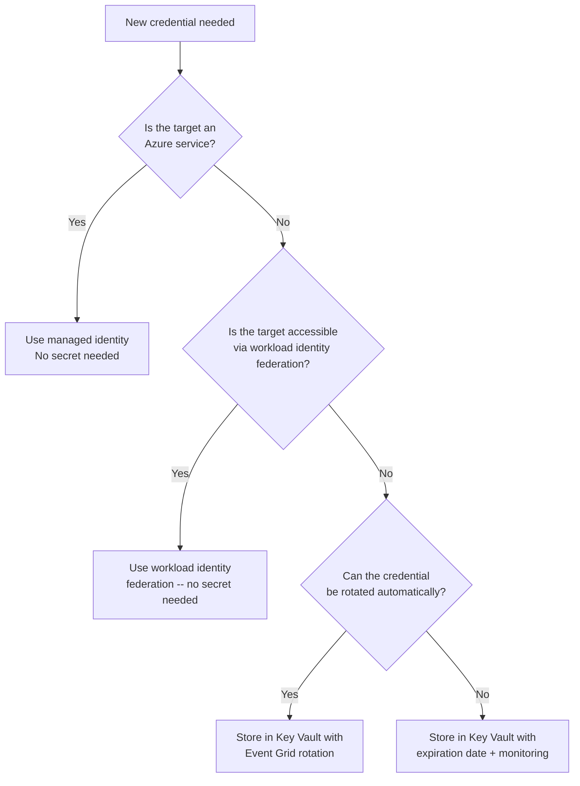
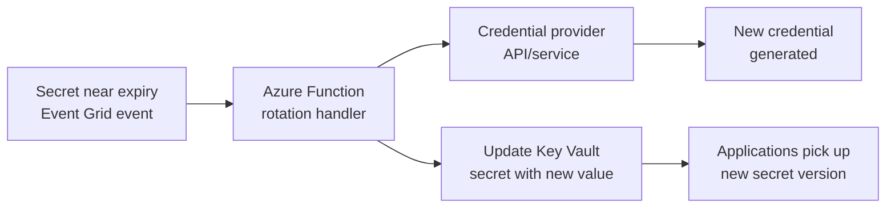

# Best Practices: HashiCorp Vault to Azure Key Vault Migration

**Status:** Authored 2026-04-30
**Audience:** Platform Engineers, Security Architects, DevOps Engineers
**Purpose:** Operational best practices for incremental migration, managed identity adoption, Key Vault networking, backup and recovery, and CSA-in-a-Box secrets integration

---

## 1. Incremental migration strategy

### Migrate app-by-app, not big-bang

The single most important best practice: **never attempt a big-bang migration** from Vault to Key Vault. Migrate one application at a time, validate, and proceed.

```mermaid
flowchart LR
    subgraph Phase1["Phase 1: Low-risk apps"]
        A1[Dev/test workloads]
        A2[New applications]
        A3[Internal tools]
    end

    subgraph Phase2["Phase 2: Medium-risk apps"]
        B1[Non-customer-facing APIs]
        B2[Batch processing]
        B3[Data pipelines]
    end

    subgraph Phase3["Phase 3: High-risk apps"]
        C1[Customer-facing APIs]
        C2[Payment processing]
        C3[Authentication services]
    end

    subgraph Phase4["Phase 4: Decommission"]
        D1[Vault cluster shutdown]
        D2[Consul decommission]
        D3[HSM return]
    end

    Phase1 --> Phase2 --> Phase3 --> Phase4
```



### Migration ordering criteria

| Criterion                                            | Priority | Rationale                                                                    |
| ---------------------------------------------------- | -------- | ---------------------------------------------------------------------------- |
| **New applications (no Vault dependency)**           | Highest  | Start fresh on Key Vault; no migration needed                                |
| **Dev/test environments**                            | High     | Low risk, validates migration tooling and procedures                         |
| **Applications with managed identity compatibility** | High     | Eliminate Vault entirely for these apps (no Key Vault secrets needed either) |
| **Applications with few Vault dependencies**         | Medium   | Smaller blast radius, faster migration                                       |
| **Applications with Transit engine dependency**      | Medium   | Requires API change, but straightforward mapping                             |
| **Applications with PKI dependency**                 | Lower    | Certificate chain migration requires careful planning                        |
| **Applications with custom Vault plugins**           | Lowest   | Requires most custom migration work                                          |

### Parallel-run pattern

During transition, applications should support reading from both Vault and Key Vault:

```python
import os
from azure.identity import DefaultAzureCredential
from azure.keyvault.secrets import SecretClient

class SecretProvider:
    """Dual-source secret provider for migration period."""

    def __init__(self):
        self.source = os.getenv('SECRET_SOURCE', 'keyvault')  # 'vault' or 'keyvault'

        if self.source == 'keyvault':
            credential = DefaultAzureCredential()
            self.kv_client = SecretClient(
                vault_url=os.getenv('KEY_VAULT_URL'),
                credential=credential
            )
        elif self.source == 'vault':
            import hvac
            self.vault_client = hvac.Client(
                url=os.getenv('VAULT_ADDR'),
                token=os.getenv('VAULT_TOKEN')
            )

    def get_secret(self, name: str) -> str:
        if self.source == 'keyvault':
            return self.kv_client.get_secret(name).value
        else:
            # Map Key Vault name back to Vault path
            vault_path = name.replace('-', '/')
            response = self.vault_client.secrets.kv.v2.read_secret_version(path=vault_path)
            return list(response['data']['data'].values())[0]
```

Toggle the `SECRET_SOURCE` environment variable to switch between providers without code deployment.

---

## 2. Managed identity adoption ladder

### Progression from secrets to passwordless

| Stage                                            | What changes                                        | Vault dependency      | Key Vault dependency       |
| ------------------------------------------------ | --------------------------------------------------- | --------------------- | -------------------------- |
| **Stage 0: Vault KV**                            | Status quo -- all secrets in Vault                  | Full                  | None                       |
| **Stage 1: Key Vault secrets**                   | Static secrets migrated to Key Vault                | Transit, PKI, dynamic | Secrets                    |
| **Stage 2: Managed identity for Azure DBs**      | Azure database passwords eliminated entirely        | Transit, PKI          | Secrets (non-Azure only)   |
| **Stage 3: Managed identity for Azure services** | Storage keys, Event Hub strings, etc. eliminated    | Transit, PKI          | Secrets (third-party only) |
| **Stage 4: Key Vault for remaining secrets**     | Third-party API keys, legacy passwords in Key Vault | Transit, PKI          | Secrets + rotation         |
| **Stage 5: Key Vault keys for encryption**       | Transit engine replaced by Key Vault keys           | PKI only              | Secrets + keys             |
| **Stage 6: Key Vault certificates**              | PKI engine replaced by Key Vault certificates       | None                  | Full Key Vault             |

### Managed identity-first decision tree

For every new credential request, apply this decision tree:



---

## 3. Key Vault networking best practices

### Always use private endpoints in production

```bicep
// Production Key Vault networking pattern
resource keyVault 'Microsoft.KeyVault/vaults@2023-07-01' = {
  name: vaultName
  location: location
  properties: {
    publicNetworkAccess: 'Disabled'
    networkAcls: {
      defaultAction: 'Deny'
      bypass: 'AzureServices' // Required for PaaS service integration
    }
  }
}

resource privateEndpoint 'Microsoft.Network/privateEndpoints@2023-09-01' = {
  name: 'pe-${vaultName}'
  location: location
  properties: {
    subnet: { id: privateEndpointSubnetId }
    privateLinkServiceConnections: [
      {
        name: 'kv-link'
        properties: {
          privateLinkServiceId: keyVault.id
          groupIds: ['vault']
        }
      }
    ]
  }
}
```

### DNS configuration for private endpoints

```bicep
// Private DNS zone for Key Vault name resolution
resource dnsZone 'Microsoft.Network/privateDnsZones@2020-06-01' = {
  name: 'privatelink.vaultcore.azure.net' // Or .usgovcloudapi.net for Gov
  location: 'global'
}

resource dnsLink 'Microsoft.Network/privateDnsZones/virtualNetworkLinks@2020-06-01' = {
  parent: dnsZone
  name: 'kv-dns-link'
  location: 'global'
  properties: {
    virtualNetwork: { id: hubVnetId }
    registrationEnabled: false
  }
}
```

### Network architecture patterns

| Pattern                                    | Description                                                            | When to use                                   |
| ------------------------------------------ | ---------------------------------------------------------------------- | --------------------------------------------- |
| **Hub-spoke with private endpoint in hub** | Key Vault private endpoint in hub VNet; spoke VNets access via peering | Standard enterprise pattern                   |
| **Per-spoke private endpoints**            | Each spoke VNet has its own private endpoint to Key Vault              | High-isolation environments                   |
| **Service endpoint (legacy)**              | VNet service endpoint for Key Vault                                    | Simpler but less secure than private endpoint |
| **Azure Firewall with FQDN rules**         | Key Vault accessed through Azure Firewall                              | Environments with centralized egress control  |

---

## 4. Key Vault organization patterns

### One vault per application per environment

```
kv-webapp-dev          (webapp team, dev environment)
kv-webapp-staging      (webapp team, staging)
kv-webapp-prod         (webapp team, production)
kv-api-dev             (API team, dev)
kv-api-prod            (API team, production)
kv-shared-prod         (shared secrets: third-party API keys)
kv-platform-prod       (platform team: encryption keys, certificates)
```

### Why separate vaults (not paths in one vault)

| Aspect               | Single Vault (Vault pattern)                     | Separate Key Vaults (recommended)                   |
| -------------------- | ------------------------------------------------ | --------------------------------------------------- |
| **Blast radius**     | Compromise of one path may expose others         | Compromise of one vault is isolated                 |
| **RBAC granularity** | RBAC is per-vault minimum (Key Vault limitation) | Full RBAC isolation per vault                       |
| **Throttling**       | 4,000 ops/sec shared across all consumers        | 4,000 ops/sec per vault per consumer                |
| **Audit clarity**    | All operations in one log stream                 | Separate log streams per vault                      |
| **Cost**             | Lower (fewer vault instances)                    | Negligible incremental cost (per-operation pricing) |
| **Compliance scope** | Broader blast radius for assessment              | Narrower scope per vault                            |

### Vault naming convention

```
kv-{team/app}-{environment}[-{region}]

Constraints:
  - 3-24 characters (globally unique)
  - Alphanumeric and hyphens only
  - Must start with a letter
  - Must end with a letter or digit

Examples:
  kv-webapp-prod
  kv-adf-prod-eus2
  kv-dbr-staging
  kv-shared-prod-gov
```

---

## 5. Backup and recovery

### Key Vault backup strategy

| Object           | Backup method                               | Recovery                                                        |
| ---------------- | ------------------------------------------- | --------------------------------------------------------------- |
| **Secrets**      | `az keyvault secret backup` (per-secret)    | `az keyvault secret restore` (same tenant, same geography)      |
| **Keys**         | `az keyvault key backup` (per-key)          | `az keyvault key restore` (same tenant, same geography)         |
| **Certificates** | `az keyvault certificate backup` (per-cert) | `az keyvault certificate restore` (same tenant, same geography) |
| **Full vault**   | Script to backup all objects                | Script to restore all objects to new vault                      |

### Automated backup script

```python
#!/usr/bin/env python3
"""Backup all Key Vault objects to local encrypted files."""
import os
from datetime import datetime
from azure.identity import DefaultAzureCredential
from azure.keyvault.secrets import SecretClient
from azure.keyvault.keys import KeyClient
from azure.keyvault.certificates import CertificateClient

VAULT_NAME = os.getenv('KEY_VAULT_NAME', 'kv-prod')
BACKUP_DIR = f"backups/{VAULT_NAME}/{datetime.now().strftime('%Y%m%d-%H%M%S')}"
os.makedirs(BACKUP_DIR, exist_ok=True)

credential = DefaultAzureCredential()
vault_url = f"https://{VAULT_NAME}.vault.azure.net"

# Backup secrets
secret_client = SecretClient(vault_url=vault_url, credential=credential)
for secret in secret_client.list_properties_of_secrets():
    backup = secret_client.backup_secret(secret.name)
    with open(f"{BACKUP_DIR}/secret-{secret.name}.bak", 'wb') as f:
        f.write(backup)
    print(f"Backed up secret: {secret.name}")

# Backup keys
key_client = KeyClient(vault_url=vault_url, credential=credential)
for key in key_client.list_properties_of_keys():
    backup = key_client.backup_key(key.name)
    with open(f"{BACKUP_DIR}/key-{key.name}.bak", 'wb') as f:
        f.write(backup)
    print(f"Backed up key: {key.name}")

# Backup certificates
cert_client = CertificateClient(vault_url=vault_url, credential=credential)
for cert in cert_client.list_properties_of_certificates():
    backup = cert_client.backup_certificate(cert.name)
    with open(f"{BACKUP_DIR}/cert-{cert.name}.bak", 'wb') as f:
        f.write(backup)
    print(f"Backed up certificate: {cert.name}")

print(f"\nBackup complete: {BACKUP_DIR}")
```

### Recovery constraints

Key Vault backup/restore has important constraints:

- Backups can only be restored to Key Vaults **in the same Azure geography** (e.g., US, Europe)
- Backups can only be restored to Key Vaults **in the same Azure subscription** and **Entra tenant**
- Backups include the secret/key version history
- Soft-deleted objects in the target vault will conflict with restore (purge first)

For cross-geography or cross-tenant disaster recovery, use:

1. **Managed HSM security domain backup** (for HSM-backed keys)
2. **Application-level secret replication** (export values, import to DR vault)
3. **Azure Paired Regions** with geo-replicated Key Vault (Premium)

---

## 6. Secret rotation best practices

### Rotation automation pattern



### Rotation categories

| Category                 | Rotation method                                                       | Frequency              |
| ------------------------ | --------------------------------------------------------------------- | ---------------------- |
| **Azure service keys**   | Replace with managed identity (no rotation needed)                    | N/A                    |
| **Third-party API keys** | Event Grid + Azure Function calling provider API                      | 30-90 days             |
| **Database passwords**   | Replace with managed identity; or Event Grid + Function + SQL ALTER   | 30 days                |
| **Signing keys**         | Key Vault key rotation policy                                         | 90-365 days            |
| **TLS certificates**     | Key Vault auto-renewal with CA integration                            | 80% of validity period |
| **Storage account keys** | Replace with managed identity; or Key Vault managed storage (preview) | 60 days                |

### Setting expiration on all secrets

```bash
# Enforce expiration via Azure Policy
az policy assignment create \
  --name "kv-secrets-must-expire" \
  --display-name "Key Vault secrets must have expiration dates" \
  --policy "/providers/Microsoft.Authorization/policyDefinitions/98728c90-32c7-4049-8429-847dc0f4fe37" \
  --scope /subscriptions/<sub-id> \
  --enforcement-mode Default
```

---

## 7. CSA-in-a-Box secrets integration patterns

### Databricks: Key Vault-backed secret scopes

```bash
# Create Databricks secret scope backed by Key Vault
# (via Databricks CLI or API)
databricks secrets create-scope \
  --scope kv-backed \
  --scope-backend-type AZURE_KEYVAULT \
  --resource-id /subscriptions/<sub>/resourceGroups/<rg>/providers/Microsoft.KeyVault/vaults/kv-databricks-prod \
  --dns-name https://kv-databricks-prod.vault.azure.net/
```

In Databricks notebooks:

```python
# Access secrets from Key Vault-backed scope
storage_key = dbutils.secrets.get(scope="kv-backed", key="adls-storage-key")
sql_password = dbutils.secrets.get(scope="kv-backed", key="sql-connection-string")

# Better: use managed identity for ADLS access (no secret needed)
spark.conf.set(
    "fs.azure.account.auth.type.datalake.dfs.core.windows.net",
    "OAuth"
)
spark.conf.set(
    "fs.azure.account.oauth.provider.type.datalake.dfs.core.windows.net",
    "org.apache.hadoop.fs.azurebfs.oauth2.MsiTokenProvider"
)
```

### Azure Data Factory: linked service credentials

```json
{
    "name": "AzureSqlDatabase",
    "type": "Microsoft.DataFactory/factories/linkedservices",
    "properties": {
        "type": "AzureSqlDatabase",
        "typeProperties": {
            "connectionString": {
                "type": "AzureKeyVaultSecret",
                "store": {
                    "referenceName": "AzureKeyVaultLinkedService",
                    "type": "LinkedServiceReference"
                },
                "secretName": "sql-connection-string"
            }
        }
    }
}
```

Better -- use managed identity for ADF to SQL:

```json
{
    "name": "AzureSqlDatabase",
    "type": "Microsoft.DataFactory/factories/linkedservices",
    "properties": {
        "type": "AzureSqlDatabase",
        "typeProperties": {
            "server": "sql-prod.database.windows.net",
            "database": "appdb",
            "authenticationType": "ManagedIdentity"
        }
    }
}
```

### Microsoft Fabric: Key Vault connections

Fabric data pipelines reference Key Vault for external data source credentials:

1. Create a Key Vault linked service in Fabric
2. Reference Key Vault secrets in pipeline connection configurations
3. Fabric accesses Key Vault using the workspace managed identity

For Fabric data sources that support managed identity (Azure SQL, ADLS, Cosmos DB), configure direct managed identity authentication instead of Key Vault secrets.

### Purview: scan credentials

```bash
# Create Key Vault connection in Purview
# Purview uses Key Vault-stored credentials for data source scanning

# 1. Grant Purview managed identity access to Key Vault
az role assignment create \
  --role "Key Vault Secrets User" \
  --assignee-object-id $(az purview account show --name purview-prod -g rg-gov --query identity.principalId -o tsv) \
  --scope $(az keyvault show --name kv-purview-prod --query id -o tsv)

# 2. Store scan credentials in Key Vault
az keyvault secret set \
  --vault-name kv-purview-prod \
  --name "oracle-scan-password" \
  --value "$ORACLE_PASSWORD" \
  --tags "purpose=purview-scan" "source=oracle-prod"
```

### Azure Monitor: Key Vault diagnostics in CSA-in-a-Box

```bicep
// Route Key Vault diagnostics to CSA-in-a-Box Log Analytics workspace
resource kvDiagnostics 'Microsoft.Insights/diagnosticSettings@2021-05-01-preview' = {
  name: 'csa-inabox-diagnostics'
  scope: keyVault
  properties: {
    workspaceId: csaLogAnalyticsWorkspaceId // CSA-in-a-Box workspace
    logs: [
      {
        categoryGroup: 'allLogs'
        enabled: true
      }
    ]
    metrics: [
      {
        category: 'AllMetrics'
        enabled: true
      }
    ]
  }
}
```

---

## 8. Monitoring and alerting

### Key Vault health monitoring

```kusto
// Alert: Key Vault throttling (approaching throughput limit)
AzureMetrics
| where ResourceProvider == "MICROSOFT.KEYVAULT"
| where MetricName == "SaturationShoebox"
| where Average > 75  // Alert when above 75% saturation
| project TimeGenerated, Resource, Average
| order by TimeGenerated desc

// Alert: Secret access failures
AzureDiagnostics
| where ResourceProvider == "MICROSOFT.KEYVAULT"
| where ResultType != "Success"
| summarize FailureCount = count() by OperationName, CallerIPAddress, bin(TimeGenerated, 5m)
| where FailureCount > 5

// Alert: Unauthorized access attempts
AzureDiagnostics
| where ResourceProvider == "MICROSOFT.KEYVAULT"
| where httpStatusCode_d == 403
| summarize Count = count() by CallerIPAddress, OperationName, identity_claim_upn_s
```

### Action group for Key Vault alerts

```bicep
resource actionGroup 'Microsoft.Insights/actionGroups@2023-01-01' = {
  name: 'ag-keyvault-alerts'
  location: 'global'
  properties: {
    groupShortName: 'kv-alerts'
    enabled: true
    emailReceivers: [
      {
        name: 'security-team'
        emailAddress: 'security@example.com'
      }
    ]
  }
}

resource throttleAlert 'Microsoft.Insights/metricAlerts@2018-03-01' = {
  name: 'kv-throttle-alert'
  location: 'global'
  properties: {
    severity: 2
    scopes: [keyVault.id]
    criteria: {
      'odata.type': 'Microsoft.Azure.Monitor.SingleResourceMultipleMetricCriteria'
      allOf: [
        {
          name: 'saturation'
          metricName: 'SaturationShoebox'
          operator: 'GreaterThan'
          threshold: 75
          timeAggregation: 'Average'
        }
      ]
    }
    actions: [{ actionGroupId: actionGroup.id }]
    windowSize: 'PT5M'
    evaluationFrequency: 'PT1M'
  }
}
```

---

## 9. Common pitfalls and how to avoid them

| Pitfall                         | Impact                                             | Prevention                                                                                     |
| ------------------------------- | -------------------------------------------------- | ---------------------------------------------------------------------------------------------- |
| **Secret name collisions**      | Vault path `a/b/c` and `a-b-c` both map to `a-b-c` | Use deterministic naming convention; include mount prefix                                      |
| **Missing purge protection**    | Secrets permanently deleted, no recovery           | Enable purge protection on all production vaults (irreversible)                                |
| **RBAC too broad**              | Key Vault Administrator assigned to all developers | Use Key Vault Secrets User for applications; Officer for admins only; PIM for elevation        |
| **No private endpoint**         | Key Vault accessible from public internet          | Always deploy with `publicNetworkAccess: Disabled` + private endpoint in production            |
| **No expiration dates**         | Secrets never rotated, increasing blast radius     | Azure Policy to deny secrets without expiration; rotation workflows                            |
| **25 KB secret limit**          | Large configuration files fail to import           | Store large configs in Azure App Configuration or Azure Blob; store reference URI in Key Vault |
| **Single vault for everything** | Blast radius includes all applications             | One vault per application per environment                                                      |
| **No backup strategy**          | Accidental deletion with no recovery path          | Soft-delete + purge protection + periodic backup scripts                                       |
| **Ignoring throttling**         | Applications fail under load                       | Monitor saturation metric; distribute load across multiple vaults                              |
| **Hardcoded vault URLs**        | Cannot failover to DR vault                        | Use Azure App Configuration for vault URL; or environment variables                            |

---

## 10. Migration success criteria

Before declaring the migration complete, validate:

| Criterion                    | Validation method                                                          |
| ---------------------------- | -------------------------------------------------------------------------- |
| **All secrets accessible**   | Application smoke tests pass in all environments                           |
| **Managed identity working** | Database connections succeed without passwords                             |
| **Rotation configured**      | Event Grid triggers fire for near-expiry secrets                           |
| **RBAC validated**           | Unauthorized access attempts are denied (test with non-privileged account) |
| **Monitoring active**        | Key Vault diagnostics appear in Log Analytics                              |
| **Backup tested**            | Restore from backup to test vault succeeds                                 |
| **Documentation updated**    | ATO/SSP, runbooks, and architecture diagrams reflect Key Vault             |
| **Team trained**             | Platform engineers can manage Key Vault without Vault expertise            |
| **Vault decommissioned**     | Vault cluster, Consul, and HSM appliances removed                          |
| **Cost validated**           | Actual Key Vault costs align with TCO projections                          |

---

## Related resources

- **Migration playbook:** [Vault to Key Vault](../vault-to-key-vault.md)
- **Migration center:** [Complete Migration Center](index.md)
- **Tutorial:** [Secret Migration Tutorial](tutorial-secret-migration.md)
- **Tutorial:** [Managed Identity Tutorial](tutorial-managed-identity.md)
- **Federal guide:** [Federal Migration Guide](federal-migration-guide.md)
- **CSA-in-a-Box key rotation runbook:** [Key Rotation Runbook](../../runbooks/key-rotation.md)
- **Microsoft Learn:**
    - [Key Vault best practices](https://learn.microsoft.com/azure/key-vault/general/best-practices)
    - [Key Vault security features](https://learn.microsoft.com/azure/key-vault/general/security-features)
    - [Key Vault backup and restore](https://learn.microsoft.com/azure/key-vault/general/backup)
    - [Managed identity best practices](https://learn.microsoft.com/entra/identity/managed-identities-azure-resources/managed-identity-best-practice-recommendations)

---

**Maintainers:** csa-inabox core team
**Last updated:** 2026-04-30
