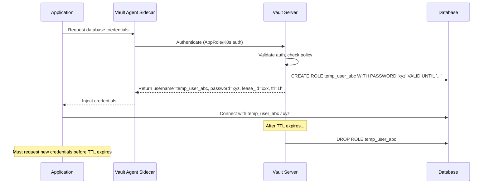
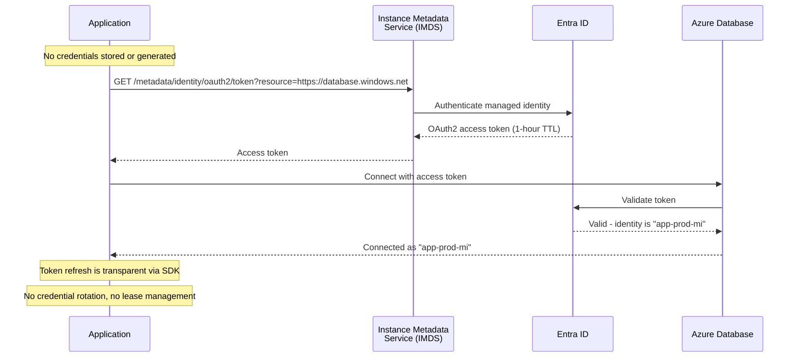

# Dynamic Secrets Migration: Vault Database Engine to Azure Managed Identity

**Status:** Authored 2026-04-30
**Audience:** Platform Engineers, Application Developers, Database Administrators
**Purpose:** Guide for replacing HashiCorp Vault dynamic database credentials with Azure managed identity -- eliminating stored credentials entirely

---

## Overview

HashiCorp Vault's database secrets engine generates short-lived database credentials on demand. Applications request credentials from Vault, receive a username/password pair with a configurable TTL (typically minutes to hours), and Vault automatically revokes the credentials when the lease expires. This pattern was a significant security improvement over static, long-lived database passwords.

Azure managed identity supersedes this pattern entirely. Instead of generating short-lived credentials, managed identity eliminates credentials from the equation. Applications authenticate to Azure databases using OAuth2 tokens issued by Entra ID, bound to the application's identity. There is no username, no password, no credential to rotate, no lease to manage, and no secrets engine to operate.

This guide covers migrating from Vault dynamic database credentials to Azure managed identity for Azure SQL Database, Azure Database for PostgreSQL, and Azure Cosmos DB.

---

## 1. Architecture comparison

### Vault dynamic secrets flow



### Managed identity flow



### Key differences

| Aspect                      | Vault dynamic secrets                               | Managed identity                                                   |
| --------------------------- | --------------------------------------------------- | ------------------------------------------------------------------ |
| **Credentials exist**       | Yes (short-lived username/password)                 | No (token-based, no password)                                      |
| **Infrastructure required** | Vault cluster + database plugin + agent sidecar     | None (built into Azure platform)                                   |
| **Database configuration**  | Vault needs CREATE/DROP ROLE privileges on database | Entra admin configured on database; managed identity granted roles |
| **Application code**        | Vault SDK or agent sidecar integration              | `DefaultAzureCredential` + standard database driver                |
| **Rotation**                | Automatic via TTL expiration and regeneration       | Automatic via token refresh (transparent)                          |
| **Audit trail**             | Vault audit log + database audit                    | Entra sign-in logs + database audit                                |
| **Blast radius**            | Compromised credential valid for TTL                | No credential to compromise                                        |
| **Supported services**      | Any database with Vault plugin                      | Azure SQL, PostgreSQL Flexible, MySQL Flexible, Cosmos DB          |

---

## 2. Pre-migration requirements

### Azure database requirements

| Database                                   | Managed identity support          | Entra admin requirement                         |
| ------------------------------------------ | --------------------------------- | ----------------------------------------------- |
| **Azure SQL Database**                     | Yes (system and user-assigned MI) | Must set Entra admin on SQL server              |
| **Azure SQL Managed Instance**             | Yes (system and user-assigned MI) | Must set Entra admin on MI                      |
| **Azure Database for PostgreSQL Flexible** | Yes (Entra authentication)        | Must enable Entra auth and create Entra roles   |
| **Azure Database for MySQL Flexible**      | Yes (Entra authentication)        | Must enable Entra auth                          |
| **Azure Cosmos DB**                        | Yes (data-plane RBAC with Entra)  | Must enable Entra RBAC (or use resource tokens) |
| **Azure Cache for Redis**                  | Yes (Entra authentication)        | Must enable Entra access                        |

### Application requirements

Applications must use Azure SDK credential providers that support managed identity:

| Language        | SDK               | Credential class                |
| --------------- | ----------------- | ------------------------------- |
| Python          | `azure-identity`  | `DefaultAzureCredential`        |
| .NET            | `Azure.Identity`  | `DefaultAzureCredential`        |
| Java            | `azure-identity`  | `DefaultAzureCredentialBuilder` |
| JavaScript/Node | `@azure/identity` | `DefaultAzureCredential`        |
| Go              | `azidentity`      | `NewDefaultAzureCredential`     |

---

## 3. Azure SQL Database migration

### Step 1: Create managed identity

```bicep
// User-assigned managed identity for the application
resource appIdentity 'Microsoft.ManagedIdentity/userAssignedIdentities@2023-01-31' = {
  name: 'mi-webapp-prod'
  location: resourceGroup().location
}
```

### Step 2: Configure Entra admin on SQL server

```bicep
resource sqlServer 'Microsoft.Sql/servers@2023-08-01-preview' = {
  name: 'sql-prod'
  location: resourceGroup().location
  properties: {
    administrators: {
      azureADOnlyAuthentication: true // Disable SQL auth entirely
      login: 'sqladmin-group'
      sid: entraAdminGroupId
      principalType: 'Group'
      tenantId: subscription().tenantId
    }
  }
}
```

### Step 3: Grant database access to managed identity

```sql
-- Connect to the database as the Entra admin
-- Create user for the managed identity
CREATE USER [mi-webapp-prod] FROM EXTERNAL PROVIDER;

-- Grant appropriate roles
ALTER ROLE db_datareader ADD MEMBER [mi-webapp-prod];
ALTER ROLE db_datawriter ADD MEMBER [mi-webapp-prod];

-- For more granular access:
-- GRANT SELECT, INSERT, UPDATE ON SCHEMA::dbo TO [mi-webapp-prod];
-- GRANT EXECUTE ON SCHEMA::dbo TO [mi-webapp-prod];
```

### Step 4: Update application connection string

**Before (Vault dynamic secrets):**

```python
import hvac
import pyodbc

# Get dynamic credentials from Vault
vault_client = hvac.Client(url='https://vault:8200')
vault_client.auth.approle.login(role_id='xxx', secret_id='yyy')
creds = vault_client.secrets.database.generate_credentials('webapp-sql-role')

username = creds['data']['username']
password = creds['data']['password']

conn = pyodbc.connect(
    f"DRIVER={{ODBC Driver 18 for SQL Server}};"
    f"SERVER=sql-prod.database.windows.net;"
    f"DATABASE=appdb;"
    f"UID={username};"
    f"PWD={password};"
)
```

**After (managed identity):**

```python
from azure.identity import DefaultAzureCredential
import pyodbc
import struct

credential = DefaultAzureCredential()
token = credential.get_token("https://database.windows.net/.default")

# Pack token for pyodbc
token_bytes = token.token.encode("UTF-16-LE")
token_struct = struct.pack(f'<I{len(token_bytes)}s', len(token_bytes), token_bytes)
SQL_COPT_SS_ACCESS_TOKEN = 1256

conn = pyodbc.connect(
    "DRIVER={ODBC Driver 18 for SQL Server};"
    "SERVER=sql-prod.database.windows.net;"
    "DATABASE=appdb;",
    attrs_before={SQL_COPT_SS_ACCESS_TOKEN: token_struct}
)

# No username. No password. No Vault. No rotation.
```

**With SQLAlchemy:**

```python
from azure.identity import DefaultAzureCredential
from sqlalchemy import create_engine, event

credential = DefaultAzureCredential()

engine = create_engine(
    "mssql+pyodbc://sql-prod.database.windows.net/appdb"
    "?driver=ODBC+Driver+18+for+SQL+Server"
    "&Encrypt=yes"
    "&TrustServerCertificate=no"
)

@event.listens_for(engine, "do_connect")
def provide_token(dialect, conn_rec, cargs, cparams):
    token = credential.get_token("https://database.windows.net/.default")
    token_bytes = token.token.encode("UTF-16-LE")
    token_struct = struct.pack(f'<I{len(token_bytes)}s', len(token_bytes), token_bytes)
    cparams["attrs_before"] = {1256: token_struct}
    # Remove uid/pwd if present
    cparams.pop("user", None)
    cparams.pop("password", None)
```

---

## 4. Azure Database for PostgreSQL migration

### Step 1: Enable Entra authentication on PostgreSQL

```bicep
resource pgServer 'Microsoft.DBforPostgreSQL/flexibleServers@2023-12-01-preview' = {
  name: 'pg-prod'
  location: resourceGroup().location
  properties: {
    authConfig: {
      activeDirectoryAuth: 'Enabled'
      passwordAuth: 'Disabled' // Disable password auth entirely
      tenantId: subscription().tenantId
    }
  }
}
```

### Step 2: Create Entra role in PostgreSQL

```sql
-- Connect as the Entra admin
-- Create role for the managed identity using its client ID
SELECT * FROM pgaadauth_create_principal('mi-webapp-prod', false, false);

-- Grant appropriate privileges
GRANT SELECT, INSERT, UPDATE, DELETE ON ALL TABLES IN SCHEMA public TO "mi-webapp-prod";
GRANT USAGE ON ALL SEQUENCES IN SCHEMA public TO "mi-webapp-prod";
ALTER DEFAULT PRIVILEGES IN SCHEMA public GRANT SELECT, INSERT, UPDATE, DELETE ON TABLES TO "mi-webapp-prod";
```

### Step 3: Update application code

**Before (Vault dynamic secrets):**

```python
import hvac
import psycopg2

vault_client = hvac.Client(url='https://vault:8200')
vault_client.auth.kubernetes.login(role='webapp', jwt=service_account_token)
creds = vault_client.secrets.database.generate_credentials('webapp-pg-role')

conn = psycopg2.connect(
    host='pg-prod.postgres.database.azure.com',
    database='appdb',
    user=creds['data']['username'],
    password=creds['data']['password'],
    sslmode='require'
)
```

**After (managed identity):**

```python
from azure.identity import DefaultAzureCredential
import psycopg2

credential = DefaultAzureCredential()
token = credential.get_token("https://ossrdbms-aad.database.windows.net/.default")

conn = psycopg2.connect(
    host='pg-prod.postgres.database.azure.com',
    database='appdb',
    user='mi-webapp-prod',  # Managed identity name
    password=token.token,   # OAuth2 access token as password
    sslmode='require'
)

# No Vault. Token auto-refreshes via DefaultAzureCredential.
```

**With asyncpg:**

```python
from azure.identity.aio import DefaultAzureCredential
import asyncpg

async def get_connection():
    credential = DefaultAzureCredential()
    token = await credential.get_token("https://ossrdbms-aad.database.windows.net/.default")

    conn = await asyncpg.connect(
        host='pg-prod.postgres.database.azure.com',
        database='appdb',
        user='mi-webapp-prod',
        password=token.token,
        ssl='require'
    )
    return conn
```

---

## 5. Azure Cosmos DB migration

### Step 1: Enable Entra RBAC on Cosmos DB

```bicep
resource cosmosAccount 'Microsoft.DocumentDB/databaseAccounts@2024-02-15-preview' = {
  name: 'cosmos-prod'
  location: resourceGroup().location
  properties: {
    disableLocalAuth: true // Disable key-based auth entirely
    // ... other properties
  }
}

// Assign Cosmos DB Built-in Data Contributor role to managed identity
resource cosmosRoleAssignment 'Microsoft.DocumentDB/databaseAccounts/sqlRoleAssignments@2024-02-15-preview' = {
  parent: cosmosAccount
  name: guid(cosmosAccount.id, appIdentity.id, 'data-contributor')
  properties: {
    roleDefinitionId: '${cosmosAccount.id}/sqlRoleDefinitions/00000000-0000-0000-0000-000000000002' // Built-in Data Contributor
    principalId: appIdentity.properties.principalId
    scope: cosmosAccount.id
  }
}
```

### Step 2: Update application code

**Before (Vault dynamic secrets or stored key):**

```python
import hvac
from azure.cosmos import CosmosClient

vault_client = hvac.Client(url='https://vault:8200')
vault_client.auth.approle.login(role_id='xxx', secret_id='yyy')
secret = vault_client.secrets.kv.v2.read_secret_version(path='cosmos/prod')

client = CosmosClient(
    url='https://cosmos-prod.documents.azure.com:443/',
    credential=secret['data']['data']['primary_key']
)
```

**After (managed identity):**

```python
from azure.identity import DefaultAzureCredential
from azure.cosmos import CosmosClient

credential = DefaultAzureCredential()

client = CosmosClient(
    url='https://cosmos-prod.documents.azure.com:443/',
    credential=credential  # Managed identity - no key needed
)

database = client.get_database_client('appdb')
container = database.get_container_client('items')

# No primary key. No Vault. Entra RBAC controls access.
```

---

## 6. AKS workload identity setup

For applications running on AKS, workload identity replaces both Vault Kubernetes auth and Vault Agent Injector:

### Step 1: Enable workload identity on AKS

```bicep
resource aksCluster 'Microsoft.ContainerService/managedClusters@2024-01-01' = {
  name: 'aks-prod'
  location: resourceGroup().location
  properties: {
    oidcIssuerProfile: {
      enabled: true
    }
    securityProfile: {
      workloadIdentity: {
        enabled: true
      }
    }
  }
}
```

### Step 2: Create federated credential

```bash
az identity federated-credential create \
  --name fc-webapp-prod \
  --identity-name mi-webapp-prod \
  --resource-group rg-prod \
  --issuer "$(az aks show -g rg-prod -n aks-prod --query oidcIssuerProfile.issuerUrl -o tsv)" \
  --subject system:serviceaccount:app-namespace:webapp-sa
```

### Step 3: Configure pod to use workload identity

```yaml
# Before: Vault Agent Injector annotations
apiVersion: apps/v1
kind: Deployment
metadata:
    name: webapp
spec:
    template:
        metadata:
            annotations:
                # REMOVE these Vault annotations:
                # vault.hashicorp.com/agent-inject: "true"
                # vault.hashicorp.com/role: "webapp"
                # vault.hashicorp.com/agent-inject-secret-db-creds: "database/creds/webapp-role"
            labels:
                azure.workload.identity/use: "true" # ADD this label
        spec:
            serviceAccountName: webapp-sa # Must match federated credential
            containers:
                - name: webapp
                  env:
                      # These are set automatically by workload identity webhook:
                      # - AZURE_CLIENT_ID
                      # - AZURE_TENANT_ID
                      # - AZURE_FEDERATED_TOKEN_FILE
                      []
```

---

## 7. Handling non-Azure databases

For databases that do not support Azure managed identity (on-premises, other clouds, third-party hosted):

### Option 1: Key Vault secret with automated rotation

```python
# Azure Function for automated database password rotation
import azure.functions as func
from azure.identity import DefaultAzureCredential
from azure.keyvault.secrets import SecretClient
import secrets
import psycopg2

def main(event: func.EventGridEvent):
    data = event.get_json()
    secret_name = data['ObjectName']

    credential = DefaultAzureCredential()
    kv_client = SecretClient(
        vault_url="https://kv-secrets-prod.vault.azure.net",
        credential=credential
    )

    # Generate new password
    new_password = secrets.token_urlsafe(32)

    # Update password on the database
    current_secret = kv_client.get_secret(secret_name)
    current_config = json.loads(current_secret.value)

    conn = psycopg2.connect(
        host=current_config['host'],
        user=current_config['admin_user'],
        password=current_config['admin_password'],
        database='postgres'
    )
    with conn.cursor() as cur:
        cur.execute(f"ALTER USER {current_config['app_user']} PASSWORD %s", (new_password,))
    conn.commit()
    conn.close()

    # Update Key Vault secret
    current_config['password'] = new_password
    kv_client.set_secret(
        name=secret_name,
        value=json.dumps(current_config),
        content_type="application/json",
        expires_on=datetime.now(timezone.utc) + timedelta(days=30),
        tags={"rotation-type": "database-password"}
    )
```

### Option 2: Workload identity federation for cross-cloud

For AWS RDS or GCP Cloud SQL databases accessible from Azure workloads, use workload identity federation to authenticate with the target cloud's IAM, then use that cloud's native token-based database authentication.

---

## 8. Migration rollback plan

During migration, maintain the ability to roll back to Vault:

1. **Do not decommission Vault** until all applications are validated on managed identity
2. **Keep Vault database engine roles active** during the transition period
3. **Feature-flag the credential source** in application code:

```python
import os
from azure.identity import DefaultAzureCredential

def get_db_connection():
    credential_source = os.getenv("DB_CREDENTIAL_SOURCE", "managed-identity")

    if credential_source == "managed-identity":
        credential = DefaultAzureCredential()
        token = credential.get_token("https://database.windows.net/.default")
        # Connect with token...
    elif credential_source == "vault":
        # Legacy Vault path
        vault_client = hvac.Client(url=os.getenv("VAULT_ADDR"))
        # Connect with Vault credentials...
```

---

## 9. Validation checklist

- [ ] Managed identity is created and assigned to the application resource (App Service, AKS, VM, etc.)
- [ ] Entra admin is configured on each Azure database
- [ ] Database users/roles are created for the managed identity
- [ ] `DefaultAzureCredential` works in the application (test with `az login` locally, MI in Azure)
- [ ] Vault Agent sidecar annotations are removed from Kubernetes deployments
- [ ] Application successfully connects to the database without any stored password
- [ ] SQL auth / password auth is disabled on the database (Entra-only mode)
- [ ] Vault database engine roles can be decommissioned
- [ ] Performance is acceptable (token acquisition adds ~50-200ms on first call, cached thereafter)
- [ ] Monitoring captures Entra sign-in logs for the managed identity

---

## Related resources

- **Secrets migration:** [Secrets Migration Guide](secrets-migration.md)
- **Tutorial:** [Tutorial: Managed Identity for Zero Stored Secrets](tutorial-managed-identity.md)
- **Feature mapping:** [Complete Feature Mapping](feature-mapping-complete.md)
- **Best practices:** [Best Practices](best-practices.md)
- **Microsoft Learn:**
    - [Managed identity for Azure SQL](https://learn.microsoft.com/azure/azure-sql/database/authentication-azure-ad-user-assigned-managed-identity)
    - [Entra auth for PostgreSQL](https://learn.microsoft.com/azure/postgresql/flexible-server/how-to-configure-sign-in-azure-ad-authentication)
    - [Entra RBAC for Cosmos DB](https://learn.microsoft.com/azure/cosmos-db/how-to-setup-rbac)
    - [AKS workload identity](https://learn.microsoft.com/azure/aks/workload-identity-overview)

---

**Maintainers:** csa-inabox core team
**Last updated:** 2026-04-30
