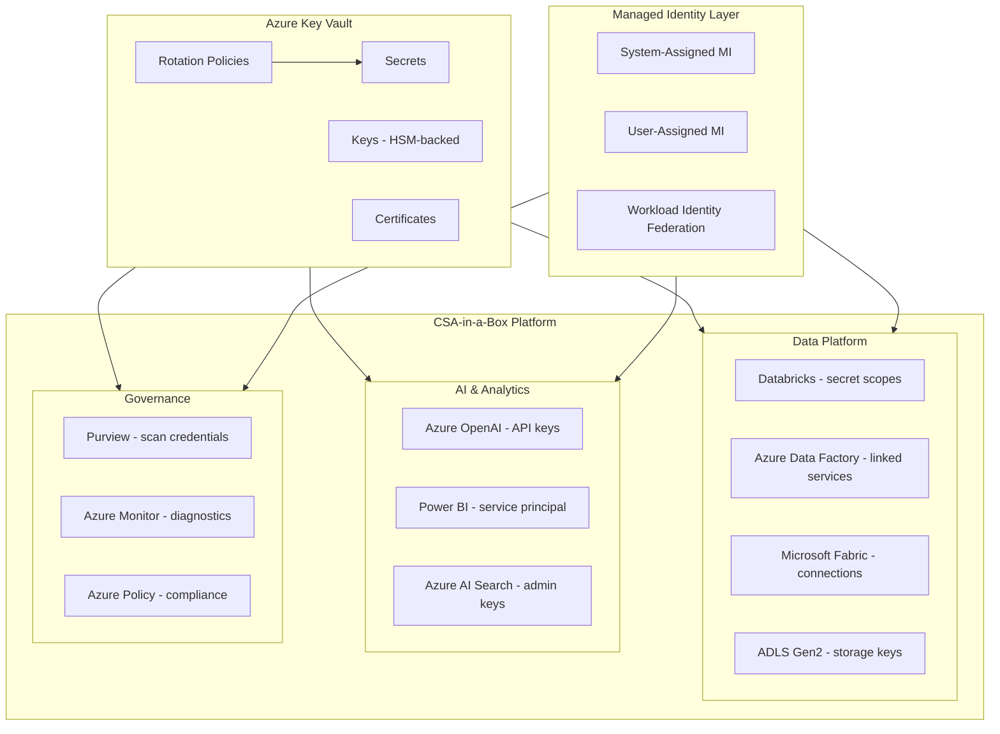
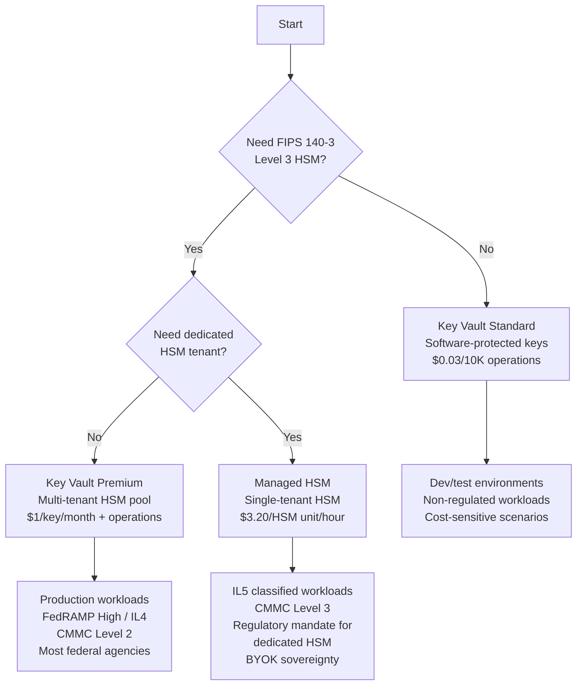

# HashiCorp Vault to Azure Key Vault Migration Center

**The definitive resource for migrating from HashiCorp Vault (OSS and Enterprise) to Azure Key Vault, with CSA-in-a-Box as the secrets management and governance integration layer.**

---

## Who this is for

This migration center serves platform engineers, security architects, DevOps engineers, CISOs, and federal security teams who are evaluating or executing a migration from HashiCorp Vault to Azure Key Vault. Whether you are responding to IBM acquisition uncertainty, BSL license concerns, infrastructure overhead reduction mandates, or a strategic consolidation around Azure-native services, these resources provide the evidence, patterns, and step-by-step guidance to execute confidently.

---

## Quick-start decision matrix

| Your situation                                | Start here                                                             |
| --------------------------------------------- | ---------------------------------------------------------------------- |
| Executive evaluating Key Vault vs Vault       | [Why Key Vault over Vault](why-key-vault-over-vault.md)                |
| Need cost justification for migration         | [Total Cost of Ownership Analysis](tco-analysis.md)                    |
| Need a feature-by-feature comparison          | [Complete Feature Mapping (40+ features)](feature-mapping-complete.md) |
| Ready to plan a migration                     | [Migration Playbook](../vault-to-key-vault.md)                         |
| Migrating KV secrets                          | [Secrets Migration Guide](secrets-migration.md)                        |
| Migrating PKI / certificates                  | [PKI Migration Guide](pki-migration.md)                                |
| Replacing Vault dynamic secrets               | [Dynamic Secrets to Managed Identity](dynamic-secrets-migration.md)    |
| Migrating Transit engine encryption           | [Encryption Migration Guide](encryption-migration.md)                  |
| Migrating Vault policies                      | [Policy Migration Guide](policy-migration.md)                          |
| Want a step-by-step secret migration tutorial | [Tutorial: Secret Migration](tutorial-secret-migration.md)             |
| Want to eliminate database passwords          | [Tutorial: Managed Identity](tutorial-managed-identity.md)             |
| Federal / government requirements             | [Federal Migration Guide](federal-migration-guide.md)                  |
| Best practices for production                 | [Best Practices](best-practices.md)                                    |

---

## How CSA-in-a-Box fits

CSA-in-a-Box is not a secrets management tool. Azure Key Vault is the secrets management service. CSA-in-a-Box is the **analytics and governance landing zone** where Azure Key Vault serves as the central secrets management layer that secures every CSA-in-a-Box component.

**What CSA-in-a-Box gains from Key Vault migration:**

| Capability                      | How Key Vault enables it                                                                                                                                                                                         |
| ------------------------------- | ---------------------------------------------------------------------------------------------------------------------------------------------------------------------------------------------------------------- |
| **Databricks secret scopes**    | Databricks Azure Key Vault-backed secret scopes reference Key Vault directly. Notebooks call `dbutils.secrets.get(scope, key)` -- no credentials in code, no separate Vault agent sidecar needed.                |
| **ADF credential management**   | ADF linked services for SQL Server, ADLS, Cosmos DB, and external sources store credentials in Key Vault. ADF accesses Key Vault via managed identity -- zero stored passwords in ADF configuration.             |
| **Fabric connection security**  | Microsoft Fabric data pipelines reference Key Vault for external data source credentials. Key Vault rotation ensures credentials stay current without manual intervention.                                       |
| **Purview catalog scanning**    | Purview data source scans authenticate to databases, storage accounts, and external systems using Key Vault-stored credentials or managed identity -- fully audited in Azure Monitor.                            |
| **Azure OpenAI key management** | Azure OpenAI API keys stored in Key Vault with rotation policies. Applications access via managed identity, never embedding API keys in code or configuration files.                                             |
| **Compliance audit trail**      | Key Vault diagnostic logging to Log Analytics provides a complete, tamper-evident audit trail of every secret access, key operation, and certificate issuance for FedRAMP, CMMC, and HIPAA compliance reporting. |

---

## Key Vault tier selection guide

Choosing the right Key Vault tier is the first architectural decision. The tier determines HSM backing, compliance posture, and cost structure.

### Decision flowchart

### Tier comparison

| Criterion                | Standard                                 | Premium                              | Managed HSM                                      |
| ------------------------ | ---------------------------------------- | ------------------------------------ | ------------------------------------------------ |
| **HSM backing**          | Software-protected                       | FIPS 140-3 Level 3 (shared HSM pool) | FIPS 140-3 Level 3 (dedicated, single-tenant)    |
| **Key types**            | RSA 2048/3072/4096, EC P-256/P-384/P-521 | Same + HSM-backed                    | Same + AES-128/192/256 (HSM-backed)              |
| **Secrets**              | Unlimited (25 KB max per secret)         | Unlimited (25 KB max per secret)     | N/A (keys only; pair with Key Vault for secrets) |
| **Certificates**         | Yes                                      | Yes                                  | N/A (pair with Key Vault for certificates)       |
| **Max operations/sec**   | 4,000 (per vault, per region)            | 4,000 (per vault, per region)        | 5,000 RSA-2048 / 2,000 EC-P256 per HSM unit      |
| **Availability SLA**     | 99.99%                                   | 99.99%                               | 99.99%                                           |
| **Geo-replication**      | No                                       | Yes (read replicas)                  | Yes (multi-region HA, 3+ HSM units)              |
| **Private endpoints**    | Yes                                      | Yes                                  | Yes                                              |
| **Azure Government**     | Yes                                      | Yes                                  | Yes                                              |
| **FedRAMP**              | Moderate                                 | High                                 | High                                             |
| **DoD IL**               | IL2                                      | IL4                                  | IL4/IL5                                          |
| **CMMC**                 | Level 1                                  | Level 2                              | Level 2/3                                        |
| **Pricing model**        | Per-operation (secrets, keys, certs)     | Per-key/month + per-operation        | Per-HSM-unit/hour                                |
| **Typical monthly cost** | $5-50 (moderate usage)                   | $50-500 (moderate keys + operations) | $2,300+ per HSM unit                             |

### When to use each tier

**Key Vault Standard** is appropriate for:

- Development and testing environments
- Non-regulated commercial workloads where software-protected keys are acceptable
- Cost-sensitive scenarios with moderate secret volumes
- Scenarios where HSM backing is not a compliance requirement

**Key Vault Premium** is appropriate for:

- Production workloads in regulated industries
- Federal agencies requiring FedRAMP High authorization
- CMMC Level 2 compliance (most DoD contractors)
- IL4 workloads in Azure Government
- Any scenario requiring HSM-backed keys without dedicated HSM hardware

**Managed HSM** is appropriate for:

- IL5 classified data processing
- CMMC Level 3 (advanced) requirements
- Regulatory mandates for dedicated, single-tenant HSM hardware
- BYOK scenarios requiring full key sovereignty
- Financial services with HSM custody requirements
- Organizations with existing on-premises HSM infrastructure requiring cloud parity

---

## Migration timeline overview

A typical Vault-to-Key Vault migration follows a phased approach. Timeline varies based on Vault complexity, number of applications, and compliance requirements.

| Phase                                            | Duration        | Scope                                                                                |
| ------------------------------------------------ | --------------- | ------------------------------------------------------------------------------------ |
| **Phase 0: Discovery**                           | 2 weeks         | Inventory all Vault secrets engines, policies, auth methods, applications            |
| **Phase 1: Key Vault deployment**                | 2 weeks         | Deploy Key Vault instances via Bicep, configure networking, RBAC, monitoring         |
| **Phase 2: Static secrets**                      | 4 weeks         | Migrate KV v1/v2 secrets, configure rotation policies, update application references |
| **Phase 3: Dynamic secrets to managed identity** | 6 weeks         | Replace Vault database engine with managed identity, eliminate stored passwords      |
| **Phase 4: Transit to Key Vault keys**           | 4 weeks         | Migrate encryption keys, update encrypt/decrypt API calls                            |
| **Phase 5: PKI to certificates**                 | 4 weeks         | Migrate CAs, certificate issuance policies, integrate with App Service/AKS           |
| **Phase 6: Policy and governance**               | 4 weeks         | Map Vault policies to Azure RBAC, deploy Azure Policy, enable PIM                    |
| **Phase 7: Cutover**                             | 4 weeks         | Final validation, decommission Vault cluster and Consul backend                      |
| **Total**                                        | **26-30 weeks** | Full migration including parallel-run validation                                     |

For simpler deployments (OSS Vault, KV secrets only, few applications), the timeline can compress to 8-12 weeks by skipping phases that do not apply.

---

## Navigation

### Strategic

- [Why Key Vault over Vault (Executive Brief)](why-key-vault-over-vault.md) -- The strategic case for migration, covering IBM acquisition uncertainty, managed infrastructure advantages, managed identity, and FIPS 140-3 Level 3 HSM.
- [Total Cost of Ownership Analysis](tco-analysis.md) -- Three-year TCO comparing Vault Enterprise (per-node licensing, Consul backend, admin FTE) with Key Vault Standard/Premium/Managed HSM.

### Feature reference

- [Complete Feature Mapping (40+ features)](feature-mapping-complete.md) -- Every Vault secrets engine, auth method, policy mechanism, and operational feature mapped to its Azure Key Vault equivalent.

### Migration guides

- [Secrets Migration](secrets-migration.md) -- Static secrets from Vault KV v1/v2 to Key Vault secrets, including versioning, rotation policies, soft-delete, and RBAC.
- [PKI Migration](pki-migration.md) -- Vault PKI engine to Key Vault certificates, CA migration, ACME protocol, and integration with App Service, AKS, and API Management.
- [Dynamic Secrets to Managed Identity](dynamic-secrets-migration.md) -- Eliminating stored database credentials entirely using Azure managed identity for SQL, PostgreSQL, and Cosmos DB.
- [Encryption Migration](encryption-migration.md) -- Vault Transit engine to Key Vault keys, covering encrypt/decrypt API migration, key types, rotation, envelope encryption, and BYOK.
- [Policy Migration](policy-migration.md) -- Vault path-based policies to Azure RBAC role assignments, Entra groups, PIM just-in-time access, and Azure Policy governance.

### Tutorials

- [Tutorial: Secret Migration (Step-by-Step)](tutorial-secret-migration.md) -- Export secrets from Vault, create Key Vault with Bicep, import secrets with Python, configure RBAC, update application references, and validate.
- [Tutorial: Managed Identity for Zero Stored Secrets](tutorial-managed-identity.md) -- Replace Vault dynamic database credentials with Azure managed identity for SQL, PostgreSQL, and Cosmos DB.

### Federal and compliance

- [Federal Migration Guide](federal-migration-guide.md) -- Key Vault in Azure Government, FIPS 140-3 Level 3 (Premium/Managed HSM), IL4/IL5, CMMC, FedRAMP key management controls.

### Operational

- [Best Practices](best-practices.md) -- Incremental migration strategy, managed identity adoption ladder, Key Vault networking (private endpoints), backup and recovery, CSA-in-a-Box secrets integration patterns.

---

## Related resources

- **Migration playbook (concise):** [Vault to Key Vault Playbook](../vault-to-key-vault.md)
- **Migration index:** [All migration guides](../README.md)
- **CSA-in-a-Box identity and secrets flow:** [Reference Architecture](../../reference-architecture/identity-secrets-flow.md)
- **CSA-in-a-Box compliance matrices:**
    - [NIST 800-53 Rev 5](../../compliance/nist-800-53-rev5.md)
    - [FedRAMP Moderate](../../compliance/fedramp-moderate.md)
    - [CMMC 2.0 Level 2](../../compliance/cmmc-2.0-l2.md)
- **Key rotation runbook:** [Runbook](../../runbooks/key-rotation.md)
- **Microsoft Learn:**
    - [Azure Key Vault documentation](https://learn.microsoft.com/azure/key-vault/)
    - [Managed identity overview](https://learn.microsoft.com/entra/identity/managed-identities-azure-resources/overview)
    - [Key Vault best practices](https://learn.microsoft.com/azure/key-vault/general/best-practices)
    - [Managed HSM documentation](https://learn.microsoft.com/azure/key-vault/managed-hsm/)
    - [Key Vault security baseline](https://learn.microsoft.com/security/benchmark/azure/baselines/key-vault-security-baseline)

---

**Maintainers:** csa-inabox core team
**Last updated:** 2026-04-30
