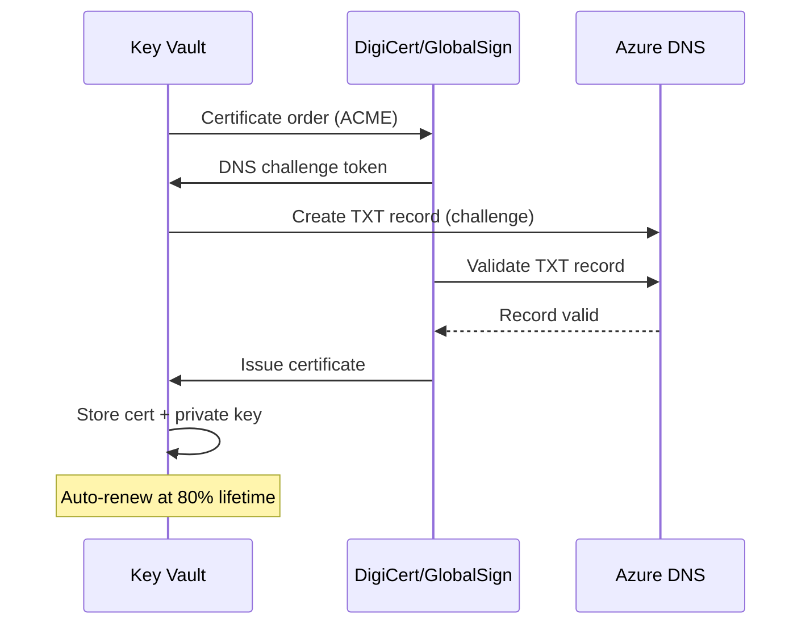

# PKI Migration: Vault PKI Engine to Azure Key Vault Certificates

**Status:** Authored 2026-04-30
**Audience:** Security Engineers, PKI Administrators, Platform Engineers
**Purpose:** Guide for migrating certificate authority (CA) infrastructure and certificate issuance from Vault PKI engine to Azure Key Vault certificates

---

## Overview

The HashiCorp Vault PKI secrets engine provides a full certificate authority (CA) implementation: root CA generation, intermediate CA signing, certificate issuance with configurable roles, CRL distribution, and OCSP response. It is commonly used for internal TLS certificates, mutual TLS (mTLS) in service meshes, and short-lived workload identity certificates.

Azure Key Vault certificates provide managed certificate lifecycle including creation, import, renewal, and integration with public CAs (DigiCert, GlobalSign) and Azure services (App Service, AKS, API Management, Application Gateway). For internal CA scenarios, Key Vault supports self-signed CA generation and CSR-based issuance with external CAs.

This guide covers the migration of CA infrastructure, certificate issuance workflows, and certificate consumer updates from Vault PKI to Key Vault certificates.

---

## 1. PKI architecture comparison

### Vault PKI engine

```
Root CA (Vault PKI mount: pki/)
  └── Intermediate CA (Vault PKI mount: pki_int/)
        ├── Role: web-server (CN=*.example.com, TTL=30d)
        ├── Role: service-mesh (CN=*.svc.cluster.local, TTL=1h)
        └── Role: client-auth (CN=user@example.com, TTL=8h)

Certificate Consumers:
  - Vault Agent sidecar injects certs into pods
  - Applications request certs via Vault API
  - Consul Connect uses Vault PKI for mTLS
  - CRL/OCSP served by Vault
```

### Key Vault certificates

```
Azure Key Vault (kv-certs-prod)
  ├── Certificate Policy: web-tls (DigiCert integration, auto-renew)
  ├── Certificate Policy: internal-tls (self-signed CA, auto-renew)
  └── Certificate Policy: client-auth (GlobalSign integration)

Certificate Consumers:
  - App Service: auto-bind from Key Vault
  - AKS: CSI Secret Store Driver mounts certs
  - API Management: TLS certs from Key Vault
  - Application Gateway: SSL certs from Key Vault
  - Azure Front Door: custom domain TLS from Key Vault
```

---

## 2. Pre-migration assessment

### Inventory Vault PKI configuration

```bash
# List PKI mounts
vault secrets list -format=json | jq 'to_entries[] | select(.value.type == "pki") | .key'

# For each PKI mount, get CA certificate
vault read pki/cert/ca -format=json | jq -r '.data.certificate'

# List roles (certificate templates)
vault list pki_int/roles

# Read role configuration
vault read pki_int/roles/web-server -format=json

# Get CRL configuration
vault read pki/config/crl -format=json

# Get URLs configuration (CRL, OCSP, issuing CA)
vault read pki/config/urls -format=json

# Count issued certificates (if tracking is enabled)
vault list pki_int/certs -format=json | jq '. | length'
```

### Categorize certificates by migration path

| Certificate type                      | Vault PKI role               | Migration target                                         |
| ------------------------------------- | ---------------------------- | -------------------------------------------------------- |
| **Public TLS (web-facing)**           | web-server role, 90-day TTL  | Key Vault + DigiCert/GlobalSign integration (auto-renew) |
| **Internal TLS (service-to-service)** | internal role, 30-day TTL    | Key Vault self-signed or import existing internal CA     |
| **mTLS (service mesh)**               | mesh role, 1-hour TTL        | AKS workload identity or Istio-based service mesh CA     |
| **Client certificates**               | client-auth role, 8-hour TTL | Key Vault certificates with Entra certificate-based auth |
| **Code signing**                      | signing role, 1-year TTL     | Azure Trusted Signing or Key Vault-stored signing cert   |

---

## 3. CA certificate migration

### Option A: Import existing CA to Key Vault

If you want to maintain your existing CA trust chain (recommended for seamless transition):

```bash
# Export root CA certificate and private key from Vault
vault read -format=json pki/cert/ca | jq -r '.data.certificate' > root-ca.pem

# Export intermediate CA certificate and private key
# Note: Vault does not export CA private keys via API by default
# You need the original CA key or must generate a new intermediate

# If you have the CA as a PFX/PKCS#12 file:
az keyvault certificate import \
  --vault-name kv-certs-prod \
  --name internal-ca \
  --file intermediate-ca.pfx \
  --password "$PFX_PASSWORD"
```

### Option B: Generate new CA in Key Vault

For a clean start with a new internal CA:

```bash
# Create a self-signed root CA certificate in Key Vault
az keyvault certificate create \
  --vault-name kv-certs-prod \
  --name internal-root-ca \
  --policy @ca-policy.json
```

CA policy file (`ca-policy.json`):

```json
{
    "issuerParameters": {
        "name": "Self"
    },
    "keyProperties": {
        "exportable": false,
        "keySize": 4096,
        "keyType": "RSA",
        "reuseKey": false
    },
    "x509CertificateProperties": {
        "subject": "CN=Internal Root CA, O=Contoso, C=US",
        "validityInMonths": 120,
        "keyUsage": ["keyCertSign", "cRLSign"],
        "ekus": []
    },
    "lifetimeActions": [
        {
            "trigger": { "daysBeforeExpiry": 90 },
            "action": { "actionType": "EmailContacts" }
        }
    ]
}
```

### Option C: Integrate with public CA

For public-facing certificates, integrate Key Vault with DigiCert or GlobalSign:

```bash
# Configure DigiCert CA integration
az keyvault certificate issuer create \
  --vault-name kv-certs-prod \
  --issuer-name DigiCert \
  --provider-name DigiCert \
  --account-id "$DIGICERT_ACCOUNT_ID" \
  --api-key "$DIGICERT_API_KEY" \
  --organization-id "$DIGICERT_ORG_ID"

# Create certificate with DigiCert issuance
az keyvault certificate create \
  --vault-name kv-certs-prod \
  --name web-tls-cert \
  --policy @web-tls-policy.json
```

Web TLS policy (`web-tls-policy.json`):

```json
{
    "issuerParameters": {
        "name": "DigiCert"
    },
    "keyProperties": {
        "exportable": true,
        "keySize": 2048,
        "keyType": "RSA",
        "reuseKey": false
    },
    "x509CertificateProperties": {
        "subject": "CN=www.example.com",
        "subjectAlternativeNames": {
            "dnsNames": ["www.example.com", "api.example.com"]
        },
        "validityInMonths": 12
    },
    "lifetimeActions": [
        {
            "trigger": { "lifetimePercentage": 80 },
            "action": { "actionType": "AutoRenew" }
        }
    ]
}
```

---

## 4. Certificate issuance workflow migration

### Vault PKI issuance flow

```bash
# Application requests certificate from Vault
vault write pki_int/issue/web-server \
  common_name="api.example.com" \
  alt_names="api-v2.example.com" \
  ttl="720h"
```

### Key Vault certificate issuance

```python
from azure.identity import DefaultAzureCredential
from azure.keyvault.certificates import (
    CertificateClient,
    CertificatePolicy,
    SubjectAlternativeNames,
    KeyType,
    KeyUsageType,
)

credential = DefaultAzureCredential()
client = CertificateClient(
    vault_url="https://kv-certs-prod.vault.azure.net",
    credential=credential
)

# Create certificate with issuance policy
policy = CertificatePolicy(
    issuer_name="Self",  # or "DigiCert" / "GlobalSign"
    subject="CN=api.example.com,O=Contoso,C=US",
    san_dns_names=["api.example.com", "api-v2.example.com"],
    validity_in_months=12,
    key_type=KeyType.rsa,
    key_size=2048,
    content_type="application/x-pkcs12",
    key_usage=[KeyUsageType.digital_signature, KeyUsageType.key_encipherment],
    lifetime_actions=[{
        "trigger": {"lifetime_percentage": 80},
        "action": {"action_type": "AutoRenew"}
    }]
)

poller = client.begin_create_certificate(
    certificate_name="api-tls-cert",
    policy=policy
)
certificate = poller.result()
print(f"Certificate created: {certificate.name}, thumbprint: {certificate.properties.x509_thumbprint.hex()}")
```

---

## 5. Certificate consumer migration

### App Service

```bicep
// Bind Key Vault certificate to App Service custom domain
resource appService 'Microsoft.Web/sites@2023-12-01' = {
  name: 'myapp'
  // ...
}

resource certificate 'Microsoft.Web/certificates@2023-12-01' = {
  name: 'api-tls-cert'
  location: resourceGroup().location
  properties: {
    keyVaultId: keyVault.id
    keyVaultSecretName: 'api-tls-cert'
  }
}

resource hostNameBinding 'Microsoft.Web/sites/hostNameBindings@2023-12-01' = {
  parent: appService
  name: 'api.example.com'
  properties: {
    sslState: 'SniEnabled'
    thumbprint: certificate.properties.thumbprint
  }
}
```

### AKS (CSI Secret Store Driver)

```yaml
apiVersion: secrets-store.csi.x-k8s.io/v1
kind: SecretProviderClass
metadata:
    name: azure-kv-certs
spec:
    provider: azure
    parameters:
        usePodIdentity: "false"
        useVMManagedIdentity: "true"
        userAssignedIdentityID: "<managed-identity-client-id>"
        keyvaultName: "kv-certs-prod"
        objects: |
            array:
              - |
                objectName: api-tls-cert
                objectType: secret  # Use 'secret' to get both cert + private key as PFX
        tenantId: "<tenant-id>"
    secretObjects:
        - secretName: api-tls
          type: kubernetes.io/tls
          data:
              - objectName: api-tls-cert
                key: tls.crt
              - objectName: api-tls-cert
                key: tls.key
```

### API Management

```bicep
// Reference Key Vault certificate in API Management custom domain
resource apim 'Microsoft.ApiManagement/service@2023-09-01-preview' = {
  name: 'apim-prod'
  // ...
  properties: {
    hostnameConfigurations: [
      {
        type: 'Proxy'
        hostName: 'api.example.com'
        keyVaultId: '${keyVault.id}/secrets/api-tls-cert'
        negotiateClientCertificate: false
      }
    ]
  }
}
```

### Application Gateway

```bicep
// SSL certificate from Key Vault for Application Gateway
resource appGw 'Microsoft.Network/applicationGateways@2023-09-01' = {
  name: 'appgw-prod'
  // ...
  properties: {
    sslCertificates: [
      {
        name: 'api-tls-cert'
        properties: {
          keyVaultSecretId: '${keyVault.properties.vaultUri}secrets/api-tls-cert'
        }
      }
    ]
  }
}
```

---

## 6. ACME protocol support

Key Vault supports the ACME protocol for automated certificate issuance from public CAs that support ACME (e.g., Let's Encrypt via DigiCert integration).

### ACME workflow



For Vault PKI environments that were providing internal certificates and you want to transition to publicly trusted certificates, the ACME integration eliminates the need to manage an internal CA entirely.

---

## 7. Short-lived certificate considerations

Vault PKI excels at short-lived certificates (minutes to hours) for service mesh mTLS. Key Vault has a minimum certificate validity of 1 month, making it unsuitable for sub-hour certificate lifetimes.

### Migration options for short-lived certificates

| Scenario                              | Recommended approach                                                       |
| ------------------------------------- | -------------------------------------------------------------------------- |
| **AKS service mesh (Consul Connect)** | Migrate to Istio-based Azure Service Mesh (built-in mTLS, no external CA)  |
| **Workload identity (SPIFFE/SPIRE)**  | AKS workload identity with OIDC federation (no certificates needed)        |
| **gRPC mTLS**                         | Key Vault certificates with 1-month validity + auto-renewal; or Istio mTLS |
| **API gateway mTLS**                  | API Management mutual TLS with Key Vault certificates                      |

If short-lived certificates are strictly required (sub-hour TTL for zero-trust architectures), consider:

1. **Azure Managed HSM** as the CA signing key store, with a custom certificate issuance service that signs short-lived certificates using HSM-backed keys
2. **SPIFFE/SPIRE on AKS** with the signing key stored in Key Vault Managed HSM
3. **Istio's built-in CA** for service mesh mTLS (no external CA needed)

---

## 8. CRL and OCSP migration

### Vault CRL/OCSP

Vault PKI serves CRL and OCSP responses at configurable endpoints:

```
CRL: https://vault.example.com/v1/pki/crl
OCSP: https://vault.example.com/v1/pki/ocsp
```

### Key Vault CRL/OCSP

Key Vault does not serve CRL or OCSP endpoints directly. For certificates issued through integrated CAs (DigiCert, GlobalSign), the CA handles CRL/OCSP infrastructure.

For self-signed/internal CA scenarios where CRL distribution is required:

1. Generate CRL periodically using the CA private key in Key Vault (via Azure Function)
2. Publish CRL to Azure Blob Storage with a public URL
3. Configure certificate AIA/CRL distribution points to reference the Blob Storage URL

```python
# Azure Function to generate CRL from Key Vault CA
from cryptography import x509
from cryptography.hazmat.primitives import hashes, serialization
from azure.identity import DefaultAzureCredential
from azure.keyvault.certificates import CertificateClient
from azure.keyvault.keys.crypto import CryptographyClient
from azure.storage.blob import BlobClient
from datetime import datetime, timedelta, timezone

def generate_crl():
    credential = DefaultAzureCredential()
    cert_client = CertificateClient(
        vault_url="https://kv-certs-prod.vault.azure.net",
        credential=credential
    )

    # Load CA certificate
    ca_cert_bundle = cert_client.get_certificate("internal-ca")
    ca_cert = x509.load_der_x509_certificate(ca_cert_bundle.cer)

    # Build CRL (example -- add revoked certs as needed)
    builder = x509.CertificateRevocationListBuilder()
    builder = builder.issuer_name(ca_cert.subject)
    builder = builder.last_update(datetime.now(timezone.utc))
    builder = builder.next_update(datetime.now(timezone.utc) + timedelta(hours=24))

    # Sign CRL using Key Vault key
    crypto_client = CryptographyClient(
        key_id=f"https://kv-certs-prod.vault.azure.net/keys/{ca_cert_bundle.key_id}",
        credential=credential
    )
    # ... sign and publish to Blob Storage
```

---

## 9. Post-migration validation

### Validation checklist

- [ ] CA certificate chain is properly imported or generated in Key Vault
- [ ] Certificate issuance policies match Vault PKI role configurations
- [ ] Auto-renewal is configured for all certificates
- [ ] App Service custom domains bind certificates from Key Vault
- [ ] AKS pods mount certificates via CSI Secret Store Driver
- [ ] API Management references Key Vault certificates for custom domains
- [ ] CRL/OCSP infrastructure is established (if using internal CA)
- [ ] Certificate expiration monitoring is configured in Azure Monitor
- [ ] RBAC roles (Key Vault Certificates Officer, User) are assigned appropriately
- [ ] Diagnostic logging captures certificate operations

---

## Related resources

- **Secrets migration:** [Secrets Migration Guide](secrets-migration.md)
- **Encryption migration:** [Encryption Migration Guide](encryption-migration.md)
- **Feature mapping:** [Complete Feature Mapping](feature-mapping-complete.md)
- **Best practices:** [Best Practices](best-practices.md)
- **Microsoft Learn:**
    - [Key Vault certificates overview](https://learn.microsoft.com/azure/key-vault/certificates/about-certificates)
    - [Integrate with DigiCert CA](https://learn.microsoft.com/azure/key-vault/certificates/how-to-integrate-certificate-authority)
    - [CSI Secret Store Driver for AKS](https://learn.microsoft.com/azure/aks/csi-secrets-store-driver)

---

**Maintainers:** csa-inabox core team
**Last updated:** 2026-04-30
