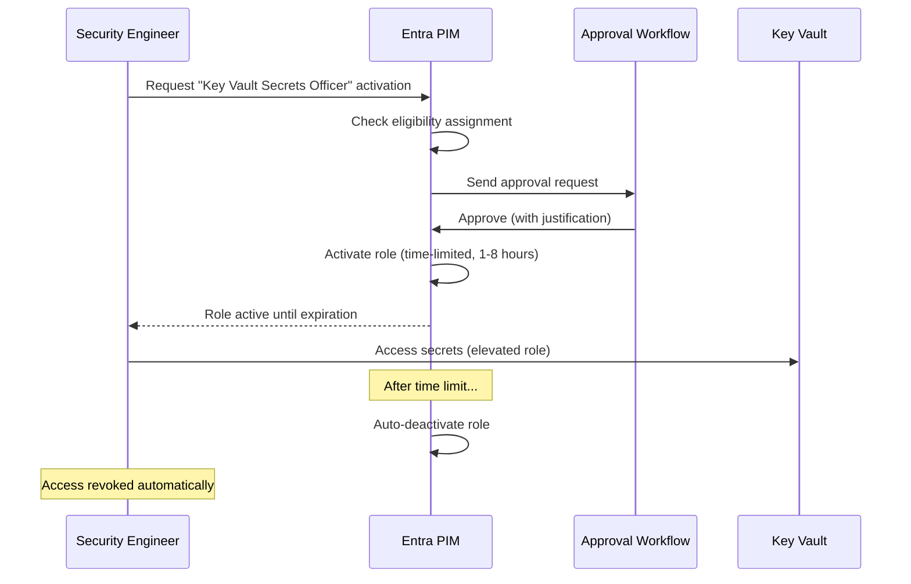

# Policy Migration: Vault Policies to Azure RBAC and Azure Policy

**Status:** Authored 2026-04-30
**Audience:** Security Engineers, IAM Architects, Platform Engineers
**Purpose:** Guide for migrating HashiCorp Vault ACL policies and Sentinel policies to Azure RBAC role assignments, Entra ID groups, PIM just-in-time access, and Azure Policy for Key Vault governance

---

## Overview

HashiCorp Vault uses a path-based ACL policy model. Policies define capabilities (create, read, update, delete, list, sudo, deny) on specific paths within Vault. Vault Enterprise adds Sentinel policies for policy-as-code enforcement with business logic beyond simple ACLs.

Azure Key Vault uses Azure RBAC for authorization. Built-in roles (Key Vault Secrets User, Key Vault Crypto Officer, etc.) are assigned to Entra ID principals at specific scopes. Azure Policy provides governance guardrails (equivalent to Vault Sentinel) for enforcing organizational standards on Key Vault configuration.

This guide maps Vault policy patterns to Azure RBAC assignments and Azure Policy definitions.

---

## 1. Vault policy model vs Azure RBAC

### Vault: path-based capabilities

```hcl
# Vault policy: read secrets for app1 in production
path "secret/data/app1/prod/*" {
  capabilities = ["read", "list"]
}

# Deny access to admin secrets
path "secret/data/admin/*" {
  capabilities = ["deny"]
}

# Full access to app1 KV engine
path "secret/data/app1/*" {
  capabilities = ["create", "read", "update", "delete", "list"]
}
path "secret/metadata/app1/*" {
  capabilities = ["read", "list", "delete"]
}
```

### Azure RBAC: role-based, scope-based

```bash
# Equivalent: read secrets in a specific Key Vault
az role assignment create \
  --role "Key Vault Secrets User" \
  --assignee-object-id <principal-id> \
  --scope /subscriptions/<sub>/resourceGroups/<rg>/providers/Microsoft.KeyVault/vaults/kv-app1-prod

# Equivalent: full access to secrets in a Key Vault
az role assignment create \
  --role "Key Vault Secrets Officer" \
  --assignee-object-id <principal-id> \
  --scope /subscriptions/<sub>/resourceGroups/<rg>/providers/Microsoft.KeyVault/vaults/kv-app1-prod
```

### Key architectural difference

Vault uses a **single cluster** with path isolation. Multiple applications share one Vault instance, and policies separate access by path prefix.

Azure Key Vault uses **separate vault instances** for isolation. Each application or team gets its own Key Vault, and RBAC roles control access at the vault level. This is a stronger isolation model -- compromising one vault's RBAC does not expose another vault's secrets.

---

## 2. Policy mapping reference

### Common Vault policies mapped to Azure RBAC

| Vault policy pattern                                                                      | Azure RBAC role                                                   | Scope                           | Notes                                     |
| ----------------------------------------------------------------------------------------- | ----------------------------------------------------------------- | ------------------------------- | ----------------------------------------- |
| `path "secret/data/*" { capabilities = ["read"] }`                                        | Key Vault Secrets User                                            | Key Vault instance              | Read secret values                        |
| `path "secret/data/*" { capabilities = ["read", "list"] }`                                | Key Vault Secrets User + Key Vault Reader                         | Key Vault instance              | Read values + list metadata               |
| `path "secret/data/*" { capabilities = ["create", "read", "update", "delete", "list"] }`  | Key Vault Secrets Officer                                         | Key Vault instance              | Full CRUD on secrets                      |
| `path "transit/encrypt/*" { capabilities = ["update"] }`                                  | Key Vault Crypto User                                             | Key Vault instance (keys vault) | Encrypt/decrypt operations                |
| `path "transit/*" { capabilities = ["create", "read", "update", "delete", "list"] }`      | Key Vault Crypto Officer                                          | Key Vault instance (keys vault) | Full key management                       |
| `path "pki/issue/*" { capabilities = ["update"] }`                                        | Key Vault Certificates Officer                                    | Key Vault instance              | Certificate issuance                      |
| `path "sys/*" { capabilities = ["read", "list"] }`                                        | Key Vault Reader                                                  | Key Vault instance              | Read metadata only                        |
| `path "sys/*" { capabilities = ["sudo"] }`                                                | Key Vault Administrator                                           | Key Vault instance              | Full vault management                     |
| `path "auth/*" { capabilities = ["create", "read", "update", "delete", "list", "sudo"] }` | N/A (Entra ID admin)                                              | Entra ID                        | Auth config is in Entra ID, not Key Vault |
| Deny policy on specific path                                                              | Remove role assignment; or use deny assignment (Azure Blueprints) | Specific scope                  | Azure RBAC is deny-by-default             |

### Built-in Key Vault RBAC roles

| Role                                         | Description                               | Secret perms   | Key perms                                    | Cert perms     |
| -------------------------------------------- | ----------------------------------------- | -------------- | -------------------------------------------- | -------------- |
| **Key Vault Administrator**                  | Full management                           | All            | All                                          | All            |
| **Key Vault Reader**                         | Read metadata (no values)                 | List, metadata | List, metadata                               | List, metadata |
| **Key Vault Secrets Officer**                | Manage secrets                            | All            | None                                         | None           |
| **Key Vault Secrets User**                   | Read secret values                        | Get, List      | None                                         | None           |
| **Key Vault Crypto Officer**                 | Manage keys                               | None           | All                                          | None           |
| **Key Vault Crypto User**                    | Use keys for crypto ops                   | None           | Encrypt, Decrypt, Sign, Verify, Wrap, Unwrap | None           |
| **Key Vault Crypto Service Encryption User** | Wrap/Unwrap only (for service encryption) | None           | Wrap, Unwrap                                 | None           |
| **Key Vault Certificates Officer**           | Manage certificates                       | None           | None                                         | All            |

---

## 3. Entra ID groups for policy organization

### Vault: entity groups

Vault uses entities and identity groups to organize policy assignments:

```hcl
# Create identity group and assign policy
vault write identity/group name="app1-team" policies="app1-prod-read"
vault write identity/group/name/app1-team member_entity_ids="entity-id-1,entity-id-2"
```

### Azure: Entra ID security groups

```bash
# Create Entra ID security group
az ad group create \
  --display-name "KV-App1-Prod-Readers" \
  --mail-nickname "kv-app1-prod-readers" \
  --description "Read access to app1 production Key Vault secrets"

# Add members
az ad group member add \
  --group "KV-App1-Prod-Readers" \
  --member-id <user-or-sp-object-id>

# Assign RBAC role to the group
az role assignment create \
  --role "Key Vault Secrets User" \
  --assignee-object-id $(az ad group show -g "KV-App1-Prod-Readers" --query id -o tsv) \
  --assignee-principal-type Group \
  --scope /subscriptions/<sub>/resourceGroups/<rg>/providers/Microsoft.KeyVault/vaults/kv-app1-prod
```

### Recommended group naming convention

```
KV-{Application}-{Environment}-{Role}

Examples:
  KV-WebApp-Prod-SecretsUser       (read secrets)
  KV-WebApp-Prod-SecretsOfficer    (manage secrets)
  KV-Platform-Prod-CryptoOfficer   (manage encryption keys)
  KV-PKI-Prod-CertsOfficer         (manage certificates)
  KV-All-Prod-Admins               (full admin, break-glass only)
```

---

## 4. PIM for just-in-time access

### Vault: response wrapping and short-lived tokens

Vault provides just-in-time access through:

- Short-lived tokens with configurable TTL
- Response wrapping (single-use wrapped tokens)
- Auth method configurations with max TTL

### Azure: Privileged Identity Management (PIM)

PIM provides a formal just-in-time (JIT) access workflow:



### Configure PIM for Key Vault roles

```bash
# Make Key Vault Secrets Officer eligible (not permanently assigned)
# This is configured in the Azure portal or via Microsoft Graph API

# Microsoft Graph API example:
# POST /roleManagement/directory/roleEligibilityScheduleRequests
# {
#   "action": "AdminAssign",
#   "justification": "Eligible for JIT Key Vault admin access",
#   "roleDefinitionId": "<Key Vault Secrets Officer role ID>",
#   "directoryScopeId": "/subscriptions/.../providers/Microsoft.KeyVault/vaults/kv-prod",
#   "principalId": "<user-or-group-id>",
#   "scheduleInfo": {
#     "startDateTime": "2026-01-01T00:00:00Z",
#     "expiration": {
#       "type": "noExpiration"
#     }
#   }
# }
```

### PIM configuration recommendations

| Setting                             | Recommended value                        | Rationale                              |
| ----------------------------------- | ---------------------------------------- | -------------------------------------- |
| **Maximum activation duration**     | 4 hours (8 hours for complex operations) | Limits exposure window                 |
| **Require justification**           | Yes                                      | Audit trail for access requests        |
| **Require approval**                | Yes (for Officer/Admin roles)            | Peer review for elevated access        |
| **Require MFA**                     | Yes                                      | Prevent credential-based elevation     |
| **Send notification on activation** | Yes (to security team)                   | Real-time awareness of elevated access |
| **Eligible assignment expiration**  | 6 months (renewable)                     | Forces periodic review of eligibility  |

---

## 5. Azure Policy for Key Vault governance

### Vault: Sentinel policies (Enterprise)

Vault Enterprise Sentinel policies enforce business logic:

```python
# Vault Sentinel policy: enforce minimum secret TTL
import "time"
import "strings"

precond = rule {
    request.operation in ["create", "update"] and
    strings.has_prefix(request.path, "secret/data/")
}

main = rule when precond {
    # Require secret TTL of at least 24 hours
    request.data.ttl >= time.hour * 24
}
```

### Azure Policy: built-in and custom policies

Azure Policy provides equivalent governance. Azure includes built-in Key Vault policies and supports custom policy definitions.

#### Built-in Key Vault policies

| Policy                                                          | Description                            | Vault Sentinel equivalent     |
| --------------------------------------------------------------- | -------------------------------------- | ----------------------------- |
| **Key Vault should use private endpoint**                       | Enforces private endpoint connectivity | Network restriction policies  |
| **Key Vault keys should have expiration date**                  | All keys must have expiry set          | TTL enforcement               |
| **Key Vault secrets should have expiration date**               | All secrets must have expiry set       | TTL enforcement               |
| **Key Vault should have soft-delete enabled**                   | Prevents accidental permanent deletion | Data protection policy        |
| **Key Vault should have purge protection enabled**              | Prevents purge during retention        | Data protection policy        |
| **Keys should be backed by HSM**                                | Enforce HSM backing for all keys       | Key protection policy         |
| **Keys using RSA should have minimum key size**                 | Enforce minimum 2048-bit RSA           | Key strength policy           |
| **Certificates should have specified lifetime action triggers** | Enforce auto-renewal                   | Certificate management policy |

#### Assign built-in policies

```bash
# Require secrets to have expiration dates
az policy assignment create \
  --name "kv-secrets-expiry" \
  --display-name "Key Vault secrets must have expiration dates" \
  --policy "/providers/Microsoft.Authorization/policyDefinitions/98728c90-32c7-4049-8429-847dc0f4fe37" \
  --scope /subscriptions/<sub-id> \
  --enforcement-mode Default

# Require Key Vault to use private endpoints
az policy assignment create \
  --name "kv-private-endpoint" \
  --display-name "Key Vault must use private endpoint" \
  --policy "/providers/Microsoft.Authorization/policyDefinitions/a6abeaec-4d90-4a02-805f-6b26c4d3fbe9" \
  --scope /subscriptions/<sub-id>

# Require HSM backing for keys
az policy assignment create \
  --name "kv-keys-hsm" \
  --display-name "Key Vault keys must use HSM" \
  --policy "/providers/Microsoft.Authorization/policyDefinitions/587c79fe-dd04-4a5e-9d0b-f89598c7261b" \
  --scope /subscriptions/<sub-id>
```

#### Custom policy: enforce minimum secret expiration

```json
{
    "mode": "Microsoft.KeyVault.Data",
    "policyRule": {
        "if": {
            "allOf": [
                {
                    "field": "type",
                    "equals": "Microsoft.KeyVault.Data/vaults/secrets"
                },
                {
                    "anyOf": [
                        {
                            "field": "Microsoft.KeyVault.Data/vaults/secrets/attributes.expiresOn",
                            "exists": false
                        },
                        {
                            "field": "Microsoft.KeyVault.Data/vaults/secrets/attributes.expiresOn",
                            "greater": "[addDays(utcNow(), 365)]"
                        }
                    ]
                }
            ]
        },
        "then": {
            "effect": "deny"
        }
    }
}
```

#### Custom policy: enforce naming convention

```json
{
    "mode": "Microsoft.KeyVault.Data",
    "policyRule": {
        "if": {
            "allOf": [
                {
                    "field": "type",
                    "equals": "Microsoft.KeyVault.Data/vaults/secrets"
                },
                {
                    "not": {
                        "field": "name",
                        "match": "??*-??*-*"
                    }
                }
            ]
        },
        "then": {
            "effect": "deny"
        }
    }
}
```

---

## 6. Conditional Access for Key Vault

Entra ID Conditional Access provides context-aware access control that Vault does not natively support:

### Example: require MFA and compliant device for Key Vault admin access

```json
{
    "displayName": "Key Vault Admin - Require MFA + Compliant Device",
    "conditions": {
        "applications": {
            "includeApplications": ["cfa8b339-82a2-471a-a3c9-0fc0be7a4093"]
        },
        "users": {
            "includeGroups": ["<KV-Admins-Group-ID>"]
        }
    },
    "grantControls": {
        "operator": "AND",
        "builtInControls": ["mfa", "compliantDevice"]
    }
}
```

### Example: block Key Vault access from untrusted locations

```json
{
    "displayName": "Key Vault - Block untrusted locations",
    "conditions": {
        "applications": {
            "includeApplications": ["cfa8b339-82a2-471a-a3c9-0fc0be7a4093"]
        },
        "locations": {
            "includeLocations": ["All"],
            "excludeLocations": ["<trusted-locations-id>"]
        }
    },
    "grantControls": {
        "operator": "OR",
        "builtInControls": ["block"]
    }
}
```

---

## 7. Policy migration checklist

### For each Vault policy, complete these steps:

- [ ] Identify the Vault policy paths and capabilities
- [ ] Map to the appropriate Key Vault RBAC role (see mapping table)
- [ ] Determine the scope: specific vault, resource group, or subscription
- [ ] Create Entra ID security group for the policy assignment
- [ ] Assign RBAC role to the group at the appropriate scope
- [ ] Configure PIM for privileged roles (Officer, Admin)
- [ ] Validate access: principals can access what they need and cannot access what they should not
- [ ] Deploy Azure Policy for governance guardrails
- [ ] Configure Conditional Access for administrative roles
- [ ] Document the mapping in the migration inventory

### Post-migration governance validation

- [ ] All Key Vault instances have RBAC authorization enabled (not legacy access policies)
- [ ] No permanent assignments for privileged roles (use PIM eligible assignments)
- [ ] Azure Policy compliance reports show no violations
- [ ] Conditional Access policies are active for Key Vault admin access
- [ ] Diagnostic logging captures all access events
- [ ] Break-glass procedures are documented and tested

---

## Related resources

- **Secrets migration:** [Secrets Migration Guide](secrets-migration.md)
- **Feature mapping:** [Complete Feature Mapping](feature-mapping-complete.md)
- **Federal guide:** [Federal Migration Guide](federal-migration-guide.md)
- **Best practices:** [Best Practices](best-practices.md)
- **Microsoft Learn:**
    - [Key Vault RBAC overview](https://learn.microsoft.com/azure/key-vault/general/rbac-guide)
    - [Azure Policy for Key Vault](https://learn.microsoft.com/azure/key-vault/general/azure-policy)
    - [PIM for Azure resources](https://learn.microsoft.com/entra/id-governance/privileged-identity-management/pim-resource-roles-assign-roles)
    - [Conditional Access](https://learn.microsoft.com/entra/identity/conditional-access/overview)

---

**Maintainers:** csa-inabox core team
**Last updated:** 2026-04-30
