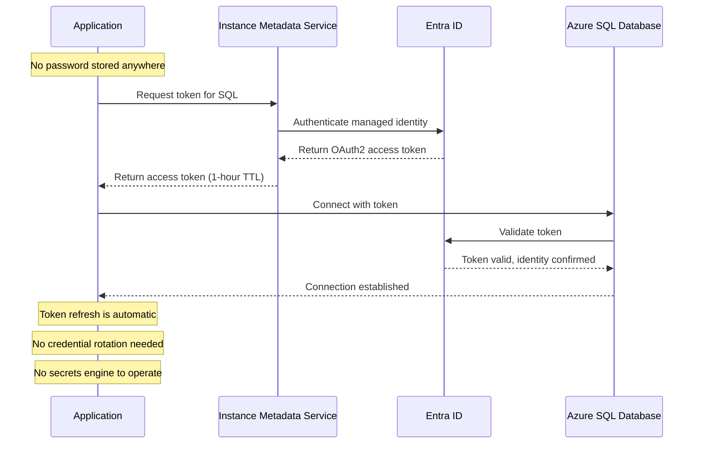

# Why Azure Key Vault over HashiCorp Vault

**Status:** Authored 2026-04-30
**Audience:** CISOs, CIOs, Security Architects, Platform Engineering Leadership, Federal Security Decision-Makers
**Purpose:** Executive brief for decision-makers evaluating a HashiCorp Vault to Azure Key Vault migration

---

## Executive summary

The secrets management landscape has shifted fundamentally. HashiCorp Vault, the dominant multi-cloud secrets management platform for the past decade, is now an IBM product following the $6.4 billion acquisition completed in late 2024. The acquisition came on the heels of HashiCorp's controversial August 2023 license change from the Mozilla Public License (MPL) to the Business Source License (BSL), which restricted competitive use and fractured the open-source community -- producing the OpenBao fork.

Azure Key Vault is the Azure-native key management, secrets management, and certificate management service. It is not a Vault competitor in the traditional sense -- it is a fundamentally different architectural approach. Where Vault is infrastructure you operate (clusters, Consul backend, auto-unseal HSMs, TLS certificates, upgrade cycles), Key Vault is a managed service you consume. Where Vault generates dynamic secrets to reduce credential exposure windows, Azure managed identity eliminates credentials entirely. Where Vault requires dedicated security engineering staff for operations, Key Vault operational overhead is near zero.

This document presents the strategic case for migrating from HashiCorp Vault to Azure Key Vault. It is written for decision-makers evaluating the trade-offs objectively. Where Vault retains advantages, we say so explicitly.

---

## 1. The IBM acquisition changes the calculus

### What happened

IBM announced the acquisition of HashiCorp for $6.4 billion in April 2024. The deal closed in late 2024. HashiCorp -- the company behind Vault, Terraform, Consul, Nomad, Packer, Vagrant, Waypoint, and Boundary -- is now a wholly owned subsidiary of IBM.

### What this means for Vault customers

| Factor                    | Before acquisition                                                                             | After acquisition                                                                                                                               |
| ------------------------- | ---------------------------------------------------------------------------------------------- | ----------------------------------------------------------------------------------------------------------------------------------------------- |
| **Product independence**  | Vault was HashiCorp's crown jewel, receiving dedicated R&D investment as a core revenue driver | Vault is one product in IBM's vast portfolio; R&D competes with IBM Security Verify, Guardium, QRadar, and other IBM security products          |
| **Pricing trajectory**    | Vault Enterprise pricing was aggressive but predictable, with per-node licensing               | IBM has a documented pattern of increasing enterprise license costs post-acquisition (Red Hat Enterprise Linux, Turbonomic, Instana precedents) |
| **Innovation velocity**   | HashiCorp shipped Vault releases frequently with community-driven features                     | IBM's enterprise software cadence is historically slower; post-acquisition integration diverts engineering bandwidth                            |
| **Community ecosystem**   | Vibrant open-source community contributing plugins, auth methods, and secrets engines          | BSL license change already reduced community contributions; IBM ownership further discourages community investment in a proprietary product     |
| **Cloud strategy**        | HashiCorp Cloud Platform (HCP) Vault as managed option, multi-cloud positioning                | IBM may deprioritize HCP in favor of IBM Cloud-native offerings or strategic partnerships that do not align with Azure-first organizations      |
| **Federal relationships** | Direct HashiCorp federal sales team with dedicated government practice                         | IBM Federal absorbing HashiCorp federal; organizational transition creates account management uncertainty                                       |
| **Long-term viability**   | Independent company with secrets management as core mission                                    | Division within a $60B+ conglomerate; secrets management is not IBM's strategic priority                                                        |

### The BSL license change

Before the acquisition, HashiCorp shifted Vault from the Mozilla Public License (MPL) to the Business Source License (BSL 1.1) in August 2023. This change:

- **Restricts competitive use:** organizations cannot offer Vault as a managed service without HashiCorp's (now IBM's) permission
- **Fractured the community:** the Linux Foundation accepted the OpenBao fork (Vault under MPL), but OpenBao lacks enterprise features and support ecosystem
- **Signals commercial intent:** the BSL change was widely interpreted as a prelude to aggressive monetization, which the IBM acquisition confirmed

### The risk of inaction

Staying on Vault is itself a strategic decision with risk:

- **License cost escalation** at next enterprise renewal cycle
- **Reduced innovation velocity** as IBM prioritizes portfolio integration over Vault feature development
- **Talent attrition** from Vault engineering teams during post-acquisition reorganization
- **Strategic misalignment** if your organization is Azure-first and Vault's multi-cloud positioning adds unnecessary complexity
- **Technical debt accumulation** as Vault cluster operations continue requiring dedicated staff while alternatives offer zero-infrastructure approaches

---

## 2. Azure-native integration: every service, zero configuration

### The integration advantage

Azure Key Vault integrates natively with every Azure service. This is not marketing -- it is architectural. Key Vault was designed as the secrets management layer for Azure, and every Azure service team builds Key Vault integration into their product.

| Azure service                | Key Vault integration                                    | Vault equivalent effort                                                        |
| ---------------------------- | -------------------------------------------------------- | ------------------------------------------------------------------------------ |
| **Azure App Service**        | Certificate auto-bind, secret references in app settings | Agent sidecar or init container, TLS cert manual deployment                    |
| **Azure Kubernetes Service** | CSI Secret Store Driver (native), workload identity      | Vault Agent Injector sidecar, Kubernetes auth method configuration             |
| **Azure Functions**          | Key Vault references in application settings             | Agent sidecar not available; must use Vault SDK in function code               |
| **Azure SQL / PostgreSQL**   | Managed identity authentication (no password)            | Dynamic secrets engine requires Vault cluster access, TTL management           |
| **Azure Storage**            | Customer-managed keys from Key Vault                     | Not applicable; Vault Transit does not integrate with Azure Storage encryption |
| **Cosmos DB**                | Customer-managed keys, managed identity auth             | Dynamic secrets possible but complex; no native Cosmos DB integration          |
| **Azure Data Factory**       | Linked service credentials from Key Vault                | No native ADF integration; requires custom activity or workaround              |
| **Databricks**               | Key Vault-backed secret scopes (native)                  | Databricks secret scopes with Vault require agent sidecar in cluster           |
| **Microsoft Fabric**         | Key Vault references for connection credentials          | No Fabric integration; requires manual credential management                   |
| **Azure DevOps**             | Variable groups linked to Key Vault                      | Vault integration requires custom pipeline tasks                               |
| **GitHub Actions**           | Azure Key Vault action for secret injection              | Vault action available but requires Vault network access from GitHub runners   |
| **API Management**           | Named values from Key Vault, TLS certificates            | No native APIM integration                                                     |
| **Event Grid**               | Secret expiration events trigger rotation workflows      | No equivalent; Vault relies on TTLs without event-driven rotation              |
| **Azure Monitor**            | Diagnostic settings for complete audit trail             | Vault audit backend requires separate log infrastructure                       |
| **Microsoft Purview**        | Key Vault credentials for data source scanning           | No Purview integration                                                         |

### What this means in practice

With Vault, integrating secrets management into an Azure application requires:

1. Deploy and maintain Vault cluster (3-5 nodes)
2. Deploy and maintain Consul backend (3-5 nodes)
3. Configure network connectivity from every application to Vault
4. Install and configure Vault Agent sidecars or SDK integration in every application
5. Manage Vault auth methods for each application type (AppRole, Kubernetes, OIDC)
6. Manage TLS certificates for Vault API endpoints
7. Monitor Vault cluster health, performance, and capacity

With Key Vault, the same integration requires:

1. Deploy Key Vault (Bicep one-liner)
2. Enable managed identity on the application
3. Grant RBAC role on Key Vault

Three steps instead of seven. No infrastructure. No sidecars. No auth method configuration.

---

## 3. Managed identity eliminates secrets entirely

### The paradigm shift

Vault's dynamic secrets engine was genuinely innovative when it launched. Instead of static credentials with indefinite lifetimes, Vault generates short-lived credentials on demand -- reducing the blast radius of credential compromise.

Azure managed identity takes this further: it eliminates credentials entirely. There is no secret to rotate, no TTL to manage, no credential to leak, no dynamic secrets engine to operate.

### How managed identity works

### Vault dynamic secrets vs managed identity

| Capability                  | Vault dynamic secrets                                            | Azure managed identity                                                              |
| --------------------------- | ---------------------------------------------------------------- | ----------------------------------------------------------------------------------- |
| **Credentials stored**      | Short-lived credentials generated on demand                      | No credentials stored -- token-based auth via IMDS                                  |
| **Infrastructure required** | Vault cluster + database plugin + lease management               | None (built into Azure platform)                                                    |
| **Rotation**                | Automatic via TTL expiration and regeneration                    | Automatic via token refresh (transparent to application)                            |
| **Blast radius**            | Compromised credential valid for TTL duration (minutes to hours) | No credential to compromise; token theft requires IMDS access (VM-level compromise) |
| **Supported databases**     | PostgreSQL, MySQL, MSSQL, MongoDB, Cassandra, others             | Azure SQL, PostgreSQL Flexible, MySQL Flexible, Cosmos DB, others                   |
| **Cross-cloud**             | Yes (any database with supported plugin)                         | Azure services only (workload identity federation for cross-cloud)                  |
| **Application code change** | Vault SDK or Agent sidecar integration                           | `DefaultAzureCredential` -- single line in most Azure SDKs                          |
| **Operational overhead**    | Vault cluster operations, lease monitoring, TTL tuning           | Zero                                                                                |

### Where Vault retains an advantage

Vault's dynamic secrets engine supports databases and services that managed identity cannot reach:

- **On-premises databases** not connected to Azure
- **Third-party SaaS APIs** that require API keys (managed identity does not help here; Key Vault stores these secrets)
- **Non-Azure cloud services** where workload identity federation is not available
- **Legacy systems** that only accept username/password authentication

For these cases, Key Vault secrets with Event Grid-triggered rotation policies provide equivalent functionality to Vault KV secrets with TTLs, though without the dynamic generation capability.

---

## 4. FIPS 140-3 Level 3 HSM -- native, no appliances

### The HSM landscape

Federal agencies and regulated industries require FIPS 140-validated hardware security modules for cryptographic key protection. The security level (Level 1 through Level 4) determines the physical tamper-resistance requirements.

| HSM approach                    | FIPS level                     | Infrastructure                                            | Cost                                              |
| ------------------------------- | ------------------------------ | --------------------------------------------------------- | ------------------------------------------------- |
| **Vault OSS**                   | Software only (no FIPS)        | Vault cluster                                             | $0 (license) + cluster infra                      |
| **Vault Enterprise + Luna HSM** | FIPS 140-2 Level 3 (Luna)      | Vault cluster + Luna appliance + network HSM connectivity | $200K+ (HSM appliance) + Vault Enterprise license |
| **Vault Enterprise + CloudHSM** | FIPS 140-2 Level 3 (CloudHSM)  | Vault cluster + AWS CloudHSM cluster                      | CloudHSM hourly + Vault Enterprise license        |
| **Key Vault Premium**           | FIPS 140-3 Level 3             | None (managed service)                                    | $1/key/month + operations                         |
| **Managed HSM**                 | FIPS 140-3 Level 3 (dedicated) | None (managed service)                                    | $3.20/HSM unit/hour                               |

Key Vault Premium and Managed HSM use **FIPS 140-3** (the current standard, successor to 140-2). Vault's HSM integrations typically validate against FIPS 140-2 because they depend on the underlying HSM appliance's certification.

### Managed HSM for classified workloads

Azure Managed HSM provides:

- **Single-tenant HSM** -- your keys are processed in dedicated HSM hardware, not shared with other tenants
- **Customer-controlled security domain** -- you hold the security domain keys; Microsoft cannot access your key material
- **Multi-region high availability** -- three or more HSM units across availability zones
- **Full key sovereignty** -- BYOK import, key export (when permitted by policy), complete key lifecycle control
- **IL4/IL5 authorization** in Azure Government

This is equivalent to deploying dedicated Luna or nCipher HSM appliances, but without the physical infrastructure, maintenance contracts, firmware updates, and datacenter space requirements.

---

## 5. No infrastructure to manage

### Vault operational burden

Operating Vault Enterprise in production requires:

| Operational task               | Frequency              | Effort                                                                |
| ------------------------------ | ---------------------- | --------------------------------------------------------------------- |
| **Cluster node patching**      | Monthly                | 2-4 hours (rolling upgrade across 3-5 nodes)                          |
| **Consul backend maintenance** | Monthly                | 2-4 hours (separate 3-5 node cluster)                                 |
| **TLS certificate renewal**    | Quarterly or on-demand | 1-2 hours per renewal cycle                                           |
| **Vault version upgrades**     | Quarterly              | 4-8 hours (staged rollout, testing, rollback planning)                |
| **Auto-unseal HSM management** | Ongoing                | HSM firmware updates, connectivity monitoring, failover testing       |
| **Backup and restore testing** | Monthly                | 2-4 hours (snapshot, restore to DR, validate)                         |
| **Capacity planning**          | Quarterly              | Storage growth for KV versioning, transit key rotation, audit logs    |
| **Monitoring and alerting**    | Ongoing                | Vault health, seal status, token TTL exhaustion, lease count          |
| **Incident response**          | Ad hoc                 | Seal events, cluster split-brain, Consul leadership election failures |
| **Audit log management**       | Ongoing                | Vault audit backend to SIEM, storage management, retention policies   |

**Estimated FTE:** 0.5-1.0 FTE dedicated to Vault operations, or the equivalent distributed across a platform engineering team.

### Key Vault operational burden

| Operational task               | Frequency                                  | Effort                                         |
| ------------------------------ | ------------------------------------------ | ---------------------------------------------- |
| **Service patching**           | Never (Microsoft-managed)                  | 0                                              |
| **Infrastructure maintenance** | Never (no infrastructure)                  | 0                                              |
| **TLS certificate management** | Never (managed endpoints)                  | 0                                              |
| **Version upgrades**           | Never (evergreen service)                  | 0                                              |
| **Backup and restore**         | Automated (soft-delete, purge protection)  | Configuration only                             |
| **Monitoring and alerting**    | Set-and-forget (Azure Monitor diagnostics) | Initial setup: 1-2 hours                       |
| **RBAC management**            | As needed (role assignment changes)        | Minutes per change                             |
| **Secret rotation policies**   | Set-and-forget (Event Grid triggers)       | Initial setup: 1-2 hours per rotation workflow |

**Estimated FTE:** 0.05-0.1 FTE (a few hours per month, typically absorbed by existing cloud operations team).

---

## 6. Cost structure comparison

### Vault Enterprise: per-node licensing

Vault Enterprise pricing is per-node, per-year:

- **Vault Enterprise:** ~$30,000-$50,000 per node per year (list price varies by agreement)
- **Minimum production deployment:** 3 nodes (HA cluster) = $90,000-$150,000/year
- **Plus Consul backend:** 3-5 additional nodes (Consul Enterprise or OSS)
- **Plus compute infrastructure:** VM/container costs for Vault and Consul nodes
- **Plus HSM appliances:** $50,000-$200,000+ per HSM for auto-unseal or FIPS compliance
- **Plus admin FTE:** 0.5-1.0 FTE ($75,000-$150,000 fully loaded)

### Key Vault: per-operation pricing

Key Vault pricing is consumption-based:

- **Secrets operations:** $0.03 per 10,000 operations
- **Key operations (software):** $0.03 per 10,000 operations
- **Key operations (HSM-backed):** $0.03-$1.50 per 10,000 operations (varies by key type)
- **HSM-backed keys:** $1/key/month (Premium) or $5/key/month (imported HSM keys)
- **Certificates:** $3/renewal (standard), $0.03/10K operations
- **Managed HSM:** $3.20 per HSM unit per hour ($2,304/month per unit)
- **No infrastructure costs** -- included in the managed service
- **No admin FTE** -- absorbed into existing cloud operations

For detailed 3-year projections, see [TCO Analysis](tco-analysis.md).

---

## 7. Entra ID RBAC: unified identity

### Vault auth complexity

Vault maintains its own authentication layer separate from the organization's identity provider. A typical Vault deployment configures multiple auth methods:

- **AppRole** for service-to-service authentication
- **Kubernetes** for pod-level authentication
- **LDAP** for human operators
- **OIDC** for SSO integration
- **Token** for automation and emergency access

Each auth method has its own configuration, troubleshooting surface, and security model. Identity is fragmented between Entra ID (the organization's IdP) and Vault's auth layer.

### Key Vault: Entra ID is the auth layer

Key Vault uses Entra ID as its sole authentication and authorization provider:

- **Managed identity** for Azure-hosted workloads (system-assigned or user-assigned)
- **Service principal** for CI/CD pipelines and external automation
- **Entra ID users/groups** for human operators
- **Workload identity federation** for non-Azure workloads (GitHub Actions, AWS, GCP)

Authorization uses Azure RBAC with built-in roles:

| Role                                         | Permissions                                         |
| -------------------------------------------- | --------------------------------------------------- |
| **Key Vault Administrator**                  | Full management of Key Vault and all objects        |
| **Key Vault Secrets Officer**                | Manage secrets (CRUD, but not keys or certificates) |
| **Key Vault Secrets User**                   | Read secret values                                  |
| **Key Vault Crypto Officer**                 | Manage keys (CRUD, key operations)                  |
| **Key Vault Crypto User**                    | Use keys for encrypt/decrypt/wrap/unwrap            |
| **Key Vault Certificates Officer**           | Manage certificates (CRUD, issuance)                |
| **Key Vault Crypto Service Encryption User** | Wrap/unwrap keys for service encryption (TDE, SSE)  |
| **Key Vault Reader**                         | Read metadata (no secret values, no key material)   |

### PIM for just-in-time access

Entra Privileged Identity Management (PIM) enables just-in-time elevation for Key Vault access:

- Security engineers request "Key Vault Secrets Officer" role activation
- Approval workflow (manager or peer approval)
- Time-limited activation (1-8 hours)
- Full audit trail in Entra ID logs

Vault achieves similar capability through response-wrapping tokens and short-lived tokens, but requires Vault-specific tooling rather than the organization's standard PAM solution.

---

## 8. Where Vault retains advantages

This section documents areas where Vault provides capabilities that Key Vault does not directly replicate. An honest assessment strengthens the migration case by addressing objections proactively.

### Multi-cloud secrets management

Vault's strongest differentiator is multi-cloud support. A single Vault cluster can manage secrets for AWS, Azure, GCP, and on-premises workloads with a unified API and policy model.

**Key Vault mitigation:** organizations committed to Azure-first can use Key Vault for Azure workloads and workload identity federation for cross-cloud scenarios. Organizations with significant multi-cloud investment may retain Vault for non-Azure workloads while migrating Azure workloads to Key Vault.

### Dynamic secrets for non-Azure databases

Vault's database secrets engine generates on-demand credentials for PostgreSQL, MySQL, MongoDB, Cassandra, and other databases regardless of where they run. Key Vault does not generate dynamic credentials.

**Key Vault mitigation:** for Azure-hosted databases, managed identity eliminates the need for dynamic secrets entirely. For non-Azure databases, Key Vault secrets with automated rotation via Event Grid and Azure Functions provide comparable security posture (rotate on schedule vs generate on demand).

### Advanced secret templating and transformation

Vault's Transform secrets engine supports format-preserving encryption, tokenization, and data masking. Key Vault does not provide these capabilities natively.

**Key Vault mitigation:** Azure Purview provides data masking and classification. For format-preserving encryption, consider Azure Confidential Computing or application-level encryption libraries.

### Transit engine performance at scale

Vault Transit engine is optimized for high-throughput encryption operations (encrypt/decrypt/sign/verify) with batching support. Key Vault has per-vault throughput limits (4,000 operations/second for Standard/Premium).

**Key Vault mitigation:** Managed HSM supports higher throughput (5,000 RSA-2048 operations/second per HSM unit), and multiple Key Vault instances can be used for horizontal scaling. For very high-throughput encryption, consider client-side envelope encryption with Key Vault for key wrapping only.

### Consul service mesh integration

Vault integrates deeply with Consul for service mesh certificate issuance and identity-based networking.

**Key Vault mitigation:** organizations using Azure-managed Kubernetes (AKS) should evaluate workload identity and the Azure Service Mesh (Istio-based) as the replacement for Consul Connect.

---

## 9. The managed identity adoption ladder

Migration from Vault to Key Vault is not binary. Organizations can adopt incrementally:

| Stage       | Description                                                                                             | Vault dependency                                  |
| ----------- | ------------------------------------------------------------------------------------------------------- | ------------------------------------------------- |
| **Stage 1** | Migrate static secrets to Key Vault; applications read from Key Vault instead of Vault KV               | Vault still handles Transit, PKI, dynamic secrets |
| **Stage 2** | Adopt managed identity for Azure-hosted databases; decommission Vault database engine for Azure targets | Vault handles Transit, PKI, non-Azure databases   |
| **Stage 3** | Migrate Transit encryption to Key Vault keys; update encrypt/decrypt API calls                          | Vault handles PKI, non-Azure databases            |
| **Stage 4** | Migrate PKI to Key Vault certificates + CA integration; update certificate consumers                    | Vault handles non-Azure databases only            |
| **Stage 5** | Full decommission -- Key Vault + managed identity covers all use cases; Vault cluster retired           | No Vault dependency                               |

Each stage delivers measurable value (reduced infrastructure, reduced licensing, simplified operations) without requiring a big-bang migration.

---

## 10. Decision framework

### Migrate to Key Vault when

- Your organization is **Azure-first or Azure-only** for infrastructure
- You want to **eliminate secrets management infrastructure** (Vault cluster, Consul, HSM appliances)
- You need **FIPS 140-3 Level 3 HSM** without deploying physical HSM hardware
- You are in a **federal/regulated environment** requiring FedRAMP High, IL4/IL5, or CMMC compliance
- You want to **eliminate stored credentials** for Azure-to-Azure communication via managed identity
- **Cost reduction** is a priority (per-operation pricing vs per-node licensing)
- Your team wants to **reduce specialized skill requirements** (Key Vault does not need dedicated Vault administrators)
- You are deploying **CSA-in-a-Box** and want native secrets management integration across Databricks, ADF, Fabric, and Purview

### Retain Vault when

- Your organization has **significant multi-cloud investment** (AWS + Azure + GCP) with a single secrets management requirement
- You depend heavily on **Vault Transform engine** for format-preserving encryption or tokenization
- You have **non-Azure databases** that benefit from dynamic credential generation
- You have a **mature Vault operations team** and the migration cost does not justify the benefit
- You use **Consul service mesh** extensively and Vault's integration is critical to your networking architecture

### Hybrid approach

Many organizations will benefit from a hybrid approach during transition:

- **Key Vault** for all Azure-native workloads, CSA-in-a-Box integration, and new applications
- **Vault** (maintained at reduced scale) for non-Azure workloads, multi-cloud scenarios, or specialized Transform/PKI use cases
- **Managed identity** adopted immediately for all new Azure deployments, regardless of Vault migration timeline

---

## 11. Related resources

- **Migration playbook:** [Vault to Key Vault Playbook](../vault-to-key-vault.md)
- **Migration center:** [Complete Migration Center](index.md)
- **TCO analysis:** [Total Cost of Ownership](tco-analysis.md)
- **Feature mapping:** [40+ Features Mapped](feature-mapping-complete.md)
- **Federal guidance:** [Federal Migration Guide](federal-migration-guide.md)
- **Microsoft Learn:**
    - [Azure Key Vault overview](https://learn.microsoft.com/azure/key-vault/general/overview)
    - [Managed identity overview](https://learn.microsoft.com/entra/identity/managed-identities-azure-resources/overview)
    - [Key Vault security baseline](https://learn.microsoft.com/security/benchmark/azure/baselines/key-vault-security-baseline)

---

**Maintainers:** csa-inabox core team
**Last updated:** 2026-04-30
