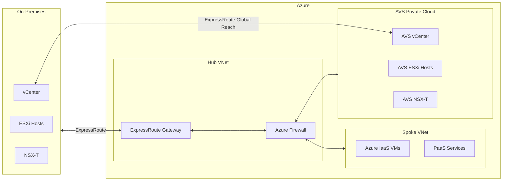

# AVS Migration Guide -- Azure VMware Solution

**Complete guide to migrating on-premises VMware workloads to Azure VMware Solution (AVS) using HCX Enterprise, live vMotion, bulk migration, and content library synchronization.**

---

## What is Azure VMware Solution

Azure VMware Solution (AVS) runs VMware vSphere, vCenter Server, NSX-T Data Center, and vSAN on dedicated bare-metal Azure infrastructure. Your existing VMware VMs run without modification on the same hypervisor. Your existing VMware tools -- vSphere Client, PowerCLI, vRealize Automation -- connect to the AVS vCenter the same way they connect to your on-premises vCenter.

AVS is a first-party Azure service, jointly engineered by Microsoft and Broadcom (VMware). Microsoft manages the underlying infrastructure (hosts, networking, storage hardware), while you manage the VMware layer (VMs, NSX segments, workload configurations).

### What is included in AVS

| Component                      | Included        | Notes                                      |
| ------------------------------ | --------------- | ------------------------------------------ |
| vSphere Enterprise Plus        | Yes             | Full feature set                           |
| vCenter Server                 | Yes             | Microsoft-managed, customer-accessible     |
| NSX-T Data Center (Advanced)   | Yes             | Full networking and micro-segmentation     |
| vSAN Enterprise                | Yes             | NVMe flash storage on all hosts            |
| HCX Enterprise                 | Yes (free)      | Migration tool, $5,000+/site value on-prem |
| ESXi host lifecycle (patching) | Yes             | Microsoft-managed                          |
| Hardware maintenance           | Yes             | Microsoft-managed                          |
| Azure Monitor integration      | Yes             | Syslog and metrics forwarding              |
| Azure Backup for AVS           | Optional add-on | Per-VM pricing                             |
| Azure Site Recovery for AVS    | Optional add-on | DR to another AVS or Azure region          |

---

## AVS host SKUs

| SKU       | CPU                            | Cores | Threads (HT) | RAM      | Storage (raw NVMe) | Network | Typical VM density |
| --------- | ------------------------------ | ----- | ------------ | -------- | ------------------ | ------- | ------------------ |
| **AV36**  | Dual Intel Xeon Gold 6140      | 36    | 72           | 576 GB   | 15.36 TB           | 25 Gbps | 15--25 VMs         |
| **AV36P** | Dual Intel Xeon Gold 6240      | 36    | 72           | 768 GB   | 19.2 TB            | 25 Gbps | 20--35 VMs         |
| **AV52**  | Dual Intel Xeon Platinum 8270  | 52    | 104          | 1,536 GB | 38.4 TB            | 25 Gbps | 35--60 VMs         |
| **AV64**  | Dual Intel Xeon Platinum 8370C | 64    | 128          | 1,024 GB | 15.36 TB           | 25 Gbps | 25--45 VMs         |

!!! note "SKU availability"
Not all SKUs are available in all regions. AV36P is the most commonly available. Check [Azure products by region](https://azure.microsoft.com/explore/global-infrastructure/products-by-region/) for current availability.

---

## AVS private cloud deployment

### Prerequisites

- Azure subscription with AVS resource provider registered
- Sufficient host quota (request via Azure Portal support ticket)
- Non-overlapping /22 CIDR block for AVS management network
- ExpressRoute circuit or VPN for on-premises connectivity (recommended)

### Deployment via Azure CLI

```bash
# Register the AVS resource provider
az provider register --namespace Microsoft.AVS

# Create resource group
az group create \
  --name rg-avs-prod \
  --location eastus2

# Create AVS private cloud (minimum 3 hosts)
az vmware private-cloud create \
  --name avs-prod-eastus2 \
  --resource-group rg-avs-prod \
  --location eastus2 \
  --sku AV36P \
  --cluster-size 3 \
  --network-block 10.175.0.0/22 \
  --internet enabled \
  --accept-eula

# Verify deployment status
az vmware private-cloud show \
  --name avs-prod-eastus2 \
  --resource-group rg-avs-prod \
  --query "provisioningState"
```

### Deployment via Bicep

```bicep
@description('AVS private cloud name')
param privateCloudName string = 'avs-prod-eastus2'

@description('Location for AVS deployment')
param location string = 'eastus2'

@description('AVS host SKU')
@allowed(['AV36', 'AV36P', 'AV52', 'AV64'])
param skuName string = 'AV36P'

@description('Number of hosts in the default cluster')
@minValue(3)
@maxValue(16)
param clusterSize int = 3

@description('Address block for AVS management (/22 required)')
param networkBlock string = '10.175.0.0/22'

resource avsPrivateCloud 'Microsoft.AVS/privateClouds@2023-09-01' = {
  name: privateCloudName
  location: location
  sku: {
    name: skuName
  }
  properties: {
    networkBlock: networkBlock
    internet: 'Enabled'
    managementCluster: {
      clusterSize: clusterSize
    }
  }
}

output privateCloudId string = avsPrivateCloud.id
output vCenterUrl string = avsPrivateCloud.properties.endpoints.vcsa
output nsxManagerUrl string = avsPrivateCloud.properties.endpoints.nsxtManager
```

!!! warning "Deployment time"
AVS private cloud deployment takes 3--4 hours. Plan accordingly and do not cancel the deployment mid-process.

---

## Networking connectivity

### ExpressRoute connectivity (recommended)

AVS connects to Azure VNets and on-premises networks via ExpressRoute:

```bash
# Create ExpressRoute authorization key on AVS
az vmware authorization create \
  --name er-auth-key \
  --private-cloud avs-prod-eastus2 \
  --resource-group rg-avs-prod

# Connect AVS ExpressRoute to your VNet gateway
az network vpn-connection create \
  --name avs-vnet-connection \
  --resource-group rg-network \
  --vnet-gateway1 /subscriptions/{sub}/resourceGroups/rg-network/providers/Microsoft.Network/virtualNetworkGateways/gw-hub \
  --express-route-circuit2 /subscriptions/{sub}/resourceGroups/rg-avs-prod/providers/Microsoft.AVS/privateClouds/avs-prod-eastus2/expressRouteCircuits/default \
  --authorization-key {auth-key-from-above}
```

### ExpressRoute Global Reach (on-prem to AVS)

For direct on-premises to AVS connectivity without routing through Azure:

```bash
# Enable Global Reach between on-prem ER and AVS ER
az vmware global-reach-connection create \
  --name onprem-to-avs \
  --private-cloud avs-prod-eastus2 \
  --resource-group rg-avs-prod \
  --peer-express-route-circuit /subscriptions/{sub}/resourceGroups/rg-network/providers/Microsoft.Network/expressRouteCircuits/er-onprem \
  --authorization-key {onprem-er-auth-key}
```

### Network topology



---

## HCX Enterprise migration

HCX (Hybrid Cloud Extension) Enterprise is included free with every AVS private cloud. It provides four migration methods and L2 network extension capabilities.

### HCX deployment on AVS

HCX Manager is deployed automatically when you enable the HCX add-on:

```bash
# Enable HCX on AVS private cloud
az vmware addon hcx create \
  --private-cloud avs-prod-eastus2 \
  --resource-group rg-avs-prod \
  --offer VMware-MaaS-Cloud
```

### HCX on-premises connector

Deploy the HCX Connector OVA on your on-premises vCenter:

1. Download HCX Connector OVA from the AVS portal (Azure Portal > AVS > HCX)
2. Deploy OVA to on-premises vCenter
3. Configure HCX with management, uplink, and vMotion network profiles
4. Activate with the license key from AVS portal

### HCX site pairing

Create the connection between on-premises HCX and AVS HCX:

1. In the on-premises HCX Manager, navigate to **Site Pairing**
2. Enter the AVS HCX Manager URL (from Azure Portal)
3. Authenticate with the AVS cloudadmin credentials
4. Accept the remote site certificate

### HCX compute profile

Configure the compute profile to define which on-prem resources HCX can use:

- Select the on-premises vCenter cluster(s)
- Select the datastore(s) for HCX appliance deployment
- Select the network profiles (management, uplink, vMotion, replication)

### HCX service mesh

The service mesh creates the connectivity infrastructure (IX, NE, WAN optimization appliances):

- **Interconnect (IX)**: provides the secure tunnel between sites
- **Network Extension (NE)**: provides L2 extension (same subnet on both sides)
- **WAN Optimization**: optional, accelerates replication over WAN links

---

## Migration methods

### 1. HCX vMotion (zero-downtime)

Live migration of a running VM with zero downtime. The VM maintains its MAC address, IP address, and network connections throughout.

**Best for:** production workloads requiring zero downtime, one-at-a-time migration, final cutover

**Limitations:** one VM at a time, requires sufficient bandwidth, VM must be powered on

```
Throughput: ~2 Gbps per VM (depends on WAN bandwidth)
Downtime: 0 (switchover is sub-second)
VMs per operation: 1
```

### 2. HCX Bulk Migration

Parallel migration of multiple VMs with a brief reboot at cutover. VMs are replicated in the background, then a short switchover window reboots the VM on the destination.

**Best for:** large-scale migrations (hundreds to thousands of VMs), non-zero downtime tolerance

**Limitations:** requires VM reboot at cutover (typically 2--5 minutes), scheduling switchover window

```
Throughput: ~4 Gbps aggregate (8 concurrent replications default)
Downtime: 2--5 minutes per VM (reboot at switchover)
VMs per operation: up to 200 concurrent
```

### 3. HCX Replication Assisted vMotion (RAV)

Combines bulk migration's parallel replication with vMotion's zero-downtime cutover. VMs replicate in bulk, then final cutover uses vMotion for zero downtime.

**Best for:** large-scale migrations requiring zero downtime at cutover

```
Throughput: ~4 Gbps aggregate replication + vMotion cutover
Downtime: 0 (vMotion switchover)
VMs per operation: up to 200 concurrent replication, sequential vMotion cutover
```

### 4. Cold Migration

Migration of powered-off VMs. Fastest for VMs that can be offline during migration.

**Best for:** development/test VMs, template VMs, VMs being decommissioned, large cold storage VMs

```
Throughput: limited by network bandwidth
Downtime: VM is offline throughout
VMs per operation: up to 200 concurrent
```

### Migration method decision matrix

| Criteria                   | vMotion  | Bulk                    | RAV                                  | Cold           |
| -------------------------- | -------- | ----------------------- | ------------------------------------ | -------------- |
| Downtime                   | Zero     | 2--5 min                | Zero                                 | Full offline   |
| Parallelism                | 1 VM     | 200 concurrent          | 200 replication + sequential cutover | 200 concurrent |
| Production workloads       | Yes      | With maintenance window | Yes                                  | No             |
| Speed (per VM)             | Moderate | Fast                    | Fast replication + moderate cutover  | Fastest        |
| Network bandwidth required | High     | Moderate                | Moderate + high at cutover           | Moderate       |

---

## Cluster management

### Scaling clusters

```bash
# Scale out (add hosts)
az vmware cluster update \
  --name Cluster-1 \
  --private-cloud avs-prod-eastus2 \
  --resource-group rg-avs-prod \
  --cluster-size 5

# Add a second cluster
az vmware cluster create \
  --name Cluster-2 \
  --private-cloud avs-prod-eastus2 \
  --resource-group rg-avs-prod \
  --sku AV36P \
  --cluster-size 3
```

### Host replacement

Microsoft automatically replaces failed hosts. If a host enters a degraded state:

1. Microsoft monitoring detects the issue
2. A replacement host is provisioned automatically
3. VMs are migrated via vSphere HA to surviving hosts
4. Failed host is decommissioned and replaced
5. VMs are rebalanced via DRS

---

## Post-migration operations

### Azure Monitor integration

```bash
# Configure syslog forwarding from AVS to Log Analytics
az vmware private-cloud add-identity-source \
  --private-cloud avs-prod-eastus2 \
  --resource-group rg-avs-prod \
  --name "AzureAD" \
  --alias "aad" \
  --domain "contoso.com" \
  --base-user-dn "dc=contoso,dc=com" \
  --base-group-dn "dc=contoso,dc=com" \
  --primary-server "ldaps://dc1.contoso.com:636" \
  --ssl Enabled
```

### Defender for Cloud integration

Enable Microsoft Defender for Cloud for AVS workloads to get vulnerability assessment, security recommendations, and threat detection:

1. Enable Defender for Cloud on the AVS subscription
2. Deploy the Log Analytics agent to AVS VMs (via vCenter guest policy)
3. Configure Defender for Servers plan
4. Review security recommendations in the Azure Portal

### Azure Backup for AVS

```bash
# Create Recovery Services vault
az backup vault create \
  --name rsv-avs-backup \
  --resource-group rg-avs-prod \
  --location eastus2

# Configure backup for AVS VMs
# (Done via Azure Portal or MABS agent on AVS)
```

---

## CSA-in-a-Box integration for data workloads

After migrating infrastructure to AVS, data workloads running on AVS VMs can be further modernized:

| AVS VM workload            | CSA-in-a-Box modernization target | Approach                    |
| -------------------------- | --------------------------------- | --------------------------- |
| SQL Server on AVS VM       | Fabric Warehouse or Azure SQL MI  | Azure DMS from AVS VM       |
| ETL server on AVS VM       | Azure Data Factory + dbt          | Pipeline migration          |
| Reporting server on AVS VM | Power BI + Direct Lake            | Report conversion           |
| Hadoop on AVS VMs          | Databricks + ADLS Gen2            | Data and notebook migration |

The AVS VMs can connect to CSA-in-a-Box PaaS services via the ExpressRoute connectivity already established. This enables a phased modernization where data workloads move from AVS VMs to PaaS while the AVS infrastructure continues running non-data workloads.

---

## Related

- [Azure IaaS Migration Guide](azure-iaas-migration.md)
- [HCX Migration Tutorial](tutorial-hcx-migration.md)
- [Networking Migration](networking-migration.md)
- [Storage Migration](storage-migration.md)
- [Feature Mapping](feature-mapping-complete.md)
- [Migration Playbook](../vmware-to-azure.md)
- [Microsoft Learn: Azure VMware Solution](https://learn.microsoft.com/azure/azure-vmware/)

---

**Last updated:** 2026-04-30
**Maintainers:** CSA-in-a-Box core team
