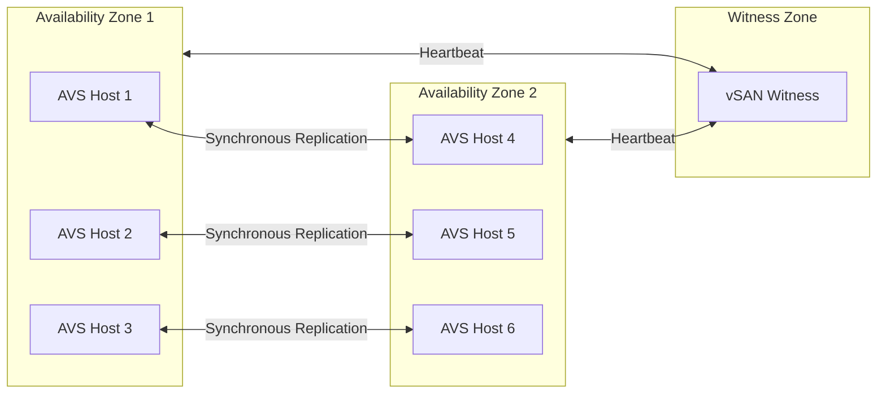

# Disaster Recovery Migration -- SRM to Azure Site Recovery

**Complete guide to migrating VMware disaster recovery from SRM, Zerto, and Veeam to Azure-native DR services including Azure Site Recovery, AVS DR, and JetStream DR.**

---

## DR mapping overview

| VMware DR solution             | Azure equivalent                                 | Use case                                             |
| ------------------------------ | ------------------------------------------------ | ---------------------------------------------------- |
| **VMware SRM**                 | Azure Site Recovery (ASR)                        | Orchestrated DR failover with recovery plans         |
| **vSphere Replication**        | ASR continuous replication                       | VM-level replication to Azure                        |
| **SRM recovery plans**         | ASR recovery plans                               | Automated failover sequence with scripts             |
| **SRM DR testing**             | ASR test failover                                | Non-disruptive DR validation                         |
| **Zerto**                      | Zerto for Azure / Zerto for AVS                  | Near-synchronous replication, journal-based recovery |
| **Veeam Backup & Replication** | Veeam for Azure / Azure Backup                   | Backup-based DR and instant recovery                 |
| **vSAN stretched cluster**     | AVS stretched cluster / Azure Availability Zones | Synchronous replication for zero RPO                 |
| **NSX DR (network failover)**  | ASR network mapping + Azure Firewall             | Network configuration failover                       |

---

## 1. Azure Site Recovery (ASR) -- replacing SRM

Azure Site Recovery is the primary DR solution for both AVS and Azure IaaS workloads. It provides continuous replication, automated failover, and recovery plans comparable to VMware SRM.

### ASR capabilities

| Capability             | SRM equivalent                 | ASR implementation                     |
| ---------------------- | ------------------------------ | -------------------------------------- |
| Continuous replication | vSphere Replication            | ASR replication (RPO 30 sec -- 15 min) |
| Recovery plans         | SRM recovery plans             | ASR recovery plans with sequencing     |
| Automated failover     | SRM planned/unplanned failover | ASR planned/unplanned failover         |
| DR testing             | SRM non-disruptive test        | ASR test failover (isolated network)   |
| Network re-IP          | SRM network mapping            | ASR network mapping + static IP config |
| Custom scripts         | SRM callouts                   | ASR Automation runbooks + scripts      |
| Monitoring             | SRM monitoring dashboard       | Azure Monitor + ASR dashboard          |
| RTO                    | Depends on VM count            | Typically < 2 hours for most workloads |
| RPO                    | 15 min (vSphere Replication)   | 30 sec -- 15 min (ASR)                 |

### ASR for VMware VMs (on-prem to Azure)

Protect on-premises VMware VMs by replicating them to Azure:

```bash
# Create Recovery Services vault
az backup vault create \
  --name rsv-dr-eastus2 \
  --resource-group rg-dr \
  --location eastus2

# Configure ASR for VMware (requires configuration server on-prem)
# Deploy the configuration server OVA in VMware environment
# Register with the Recovery Services vault
# Enable replication per VM via Azure Portal
```

### ASR for AVS (AVS to AVS or AVS to Azure)

For AVS workloads, ASR supports:

- **AVS to AVS**: replicate between two AVS private clouds in different regions
- **AVS to Azure IaaS**: replicate AVS VMs to Azure Managed Disks for DR
- **Azure IaaS to Azure IaaS**: replicate Azure VMs between regions

```bash
# Enable ASR for an Azure VM (region to region)
az vm replication enable \
  --name migrated-vm-01 \
  --resource-group rg-migrated-vms \
  --target-resource-group rg-dr-westus2 \
  --target-region westus2 \
  --target-availability-zone 1
```

### Recovery plans

Recovery plans define the order in which VMs are failed over, along with pre/post scripts:

```bash
# Create recovery plan
az site-recovery recovery-plan create \
  --name rp-app-tier \
  --resource-group rg-dr \
  --vault-name rsv-dr-eastus2 \
  --groups '[
    {
      "groupType": "Boot",
      "replicationProtectedItems": [
        {"id": "/subscriptions/{sub}/.../protectedItems/vm-db-01"},
        {"id": "/subscriptions/{sub}/.../protectedItems/vm-db-02"}
      ]
    },
    {
      "groupType": "Boot",
      "replicationProtectedItems": [
        {"id": "/subscriptions/{sub}/.../protectedItems/vm-app-01"},
        {"id": "/subscriptions/{sub}/.../protectedItems/vm-app-02"}
      ]
    },
    {
      "groupType": "Boot",
      "replicationProtectedItems": [
        {"id": "/subscriptions/{sub}/.../protectedItems/vm-web-01"},
        {"id": "/subscriptions/{sub}/.../protectedItems/vm-web-02"}
      ]
    }
  ]'
```

The recovery plan above boots VMs in sequence: databases first, then application servers, then web servers.

### Test failover

```bash
# Run test failover (non-disruptive)
az site-recovery recovery-plan test-failover \
  --name rp-app-tier \
  --resource-group rg-dr \
  --vault-name rsv-dr-eastus2 \
  --failover-direction PrimaryToRecovery \
  --network-id /subscriptions/{sub}/resourceGroups/rg-dr/providers/Microsoft.Network/virtualNetworks/vnet-dr-test
```

!!! tip "Test failover uses isolated network"
Always use an isolated test VNet for test failover to avoid IP conflicts with production. ASR creates test VMs in the isolated network, and you can validate application health without affecting production.

---

## 2. Zerto for AVS and Azure

Zerto provides near-synchronous replication with journal-based recovery, enabling any-point-in-time recovery (granularity measured in seconds).

### Zerto for AVS

| Feature              | Capability                          |
| -------------------- | ----------------------------------- |
| RPO                  | Near-zero (5--15 seconds typical)   |
| RTO                  | Minutes (automated failover)        |
| Recovery granularity | Any point in time (journal-based)   |
| Network re-IP        | Automated during failover           |
| Consistency groups   | Multi-VM crash-consistent groups    |
| Testing              | Non-disruptive, isolated DR testing |

### Zerto deployment on AVS

1. Deploy Zerto Virtual Manager (ZVM) on AVS
2. Deploy Zerto Virtual Replication Appliances (VRAs) on each ESXi host
3. Configure Virtual Protection Groups (VPGs) for VM grouping
4. Set journal history (hours/days of recovery points)
5. Configure failover networking

### When to choose Zerto over ASR

| Criteria                   | ASR                                 | Zerto                         |
| -------------------------- | ----------------------------------- | ----------------------------- |
| RPO requirement            | 30 sec -- 15 min                    | 5--15 seconds                 |
| Any-point-in-time recovery | No (recovery points at intervals)   | Yes (continuous journal)      |
| Multi-VM consistency       | Application-consistent snapshots    | Continuous consistency groups |
| Licensing model            | Per-VM Azure pricing ($25/VM/month) | Per-VM Zerto licensing        |
| Automation                 | ASR recovery plans                  | Zerto orchestration with APIs |

---

## 3. JetStream DR for AVS

JetStream DR is optimized specifically for AVS disaster recovery scenarios.

### JetStream capabilities

| Feature            | Capability                           |
| ------------------ | ------------------------------------ |
| RPO                | Near-zero (continuous replication)   |
| RTO                | < 5 minutes for most workloads       |
| Storage efficiency | Deduplicated, compressed replication |
| AVS integration    | Native AVS marketplace deployment    |
| Recovery target    | AVS private cloud (another region)   |
| Runbook automation | Built-in DR runbook engine           |

### JetStream deployment

1. Deploy JetStream DR from AVS Azure Marketplace add-on
2. Configure protected site (source AVS) and recovery site (target AVS)
3. Define protection domains (groups of VMs)
4. Set replication policies (RPO, retention)
5. Create and test recovery plans

---

## 4. AVS stretched cluster (zero RPO)

For workloads requiring zero data loss (RPO = 0), AVS stretched clusters provide synchronous replication across Azure Availability Zones.

### Stretched cluster architecture



### Stretched cluster characteristics

| Parameter         | Value                                                |
| ----------------- | ---------------------------------------------------- |
| RPO               | 0 (synchronous replication)                          |
| RTO               | < 1 minute (automatic vSphere HA restart)            |
| Minimum hosts     | 6 (3 per AZ)                                         |
| Maximum hosts     | 16 (8 per AZ)                                        |
| Inter-AZ latency  | < 5 ms (Azure AZ guarantee)                          |
| Supported regions | Limited (check Azure documentation for current list) |

---

## 5. Cross-region DR patterns

### Pattern 1: AVS to AVS (same VMware tools)

```
Primary: AVS Private Cloud (East US 2)
    ↓ ASR or Zerto replication
DR:      AVS Private Cloud (West US 2)
```

### Pattern 2: AVS to Azure IaaS (cost-optimized DR)

```
Primary: AVS Private Cloud (East US 2)
    ↓ ASR replication
DR:      Azure IaaS VMs (West US 2) -- only running during failover
```

This pattern reduces DR costs because Azure IaaS VMs are only provisioned during failover. You pay only for the replicated storage and ASR licensing, not for running VMs.

### Pattern 3: Azure IaaS to Azure IaaS

```
Primary: Azure VMs (East US 2)
    ↓ ASR replication
DR:      Azure VMs (West US 2) -- auto-provisioned on failover
```

### DR cost comparison

| DR pattern                        | Monthly cost (150 protected VMs) | RPO              | RTO               |
| --------------------------------- | -------------------------------- | ---------------- | ----------------- |
| On-prem SRM + vSphere Replication | $12,500 (licenses + DR site)     | 15 min           | 1--4 hours        |
| ASR (AVS to Azure IaaS)           | $3,750 ($25/VM) + storage        | 30 sec -- 15 min | 30 min -- 2 hours |
| ASR (Azure to Azure)              | $3,750 + storage                 | 30 sec -- 15 min | 30 min -- 2 hours |
| Zerto for AVS                     | $6,000--$9,000 (Zerto licensing) | 5--15 sec        | 5--15 min         |
| AVS stretched cluster             | Included (hosts already paid)    | 0                | < 1 min           |

---

## 6. DR migration strategy

### Phase 1: Assess current DR

Document your current VMware DR configuration:

- SRM recovery plans (count, VMs per plan, sequence)
- vSphere Replication policies (RPO settings per VM)
- Network mapping rules
- Custom scripts and callouts
- DR testing frequency and results
- RTO/RPO requirements per application tier

### Phase 2: Design Azure DR

Map each VMware DR component to its Azure equivalent:

1. SRM recovery plans become ASR recovery plans
2. vSphere Replication becomes ASR continuous replication
3. SRM network mapping becomes ASR network mapping
4. SRM scripts become Azure Automation runbooks
5. DR testing cadence maintained or improved

### Phase 3: Implement and test

1. Enable ASR replication for migrated VMs
2. Create ASR recovery plans mirroring SRM plans
3. Configure network mapping (source VNet to target VNet)
4. Add Automation runbooks for pre/post failover tasks
5. Run test failover for each recovery plan
6. Validate RTO/RPO meets requirements
7. Decommission SRM after successful DR test

### Phase 4: Ongoing DR operations

- **Monthly**: run test failover for all critical recovery plans
- **Quarterly**: full DR drill with documented results
- **On change**: update recovery plans when VMs are added/removed
- **Continuously**: monitor ASR replication health via Azure Monitor

---

## Related

- [AVS Migration Guide](avs-migration.md)
- [Azure IaaS Migration Guide](azure-iaas-migration.md)
- [Security Migration](security-migration.md)
- [Feature Mapping](feature-mapping-complete.md)
- [Migration Playbook](../vmware-to-azure.md)
- [CSA-in-a-Box Disaster Recovery](../../DR.md)

---

**Last updated:** 2026-04-30
**Maintainers:** CSA-in-a-Box core team
