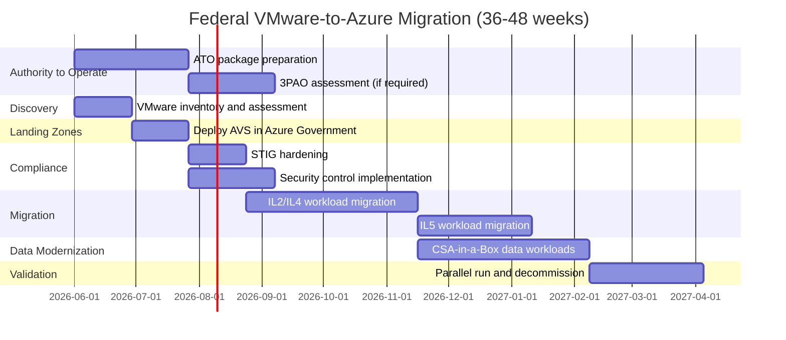

# Federal Migration Guide -- AVS in Azure Government

**Comprehensive guide for federal agencies and DoD components migrating VMware workloads to Azure VMware Solution (AVS) in Azure Government, covering IL2--IL5 compliance, FedRAMP inheritance, and DoD-specific considerations.**

---

## Federal VMware landscape

### Scale of federal VMware deployments

The US federal government and Department of Defense operate some of the largest VMware installations in the world:

| Sector                         | Estimated VMware scale                         | Key characteristics                                |
| ------------------------------ | ---------------------------------------------- | -------------------------------------------------- |
| **DoD (all branches)**         | 150,000--200,000+ ESXi hosts                   | DISA enterprise agreements, IL4/IL5/IL6 workloads  |
| **Intelligence Community**     | Classified (substantial)                       | Air-gapped, IL6+, classified environments          |
| **Civilian agencies (large)**  | 20,000--50,000+ hosts (DHS, VA, HHS, Treasury) | FedRAMP High, mixed IL levels                      |
| **Civilian agencies (mid)**    | 2,000--10,000 hosts per agency                 | FedRAMP Moderate to High                           |
| **Federal system integrators** | 50,000--100,000+ hosts (for federal contracts) | Support government workloads on behalf of agencies |

### Broadcom impact on federal

The Broadcom acquisition affects federal VMware customers with specific pain points:

- **Enterprise agreement renegotiation**: DoD-wide and agency-level VMware ELAs are being renegotiated under Broadcom terms, with significant price increases reported
- **Budget cycle misalignment**: federal budget cycles (fiscal year, PPBE for DoD) do not accommodate sudden 2x--12x cost increases
- **Procurement complexity**: federal acquisition regulations (FAR/DFAR) require competitive analysis when costs increase substantially
- **Perpetual license conversion**: many agencies invested capital in perpetual VMware licenses that are now being forcibly converted to subscription
- **Skills availability**: VMware specialists are already scarce in the federal cleared workforce; uncertainty about VMware's future makes recruitment harder

### Congressional and oversight attention

The Broadcom/VMware pricing situation has drawn attention from:

- **GAO**: monitoring agency IT spending impacts
- **OMB**: evaluating government-wide VMware spend via FITARA reporting
- **DISA**: reviewing DoD-wide enterprise agreement options
- **Agency IGs**: auditing cost impact on agency budgets

---

## AVS in Azure Government

### Region availability

| Azure Government region | AVS available | Host SKUs         | IL support             |
| ----------------------- | ------------- | ----------------- | ---------------------- |
| **US Gov Arizona**      | Yes           | AV36P, AV52       | IL2, IL4, IL5          |
| **US Gov Virginia**     | Yes           | AV36P, AV52, AV64 | IL2, IL4, IL5          |
| **US Gov Texas**        | Yes           | AV36P             | IL2, IL4, IL5          |
| **DoD Central**         | Yes           | AV36P             | IL2, IL4, IL5, DoD SRG |
| **DoD East**            | Yes           | AV36P             | IL2, IL4, IL5, DoD SRG |

!!! note "Region availability changes"
Check [Azure products by region](https://azure.microsoft.com/explore/global-infrastructure/products-by-region/?products=azure-vmware) for the most current AVS availability in Azure Government regions.

### IL (Impact Level) classification

| Impact Level | Data types                                            | AVS support       | Notes                                          |
| ------------ | ----------------------------------------------------- | ----------------- | ---------------------------------------------- |
| **IL2**      | Publicly releasable, non-CUI                          | Fully supported   | Azure Government commercial workloads          |
| **IL4**      | CUI (Controlled Unclassified Information)             | Fully supported   | Standard federal workloads                     |
| **IL5**      | CUI with higher sensitivity, NOFORN, mission-critical | Supported         | Azure Government with dedicated infrastructure |
| **IL6**      | Classified (SECRET)                                   | **Not supported** | Requires Azure Top Secret / air-gapped         |

!!! warning "IL6 gap"
AVS does not support IL6 (classified SECRET) workloads. For classified VMware workloads, options include:

    - Maintain on-premises VMware in classified enclaves
    - Azure Top Secret (limited service availability)
    - VMware Cloud on classified infrastructure
    - Evaluate re-platform to Azure Top Secret IaaS

---

## FedRAMP compliance inheritance

### How AVS inherits FedRAMP

AVS in Azure Government inherits FedRAMP High authorization from the Azure Government platform:

```
Azure Government FedRAMP High Authorization
    └── Azure VMware Solution (inherits)
        ├── Physical security (Azure datacenter)
        ├── Network security (Azure backbone)
        ├── Host security (Azure managed ESXi hosts)
        ├── Identity (Entra ID integration)
        └── Monitoring (Azure Monitor integration)

Customer responsibility:
    ├── Guest OS security (VM patching, hardening)
    ├── Application security
    ├── Data classification and protection
    ├── Access control (NSX DFW rules, vCenter RBAC)
    └── Audit logging and monitoring configuration
```

### Shared responsibility model for AVS

| Control domain        | Microsoft responsibility                             | Customer responsibility                                     |
| --------------------- | ---------------------------------------------------- | ----------------------------------------------------------- |
| **Physical security** | Datacenter physical security, environmental controls | N/A                                                         |
| **Infrastructure**    | ESXi host lifecycle, hardware, networking            | N/A                                                         |
| **vSphere platform**  | vCenter, ESXi patching, NSX-T platform               | NSX-T configuration, vCenter RBAC                           |
| **Compute**           | Host provisioning, DRS, HA                           | VM deployment, guest OS patching, application               |
| **Storage**           | vSAN hardware, firmware                              | vSAN policies, data classification                          |
| **Network**           | ExpressRoute backbone, Azure backbone                | NSX segments, firewall rules, VPN configuration             |
| **Identity**          | Entra ID platform, MFA                               | User provisioning, role assignments, conditional access     |
| **Monitoring**        | Azure Monitor platform, Service Health               | Log collection configuration, alert rules, Sentinel queries |
| **Compliance**        | FedRAMP authorization maintenance, annual assessment | Agency-specific SSP, POA&M, continuous monitoring           |

### NIST 800-53 Rev 5 control mapping

CSA-in-a-Box provides machine-readable NIST 800-53 mappings for the data platform layer. For AVS-specific controls:

| Control family                  | AVS coverage                          | CSA-in-a-Box coverage (data workloads)          |
| ------------------------------- | ------------------------------------- | ----------------------------------------------- |
| **AC (Access Control)**         | Entra ID + vCenter RBAC               | Entra ID + Purview + Unity Catalog RBAC         |
| **AU (Audit)**                  | Azure Monitor + vCenter events        | Azure Monitor + tamper-evident audit logger     |
| **CM (Configuration Mgmt)**     | Azure Policy + Bicep IaC              | Bicep + dbt contracts + GitHub Actions CI/CD    |
| **IA (Identification/Auth)**    | Entra ID MFA + PIM                    | Entra ID + managed identities                   |
| **SC (System/Comm Protection)** | NSX-T DFW + encryption + ExpressRoute | Private endpoints + encryption + VNet isolation |
| **SI (System/Info Integrity)**  | Defender for Cloud + Sentinel         | Defender for Cloud + data quality contracts     |

---

## DoD-specific considerations

### DISA STIG compliance

For DoD workloads, STIGs (Security Technical Implementation Guides) apply to:

| Component             | Applicable STIG               | Implementation                                 |
| --------------------- | ----------------------------- | ---------------------------------------------- |
| Windows Server VMs    | Windows Server 2019/2022 STIG | Azure Policy guest configuration               |
| Linux VMs             | RHEL/Ubuntu STIG              | Azure Policy guest configuration               |
| vSphere (AVS)         | VMware vSphere STIG           | Microsoft-managed + customer NSX configuration |
| NSX-T (AVS)           | VMware NSX-T STIG             | Customer-managed segment and firewall rules    |
| SQL Server (if on VM) | SQL Server STIG               | Customer-managed database configuration        |
| Networking            | Network STIG                  | NSG rules + Azure Firewall policies            |

### DISA Cloud Computing SRG

AVS in Azure Government DoD regions complies with the DISA Cloud Computing SRG:

- **CC SRG baseline**: inherited from Azure Government DoD authorization
- **Provisional Authorization (PA)**: Azure Government has DoD PA at IL2, IL4, IL5
- **Agency ATO**: each agency must obtain its own ATO based on the inherited PA

### DoD network connectivity

| Connectivity option               | Description                                   | IL support |
| --------------------------------- | --------------------------------------------- | ---------- |
| **ExpressRoute (Gov)**            | Dedicated private circuit to Azure Government | IL2--IL5   |
| **ExpressRoute Direct**           | Dedicated 10/100 Gbps ports                   | IL4--IL5   |
| **DISA CAP (Cloud Access Point)** | DISA-managed cloud access                     | IL4--IL5   |
| **BCAP (Boundary CAP)**           | For DoD tenant connectivity                   | IL4--IL5   |
| **VPN Gateway**                   | IPsec VPN over internet                       | IL2--IL4   |
| **Azure Government Peering**      | Government peering locations                  | IL2--IL5   |

```bash
# Create ExpressRoute circuit in Azure Government
az network express-route create \
  --name er-dod-govaz \
  --resource-group rg-network-gov \
  --location usgovarizona \
  --bandwidth 1000 \
  --peering-location "Washington DC" \
  --provider "Megaport" \
  --sku-family MeteredData \
  --sku-tier Premium
```

---

## Federal migration patterns

### Pattern 1: Base-level VMware to AVS in Gov

For installations (Air Force bases, Army posts, Navy installations) with local VMware environments:

```
Installation VMware Datacenter
    → ExpressRoute / DISA CAP
        → AVS Private Cloud (Azure Government)
            → Azure PaaS services (via VNet peering)
                → CSA-in-a-Box data platform (for data workloads)
```

### Pattern 2: Agency datacenter consolidation

For agencies consolidating multiple datacenter VMware deployments:

```
Agency DC 1 (VMware) ─┐
Agency DC 2 (VMware) ─┼─→ AVS (Azure Gov) + Azure IaaS
Agency DC 3 (VMware) ─┘    │
                            ├── Web/app tier → Azure IaaS VMs
                            ├── Database tier → Fabric / Azure SQL (CSA-in-a-Box)
                            └── Analytics → Power BI + Databricks (CSA-in-a-Box)
```

### Pattern 3: DoD hybrid migration

For DoD components with mixed IL levels:

```
IL2 workloads → AVS in Azure Government (standard)
IL4 workloads → AVS in Azure Government (IL4 controls)
IL5 workloads → AVS in Azure Government (IL5 dedicated)
IL6 workloads → Remain on-premises (classified enclave)
```

---

## CSA-in-a-Box federal compliance for data workloads

After migrating VMware infrastructure to AVS, data workloads modernized via CSA-in-a-Box inherit these compliance mappings:

| Framework                      | CSA-in-a-Box artifact            | Location                                                                   |
| ------------------------------ | -------------------------------- | -------------------------------------------------------------------------- |
| **NIST 800-53 Rev 5**          | Machine-readable control mapping | `csa_platform/csa_platform/governance/compliance/nist-800-53-rev5.yaml`    |
| **CMMC 2.0 Level 2**           | Practice-level mapping           | `csa_platform/csa_platform/governance/compliance/cmmc-2.0-l2.yaml`         |
| **HIPAA Security Rule**        | Safeguard mapping                | `csa_platform/csa_platform/governance/compliance/hipaa-security-rule.yaml` |
| **FedRAMP control narratives** | Human-readable narratives        | `docs/compliance/nist-800-53-rev5.md`                                      |

### Federal data governance via Purview

For federal data workloads, CSA-in-a-Box's Purview automation provides:

- **CUI classification**: automated detection and labeling of CUI data
- **PII classification**: automated PII detection across data assets
- **Government classifications**: custom classification rules for federal data types
- **Lineage tracking**: end-to-end data lineage for audit compliance
- **Data contracts**: machine-readable contracts per data product

Classification taxonomies are defined in:

- `csa_platform/csa_platform/governance/purview/classifications/government_classifications.yaml`
- `csa_platform/csa_platform/governance/purview/classifications/pii_classifications.yaml`

---

## Procurement considerations

### Federal acquisition approach

| Acquisition vehicle                          | Applicability                       | Notes                               |
| -------------------------------------------- | ----------------------------------- | ----------------------------------- |
| **GSA Schedule 70**                          | Azure Government commercial pricing | Standard IT schedule                |
| **BPA (Blanket Purchase Agreement)**         | Agency-specific Azure commitments   | Volume discounts                    |
| **SEWP V**                                   | IT products and services            | NASA-managed vehicle                |
| **DoD ESI (Enterprise Software Initiative)** | DoD-wide Azure                      | Negotiated DoD pricing              |
| **ITES-3H**                                  | Army IT enterprise solutions        | Covers Azure and migration services |
| **Alliant 2**                                | Government-wide IT solutions        | Includes cloud migration            |

### Migration funding strategies

- **Modernization fund**: agencies can request modernization funding through TMF (Technology Modernization Fund)
- **Cost avoidance**: document Broadcom cost increases as justification for migration spending
- **OMB Cloud Smart**: align migration with OMB Cloud Smart policy for cloud adoption
- **Working capital fund**: for agencies with WCF, Azure consumption can be billed as a service

---

## Migration timeline for federal

Federal migrations typically take longer than commercial due to compliance requirements:



---

## Related

- [AVS Migration Guide](avs-migration.md)
- [Security Migration](security-migration.md)
- [TCO Analysis](tco-analysis.md)
- [Best Practices](best-practices.md)
- [Migration Playbook](../vmware-to-azure.md)
- [Government Service Matrix](../../GOV_SERVICE_MATRIX.md)
- [NIST 800-53 Compliance](../../compliance/nist-800-53-rev5.md)
- [CMMC 2.0 Compliance](../../compliance/cmmc-2.0-l2.md)

---

**Last updated:** 2026-04-30
**Maintainers:** CSA-in-a-Box core team
