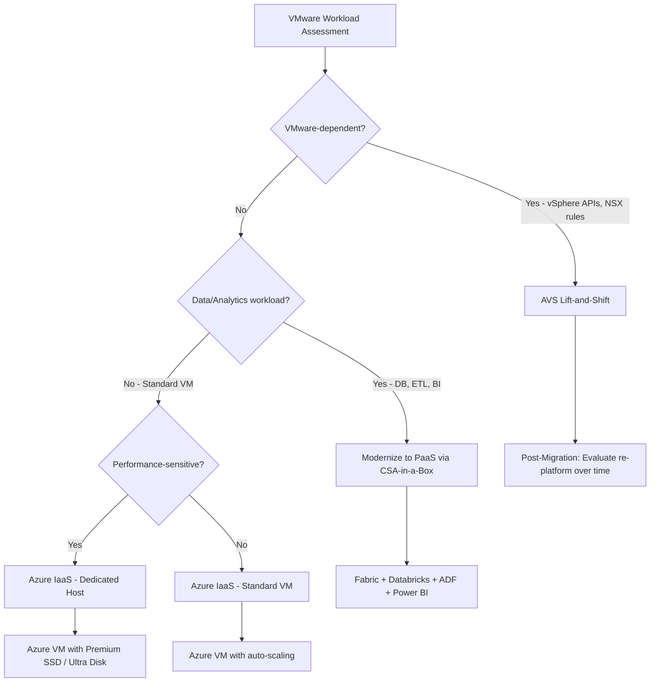
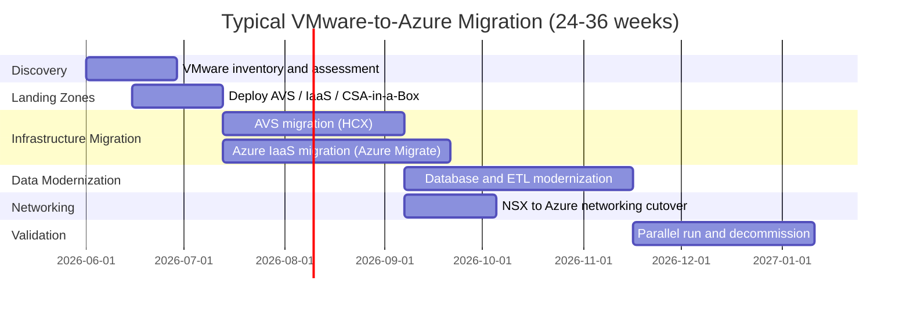

# VMware to Azure Migration Center

**The definitive resource for migrating from on-premises VMware/vSphere to Microsoft Azure -- Azure VMware Solution (AVS), Azure IaaS, and CSA-in-a-Box as your data analytics landing zone.**

---

## Who this is for

This migration center serves federal CIOs, CTOs, infrastructure architects, cloud engineers, and platform teams who are evaluating or executing a migration from VMware/vSphere to Azure. Whether you are reacting to Broadcom's acquisition-driven pricing changes, pursuing cloud-native modernization, or executing an Azure-first strategy, these resources provide the business case, technical guidance, and step-by-step tutorials to migrate confidently.

**Primary audiences:**

- **Executive decision-makers** (CIO, CTO, CFO): strategic brief, TCO analysis, decision framework
- **Infrastructure architects**: feature mapping, networking migration, storage migration, DR patterns
- **Cloud engineers**: HCX tutorials, Azure Migrate walkthroughs, Bicep/CLI deployment guides
- **Security and compliance teams**: security migration, federal compliance, Defender integration
- **Data platform teams**: how CSA-in-a-Box modernizes VM-based data workloads post-migration

---

## The Broadcom forcing function

In November 2023, Broadcom completed its $69 billion acquisition of VMware. The consequences for VMware customers have been immediate and severe:

- **Perpetual licenses eliminated** -- all customers forced to subscription-only
- **Product consolidation** -- 80+ SKUs collapsed to 4 bundles requiring purchase of capabilities many customers do not need
- **Price increases of 2x to 12x** documented across the customer base
- **Partner ecosystem disrupted** -- channel partner program restructured, many partners de-authorized
- **Support quality concerns** -- reduced support staff, longer resolution times reported
- **500,000+ affected organizations** worldwide

This is the single largest forcing function in enterprise infrastructure since the mainframe-to-client-server transition. Every organization running VMware must evaluate its options.

---

## Quick-start decision matrix

| Your situation                               | Start here                                                             |
| -------------------------------------------- | ---------------------------------------------------------------------- |
| Executive evaluating Azure vs VMware renewal | [Why Azure over VMware](why-azure-over-vmware.md)                      |
| Need cost justification for migration        | [Total Cost of Ownership Analysis](tco-analysis.md)                    |
| Need a feature-by-feature comparison         | [Complete Feature Mapping (50+ features)](feature-mapping-complete.md) |
| Want to keep VMware tools on Azure           | [AVS Migration Guide](avs-migration.md)                                |
| Want to eliminate VMware entirely            | [Azure IaaS Migration Guide](azure-iaas-migration.md)                  |
| Ready to plan a migration                    | [Migration Playbook](../vmware-to-azure.md)                            |
| Federal/DoD-specific requirements            | [Federal Migration Guide](federal-migration-guide.md)                  |
| Want hands-on tutorials                      | [Tutorials](#tutorials)                                                |
| Need performance data                        | [Benchmarks](benchmarks.md)                                            |

---

## Migration path decision matrix

The fundamental decision is which migration path to use. Most organizations use a combination.

| Criteria                      | AVS (lift-and-shift)                   | Azure IaaS (re-platform)         | Modernize to PaaS                  |
| ----------------------------- | -------------------------------------- | -------------------------------- | ---------------------------------- |
| **Application changes**       | None                                   | Minimal (driver updates)         | Significant (re-architecture)      |
| **VMware tools retained**     | Yes (vCenter, vMotion, NSX)            | No                               | No                                 |
| **Migration speed**           | Fast (HCX live migration)              | Medium (replication-based)       | Slow (re-build)                    |
| **Long-term cost**            | Higher (VMware layer on Azure)         | Lower (native Azure VMs)         | Lowest (PaaS efficiency)           |
| **VMware license dependency** | Included in AVS pricing                | Eliminated                       | Eliminated                         |
| **Best for**                  | VMware-dependent apps, rapid migration | Standard Windows/Linux workloads | Database, analytics, ETL workloads |
| **CSA-in-a-Box role**         | Data analytics landing zone            | Data analytics landing zone      | Primary migration target           |

---

## Strategic resources

Documents providing the business case, cost analysis, and strategic framing for decision-makers.

| Document                                            | Audience                   | Description                                                                                                                                      |
| --------------------------------------------------- | -------------------------- | ------------------------------------------------------------------------------------------------------------------------------------------------ |
| [Why Azure over VMware](why-azure-over-vmware.md)   | CIO / CTO / Board          | Executive strategic brief covering Broadcom disruption, cloud-native modernization, operational burden elimination, and Azure-native integration |
| [Total Cost of Ownership Analysis](tco-analysis.md) | CFO / CIO / Procurement    | Detailed pricing comparison of on-prem VMware (pre/post-Broadcom), AVS, and Azure IaaS with 3-year and 5-year projections                        |
| [Benchmarks & Performance](benchmarks.md)           | CTO / Platform Engineering | VM density, network throughput, storage IOPS, HCX migration speeds, and Azure IaaS performance data                                              |

---

## Technical references

| Document                                                | Description                                                                                                        |
| ------------------------------------------------------- | ------------------------------------------------------------------------------------------------------------------ |
| [Complete Feature Mapping](feature-mapping-complete.md) | 50+ VMware features mapped to Azure equivalents across vSphere, vCenter, NSX, vSAN, HCX, SRM, Aria, Tanzu, and VCF |
| [Migration Playbook](../vmware-to-azure.md)             | End-to-end migration playbook with phased project plan, decision framework, and CSA-in-a-Box integration           |

---

## Migration guides

Domain-specific deep dives covering every aspect of a VMware-to-Azure migration.

| Guide                                           | Source technology                             | Azure destination                              |
| ----------------------------------------------- | --------------------------------------------- | ---------------------------------------------- |
| [AVS Migration](avs-migration.md)               | vSphere, vCenter, HCX                         | Azure VMware Solution private cloud            |
| [Azure IaaS Migration](azure-iaas-migration.md) | VMware VMs                                    | Azure Virtual Machines via Azure Migrate       |
| [Networking Migration](networking-migration.md) | NSX, distributed switches, vSphere networking | VNet, NSG, Azure Firewall, ExpressRoute        |
| [Storage Migration](storage-migration.md)       | vSAN, VMFS, VMDK                              | Managed Disks, Azure NetApp Files, Azure Files |
| [Security Migration](security-migration.md)     | vSphere security, NSX micro-segmentation      | Defender for Cloud, NSG, Entra ID, Sentinel    |
| [Disaster Recovery](dr-migration.md)            | SRM, Zerto, Veeam                             | Azure Site Recovery, AVS DR, JetStream DR      |

---

## Tutorials

Hands-on, step-by-step walkthroughs for common migration scenarios.

| Tutorial                                              | Duration   | What you will build                                                                                                     |
| ----------------------------------------------------- | ---------- | ----------------------------------------------------------------------------------------------------------------------- |
| [HCX Migration to AVS](tutorial-hcx-migration.md)     | 3--4 hours | Configure HCX site pairing, network profiles, compute profiles, service mesh, and perform live vMotion migration to AVS |
| [Azure Migrate for VMware](tutorial-azure-migrate.md) | 3--4 hours | Deploy Azure Migrate appliance, discover VMs, run assessment, replicate VMs, test migration, and perform cutover        |

---

## Government and federal

| Document                                              | Description                                                                                                                                       |
| ----------------------------------------------------- | ------------------------------------------------------------------------------------------------------------------------------------------------- |
| [Federal Migration Guide](federal-migration-guide.md) | AVS in Azure Government (US Gov Arizona, Virginia, Texas, DoD Central, DoD East), IL2--IL5 compliance, FedRAMP inheritance, DoD VMware footprints |
| [Best Practices](best-practices.md)                   | Assessment methodology, phased migration waves, parallel-run validation, application dependency mapping, Broadcom contract negotiation            |

---

## How CSA-in-a-Box fits

CSA-in-a-Box is the **data and analytics landing zone** for your VMware-to-Azure migration. While AVS and Azure Migrate handle infrastructure migration (moving VMs), CSA-in-a-Box modernizes the data workloads running on those VMs into cloud-native Azure services.

### What CSA-in-a-Box provides post-migration

| VM-based workload (on VMware) | CSA-in-a-Box target                     | Benefit                                              |
| ----------------------------- | --------------------------------------- | ---------------------------------------------------- |
| SQL Server VMs                | Microsoft Fabric Warehouse / Azure SQL  | Managed PaaS, auto-scaling, Direct Lake analytics    |
| Oracle / PostgreSQL VMs       | Databricks Lakehouse / Fabric Lakehouse | Open Delta Lake format, unified governance           |
| SSIS / Informatica ETL VMs    | Azure Data Factory + dbt                | Managed orchestration, version-controlled transforms |
| SSRS / Tableau reporting VMs  | Power BI + Direct Lake semantic models  | Copilot-enabled analytics, zero-copy queries         |
| Hadoop / Spark cluster VMs    | Databricks + ADLS Gen2                  | Managed Spark, Unity Catalog governance              |
| MongoDB / Redis VMs           | Cosmos DB                               | Multi-model, globally distributed, managed           |
| ML / AI training VMs          | Azure AI Foundry + Azure OpenAI         | Managed inference, RAG patterns, responsible AI      |
| Data catalog (manual)         | Microsoft Purview                       | Automated scanning, classification, lineage          |

### Architecture -- infrastructure migration meets data modernization

```mermaid
flowchart LR
    subgraph OnPrem["On-Premises VMware"]
        VP[vSphere/vCenter]
        NSX[NSX Networking]
        VSAN[vSAN Storage]
        DBVMs[Database VMs]
        ETLVMs[ETL Server VMs]
        RPTVMs[Reporting VMs]
    end

    subgraph Azure["Azure Landing Zone"]
        subgraph Infra["Infrastructure (AVS / IaaS)"]
            AVS[Azure VMware Solution]
            AVM[Azure Virtual Machines]
        end
        subgraph CSA["CSA-in-a-Box Data Platform"]
            FAB[Microsoft Fabric]
            DBX[Databricks]
            ADF[Azure Data Factory]
            PBI[Power BI]
            PUR[Microsoft Purview]
            AOI[Azure OpenAI / AI Foundry]
        end
    end

    VP -->|HCX / Azure Migrate| AVS
    VP -->|Azure Migrate| AVM
    NSX -->|Re-architect| Azure
    VSAN -->|Migrate| Azure
    DBVMs -->|Modernize| FAB
    ETLVMs -->|Modernize| ADF
    RPTVMs -->|Modernize| PBI
```

### CSA-in-a-Box compliance coverage

For migrated data workloads, CSA-in-a-Box provides machine-readable compliance mappings:

- **FedRAMP High**: `csa_platform/csa_platform/governance/compliance/nist-800-53-rev5.yaml`
- **CMMC 2.0 Level 2**: `csa_platform/csa_platform/governance/compliance/cmmc-2.0-l2.yaml`
- **HIPAA Security Rule**: `csa_platform/csa_platform/governance/compliance/hipaa-security-rule.yaml`

---

## Migration timeline overview

---

## Related migration centers

| Migration                                       | Description                                 |
| ----------------------------------------------- | ------------------------------------------- |
| [AWS to Azure](../aws-to-azure/index.md)        | Migrating AWS analytics to Azure            |
| [GCP to Azure](../gcp-to-azure/index.md)        | Migrating GCP analytics to Azure            |
| [Hadoop/Hive to Azure](../hadoop-hive/index.md) | Migrating Hadoop ecosystems to Azure        |
| [Teradata to Azure](../teradata/index.md)       | Migrating Teradata data warehouses to Azure |

---

**Last updated:** 2026-04-30
**Maintainers:** CSA-in-a-Box core team
