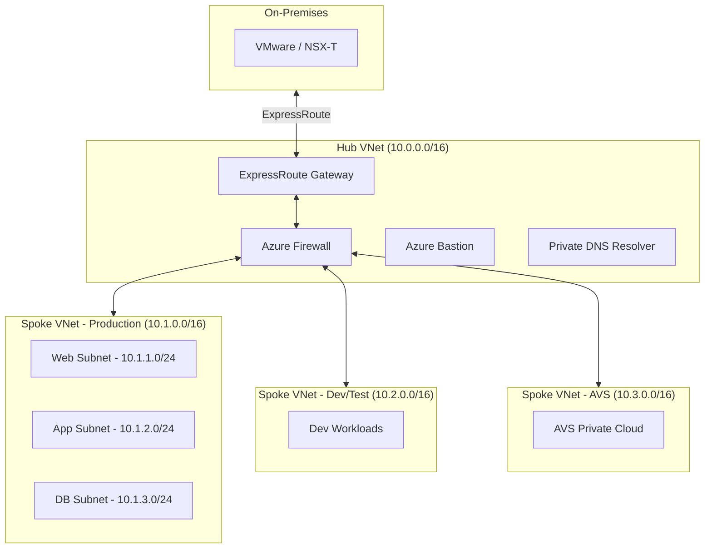

# Networking Migration -- NSX to Azure Networking

**Complete guide to migrating VMware NSX-T networking to Azure-native networking services including VNet, NSG, Azure Firewall, ExpressRoute, and load balancing.**

---

## NSX to Azure networking mapping

| NSX-T concept                  | Azure equivalent                          | Notes                                         |
| ------------------------------ | ----------------------------------------- | --------------------------------------------- |
| **Transport Zone**             | Azure Region / VNet                       | One transport zone maps to one VNet or region |
| **Segment (overlay)**          | VNet Subnet                               | NSX segments become Azure subnets             |
| **Tier-0 Gateway**             | Azure VNet + ExpressRoute/VPN Gateway     | North-south routing                           |
| **Tier-1 Gateway**             | VNet Peering + UDR (or hub-spoke)         | Tenant-level routing                          |
| **Distributed Firewall (DFW)** | NSG + ASG + Azure Firewall                | Micro-segmentation                            |
| **Gateway Firewall**           | Azure Firewall (Premium)                  | Perimeter security with IDPS                  |
| **NSX Load Balancer**          | Azure Load Balancer + Application Gateway | L4 and L7 load balancing                      |
| **NSX VPN**                    | Azure VPN Gateway                         | Site-to-site and point-to-site                |
| **NSX NAT**                    | Azure NAT Gateway / Azure Firewall SNAT   | Outbound NAT                                  |
| **NSX DHCP**                   | Azure VNet DHCP (automatic)               | Built into every subnet                       |
| **NSX DNS**                    | Azure DNS (Private + Public Zones)        | Managed DNS                                   |
| **NSX IPAM**                   | Azure VNet subnet addressing              | CIDR-based addressing                         |
| **NSX Edge Cluster**           | Azure Firewall + ExpressRoute Gateway     | Centralized network services                  |
| **NSX Service Insertion**      | Azure Firewall + NVA + UDR                | Third-party appliance integration             |

---

## Network architecture patterns

### Hub-spoke topology (recommended)

The hub-spoke model mirrors NSX's tiered gateway architecture:



### Bicep deployment

```bicep
@description('Hub VNet for centralized networking')
param hubVnetName string = 'vnet-hub-eastus2'
param location string = 'eastus2'

resource hubVnet 'Microsoft.Network/virtualNetworks@2023-09-01' = {
  name: hubVnetName
  location: location
  properties: {
    addressSpace: {
      addressPrefixes: ['10.0.0.0/16']
    }
    subnets: [
      {
        name: 'AzureFirewallSubnet'
        properties: {
          addressPrefix: '10.0.1.0/24'
        }
      }
      {
        name: 'GatewaySubnet'
        properties: {
          addressPrefix: '10.0.2.0/24'
        }
      }
      {
        name: 'AzureBastionSubnet'
        properties: {
          addressPrefix: '10.0.3.0/24'
        }
      }
    ]
  }
}
```

---

## Micro-segmentation -- NSX DFW to Azure NSG

NSX Distributed Firewall rules translate to Azure Network Security Groups (NSGs) and Application Security Groups (ASGs).

### NSX DFW rule to NSG rule mapping

| NSX DFW concept                   | Azure equivalent                       | How to map                                                     |
| --------------------------------- | -------------------------------------- | -------------------------------------------------------------- |
| **Security Group (dynamic)**      | Application Security Group (ASG)       | Tag-based membership                                           |
| **Applied To**                    | NSG association (subnet or NIC)        | Associate NSG to subnet or NIC                                 |
| **Rule: Allow TCP 443**           | NSG inbound rule                       | Priority-based rule                                            |
| **Rule: Deny all**                | NSG default deny                       | Built-in (last rule in NSG)                                    |
| **Section (ordered rule groups)** | NSG priority ranges                    | Use priority ranges (100--199 = web tier, 200--299 = app tier) |
| **DFW categories**                | Azure Firewall policy rule collections | Emergency, Infrastructure, Environment, Application            |

### Example: three-tier app migration

**NSX DFW rules (source):**

```
Section: Web-Tier
  Rule 1: Allow Internet -> SG-WebServers : TCP 443 (Allow)
  Rule 2: Allow SG-WebServers -> SG-AppServers : TCP 8080 (Allow)
  Rule 3: Deny SG-WebServers -> Any : All (Deny)

Section: App-Tier
  Rule 4: Allow SG-AppServers -> SG-DBServers : TCP 1433 (Allow)
  Rule 5: Deny SG-AppServers -> Any : All (Deny)

Section: DB-Tier
  Rule 6: Allow SG-DBServers -> SG-DBServers : TCP 1433 (Allow)
  Rule 7: Deny SG-DBServers -> Any : All (Deny)
```

**Azure NSG rules (target):**

```bash
# Create Application Security Groups
az network asg create --name asg-web --resource-group rg-network --location eastus2
az network asg create --name asg-app --resource-group rg-network --location eastus2
az network asg create --name asg-db --resource-group rg-network --location eastus2

# Create NSG for web tier
az network nsg create --name nsg-web-tier --resource-group rg-network --location eastus2

az network nsg rule create \
  --nsg-name nsg-web-tier \
  --resource-group rg-network \
  --name allow-https-inbound \
  --priority 100 \
  --direction Inbound \
  --access Allow \
  --protocol Tcp \
  --destination-port-ranges 443 \
  --source-address-prefixes Internet \
  --destination-asgs asg-web

az network nsg rule create \
  --nsg-name nsg-web-tier \
  --resource-group rg-network \
  --name allow-web-to-app \
  --priority 110 \
  --direction Outbound \
  --access Allow \
  --protocol Tcp \
  --destination-port-ranges 8080 \
  --source-asgs asg-web \
  --destination-asgs asg-app

az network nsg rule create \
  --nsg-name nsg-web-tier \
  --resource-group rg-network \
  --name deny-web-outbound \
  --priority 4000 \
  --direction Outbound \
  --access Deny \
  --protocol '*' \
  --source-asgs asg-web \
  --destination-address-prefixes '*'
```

---

## ExpressRoute connectivity

### ExpressRoute for on-premises to Azure

```bash
# Create ExpressRoute circuit
az network express-route create \
  --name er-prod-eastus2 \
  --resource-group rg-network \
  --location eastus2 \
  --bandwidth 1000 \
  --peering-location "Washington DC" \
  --provider "Equinix" \
  --sku-family MeteredData \
  --sku-tier Premium

# Create ExpressRoute gateway in hub VNet
az network vnet-gateway create \
  --name gw-er-hub \
  --resource-group rg-network \
  --location eastus2 \
  --vnet vnet-hub-eastus2 \
  --gateway-type ExpressRoute \
  --sku ErGw2AZ

# Connect circuit to gateway
az network vpn-connection create \
  --name conn-er-onprem \
  --resource-group rg-network \
  --vnet-gateway1 gw-er-hub \
  --express-route-circuit2 /subscriptions/{sub}/resourceGroups/rg-network/providers/Microsoft.Network/expressRouteCircuits/er-prod-eastus2 \
  --authorization-key {key}
```

### ExpressRoute Global Reach for AVS

For environments with both AVS and on-premises connectivity:

```bash
# Enable Global Reach between on-prem ER and AVS ER
az network express-route peering connection create \
  --name global-reach-onprem-avs \
  --resource-group rg-network \
  --circuit-name er-prod-eastus2 \
  --peering-name AzurePrivatePeering \
  --peer-circuit /subscriptions/{sub}/resourceGroups/rg-avs/providers/Microsoft.Network/expressRouteCircuits/avs-er-circuit \
  --address-prefix 172.16.0.0/29
```

---

## Azure Firewall (replacing NSX gateway firewall)

### Deploy Azure Firewall Premium

```bash
# Create Azure Firewall Premium
az network firewall create \
  --name fw-hub-eastus2 \
  --resource-group rg-network \
  --location eastus2 \
  --sku AZFW_VNet \
  --tier Premium \
  --vnet-name vnet-hub-eastus2

# Create firewall policy
az network firewall policy create \
  --name fw-policy-prod \
  --resource-group rg-network \
  --location eastus2 \
  --sku Premium \
  --idps-mode Alert
```

### Azure Firewall Premium features (NSX equivalents)

| Azure Firewall Premium feature | NSX equivalent             | Notes                                   |
| ------------------------------ | -------------------------- | --------------------------------------- |
| IDPS (signature-based)         | NSX IDS/IPS                | 67,000+ signatures, Alert or Deny mode  |
| TLS inspection                 | NSX TLS termination        | Decrypt and inspect HTTPS traffic       |
| URL filtering                  | NSX URL filtering          | Category-based and custom URL filtering |
| Web categories                 | NSX URL categories         | 60+ web categories                      |
| FQDN filtering                 | NSX FQDN lists             | Filter by domain name                   |
| Network rules                  | NSX gateway firewall rules | L3/L4 allow/deny                        |
| Application rules              | NSX L7 rules               | Protocol-aware filtering                |

---

## Load balancing

### NSX load balancer to Azure load balancing

| NSX LB feature                 | Azure equivalent                               | Service                        |
| ------------------------------ | ---------------------------------------------- | ------------------------------ |
| L4 load balancing (TCP/UDP)    | Azure Load Balancer (Standard)                 | Internal and public            |
| L7 load balancing (HTTP/HTTPS) | Azure Application Gateway v2                   | Web application load balancing |
| SSL/TLS termination            | Application Gateway + Key Vault                | Certificate management         |
| Web Application Firewall (WAF) | Application Gateway WAF v2                     | OWASP protection               |
| Global load balancing          | Azure Front Door                               | Global L7 + CDN + WAF          |
| Health probes                  | Azure LB / AG health probes                    | TCP, HTTP, HTTPS probes        |
| Session persistence            | Azure LB session affinity / AG cookie affinity | Source IP or cookie-based      |

### Deploy Azure Load Balancer

```bash
# Create internal load balancer (replacing NSX LB)
az network lb create \
  --name lb-app-internal \
  --resource-group rg-network \
  --location eastus2 \
  --sku Standard \
  --vnet-name vnet-spoke-prod \
  --subnet subnet-app \
  --frontend-ip-name fe-app \
  --backend-pool-name be-app

# Add health probe
az network lb probe create \
  --lb-name lb-app-internal \
  --resource-group rg-network \
  --name probe-http \
  --protocol Http \
  --port 8080 \
  --path /health

# Add load balancing rule
az network lb rule create \
  --lb-name lb-app-internal \
  --resource-group rg-network \
  --name rule-http \
  --protocol Tcp \
  --frontend-port 80 \
  --backend-port 8080 \
  --frontend-ip-name fe-app \
  --backend-pool-name be-app \
  --probe-name probe-http
```

---

## VPN Gateway (replacing NSX VPN)

### Site-to-site VPN

```bash
# Create VPN Gateway in hub VNet
az network vnet-gateway create \
  --name gw-vpn-hub \
  --resource-group rg-network \
  --location eastus2 \
  --vnet vnet-hub-eastus2 \
  --gateway-type Vpn \
  --vpn-type RouteBased \
  --sku VpnGw2AZ \
  --generation Generation2

# Create local network gateway (on-prem endpoint)
az network local-gateway create \
  --name lgw-onprem \
  --resource-group rg-network \
  --location eastus2 \
  --gateway-ip-address 203.0.113.1 \
  --local-address-prefixes 10.100.0.0/16

# Create site-to-site connection
az network vpn-connection create \
  --name conn-s2s-onprem \
  --resource-group rg-network \
  --vnet-gateway1 gw-vpn-hub \
  --local-gateway2 lgw-onprem \
  --shared-key {pre-shared-key}
```

---

## Network migration strategy

### Phase 1: Parallel networks

During migration, on-premises NSX and Azure networking operate in parallel:

1. Deploy hub-spoke VNet topology in Azure
2. Establish ExpressRoute or VPN connectivity
3. Configure Azure Firewall with rules mirroring NSX gateway firewall
4. Deploy NSGs with rules mirroring NSX DFW
5. Verify routing between on-premises and Azure

### Phase 2: Application migration

As VMs migrate (via HCX or Azure Migrate):

1. HCX L2 extension maintains network connectivity during migration (AVS path)
2. For re-platform, update DNS records to point to new Azure IPs
3. Update load balancer configurations
4. Verify application connectivity after each migration batch

### Phase 3: Network cutover

After all workloads are migrated:

1. Remove HCX L2 extensions (AVS path)
2. Update BGP routing to prefer Azure paths
3. Decommission on-premises NSX infrastructure
4. Update firewall rules to remove on-premises references
5. Clean up VPN/ExpressRoute configurations for decommissioned sites

---

## Related

- [AVS Migration Guide](avs-migration.md)
- [Azure IaaS Migration Guide](azure-iaas-migration.md)
- [Security Migration](security-migration.md)
- [Feature Mapping](feature-mapping-complete.md)
- [Migration Playbook](../vmware-to-azure.md)
- [CSA-in-a-Box Networking Patterns](../../patterns/networking-dns-strategy.md)

---

**Last updated:** 2026-04-30
**Maintainers:** CSA-in-a-Box core team
