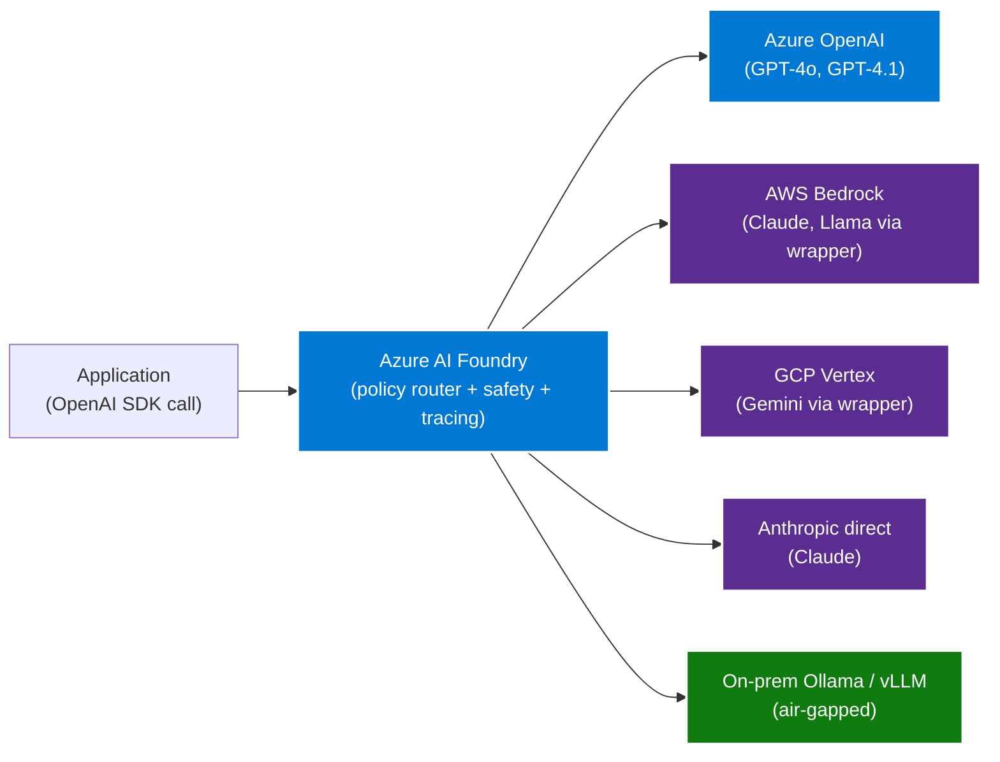

# Multi-Cloud AI — OpenAI-compatible APIs as the open contract

The model market converged on the **OpenAI chat-completions
contract** between 2024 and 2026. Every major provider now exposes
a wrapper or native endpoint that speaks the same OpenAI SDK calls.
That convergence is the AI layer's equivalent of Delta Lake — an
open standard that every vendor implements, so the application
becomes portable across model providers without code changes.

The right pattern is: **applications talk OpenAI SDK; an
orchestrator (Azure AI Foundry) routes the call to whichever
backend the policy says to use**. Swapping models becomes a config
change, not a code change.

## The architecture



## The OpenAI-compatible API contract

The contract is small enough to fit on a card:

- `POST /v1/chat/completions` — model name + messages array →
  completion.
- `POST /v1/embeddings` — model name + input → vector.
- `POST /v1/images/generations` — model name + prompt → image
  URL.
- `GET /v1/models` — list available models.

Every provider's wrapper accepts the same payload shape. The
provider may add provider-specific fields (Bedrock has
`anthropic_version`, Vertex has `safety_settings`), but the
required fields are common. Applications written against the
OpenAI SDK pass the same payload to any of them.

## Provider matrix

| Provider | Endpoint | OpenAI compat | Best for |
|---|---|---|---|
| **Azure OpenAI** | `https://{resource}.openai.azure.com/...` | Native (it is OpenAI) | Primary, regulated data, Azure-resident workloads |
| **OpenAI direct** | `https://api.openai.com/v1/...` | Native | Frontier model access, fastest GPT-4.x updates |
| **AWS Bedrock** | `https://bedrock-runtime.{region}.amazonaws.com/openai/v1/...` | Wrapper since 2024 | Claude, Llama, Titan; AWS-resident workloads |
| **GCP Vertex** | `https://{region}-aiplatform.googleapis.com/openai/v1/...` | Wrapper since 2024 | Gemini, PaLM; GCP-resident workloads |
| **Anthropic direct** | `https://api.anthropic.com/v1/...` (compat endpoint) | Wrapper | Claude with no cloud intermediary |
| **Ollama** | `http://{host}:11434/v1/...` | Native | Local dev, air-gapped, on-prem |
| **vLLM** | configurable | Native | High-throughput self-hosted |
| **LiteLLM** | configurable | Native | Universal proxy with cost tracking |
| **TGI (HuggingFace)** | configurable | Native | Self-hosted with HF model zoo |

## Azure AI Foundry as the orchestrator

Foundry is the right orchestrator anchor because:

1. **It speaks the OpenAI contract natively** as both client and
   server.
2. **Built-in content safety** — Azure AI Content Safety scans
   prompts and completions for harm categories.
3. **Built-in evaluation** — Prompt Flow runs evaluation suites
   against any backend.
4. **Built-in tracing** — OpenTelemetry-native, exports to
   Application Insights.
5. **Policy router** — route by cost, latency, data residency,
   or model quality.
6. **Connection registry** — register Bedrock, Vertex, Anthropic,
   Ollama as connections; switch via config.

Applications never call backends directly. They call Foundry. The
backend choice is operational policy.

## Policy patterns

The policy router is where the multi-cloud value shows up. Common
policies:

### Cost-based routing

```yaml
# Route long, low-stakes prompts to cheaper backends
routes:
  - match:
      prompt_tokens: ">2000"
      sensitivity: "low"
    backend: gcp-vertex-gemini-flash
  - match:
      sensitivity: "high"
    backend: azure-openai-gpt-4o
  - default:
      backend: azure-openai-gpt-4o-mini
```

### Data-residency routing

```yaml
# Keep regulated data in-region
routes:
  - match:
      data_classification: "restricted"
      region: "us-gov-virginia"
    backend: azure-openai-gov
  - match:
      data_classification: "restricted"
      region: "eu"
    backend: azure-openai-westeurope
  - default:
      backend: azure-openai-eastus2
```

### Model-quality routing

```yaml
# Route to the best model for the task type
routes:
  - match:
      task: "code_generation"
    backend: anthropic-claude-sonnet-4
  - match:
      task: "rag_synthesis"
    backend: azure-openai-gpt-4o
  - match:
      task: "embedding"
    backend: azure-openai-text-embedding-3-large
  - default:
      backend: azure-openai-gpt-4o-mini
```

### Fallback routing

```yaml
# Failover on backend outage
backends:
  - name: primary
    endpoint: azure-openai-eastus2
  - name: secondary
    endpoint: aws-bedrock-claude-sonnet
  - name: tertiary
    endpoint: gcp-vertex-gemini-pro
strategy: failover_on_5xx
```

## Embeddings + vector store portability

Embeddings have their own portability story. The vector dimensions
of `text-embedding-3-large` (3072) are different from
`bedrock-titan-embed-v2` (1024) which is different from
`vertex-text-embedding-005` (768). **Embeddings from different
models are not interchangeable**.

The discipline: pick one embedding model and stick with it across
the entire vector store. Treat the embedding model as **part of
the schema**, not a swappable choice. If you must change
embedding model, re-embed the entire corpus.

The recommended default is **Azure OpenAI `text-embedding-3-large`
(3072 dims)** with the vector store on Azure AI Search or
Postgres pgvector. Both are first-class supported and the
3072-dim embeddings have strong cross-domain retrieval quality.

## On-prem and air-gapped patterns

Some workloads cannot leave on-prem. The OpenAI-compatible contract
covers this too:

- **Ollama** — runs any GGUF-format model on commodity hardware,
  exposes OpenAI-compatible endpoint.
- **vLLM** — high-throughput self-hosted serving, OpenAI-compatible.
- **LiteLLM** — proxy that exposes OpenAI-compatible endpoint
  over any backend (including on-prem); useful for a single
  consistent interface across a mix of cloud + on-prem.
- **Azure AI Foundry connected to Arc-enabled on-prem nodes** —
  the same Foundry policy router can route to on-prem Ollama
  when the data classification requires it.

Air-gapped pattern: Foundry runs in a disconnected Azure Stack
Hub or sovereign cloud; backends are all on-prem Ollama / vLLM;
the application code is identical to the connected case.

## Anti-patterns

- **Application calls Azure OpenAI directly.** This locks the
  application to Azure OpenAI. Always go through Foundry (or
  LiteLLM as a lighter proxy) so backend swap is config-only.
- **Hard-coding model names in the application.** Use a model
  alias resolved at runtime by the orchestrator. Application asks
  for `code-model-fast`, orchestrator resolves to whatever the
  current best fit is.
- **Different embedding model per use case.** Vector stores cannot
  mix dimensions. Pick one embedding model per corpus and stick
  with it.
- **No content safety on non-Azure backends.** Bedrock and Vertex
  have their own safety; Ollama has none. Foundry's content
  safety layer covers all of them uniformly. Use it.
- **No cost tracking.** Foundry's tracing exports per-call cost
  to App Insights. Use it; otherwise multi-backend deployments
  develop runaway-spend habits.

## Related

- [Whitepaper — multi-cloud architecture](../whitepaper.md)
- [ADR-0007 — Azure OpenAI over self-hosted](../../adr/0007-azure-openai-over-self-hosted-llm.md)
- [Decision tree — Azure OpenAI vs open-source models](../../decisions/azure-openai-vs-open-source-models.md)
- [Guide — Azure AI Foundry](../../guides/azure-ai-foundry.md)
- [LLM data safety (8-layer guide)](../../guides/llm-data-safety.md)
