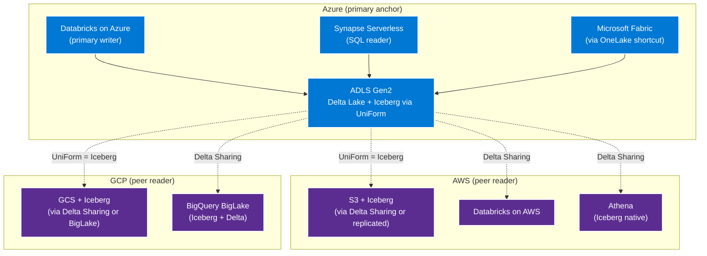
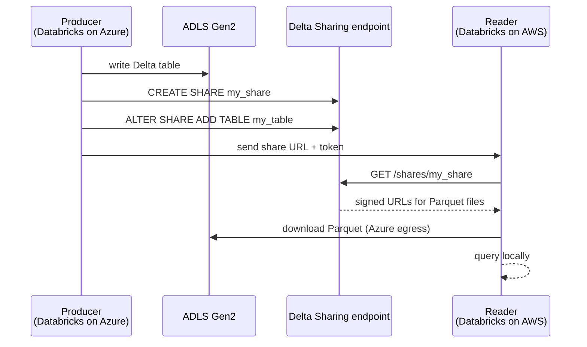
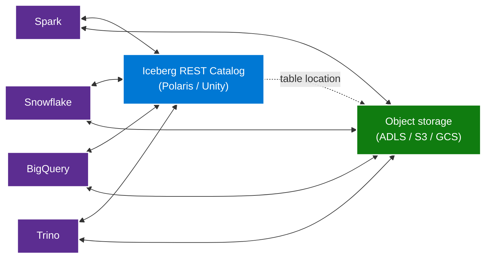

# Multi-Cloud Data — Delta + Iceberg as the portability layer

> **Comparative positioning note.** This document is written from the
> perspective of Microsoft Azure, Cloud Scale Analytics, and CSA Loom. Any
> description of third-party or competing products, services, pricing, or
> capabilities is derived from **publicly available documentation and sources**
> believed accurate at the time of writing, and is provided for **general
> comparison only**. We do not claim expertise in, or authority over, any
> non-Microsoft product or service; the respective vendor's official
> documentation is the authoritative source for their offerings, which may
> change over time. Nothing here is intended to disparage any vendor — where a
> competing product has genuine advantages, we aim to note them honestly.
> Verify all third-party details against the vendor's current official
> documentation before making decisions.

The data layer is where vendor lock-in does the most damage,
because **migrating a multi-petabyte warehouse out of a proprietary
format takes six to eighteen months**. The right defense is to put
the data in an open format from day one — Delta Lake or Apache
Iceberg — sitting on object storage that any engine can read.

## The architecture

## Format choice — Delta or Iceberg?

Both formats are open Linux Foundation specifications. Both
support ACID, schema evolution, time travel, and partition
evolution. The differences in 2026:

| Property | Delta Lake | Apache Iceberg |
|---|---|---|
| Maturity inside Microsoft + Databricks ecosystem | Native, first-class | Read via UniForm |
| Maturity inside Snowflake + BigQuery + AWS ecosystem | Read via external tables | Native, first-class |
| Concurrent multi-engine write | Single writer (multi-writer via Delta Universal Format) | Native multi-writer via catalog |
| REST catalog standard | Unity Catalog (proprietary but documented) | Iceberg REST Catalog (open standard) |
| Time travel granularity | By version + by timestamp | By snapshot |
| Production track record | Since 2019 | Since 2018 |
| Data type coverage | Full Spark types | Full Avro types |

**The right default is Delta-with-UniForm-enabled** on Azure. This
gives you:

- Native Delta reads in every Microsoft analytics surface
  (Databricks, Synapse Serverless, Fabric, Power BI)
- Iceberg-compatible reads (via UniForm) in every Iceberg-only
  surface (Snowflake, BigQuery, Athena, Trino-Iceberg)
- Zero duplication. The same Parquet files serve both readers.
- A single writer (Databricks), which avoids the multi-writer
  coordination problem.

**Choose Iceberg as primary** when:
- Your primary engine is Snowflake or BigQuery (native Iceberg)
- You need multi-engine concurrent write coordination (e.g.,
  Flink + Spark writing the same table)
- You want to standardize on the Iceberg REST catalog as the
  cross-engine metadata layer

## ADLS Gen2 as the canonical home

ADLS Gen2 is the recommended storage layer for the canonical
copy of the data. Reasons:

1. **Hierarchical namespace + POSIX-style ACLs** — required for
   Delta + Iceberg metadata patterns. S3 has flat-namespace
   limitations that Delta works around but does not love.
2. **First-class integration with every Microsoft analytics
   surface** — Databricks, Synapse, Fabric, Power BI, Purview,
   Azure ML all default to ADLS Gen2.
3. **Native Azure RBAC + ABAC** — fine-grained access control
   without IAM JSON gymnastics.
4. **Lifecycle management** — tier to cool / archive on policy.
5. **Geo-redundancy** — GRS / RA-GRS gives you a peer-region
   read copy without a second deployment.

Cross-cloud copies of the data sit on S3 (for AWS-resident
readers) and GCS (for GCP-resident readers), but those are
**derived** copies, not the source of truth. The pattern below
explains when to replicate vs. when to share.

## Cross-cloud sharing — Delta Sharing vs. replication

### Delta Sharing — the zero-copy default

Delta Sharing is the open zero-copy share protocol. The producer
exposes a share endpoint; the reader pulls Parquet files directly
from the producer's storage account. The producer pays no egress
because the reader is the network initiator. Compliant clients
exist in every major analytics engine.

The share lifecycle:

The egress cost is borne by the reader, on the reader's side of
the network — the producer's ADLS account just serves files to
authenticated clients. Total cost is bounded and predictable
because it scales with what the reader actually reads, not with
the full data set.

**When to use Delta Sharing:**
- Read-only consumers in peer clouds
- Read volume is modest (tens of GB/day, not hundreds)
- Latency tolerance is in seconds, not milliseconds
- Single producer + many readers

### Replication — when zero-copy is not enough

For high-read-volume or low-latency workloads, replicate the
Parquet files to a peer-cloud object store and point a peer-cloud
engine at the replica. This costs egress + storage on both sides
but eliminates the per-query pull.

Patterns:

| Replication path | Tool | Notes |
|---|---|---|
| ADLS → S3 | Azure Data Factory CopyJob | Incremental copy on schedule |
| ADLS → GCS | Storage Transfer Service or ADF | GCP has a free incoming-transfer service |
| ADLS → ADLS in another region | GRS / Azure Storage Object Replication | Native |
| Cross-cloud bidirectional | Databricks Delta Live Tables with multi-target sink | Engine-level |

The rule: **replicate only the hot subset**. Bronze + Silver stay
on Azure. Replicate the Gold table that the peer-cloud workload
actually queries. Trust the metadata layer (Unity Catalog) to
keep it coherent.

## The Iceberg REST catalog pattern

For Iceberg-primary deployments, the **Iceberg REST Catalog** is
the open-standard catalog layer. Implementations:

- **Polaris** (Snowflake's open-source catalog) — Apache 2.0
- **Tabular** (now part of Databricks)
- **Glue Catalog** (AWS) — REST-compatible since 2024
- **BigLake Metastore** (GCP) — REST-compatible
- **Unity Catalog** — exposes Iceberg REST endpoint since UC 3.0

The pattern: every engine in every cloud points at the same REST
catalog endpoint. The catalog tracks namespaces, tables, and
snapshots; the engine reads + writes the Parquet files in the
configured storage location. No catalog sync, no metadata
duplication.

## Anti-patterns

- **Writing to a warehouse's native columnar format as the source
  of truth.** Proprietary warehouse formats are warehouse-output
  formats, not source-of-truth formats. Land data in Delta /
  Iceberg first; let the warehouse query through external tables.
- **Replicating the full lakehouse to every cloud.** This is the
  most expensive form of multi-cloud. Replicate only the hot
  Gold tables that peer-cloud workloads actually need.
- **One Delta table per analyst.** Delta Sharing should expose
  domain-owned tables to broad audiences, not per-user copies.
- **Skipping UniForm.** If you write Delta and a downstream
  consumer wants Iceberg, enable UniForm. Do not duplicate the
  table.

## Related

- [Whitepaper — multi-cloud architecture](../whitepaper.md)
- [How-to — share Delta tables across clouds](../how-to/share-delta-tables-across-clouds.md)
- [ADR-0003 — Delta Lake over Iceberg](../../adr/0003-delta-lake-over-iceberg-and-parquet.md)
- [Decision tree — Delta vs Iceberg vs Parquet](../../decisions/delta-vs-iceberg-vs-parquet.md)
- [Multi-Cloud Databricks (Azure as Core)](../../build/guides/data-platforms/databricks-multi-cloud.md)
