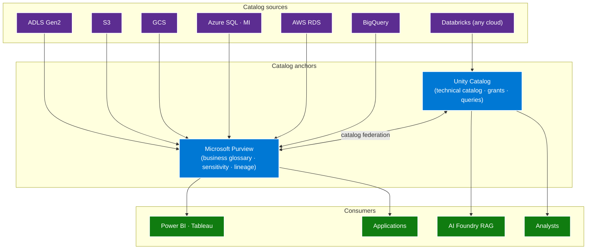
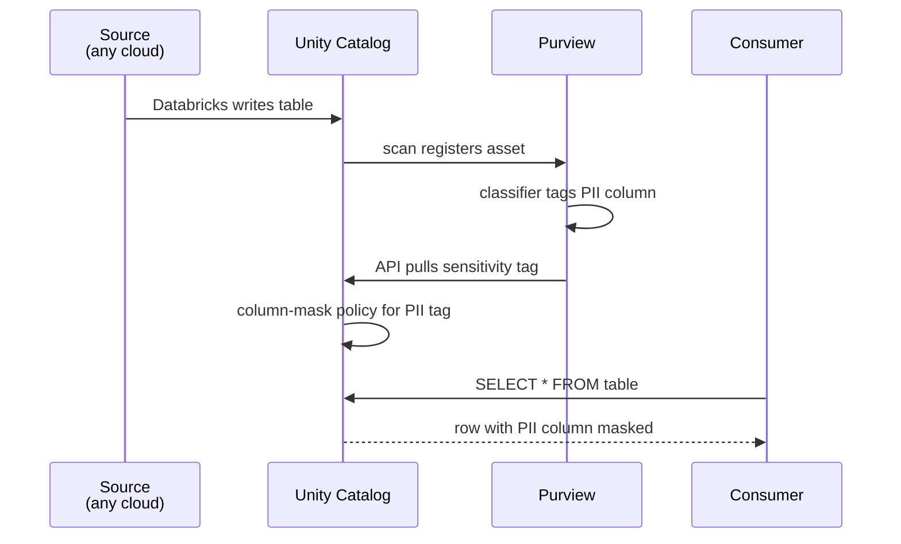

# Multi-Cloud Governance — one catalog, one lineage, one tag set

> **Comparative positioning note.** This document is written from the
> perspective of Microsoft Azure, Cloud Scale Analytics, and CSA Loom. Any
> description of third-party or competing products, services, pricing, or
> capabilities is derived from **publicly available documentation and sources**
> believed accurate at the time of writing, and is provided for **general
> comparison only**. We do not claim expertise in, or authority over, any
> non-Microsoft product or service; the respective vendor's official
> documentation is the authoritative source for their offerings, which may
> change over time. Nothing here is intended to disparage any vendor — where a
> competing product has genuine advantages, we aim to note them honestly.
> Verify all third-party details against the vendor's current official
> documentation before making decisions.

Multi-cloud governance fails the same way every time: each cloud
has its own catalog (AWS Glue, GCP Dataplex, Azure Purview),
each cloud has its own tag namespace, each cloud has its own
policy engine. The result is a governance picture stitched from
three half-views, with seams visible everywhere.

The defense is **federation, not duplication**. Purview as the
business-glossary + sensitivity + lineage anchor; Unity Catalog
as the technical-catalog + access-control anchor for Databricks
workloads; IaC-enforced tag propagation across all providers.

## The architecture

## Two catalogs, two roles

There is a useful division of labor between Purview and Unity
Catalog:

| Concern | Purview | Unity Catalog |
|---|---|---|
| Business glossary | Yes (primary) | No |
| Sensitivity labels (PII, PHI, PCI) | Yes (primary) | Inherits from Purview |
| Cross-source lineage (ADF → Databricks → Power BI) | Yes (primary) | Per-Databricks lineage |
| Asset discovery + search | Yes (broad) | Yes (Databricks-scoped) |
| Fine-grained access control (table/row/column) | No (catalog only) | Yes (primary) |
| Query-time enforcement | No | Yes |
| Multi-cloud Databricks workspaces | N/A | Yes (any cloud) |
| Multi-cloud non-Databricks (Snowflake, BigQuery, Athena) | Yes | Via federation |

The pattern: **Purview is the executive view**. Business glossary,
sensitivity classifications, end-to-end lineage. **Unity Catalog
is the engineer view**. Granular grants on tables, columns, rows.
Federation keeps them coherent.

## Catalog federation

Purview can register Unity Catalog metastores as scanned sources
since Purview 2024 connector v3.0. The scan brings Unity tables
into Purview as cataloged assets, with their classifications
and column-level lineage. Conversely, Unity Catalog can pull
Purview sensitivity tags via the Purview API and enforce them
as column masks.

The bidirectional pattern:

The result: one classifier tag in Purview becomes an enforced
column mask in every Databricks workspace in every cloud, with no
per-workspace copy of the policy.

## Tag standards that propagate

A tag set must be **mandatory, propagated by automation, and
identical across providers**. The recommended minimum:

| Tag | Values | Purpose |
|---|---|---|
| `Environment` | `prod` \| `nonprod` \| `dev` \| `sandbox` | Lifecycle + cost separation |
| `DataClass` | `public` \| `internal` \| `confidential` \| `restricted` | Sensitivity-based access |
| `Owner` | Entra group object ID | Accountability |
| `CostCenter` | finance code | Chargeback |
| `Workload` | name from workload registry | FinOps + ops grouping |
| `Compliance` | `none` \| `pci` \| `hipaa` \| `fedramp-mod` \| `fedramp-high` | Policy enforcement |
| `Region` | Azure region code | Data residency |
| `Retention` | duration | Lifecycle automation |

Propagation rules:

1. **IaC applies on create.** Bicep + Terraform modules require
   these tags as inputs; build fails without them.
2. **CI/CD enforces on update.** A policy job runs after every
   deployment scanning for resources missing any required tag.
3. **Cross-provider mapping.** Azure tags, AWS tags, GCP labels,
   and OCI tags use the same keys. The values are normalized
   (`Environment=prod` not `env=production`).
4. **Cost reporting joins on tags.** The cross-cloud FinOps
   dashboard groups by `Workload` + `CostCenter` + `Environment`.

## Policy enforcement across clouds

Each cloud has a policy engine. The recommended pattern is to
write the **policy intent** in one place (Azure Policy +
Microsoft Defender for Cloud) and **export equivalent policies**
to peer clouds via tooling:

| Cloud | Policy engine | Equivalent |
|---|---|---|
| Azure | Azure Policy + Defender for Cloud | Primary |
| AWS | AWS Config + Security Hub + SCP | Peer |
| GCP | Organization Policy + Security Command Center | Peer |
| OCI | Cloud Guard + IAM policies | Peer |
| Cross-cloud | Open Policy Agent (OPA) via Conftest in CI | Universal pre-deployment gate |

The pre-deployment gate (OPA in CI) is the most reliable layer
because it catches policy violations before they reach any
cloud's runtime engine. The runtime engines are the second line of
defense.

## Compliance frameworks

The right framework taxonomy is:

- **FedRAMP Moderate** — minimum for federal civilian SaaS.
  Azure has > 100 services in scope; AWS GovCloud and GCP Assured
  Workloads have parity for core services.
- **FedRAMP High** — federal civilian with sensitive data.
  Azure Government has the broadest footprint; AWS GovCloud has
  parity for core; GCP is more limited.
- **DoD IL4 / IL5 / IL6** — DoD-specific. Azure Government and
  AWS GovCloud have IL4 + IL5; IL6 is Azure DoD Government Secret
  and AWS Top Secret.
- **HIPAA / HITRUST** — healthcare. All three majors meet via BAA.
- **PCI DSS** — payment data. All three majors meet via
  attestation.
- **ISO 27001 / 27017 / 27018** — international. All three majors
  meet.
- **SOC 1 / 2 / 3** — service organization controls. All three
  majors meet.

The discipline: **map compliance scope at the workload-tag level**,
not the subscription level. A workload tagged
`Compliance=fedramp-high` triggers different policy enforcement
than a workload tagged `Compliance=none`, even if both run in the
same subscription.

## Lineage that crosses clouds

End-to-end lineage is the hardest cross-cloud governance problem
because every engine generates its own lineage events in its own
format. The recommended pattern:

1. **Every engine emits OpenLineage events** to a central
   collector. OpenLineage is the open standard supported by
   Spark, Airflow, dbt, Databricks, Fabric, Trino, Flink.
2. **The collector pushes to Marquez or directly to Purview.**
3. **Purview is the lineage UI** — graph view that crosses
   cloud + engine boundaries.

Per-engine lineage that does not flow OpenLineage events into
Purview is invisible at the executive level. Treat it as a gap.

## Anti-patterns

- **Per-cloud catalog with no federation.** Three catalogs, three
  search experiences, three glossaries. Pick a federation anchor.
- **Tags applied manually.** Tags must be IaC-required.
  Manually-applied tags drift within weeks.
- **Policy in only one cloud's engine.** Azure Policy alone does
  not stop AWS misconfigurations. Use OPA in CI as the universal
  gate; each cloud's engine as the runtime backstop.
- **Lineage per engine, no aggregation.** Per-engine lineage is
  useless to the executive who needs the full picture.
- **Sensitivity labels per cloud.** PII in AWS Glue, PII in
  Purview, PII in BigQuery — three different keywords. Pick the
  Purview sensitivity taxonomy and propagate.

## Related

- [Whitepaper — multi-cloud architecture](../whitepaper.md)
- [ADR-0006 — Purview over Atlas](../../adr/0006-purview-over-atlas.md)
- [Best practice — Data Governance](../../best-practices/data-governance.md)
- [Guide — Microsoft Purview](../../guides/purview.md)
- [Guide — Databricks Unity Catalog](../../guides/databricks-unity-catalog.md)
