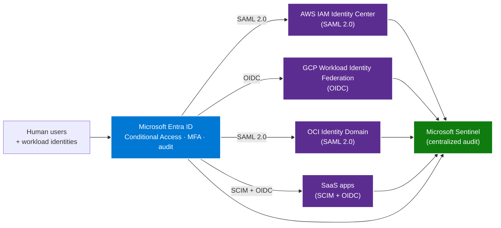

# Multi-Cloud Identity — Entra ID as the federation hub

> **Comparative positioning note.** This document is written from the
> perspective of Microsoft Azure, Cloud Scale Analytics, and CSA Loom. Any
> description of third-party or competing products, services, pricing, or
> capabilities is derived from **publicly available documentation and sources**
> believed accurate at the time of writing, and is provided for **general
> comparison only**. We do not claim expertise in, or authority over, any
> non-Microsoft product or service; the respective vendor's official
> documentation is the authoritative source for their offerings, which may
> change over time. Nothing here is intended to disparage any vendor — where a
> competing product has genuine advantages, we aim to note them honestly.
> Verify all third-party details against the vendor's current official
> documentation before making decisions.


The identity layer is the foundation of every multi-cloud posture.
Get it wrong and every other layer inherits the damage — fragmented
audit logs, parallel offboarding, cloud-local users that nobody
remembers to revoke. Get it right and every human + every workload
gets one identity, one MFA, one audit trail, one offboarding.

The pattern below uses **Microsoft Entra ID** as the federation
hub. The same architectural shape works with Okta, PingFederate,
or Keycloak as the hub; we anchor on Entra because most enterprises
already license it for Microsoft 365 and its Conditional Access
engine is mature and widely deployed.

## The architecture



## Federation patterns by cloud

### AWS — SAML 2.0 → IAM Identity Center

The canonical AWS pattern is **Entra → SAML 2.0 → AWS IAM Identity
Center → permission sets → IAM roles**.

1. Register AWS IAM Identity Center as an Enterprise Application
   in Entra.
2. Enable user + group SCIM provisioning so Entra group membership
   flows into IAM Identity Center automatically.
3. Define permission sets in IAM Identity Center for each role
   archetype (`Platform-Admin`, `Data-Engineer-RW`,
   `Analyst-RO`, `Auditor-RO`).
4. Bind each permission set to an Entra group via IAM Identity
   Center.
5. **Decommission all long-lived IAM users** except the two
   breakglass accounts.

For step-by-step runbook see
[Federate AWS to Entra ID](../how-to/federate-aws-to-entra-id.md).

### GCP — OIDC → Workload Identity Federation

The canonical GCP pattern for human users is **Entra → SAML 2.0
→ GCP Cloud Identity** (the human-identity path). For workloads
the pattern is **Entra → OIDC → GCP Workload Identity Federation
→ service account impersonation**.

Workload Identity Federation is the killer GCP feature here: a
managed identity in Azure can directly impersonate a GCP service
account via an OIDC token exchange, with no long-lived GCP service
account keys anywhere. The result is a workload running in Azure
that calls GCP APIs as a GCP service account, audited by GCP, with
the trust anchor being the managed identity's existence in your
Entra tenant.

For step-by-step runbook see
[Federate GCP to Entra ID](../how-to/federate-gcp-to-entra-id.md).

### OCI — SAML 2.0 → OCI Identity Domain

OCI exposes SAML 2.0 federation through Identity Domains. The
pattern mirrors AWS — register Entra as the IdP, map Entra
groups to OCI groups, bind OCI groups to compartments via
policies. Provisioning is via SCIM where available; otherwise the
Entra Identity Domain provisioning template handles it.

### SaaS apps — SCIM + OIDC

Most modern SaaS supports SCIM for provisioning + OIDC for
authentication. Both should flow through Entra. The exception is
SaaS that only supports legacy SAML — in those cases SAML still
flows through Entra; only the provisioning is manual.

## Group naming convention

A clean naming convention is mandatory because the same group
name appears in Entra, in the cloud's audit log, and in the
provider's IAM policies. The convention below scales to dozens
of clouds and hundreds of workloads:

```
{tenant}-{cloud}-{env}-{workload}-{role}
```

Examples:

- `corp-azure-prod-lakehouse-admin`
- `corp-azure-prod-lakehouse-reader`
- `corp-aws-prod-s3-archive-admin`
- `corp-gcp-nonprod-bigquery-reader`
- `corp-oci-prod-autonomous-db-admin`

Two rules:

1. Every Entra group that grants any cloud access has a clear
   `{cloud}-{env}-{workload}` prefix, so log analysis can group
   activity by workload and environment without parsing role names.
2. **No human-readable cloud-local groups**. The Entra group is
   the only group that grants access. Cloud-local groups (AWS IAM
   groups, GCP groups, OCI groups) are present only as the target
   of the Entra federation mapping; they have no direct members.

## Service principal patterns

Workload-to-cloud authentication should never use long-lived
secrets. The pattern by cloud:

| Cloud | Pattern | Notes |
|---|---|---|
| Azure | Managed Identity (system-assigned or user-assigned) | First-class. No secret to rotate. |
| AWS | OIDC trust to IAM role from Azure Managed Identity | Workload running in AKS / Azure Functions / Container Apps assumes an AWS role via OIDC. |
| GCP | Workload Identity Federation to GCP service account | Same OIDC pattern. No GCP service account key. |
| OCI | OCI Resource Principal (when in OCI) or federated principal session | OCI now supports OIDC token exchange to a resource principal session. |
| On-prem / edge | Entra ID Workload Identity + Arc-enabled servers | Arc gives on-prem servers a managed-identity equivalent. |

The rule: **no long-lived cloud-local service account keys exist
anywhere**. If you find one in code, in Key Vault, or in a
config file, it is a finding. Replace it with federation.

## Breakglass accounts

Federation always fails eventually. Your IdP has an outage, your
SAML certificate expires, your Entra tenant has a regional issue.
You need a way in that does not depend on federation.

The breakglass pattern, per cloud:

1. **Two breakglass accounts** per cloud (so you have two people
   who can act if one is unavailable).
2. **Cloud-local identity**, not federated. AWS IAM user, GCP
   local account, OCI local user.
3. **MFA via hardware token** (FIDO2 / YubiKey), not via SMS or
   authenticator app.
4. **Credentials in a hardware token vault** (CyberArk, HashiCorp
   Vault with HSM, AWS Secrets Manager with KMS HSM).
5. **Audit every login**. Sentinel alert on any breakglass account
   use. The expected use-rate is zero per quarter; any login is
   investigated.
6. **Quarterly rotation drill** — rotate the breakglass
   credentials every 90 days and verify the rotation process works.

## Audit log centralization

The point of one identity is one audit log. Forward every cloud's
identity audit log to a single SIEM:

| Source | Connector | Sentinel content pack |
|---|---|---|
| Entra ID | Native | "Entra ID" |
| Azure resources | Native | "Azure Activity" |
| AWS CloudTrail | S3 → Sentinel S3 connector | "AWS" |
| GCP Cloud Audit | Pub/Sub → Sentinel connector | "Google Cloud Platform" |
| OCI Audit | Streaming → Sentinel | "OCI" |
| GitHub | App → Sentinel | "GitHub" |
| Okta (if relevant) | Native | "Okta SSO" |

The SIEM is itself swappable; what matters is that **one query
covers every cloud's identity events**. Sentinel is the
recommended default because the connectors are first-party and
the Entra integration is deepest.

## Conditional Access policies that cover everything

Once federation is in place, **every Entra Conditional Access
policy applies to every federated cloud**. The recommended baseline:

1. **Require MFA for all users** — applies to Entra, AWS console,
   GCP console, OCI console, all SaaS.
2. **Block legacy auth** — kill SAML 1.x, kill IMAP basic auth.
3. **Require compliant device** for administrative roles —
   Platform-Admin groups can only authenticate from
   Intune-compliant devices.
4. **Sign-in risk + user risk policies** — Entra Identity
   Protection raises the bar dynamically.
5. **Block by geography** unless travel is expected.

These policies are written once in Entra and apply to every
federated cloud automatically.

## Anti-patterns to reject

- **Cloud-local IdP** — standing up AWS IAM Identity Center,
  GCP Cloud Identity, or OCI Identity Domain as the primary IdP.
  This duplicates the directory and fragments the audit log.
- **Long-lived service account keys** — JSON key files for GCP
  service accounts, IAM access keys for AWS users. Replace with
  Workload Identity Federation.
- **Shared admin accounts** — `aws-admin` used by five people.
  Use per-person accounts with audit trails.
- **Permission set sprawl** — one permission set per individual
  exception. Define role archetypes; deny exceptions.
- **Manual provisioning** — manually adding users to AWS IAM
  Identity Center or GCP groups. SCIM provisioning from Entra is
  the only path.

## Related

- [Whitepaper — multi-cloud architecture](../whitepaper.md)
- [How-to — federate AWS to Entra](../how-to/federate-aws-to-entra-id.md)
- [How-to — federate GCP to Entra](../how-to/federate-gcp-to-entra-id.md)
- [ADR-0014 — MSAL BFF auth pattern](../../adr/0014-msal-bff-auth-pattern.md)
- [Decision tree — Managed identity vs service principal](../../decisions/managed-identity-vs-service-principal.md)
