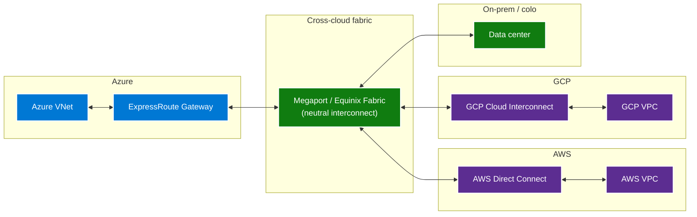

# Multi-Cloud Network — private spine over public egress

The network plane is where multi-cloud costs run away if you let
them. Public-internet egress between hyperscalers is **the most
expensive data movement on the planet** at per-GB rates around
$0.08-$0.09 outbound on AWS and GCP, $0.087 on Azure. A
multi-cloud deployment that pulls terabytes per day across the
public internet can spend more on egress than on compute.

The defense is a **private spine** — ExpressRoute on the Azure
side, Direct Connect on the AWS side, Cloud Interconnect on the
GCP side, all aggregated through a neutral fabric provider
(Megaport, Equinix Fabric, PacketFabric) at committed per-Mbps
rates that are 60-80% cheaper than per-GB public egress.

## The architecture

## The cross-cloud egress trap

Public-internet egress is the default if you do not opt out. Every
API call between AWS and Azure over public network paths is
egress-billed on the source side. A naive multi-cloud architecture
hits this on every cross-cloud call:

- Application in Azure calling an AWS RDS database — every query
  result is Azure egress.
- Workload on AWS reading from ADLS Gen2 — every Parquet file is
  Azure egress.
- Replication from Azure Blob to S3 — every byte is Azure egress.

A workload that processes 10 TB/day cross-cloud over public
internet costs roughly **$870/day = $26K/month = $317K/year in
egress alone**, before any compute or storage.

The same workload over a 1 Gbps Megaport connection costs roughly
**$400/month** committed, plus much lower per-GB on the
ExpressRoute side. The ROI on the private spine is usually under
60 days.

## ExpressRoute + Megaport — the recommended spine

The recommended pattern is **ExpressRoute Local or ExpressRoute
Standard** terminating at a Megaport or Equinix Fabric metro PoP,
with the same Megaport circuit also terminating Direct Connect
(AWS) and Cloud Interconnect (GCP).

The Megaport / Equinix fabric sits in the same metro data center
(Ashburn / VA, Dallas / TX, San Jose / CA, etc.) as the
hyperscaler peering points, so the latency is sub-millisecond
inter-cloud. The fabric provides the L2 / L3 connectivity; the
hyperscalers handle the gateway endpoints on their side.

| Component | Provider | Purpose |
|---|---|---|
| ExpressRoute Circuit | Azure + carrier | Private path Azure VNet ↔ Megaport |
| Direct Connect | AWS | Private path AWS VPC ↔ Megaport |
| Cloud Interconnect | GCP | Private path GCP VPC ↔ Megaport |
| FastConnect | OCI | Private path OCI VCN ↔ Megaport |
| Megaport Cloud Router | Megaport | Multi-cloud BGP routing |
| Equinix Fabric | Equinix | Alternative to Megaport |

### Sizing guidance

- **Sub-1 Gbps** — ExpressRoute Local at 1 Gbps + Megaport 100
  Mbps to 1 Gbps elastic VXC. Sufficient for replication and
  cross-cloud queries up to ~10 TB/day.
- **1-10 Gbps** — ExpressRoute Standard at 10 Gbps + Megaport
  dedicated VXCs. Sufficient for streaming-scale workloads.
- **10 Gbps+** — ExpressRoute Direct (100 Gbps port pairs) +
  dedicated cross-connects. Required for petabyte-scale
  replication or low-latency cross-cloud compute.

## Private Link parity across clouds

Each cloud has a private-endpoint feature. They are not
interoperable but follow the same architectural shape:

| Cloud | Private endpoint feature | Notes |
|---|---|---|
| Azure | Azure Private Link | Per-service endpoint; first-class |
| AWS | AWS PrivateLink (VPC Endpoints) | Per-service endpoint; first-class |
| GCP | Private Service Connect | Per-service endpoint |
| OCI | Private Endpoints | Per-service endpoint |

The pattern: **every cross-cloud connection terminates on a
private endpoint in the peer cloud**. There is no public-internet
DNS resolution involved. Service consumers in one cloud reach
the producer in another via the private spine + the producer's
private endpoint.

For ADLS Gen2 reached from AWS: the ADLS account has a private
endpoint on the Azure side, the AWS VPC terminates a Direct
Connect circuit to the same Megaport fabric, and the AWS workload
resolves the ADLS account's private IP via a conditional-forwarder
DNS rule.

## DNS — the often-forgotten layer

Multi-cloud DNS is non-trivial because each cloud has its own
private DNS zones and the resolvers do not cross by default.

Recommended pattern:

1. **Single private DNS root** — pick one cloud as the DNS
   anchor (usually Azure Private DNS). Stand up zones for every
   private endpoint domain (`privatelink.blob.core.windows.net`,
   `s3.amazonaws.com`, `bigquery.googleapis.com`).
2. **Conditional forwarders** from each peer cloud's resolver
   point to the Azure DNS Private Resolver inbound endpoint.
3. **Reverse zones** for in-cloud private IPs.
4. **A SOA-level audit** quarterly to catch zone drift.

The alternative (per-cloud independent DNS with stub zones) works
but is harder to operate. The single-root pattern is what large
multi-cloud deployments converge on.

## Network security baseline

| Control | Pattern |
|---|---|
| Egress filtering | Azure Firewall Premium or NVA on the egress side; equivalents on peer clouds (AWS Network Firewall, GCP Cloud NGFW) |
| TLS everywhere | mTLS on cross-cloud service-to-service; Entra-issued certs |
| Network segmentation | Hub-spoke per cloud with no transitive routing between spokes by default |
| DDoS protection | Azure DDoS Protection Standard (paid tier); AWS Shield Advanced; GCP Cloud Armor |
| Flow logs | Azure NSG flow logs → Log Analytics; equivalents per cloud → SIEM |
| Zero Trust posture | Per-workload identity (managed identity / federation), no IP-based trust |

## Cost telemetry

The FinOps view of network spend must join across providers.
Recommended:

- Tag every egress-emitting resource with the workload that owns
  it. The tag flows into the bill via the resource's metadata.
- Build a cross-cloud network cost dashboard joining Azure Cost
  Management exports, AWS CUR exports, GCP billing exports.
- Alert on any line item >$1K/day per workload — there should be
  a clear reason.
- Quarterly review of top 20 egress generators; route the top
  ones through the private spine if not already.

## Anti-patterns

- **Cross-cloud over public internet by default.** Every
  cross-cloud byte should traverse the private spine. Public
  internet is a fallback, not a default.
- **Per-service VPN tunnels.** Site-to-site VPNs over the
  internet for cross-cloud are cheap to start, expensive at
  scale, and operationally fragile. Use ExpressRoute + Megaport.
- **Open egress for compute resources.** Every VNet / VPC has a
  default-deny egress firewall. Allow-list specific endpoints.
- **DNS sprawl.** Per-cloud independent DNS with no integration.
  Centralize on one resolver, forward the rest.
- **No flow logs.** You cannot debug cross-cloud network issues
  without flow logs in both directions.

## Related

- [Whitepaper — multi-cloud architecture](../whitepaper.md)
- [How-to — cross-cloud disaster recovery](../how-to/cross-cloud-disaster-recovery.md)
- [Pattern — Networking & DNS Strategy](../../patterns/networking-dns-strategy.md)
- [Best practice — Security & Compliance](../../best-practices/security-compliance.md)
