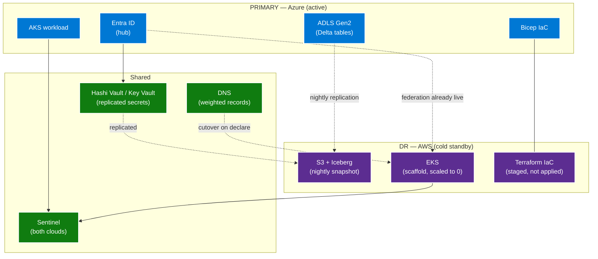

# How-to — cross-cloud disaster recovery

!!! info "Comparative positioning note"
    This document is written from the
    perspective of Microsoft Azure, Cloud Scale Analytics, and CSA Loom. Any
    description of third-party or competing products, services, pricing, or
    capabilities is derived from **publicly available documentation and sources**
    believed accurate at the time of writing, and is provided for **general
    comparison only**. We do not claim expertise in, or authority over, any
    non-Microsoft product or service; the respective vendor's official
    documentation is the authoritative source for their offerings, which may
    change over time. Nothing here is intended to disparage any vendor — where a
    competing product has genuine advantages, we aim to note them honestly.
    Verify all third-party details against the vendor's current official
    documentation before making decisions.


Cross-cloud DR is the highest-stakes flavor of multi-cloud. It is
also the most expensive — synchronous data replication across
clouds is rarely justified, and few enterprises actually need it.
The right pattern for most workloads is **cold standby in a
sibling cloud with a documented restoration runbook**, exercised
quarterly.

This runbook sets RPO + RTO targets, defines the cold-standby
architecture, and walks the restoration sequence. The destination
cloud is AWS in the examples below; substitute GCP or OCI as
needed — the shape is identical.

**RPO target:** 24 hours (last nightly snapshot).
**RTO target:** 8 hours (from declared incident to first
production traffic).

These targets fit most analytics workloads. Transactional /
financial workloads needing tighter targets need synchronous
cross-cloud replication, which is a separate (more expensive)
design.

## Architecture



## Pre-staging (one-time, weeks before any incident)

### S1 — Stand up the standby cloud account

1. AWS Organization → new account: `corp-dr-standby`.
2. Federate to Entra (see
   [federate AWS to Entra](federate-aws-to-entra-id.md)).
3. Tag the account with `Purpose=DR-Standby`.

### S2 — Replicate the Delta tables to S3 as Iceberg

The producer side runs nightly on Azure:

```python
# Daily job — running on Azure Databricks
from pyspark.sql.functions import current_timestamp

tables = [
    "main.finance.fact_sales",
    "main.finance.dim_customer",
    "main.ops.fact_orders",
]

for tbl in tables:
    df = spark.read.table(tbl)
    # Write as Iceberg to S3 via Glue catalog
    (df.write
       .format("iceberg")
       .mode("overwrite")
       .option("catalog", "glue_dr_catalog")
       .saveAsTable(f"dr.{tbl.split('.')[-2]}.{tbl.split('.')[-1]}")
    )
```

The S3 bucket has versioning + Object Lock (governance mode, 30
days) so the replica cannot be deleted or overwritten by
accident.

### S3 — Stage the Terraform plan

Write Terraform for every AWS resource the workload needs but do
**not** apply it. Store the plan in the DR account's Terraform
state bucket. The plan is the runbook artifact for restoration.

```hcl
# terraform/dr/main.tf
provider "aws" {
  region = "us-east-1"
}

# EKS cluster (scaled to 0 node groups)
module "eks" {
  source = "terraform-aws-modules/eks/aws"
  cluster_name = "dr-workload"
  cluster_version = "1.29"
  # ...
  node_groups = {
    primary = {
      desired_capacity = 0  # scaled to 0 in standby
      max_capacity     = 20
      min_capacity     = 0
    }
  }
  tags = {
    Purpose     = "DR-Standby"
    Environment = "prod"
    Workload    = "lakehouse"
    Owner       = "<entra-group-object-id>"
  }
}

# Other resources: RDS, ALB, S3 buckets, etc., all minimally sized
```

### S4 — Replicate secrets

Key Vault → AWS Secrets Manager replication for the secrets the
workload needs. Use the Key Vault event grid → Logic App → Secrets
Manager pattern for live sync, or a nightly export script for
secrets that change less frequently.

### S5 — Set up DNS weighted routing

In your DNS provider (Azure DNS, Route 53, Cloudflare):

```
api.example.com   A    primary-azure-ip   weight=100
api.example.com   A    dr-aws-placeholder weight=0
```

DR weight stays at 0 until declared. Cutover changes weights.

### S6 — SIEM coverage on both sides

Sentinel ingests CloudTrail from the standby account today, not
during the incident. The DR account is observable from day one.

## Quarterly drill

A drill exercises the runbook without taking production down.

1. Pick a non-critical workload (or a clone of a critical one).
2. Stand it up in the DR account from the staged Terraform.
3. Restore the latest data snapshot.
4. Cut DNS to weighted-50/50 for the drill.
5. Run smoke tests.
6. Cut DNS back to 100% primary.
7. Tear down the drill workload.
8. Document drift between staged Terraform and the actual
   restoration. Update the Terraform.

The drill is the only way to know if the runbook actually works.
Skipping it for two cycles means the runbook is stale; assume
restoration will fail.

## Incident sequence (on declare)

### T+0 — Incident declared

- Incident commander runs the DR-declare runbook.
- Stakeholders notified per the comms plan.
- DR account access for the platform team confirmed via Entra
  Conditional Access break-glass policy.

### T+15 min — Apply infrastructure

```bash
cd terraform/dr
terraform init
terraform plan -out=dr.plan
# review plan; should match what's been drilled
terraform apply dr.plan
```

EKS cluster, RDS, ALB, S3 buckets, security groups all come up.

### T+45 min — Scale the node groups

```bash
aws eks update-nodegroup-config \
    --cluster-name dr-workload \
    --nodegroup-name primary \
    --scaling-config minSize=3,maxSize=20,desiredSize=10
```

### T+1h — Restore data

The Iceberg replica on S3 is the source of truth post-failover.
Configure the EKS-resident Spark or Trino cluster to read from
Glue:

```sql
-- Trino reading from Glue catalog (Iceberg)
SELECT count(*) FROM glue_dr_catalog.dr.finance.fact_sales;
```

If the workload needs Delta semantics, run a Iceberg → Delta
materialization step on the DR side using the `iceberg-to-delta`
patterns from your data layer playbook.

### T+2h — Deploy applications

The same container images deploy to EKS as deployed to AKS.
Helm + ArgoCD point at the DR cluster:

```bash
kubectl config use-context dr-eks
helm install workload ./chart --values values-dr.yaml
```

`values-dr.yaml` differs from prod only in the cloud-specific
endpoints (RDS hostname, S3 bucket name, OIDC issuer).

### T+4h — Smoke tests pass

Per-workload smoke tests in CI; require green before any DNS
shift.

### T+6h — Cutover

```bash
# DNS — bring DR to 100%
aws route53 change-resource-record-sets ...
```

External traffic flows to EKS. The user-facing endpoint is
unchanged.

### T+8h — Stabilization

Full production load on DR. Monitor for 24 hours.

## Reverse-failover (when primary returns)

Once Azure is restored, you do **not** automatically fail back.
The DR cloud has the freshest state. Plan a maintenance window:

1. Replicate state changes from S3/Iceberg back to ADLS/Delta.
2. Reverify Azure infrastructure.
3. Weighted DNS shift back to Azure over a controlled window.
4. Idle EKS node groups back to 0.

## Anti-patterns

- **Hot standby with no drill.** A hot standby that has not been
  tested is statistically a cold standby with a higher bill.
- **Cross-cloud synchronous replication for analytics.** Almost
  never justified. Use nightly snapshots + the runbook.
- **DR-by-restore-only.** No staged infrastructure, no Terraform
  plan, no runbook. Restoration in incident-time is 24-48 hours
  not 8.
- **DR account has no SIEM coverage.** You will not see attacker
  activity during failover.

## RPO + RTO tracking

Per workload, document in the workload registry:

| Workload | Tier | RPO | RTO | DR cloud | Last drill |
|---|---|---|---|---|---|
| Lakehouse Gold | Tier-2 | 24h | 8h | AWS us-east-1 | 2026-Q1 |
| Customer-facing API | Tier-1 | 1h | 2h | AWS us-east-1 + GCP | 2026-Q1 |
| Internal reporting | Tier-3 | 7d | 24h | AWS us-east-1 | 2026-Q1 |

Tier-1 workloads needing sub-2h RTO use warm standby
(active-passive across clouds with continuous replication), which
is a different design.

## Related

- [Whitepaper — multi-cloud architecture](../whitepaper.md)
- [Disaster Recovery (single-cloud)](../../DR.md)
- [Best practice — multi-cloud network](../best-practices/network.md)
- [Best practice — multi-cloud identity](../best-practices/identity.md)
