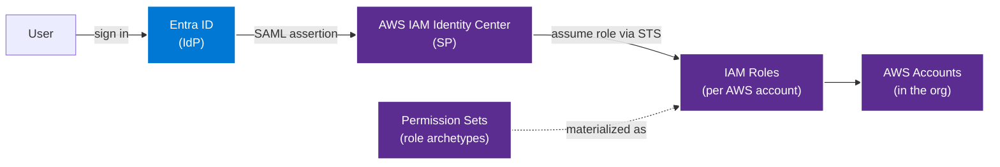

# How-to — federate AWS to Microsoft Entra ID

This runbook stands up the **Entra → SAML 2.0 → AWS IAM Identity
Center → permission sets → IAM roles** pattern. The result: every
AWS console login and every AWS CLI session authenticates through
Entra, with MFA + Conditional Access applied uniformly. No
long-lived IAM users.

**Time to complete:** 60-90 minutes (greenfield).
**Prerequisites:** Entra global admin or Application admin role +
AWS Organization management account access.

## Architecture



## Step 1 — Enable AWS IAM Identity Center

In the AWS management account (the Organization root):

1. AWS Console → IAM Identity Center → **Enable**.
2. Choose the region. This is the home region for the Identity
   Center instance — pick the region closest to your user base.
   It cannot be changed without recreating the instance.
3. Confirm the org is in `ALL_FEATURES` mode (not consolidated
   billing only).

The Identity Center home region matters because it is the only
region where the SAML metadata endpoint serves. All other regions
proxy through it.

## Step 2 — Register the Entra Enterprise Application

In Entra Admin Center:

1. **Enterprise applications** → **New application** → search
   "AWS IAM Identity Center" → select the gallery app → **Create**.
2. **Single sign-on** → **SAML**.
3. Edit **Basic SAML Configuration**:
   - **Identifier (Entity ID):** copy from AWS IAM Identity Center
     **External identity provider** wizard (`Issuer URL`).
   - **Reply URL (ACS URL):** copy from the same AWS wizard
     (`AWS ACS URL`).
   - **Sign-on URL:** the AWS Identity Center start URL.
4. Edit **User Attributes & Claims**:
   - Default claim mapping is fine. Confirm `Unique User Identifier`
     = `user.userprincipalname`.
5. Download the **Federation Metadata XML**.

## Step 3 — Configure AWS IAM Identity Center as Service Provider

Back in AWS IAM Identity Center:

1. **Settings** → **Identity source** → **Change identity source**
   → **External identity provider**.
2. Upload the Federation Metadata XML from Entra.
3. Confirm. The SAML trust is now bidirectional.

## Step 4 — Enable SCIM provisioning

SCIM auto-syncs Entra users + group memberships into AWS IAM
Identity Center.

1. In AWS IAM Identity Center → **Settings** → **Automatic
   provisioning** → **Enable**.
2. Copy the **SCIM endpoint** and the **Access token**.
3. In Entra → the AWS Enterprise App → **Provisioning** →
   **Provisioning Mode = Automatic**.
4. **Admin Credentials:**
   - **Tenant URL** = the SCIM endpoint.
   - **Secret Token** = the access token.
5. **Test Connection** → must succeed.
6. **Mappings** → review the default `Provision Microsoft Entra ID
   Groups` mapping. Confirm group object ID, displayName, and
   members all sync.
7. **Settings** → **Scope** = `Sync only assigned users and
   groups` (recommended).
8. Save → **Start provisioning**.
9. Assign the Entra groups that will have AWS access to the
   Enterprise App (Users and Groups blade).

After a few minutes, the Entra groups appear in AWS IAM Identity
Center → Groups.

## Step 5 — Define permission sets and bind to AWS accounts

A **permission set** is a reusable role definition. The same
permission set can be assigned to one Entra group across many
AWS accounts.

Recommended role archetypes:

| Permission set | Maps to AWS managed policy | For |
|---|---|---|
| `Platform-Admin` | `AdministratorAccess` | Cloud platform team |
| `Security-Audit-RO` | `SecurityAudit` + `ReadOnlyAccess` | Security auditors |
| `Data-Engineer-RW` | Custom (S3 + Glue + EMR + Lake Formation) | Data engineering |
| `Data-Analyst-RO` | Custom (Athena + S3 read on specific buckets) | Analysts |
| `Developer` | `PowerUserAccess` | App developers in non-prod |

For each:

1. AWS IAM Identity Center → **Permission sets** → **Create**.
2. Choose the policy type (managed, custom inline, or both).
3. Set the session duration (1-12 hours; 8 hours is a reasonable
   default).
4. **AWS Accounts** → select the accounts → **Assign users or
   groups** → pick the Entra group → pick the permission set.

The user signs in to the AWS start URL, sees the AWS accounts
they have access to, picks the permission set, and assumes the
underlying IAM role for the session duration.

## Conditional Access policies

In Entra, add the AWS Enterprise App to your baseline Conditional
Access policies:

- **Require MFA** for all sign-ins.
- **Require compliant device** for `Platform-Admin` role.
- **Block legacy auth**.
- **Block by geography** unless travel exception.

These apply automatically because AWS is now an Entra-federated
application.

## Breakglass accounts

Create two IAM users in the AWS management account, **outside the
federation**, for federation-failure recovery:

1. IAM → Users → Create two users (e.g., `breakglass-1`,
   `breakglass-2`).
2. Attach `AdministratorAccess`.
3. Generate console password + access keys; require MFA via FIDO2.
4. Store credentials in a hardware-token-protected vault.
5. Set up CloudTrail alarms on any login or API use by these
   users.
6. Document the use procedure; do quarterly rotation drills.

## CLI access

For programmatic access, install `aws sso` (built into AWS CLI v2):

```bash
aws configure sso
# SSO start URL: https://d-xxxxxxxxxx.awsapps.com/start
# SSO region: us-east-1
# Account ID + permission set are chosen interactively
aws sso login --profile my-account-admin
aws s3 ls --profile my-account-admin
```

The session token is cached locally for the permission set's
session duration. No long-lived access keys.

## Verification

After completing all five steps:

- [ ] Sign in to the AWS Identity Center start URL with an Entra
      identity. MFA is prompted. AWS accounts list is shown.
- [ ] Pick an account + permission set. AWS console loads with
      the role's privileges.
- [ ] `aws sso login` from the CLI succeeds.
- [ ] Sentinel (or your SIEM) receives the CloudTrail event for
      the assumed role.
- [ ] Entra sign-in log shows the SAML sign-in to the AWS app.
- [ ] No IAM users exist in the management account except the
      two breakglass accounts.

## Related

- [Best practice — multi-cloud identity](../best-practices/identity.md)
- [Whitepaper — multi-cloud architecture](../whitepaper.md)
- [How-to — federate GCP to Entra ID](federate-gcp-to-entra-id.md)
