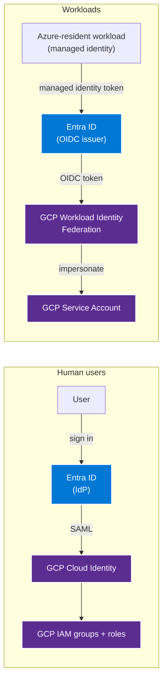

# How-to — federate GCP to Microsoft Entra ID

This runbook stands up two complementary federation patterns for
GCP:

- **Human users** — Entra → SAML 2.0 → GCP Cloud Identity → IAM
  groups.
- **Workloads** — Entra → OIDC → GCP Workload Identity Federation
  → service account impersonation.

The workload pattern is the killer feature: an Azure managed
identity directly impersonates a GCP service account via OIDC
token exchange, with **no long-lived GCP service account keys
anywhere**.

**Time to complete:** 90-120 minutes (greenfield).
**Prerequisites:** Entra global admin or Application admin +
GCP Organization admin.

## Architecture



## Step 1 — Set up Entra → SAML → Cloud Identity (human users)

For human users accessing GCP Console:

1. In Entra Admin Center → **Enterprise applications** → **New
   application** → search "Google Cloud / G Suite Connector by
   Microsoft" → **Create**.
2. **Single sign-on** → **SAML**.
3. **Basic SAML Configuration:**
   - **Identifier:** `google.com/a/<your-cloud-identity-domain>`
   - **Reply URL:** `https://www.google.com/a/<your-domain>/acs`
   - **Sign-on URL:** `https://www.google.com/a/<your-domain>/ServiceLogin`
4. **Attributes & Claims:**
   - Map `nameidentifier` → `user.userprincipalname`.
5. Download the **Federation Metadata XML**.
6. In Google Admin Console → **Security** → **Authentication** →
   **SSO with third-party IdP**:
   - **Sign-in page URL:** the Entra `LoginURL` from the metadata.
   - **Sign-out page URL:** the Entra `LogoutURL`.
   - Upload the Entra signing certificate.
   - **Use a domain-specific issuer:** enable, set to Entra
     `EntityID`.

Human users now sign in to GCP via Entra. MFA + Conditional
Access apply automatically.

## Step 2 — Set up SCIM provisioning for users + groups

1. In Entra → the Google Cloud Enterprise App → **Provisioning**
   → **Mode = Automatic**.
2. **Admin Credentials:** authenticate as a Google Workspace
   super-admin via OAuth.
3. **Mappings:** confirm user + group sync.
4. **Scope:** assigned users + groups only.
5. **Start provisioning**.

Entra group `corp-gcp-prod-bigquery-reader` syncs to a Google
Workspace group with the same name. The Google group is bound
to GCP IAM roles via principal bindings.

## Step 3 — Configure GCP IAM bindings for the synced groups

For each role archetype, create a Google Workspace group via
sync, then bind to GCP IAM:

```bash
# Bind Entra-synced group to a GCP IAM role on a project
gcloud projects add-iam-policy-binding PROJECT_ID \
    --member="group:corp-gcp-prod-bigquery-reader@<your-domain>" \
    --role="roles/bigquery.dataViewer"
```

Recommended role archetypes mirror the AWS pattern:

| Group name | GCP roles |
|---|---|
| `corp-gcp-prod-platform-admin` | `roles/owner` (project-level) |
| `corp-gcp-prod-bigquery-reader` | `roles/bigquery.dataViewer` |
| `corp-gcp-prod-bigquery-editor` | `roles/bigquery.dataEditor` |
| `corp-gcp-prod-gcs-reader` | `roles/storage.objectViewer` |

## Step 4 — Set up Workload Identity Federation (workloads)

This is the killer feature. An Azure managed identity directly
impersonates a GCP service account via OIDC token exchange.

### 4a — Create the GCP Workload Identity Pool

```bash
gcloud iam workload-identity-pools create "entra-pool" \
    --location="global" \
    --display-name="Entra ID Workload Pool"

gcloud iam workload-identity-pools providers create-oidc "entra-provider" \
    --location="global" \
    --workload-identity-pool="entra-pool" \
    --display-name="Entra ID OIDC Provider" \
    --attribute-mapping="google.subject=assertion.sub,attribute.tenant=assertion.tid,attribute.app_id=assertion.appid" \
    --issuer-uri="https://sts.windows.net/<your-entra-tenant-id>/" \
    --allowed-audiences="api://AzureADTokenExchange"
```

The provider trusts tokens issued by your Entra tenant for the
audience `api://AzureADTokenExchange`.

### 4b — Create the target GCP service account

```bash
gcloud iam service-accounts create "azure-data-pipeline" \
    --display-name="Impersonated by Azure data pipeline" \
    --project=PROJECT_ID

# Grant the SA the actual GCP permissions it needs
gcloud projects add-iam-policy-binding PROJECT_ID \
    --member="serviceAccount:azure-data-pipeline@PROJECT_ID.iam.gserviceaccount.com" \
    --role="roles/storage.objectAdmin"
```

### 4c — Allow the Entra managed identity to impersonate the SA

```bash
# AZURE_MI_OBJECT_ID is the object ID of the Azure managed identity
gcloud iam service-accounts add-iam-policy-binding \
    azure-data-pipeline@PROJECT_ID.iam.gserviceaccount.com \
    --role="roles/iam.workloadIdentityUser" \
    --member="principal://iam.googleapis.com/projects/PROJECT_NUMBER/locations/global/workloadIdentityPools/entra-pool/subject/AZURE_MI_OBJECT_ID"
```

### 4d — Configure the Azure workload to exchange tokens

In code (Python example):

```python
from azure.identity import ManagedIdentityCredential
from google.auth.aio import credentials as g_creds
from google.cloud import storage

# Get an Entra token for the GCP audience
azure_cred = ManagedIdentityCredential()
entra_token = azure_cred.get_token(
    "api://AzureADTokenExchange/.default"
).token

# Exchange for a GCP federated credential
# (Google's google-auth library handles the exchange automatically
# when configured with the workload-identity-federation config file)
gcp_client = storage.Client(
    credentials=g_creds.ExternalAccountCredentials(
        audience="//iam.googleapis.com/projects/PROJECT_NUMBER/locations/global/workloadIdentityPools/entra-pool/providers/entra-provider",
        subject_token_supplier=lambda: entra_token,
        service_account_impersonation_url=(
            "https://iamcredentials.googleapis.com/v1/projects/-/serviceAccounts/"
            "azure-data-pipeline@PROJECT_ID.iam.gserviceaccount.com:generateAccessToken"
        ),
        token_url="https://sts.googleapis.com/v1/token",
    )
)

# Use as normal — calls to GCS audit as the GCP service account
gcp_client.list_buckets()
```

The workload now calls GCP APIs as a GCP service account, but
the trust anchor is the Entra managed identity. **No GCP service
account key exists anywhere.**

## Step 5 — Apply Conditional Access + audit centralization

In Entra, add both the Google Workspace SAML app and the OIDC
token-exchange app to baseline Conditional Access policies.

For audit centralization:

1. GCP → **Logging** → set up an aggregated log sink to a
   Pub/Sub topic.
2. In Sentinel, deploy the **Google Cloud Platform** data
   connector pointing at the Pub/Sub.
3. Verify Sentinel sees both human sign-ins (via Cloud Identity
   audit) and workload calls (via Cloud Audit Logs / Service
   Account impersonation).

## Breakglass accounts

Create two local Cloud Identity admin users (not Entra-federated)
for federation-failure recovery:

1. Cloud Identity Admin Console → **Users** → Add two users with
   domain emails that are excluded from SAML SSO via the **Exempt
   Users** setting.
2. Grant Organization Admin role.
3. MFA via FIDO2 keys.
4. Credentials in hardware-token vault.
5. Alert on any sign-in.

## Verification

- [ ] Human user signs in to console.cloud.google.com via Entra.
      MFA prompted.
- [ ] User has access to projects per the synced group bindings.
- [ ] An Azure-resident managed identity successfully calls a
      GCP API and the audit log shows the call as the GCP
      service account.
- [ ] No GCP service account JSON keys exist anywhere (run
      `gcloud iam service-accounts keys list` per SA — only
      Google-managed keys should appear).
- [ ] Sentinel receives sign-in + audit logs.

## Related

- [Best practice — multi-cloud identity](../best-practices/identity.md)
- [Whitepaper — multi-cloud architecture](../whitepaper.md)
- [How-to — federate AWS to Entra ID](federate-aws-to-entra-id.md)
