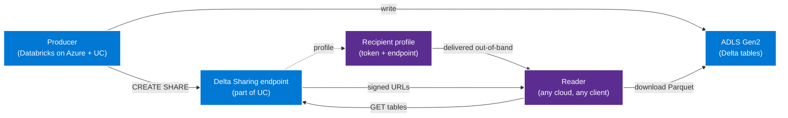

# How-to — share Delta tables across clouds with Delta Sharing

> **Comparative positioning note.** This document is written from the
> perspective of Microsoft Azure, Cloud Scale Analytics, and CSA Loom. Any
> description of third-party or competing products, services, pricing, or
> capabilities is derived from **publicly available documentation and sources**
> believed accurate at the time of writing, and is provided for **general
> comparison only**. We do not claim expertise in, or authority over, any
> non-Microsoft product or service; the respective vendor's official
> documentation is the authoritative source for their offerings, which may
> change over time. Nothing here is intended to disparage any vendor — where a
> competing product has genuine advantages, we aim to note them honestly.
> Verify all third-party details against the vendor's current official
> documentation before making decisions.


Delta Sharing is the open, zero-copy protocol for cross-cloud
table sharing. The producer exposes a share endpoint; the
reader pulls Parquet files directly from the producer's storage
account. **The producer pays no egress** because the reader is the
network initiator. Any compliant client in any cloud can read.

This runbook covers two flavors:

- **Databricks-to-Databricks (Unity Catalog)** — the easiest
  case; secured via UC principals across workspaces in any cloud.
- **Open Delta Sharing (recipient-token)** — the broader case;
  any compliant client including Power BI, pandas, Spark, Trino,
  a custom REST client.

**Time to complete:** 30-60 minutes.
**Prerequisites:** Producer Databricks workspace on Azure with
Unity Catalog enabled; a Delta table written to UC.

## Architecture — open Delta Sharing



## Path A — Databricks-to-Databricks (Unity Catalog)

This is the easiest case. The producer's UC metastore exposes
the share to the recipient's UC metastore as a UC-native
catalog. No tokens, no profiles — UC principal identity flows
end to end.

### A1 — Confirm both sides are on Unity Catalog

Both producer and recipient workspaces must be UC-enabled. (UC
is the Databricks default since 2024.)

### A2 — Producer creates the share

In a producer notebook or SQL editor:

```sql
-- Create the share container
CREATE SHARE crosscloud_finance_share
  COMMENT 'Gold-layer finance tables for cross-cloud consumers';

-- Add tables to the share
ALTER SHARE crosscloud_finance_share
  ADD TABLE main.finance.fact_sales;

ALTER SHARE crosscloud_finance_share
  ADD TABLE main.finance.dim_customer;

-- Optional: add a schema in bulk
ALTER SHARE crosscloud_finance_share
  ADD SCHEMA main.finance;
```

### A3 — Producer grants the recipient

Identify the recipient's UC metastore by its **sharing identifier**
(format: `<cloud>:<region>:<metastore-uuid>`). The recipient sends
this to the producer out of band.

```sql
-- Register the recipient (one-time)
CREATE RECIPIENT recipient_aws_finance
  USING ID 'aws:us-east-1:00000000-0000-0000-0000-000000000000'
  COMMENT 'AWS finance team Databricks workspace';

-- Grant the share to the recipient
GRANT SELECT ON SHARE crosscloud_finance_share
  TO RECIPIENT recipient_aws_finance;
```

### A4 — Recipient mounts the share as a catalog

In the recipient's workspace (on AWS, GCP, or another Azure
tenant):

```sql
-- The producer share appears in the recipient's UC as a provider
SHOW PROVIDERS;

-- Mount the share as a catalog
CREATE CATALOG IF NOT EXISTS shared_finance
  USING SHARE `<producer-metastore-id>.crosscloud_finance_share`;

-- Query as normal
SELECT * FROM shared_finance.finance.fact_sales LIMIT 100;
```

The recipient queries the table; Parquet files stream from the
producer's ADLS Gen2 across the Megaport spine (or public
internet) to the recipient's compute.

## Path B — Open Delta Sharing (recipient-token)

This is the broader case. The recipient is not Databricks —
maybe Power BI, pandas, Trino, or a custom client. The producer
issues a **recipient profile** file containing a bearer token
and the share endpoint; the recipient configures any compliant
Delta Sharing client with it.

### B1 — Producer creates the share (same as A2)

### B2 — Producer creates an open recipient

```sql
-- Open recipient (token-based)
CREATE RECIPIENT recipient_powerbi_finance
  COMMENT 'Power BI team — open Delta Sharing client';

-- Grant the share
GRANT SELECT ON SHARE crosscloud_finance_share
  TO RECIPIENT recipient_powerbi_finance;
```

### B3 — Producer activates and downloads the profile

```sql
-- Generate the activation link
DESCRIBE RECIPIENT recipient_powerbi_finance;
```

Output includes an `activation_link`. Visit the link → download
the profile file (`config.share`) → deliver it to the recipient
via secure channel (Entra-issued file share, encrypted email).

The profile is a small JSON containing:

```json
{
  "shareCredentialsVersion": 1,
  "bearerToken": "...",
  "endpoint": "https://<region>.azuredatabricks.net/api/2.0/delta-sharing/metastores/...",
  "expirationTime": "2027-05-27T00:00:00Z"
}
```

### B4 — Recipient configures the client

**Python with the `delta-sharing` library:**

```python
import delta_sharing

profile_path = "/path/to/config.share"
client = delta_sharing.SharingClient(profile_path)

# List shares + tables
for share in client.list_shares():
    for schema in client.list_schemas(share):
        for table in client.list_tables(schema):
            print(f"{share.name}.{schema.name}.{table.name}")

# Load as a pandas DataFrame
df = delta_sharing.load_as_pandas(
    f"{profile_path}#share_name.schema_name.table_name"
)
```

**Spark on any cloud:**

```python
df = spark.read.format("deltaSharing").load(
    f"{profile_path}#share_name.schema_name.table_name"
)
df.show()
```

**Power BI:**
1. Get Data → Delta Sharing.
2. Provide the endpoint URL + bearer token (from the profile).
3. Power BI lists the available tables; select and import or
   DirectQuery.

**Trino with Delta Sharing connector:**

```properties
# catalog/deltashare.properties
connector.name=delta-lake-sharing
delta-sharing.profile-path=/path/to/config.share
```

## Token rotation

Recipient bearer tokens have an expiration (default 365 days). At
60 days before expiration:

```sql
-- Rotate the recipient token
ALTER RECIPIENT recipient_powerbi_finance ROTATE TOKEN;
DESCRIBE RECIPIENT recipient_powerbi_finance;
-- New activation link → new profile → distribute to recipient
```

Recipients keep working on the old token until expiration; rotation
gives them a window to swap profiles.

## Egress + cost notes

- **Producer egress = whatever the reader downloads.** Delta
  Sharing streams Parquet bytes from the producer's storage
  account to the reader's network address. Azure egress applies
  per Azure pricing.
- **Reader pulls only what queries touch.** Delta's
  partition-pruning and predicate-pushdown apply through the
  share — a `WHERE region = 'us-east'` clause skips other
  partitions entirely.
- **Use the private spine.** If the reader is in AWS or GCP and
  the volume is non-trivial, route through Megaport / Equinix
  (see [network best practices](../best-practices/network.md)).
  Egress over the private spine is roughly 60-80% cheaper than
  public-internet egress.

## Anti-patterns

- **Sharing the storage account directly via SAS.** This bypasses
  the share metadata, audit log, and revocation flow. Always go
  through the share + recipient.
- **Embedding profiles in source code.** The bearer token grants
  data access. Store the profile in Key Vault or equivalent;
  inject at runtime.
- **Sharing entire schemas without curation.** Adds tables you
  did not intend to share when they get created. Prefer
  per-table grants for sensitive workloads.

## Verification

- [ ] Producer `SHOW SHARES` lists the share.
- [ ] Producer `SHOW GRANTS ON SHARE` shows the recipient.
- [ ] Recipient can list tables and read rows.
- [ ] Producer audit log shows the recipient's reads.
- [ ] Profile file is stored encrypted, not in version control.

## Related

- [Best practice — multi-cloud data](../best-practices/data.md)
- [Whitepaper — multi-cloud architecture](../whitepaper.md)
- [Best practice — multi-cloud network](../best-practices/network.md)
