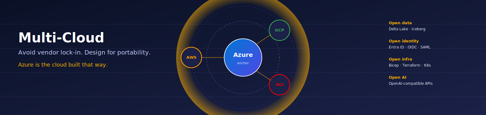
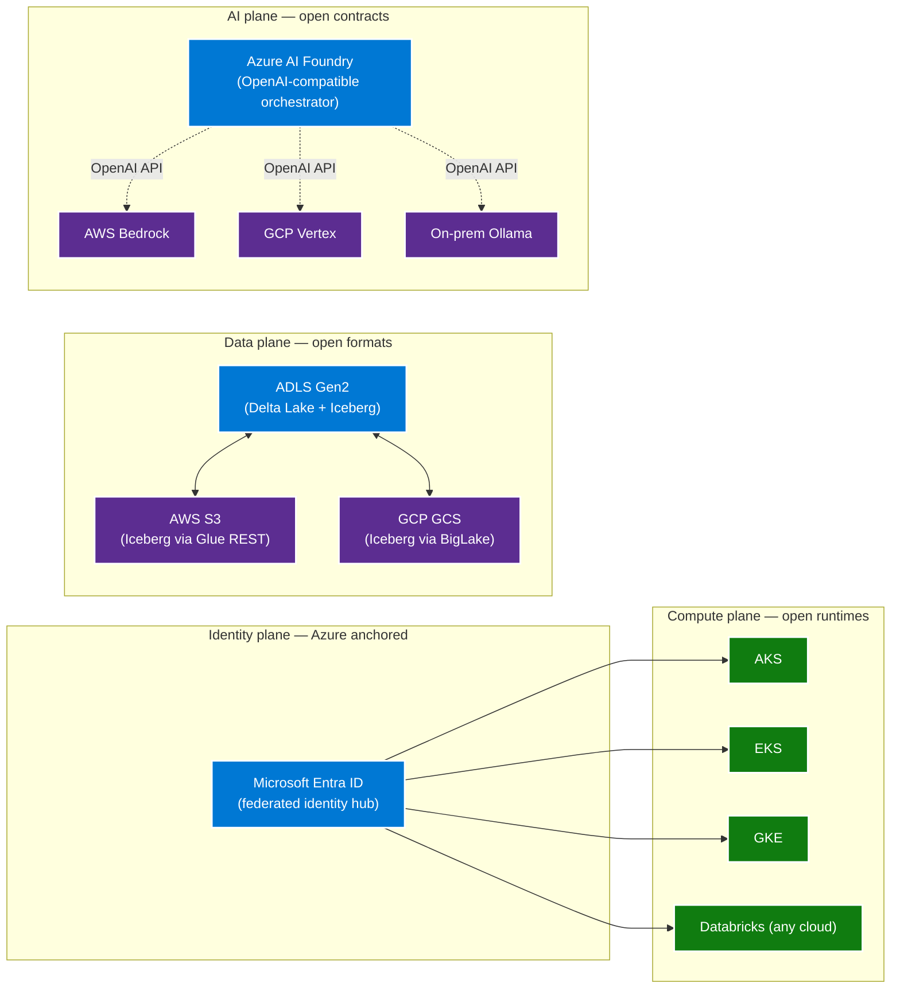

# Multi-Cloud

> **Comparative positioning note.** This document is written from the
> perspective of Microsoft Azure, Cloud Scale Analytics, and CSA Loom. Any
> description of third-party or competing products, services, pricing, or
> capabilities is derived from **publicly available documentation and sources**
> believed accurate at the time of writing, and is provided for **general
> comparison only**. We do not claim expertise in, or authority over, any
> non-Microsoft product or service; the respective vendor's official
> documentation is the authoritative source for their offerings, which may
> change over time. Nothing here is intended to disparage any vendor — where a
> competing product has genuine advantages, we aim to note them honestly.
> Verify all third-party details against the vendor's current official
> documentation before making decisions.

{ .architecture-hero loading="eager" }

!!! quote "The thesis"
    Multi-cloud is **not** having everything in all clouds. It is
    **avoiding vendor lock-in** and designing/architecting solutions
    that allow you to run workloads on any provider. Azure is the
    cloud that designs and architects it that way.

The most common multi-cloud failure is treating it as a procurement
exercise — buy AWS for one workload, GCP for another, Azure for a
third, and call it diversified. That is not multi-cloud. That is
**multi-lock-in**. You now have three vendors holding three pieces
of your business hostage instead of one.

Real multi-cloud is an **architectural posture**. It means every
critical design decision — table format, identity, infrastructure
definition, model API contract, networking — is made against
**open standards** so any workload can be lifted to any provider
on competitive terms. Azure is uniquely positioned for this because
its primary anchor services (Entra ID, ADLS Gen2 + Delta/Iceberg,
Bicep + Terraform, AI Foundry over OpenAI-compatible APIs,
AKS + Arc) are built around the same open standards that AWS, GCP,
Oracle, and on-prem platforms already speak.

This section explains the thesis, the reference architecture, and
the concrete patterns for getting there.

## Where to start

-   :material-help-circle: [**What is multi-cloud?**](what-is-multi-cloud.md)

    The thesis page. Define vendor lock-in, the three locks (data,
    identity, infrastructure), and how Azure-led architecture defeats
    each.

-   :material-file-document: [**Whitepaper**](whitepaper.md)

    The full argument — five myths, three locks, reference
    architecture, Azure as the core, data + AI + identity +
    governance + cost layers, adoption roadmap.

-   :material-account-key: [**Identity best practices**](best-practices/identity.md)

    Entra ID as the federation hub for AWS, GCP, OCI. Group naming,
    service principal patterns, breakglass strategy.

-   :material-database: [**Data best practices**](best-practices/data.md)

    Delta Lake and Apache Iceberg as portable table formats. Cross-cloud
    sharing via Delta Sharing and the Iceberg REST catalog.

-   :material-brain: [**AI best practices**](best-practices/ai.md)

    OpenAI-compatible API contracts so Azure OpenAI, AWS Bedrock,
    GCP Vertex, and on-prem Ollama plug into the same orchestrator.

-   :material-lan: [**Network best practices**](best-practices/network.md)

    ExpressRoute + Megaport / Equinix as the cross-cloud spine.
    Private Link parity across providers.

-   :material-shield-check: [**Governance best practices**](best-practices/governance.md)

    Purview + Unity Catalog cross-cloud catalog federation. Tag
    standards that propagate.

-   :material-book-open-variant: [**How-to runbooks**](how-to/federate-aws-to-entra-id.md)

    Step-by-step: federate AWS to Entra, federate GCP to Entra,
    share Delta tables across clouds, cross-cloud DR.

## The three locks (and how to break them)

| Lock | Vendor-specific form | Open form (Azure-anchored) |
|---|---|---|
| **Data format** | Redshift columnar, BigQuery Capacitor, Snowflake micro-partitions | Delta Lake or Apache Iceberg on ADLS Gen2 — readable by any compute engine |
| **Identity** | AWS IAM users, GCP local accounts, per-cloud SSO islands | Entra ID as the federated identity hub via SAML / OIDC |
| **Infrastructure** | CloudFormation, Google Deployment Manager, OCI Resource Manager | Bicep + Terraform — same authoring model, multiple providers |

The whitepaper walks each in depth.

## Reference architecture (at a glance)

## Related

- [ADR-0011 — Multi-Cloud Scope](../adr/0011-multi-cloud-scope.md)
- [ADR-0003 — Delta Lake over Iceberg](../adr/0003-delta-lake-over-iceberg-and-parquet.md)
- [Multi-Cloud Databricks (Azure as Core)](../build/guides/data-platforms/databricks-multi-cloud.md)
- [Decision tree — Delta vs Iceberg vs Parquet](../decisions/delta-vs-iceberg-vs-parquet.md)
