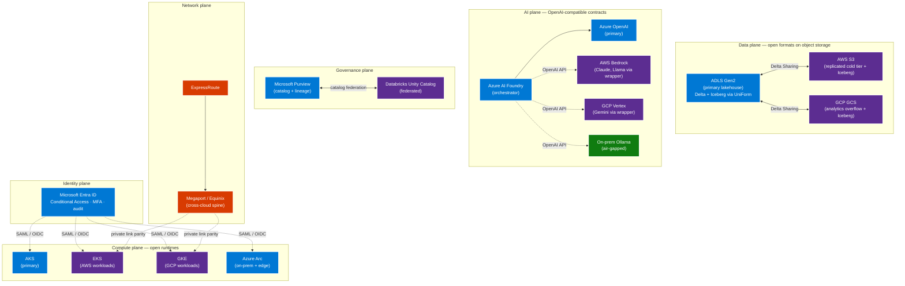

# Multi-Cloud — the architectural strategy

## Executive summary

Multi-cloud, done well, is the single most effective lever for
**bounded total cost of ownership and continuous negotiating
leverage** over a multi-year horizon. Done badly, it is the most
expensive operational tax an enterprise can self-inflict.

The difference between the two outcomes is not the number of
providers in the bill. It is whether the workload's load-bearing
dependencies — table format, identity, infrastructure definition,
container runtime, model API — are anchored to **open standards**
or to vendor-proprietary interfaces. Workloads anchored to open
standards can move. Workloads anchored to proprietary interfaces
cannot, regardless of how many clouds the bill spans.

This paper defends a specific architectural posture: **Azure as the
anchor cloud, with open standards as the load-bearing contract on
every plane.** Entra ID is the federated identity hub. ADLS Gen2
hosting Delta Lake and Apache Iceberg is the data layer. Bicep and
Terraform are the IaC layer. Containers on AKS / EKS / GKE / Arc are
the compute layer. Azure AI Foundry exposing OpenAI-compatible
endpoints is the AI orchestration layer. Purview federated with
Unity Catalog is the governance layer.

The result is a deployment that runs primarily on Azure, ports
workload-by-workload to AWS / GCP / OCI on demand, federates
identity in a single audit log, and shares data across clouds
without paid egress for the table layout itself.

The rest of the paper develops this in five sections: the myths
worth rejecting, the three locks worth defeating, the reference
architecture, the Azure-as-anchor argument, and the
plane-by-plane working pattern (data, AI, identity, governance,
cost). It closes with an adoption roadmap.

## The five myths of multi-cloud

### Myth 1 — Multi-cloud means redundancy

The most common myth is that multi-cloud is a high-availability
strategy. "If AWS goes down we fail over to Azure." This is
almost always wrong. Cross-cloud failover requires synchronous
data replication, identity replication, network path replication,
and operational runbook replication. The cost of that
infrastructure exceeds the cost of in-region HA by an order of
magnitude, and the failover itself is rarely tested because the
test is so disruptive. Single-cloud workloads with proper
region-pair HA and cross-region DR are more available, more
testable, and cheaper than cross-cloud failover. Multi-cloud is
not a redundancy strategy. It is a **portability** strategy.

### Myth 2 — Multi-cloud means duplication

The corollary myth is that multi-cloud means deploying every
workload to every cloud. This delivers the worst of every world:
N copies of the data, N parallel deployments to maintain, N egress
bills, and zero ability to move because each deployment has drifted
into provider-specific shapes. Real multi-cloud is **single-active
with portable architecture**, not many-active with duplicate
operations.

### Myth 3 — Multi-cloud means best-of-breed shopping

"Buy the best of each category from whichever cloud has it." This
ends with Redshift over here, BigQuery over there, Snowflake in a
third corner, and four months of integration work to make them
talk. It also defeats the leverage you wanted — once each workload
has built deep ties to its provider, you cannot consolidate, and
the providers know it.

Best-of-breed is a defensible posture **inside a single open
standard**. Choose Databricks on Azure vs. Databricks on AWS based
on price and proximity, because the workload is the same Delta
tables and the same notebooks. Do not choose Redshift vs.
BigQuery, because the workload then forks.

### Myth 4 — Multi-cloud means negotiating leverage automatically

Leverage is only real if you can actually move. A multi-cloud
contract you cannot execute under is theatre. The leverage comes
from the **portable architecture**, not the multi-vendor bill.
Three providers and no portability gives you zero leverage. One
provider and full portability gives you full leverage.

### Myth 5 — Multi-cloud means a cloud-agnostic platform

"We will build our own abstraction layer over all three clouds."
This is the most expensive engineering project an enterprise can
undertake, and it almost always fails. The abstraction layer
lags every provider's roadmap, hides every provider's optimizations,
adds operational surface area, and becomes its own lock-in (now you
cannot migrate off your internal platform). The correct answer is
to **adopt the open standards that already cross clouds** —
Delta / Iceberg, Entra federation, Terraform, OpenAI-compatible
APIs, Kubernetes — and lean into them. The abstraction layer
already exists; it is the open standard.

## The three locks (in depth)

### Lock 1 — Data format

Every database has a storage layout. The question is whether that
layout is a **vendor secret** or an **open specification**.

Vendor-secret layouts include Redshift columnar, BigQuery
Capacitor, Snowflake micro-partitions, Synapse dedicated SQL
columnstore, and Oracle exadata segments. Once your data is in one
of these layouts, you cannot read it from another engine. You can
only **extract and reload**, which means a full table scan, a
serialization step (usually to CSV or Parquet), an export to object
storage, and a re-ingest on the other side. For a multi-petabyte
warehouse, this is a six-to-eighteen-month migration program. The
provider knows this. It is their leverage.

Open layouts include **Apache Parquet** (the columnar file format),
**Delta Lake** (Parquet plus a transaction log that gives ACID +
time travel + schema evolution), and **Apache Iceberg** (the same
properties via a different metadata layout). Both Delta and
Iceberg are open specifications maintained by the Linux Foundation.
Both are readable + writable by multiple engines:

| Engine | Delta | Iceberg |
|---|---|---|
| Databricks | Native | Read + write via UniForm |
| Synapse Serverless | Read | Read |
| Microsoft Fabric | Native via OneLake shortcuts | Read via OneLake shortcuts |
| Apache Spark (any cloud) | Native | Native |
| Trino / Starburst | Native | Native |
| Snowflake | Read (external tables) | Read + write |
| BigQuery | Read (BigLake) | Read + write (BigLake) |
| AWS Athena | Read | Native |
| Flink | Native | Native |

The right default is **Delta on Azure (because the entire Microsoft
stack reads and writes it natively) with UniForm enabled to expose
the same data as Iceberg** for downstream engines that prefer
Iceberg. The data sits in your ADLS Gen2 account. Any engine in any
cloud can read it. No extract-reload is ever required to change
engines.

### Lock 2 — Identity

Identity lock-in is the most insidious of the three because it
accretes silently. You start with two AWS IAM users for the
platform team. Three months later you have forty users, sixty
roles, and an internal-only console wiki. There is no audit story.
Offboarding is a checklist of N revocations across N consoles. New
applications onboard with cloud-local accounts because that is
what the docs say to do. You have built a second identity directory
parallel to your primary one, and you cannot untangle them.

The open form is **federated identity from Entra ID into each
cloud's IAM**:

- **AWS** — SAML 2.0 federation to IAM roles. An Entra group maps
  to an IAM role; users authenticate to Entra (with MFA + Conditional
  Access) and assume the role via STS. No long-lived AWS IAM users.
- **GCP** — Workload Identity Federation via OIDC. An Entra group
  maps to a GCP service account or principal binding. Same flow.
- **OCI** — SAML 2.0 federation to OCI groups. Same flow.

The result is one user, one MFA prompt, one Conditional Access
policy, one offboarding action, one audit log. The federation
itself is built on RFCs (SAML 2.0, OIDC, SCIM), not Microsoft
proprietary protocols, so the same pattern would work with Okta or
Keycloak as the hub. We anchor on Entra because most enterprises
already license it for Microsoft 365 and the Conditional Access
engine is the most mature in the market.

### Lock 3 — Infrastructure (control plane)

The third lock is in the authoring model for infrastructure. If
your platform team writes CloudFormation for AWS, Google Deployment
Manager for GCP, and OCI Resource Manager for OCI, you have three
disjoint skill ecosystems and three sets of modules. Migrating a
workload between clouds means re-authoring every module in the
target cloud's DSL.

The open form is **Bicep for Azure + Terraform (or Pulumi) for
cross-cloud**. Bicep is the right Azure-native authoring model
because it is concise, deterministic, ARM-backed, and skips the
state-file ceremony. Terraform is the right cross-cloud
authoring model because the provider abstraction means the same
author writes AWS, GCP, OCI, Datadog, GitHub, Cloudflare, and
vSphere modules in one tool with one state model. Pulumi is the
right answer if your team strongly prefers general-purpose
languages (TypeScript, Python, Go, C#) over HCL.

The discipline is to **never use a provider's bespoke
deployment DSL** (CloudFormation, Deployment Manager, OCI RM)
even when the documentation tells you to. The Terraform AWS,
GCP, and OCI providers cover essentially all of the same
resources with the same patterns the rest of your IaC already uses.

## Reference architecture

Each plane is independently swappable. The identity plane can move
to Okta without changing the data plane. The AI plane can swap a
model behind the OpenAI-compatible endpoint without changing the
compute plane. The data plane can add a new cloud's object store as
a Delta Sharing peer without changing the identity plane. **That
independence is what multi-cloud actually buys you.**

## Azure as the anchor — why

There are three credible candidates for anchor cloud: Azure, AWS,
and GCP. The argument for Azure is not that it is the largest or
the cheapest; it is that **its anchor services are themselves built
on the open standards we already chose**.

### Entra ID as the identity anchor

Entra ID is the identity service that already governs Microsoft
365, GitHub Enterprise (via integration), and every Microsoft
Azure resource. For most enterprises, Entra is already the largest
human-identity directory in the company. Federating AWS, GCP, and
OCI to Entra means **adding** to a directory that exists, instead
of standing up a new one parallel to it. The Conditional Access
engine that already protects Outlook and Teams now also protects
the AWS console and the GCP console. The same MFA prompt covers
everything. The same offboarding revokes everything. There is no
parallel directory to maintain.

The same is not true of AWS IAM Identity Center, Google Cloud
Identity, or Okta. They are credible identity hubs, but they
require **adding a directory parallel to** the Microsoft 365 one
that most enterprises already run. Entra wins on
operational-cost grounds.

### ADLS Gen2 as the data anchor

ADLS Gen2 is the storage layer that Databricks, Synapse, Fabric,
HDInsight, Stream Analytics, Power BI, Purview, and Azure ML all
default to. It is **the most-supported home for Delta and Iceberg
inside the Microsoft analytics ecosystem**, which is the ecosystem
most enterprises already run. S3 and GCS are equally good as
storage primitives — Delta and Iceberg work on all three — but
the analytics tooling that operates on the data has deeper
integration with ADLS Gen2.

The pragmatic pattern: **primary lakehouse on ADLS Gen2, with Delta
Sharing fan-out to S3 and GCS** for downstream readers in those
clouds. The data is canonical in one place; readers in other
clouds get a zero-egress shareable view.

### Bicep as the IaC anchor for Azure-native, Terraform for crossing

Bicep is the Microsoft-supported Azure-native IaC language and is
the right default for any Azure-only deployment. It compiles to
ARM, has first-class Azure-extension support (Bicep Registry,
linter, formatter), and skips the Terraform state-file
operational burden. **Terraform is the right second tool** for
anything that crosses clouds, because the AzureRM, AWS, GCP, and
OCI providers all share the same authoring model.

The decision rule: **single-cloud Azure resources → Bicep. Anything
that has to touch two clouds in one deployment → Terraform.** This
is not a contradiction; it is the right tool for the right scope.

### Azure AI Foundry as the AI orchestration anchor

Azure AI Foundry is the model-orchestration surface that exposes
**OpenAI-compatible chat-completions endpoints** to applications.
Any application written against the OpenAI SDK can target Azure
OpenAI, OpenAI directly, AWS Bedrock (via the Bedrock-OpenAI
wrapper), GCP Vertex (via the Vertex-OpenAI wrapper), Anthropic
direct, or on-prem Ollama with **no code change**. Foundry adds
content safety, evaluation, prompt flow, and tracing on top.

The choice of Foundry as anchor is not because Azure has the only
good models. It is because Foundry's surface is the same open
contract that every other model provider has converged on, and
because Foundry's surrounding tooling (content safety, evals,
prompt flow) is mature.

## The data layer — Delta + Iceberg in depth

### The case for Delta as primary

Delta Lake is the more mature of the two formats inside the
Microsoft / Databricks ecosystem. It has:

- Native read + write in Databricks, Synapse Serverless,
  Microsoft Fabric, Spark, and Trino
- The longest production track record (since 2019)
- Liquid clustering, change data feed, vacuum + optimize, deep
  clones, shallow clones, time travel
- Delta Sharing — the open zero-copy share protocol — built in
- UniForm, which exposes the same Delta table as readable Iceberg
  for downstream Iceberg-only engines

The case for Delta as primary: it does everything Iceberg does,
plus has a deeper integration with the analytics surfaces most
enterprises already run, plus has UniForm so Iceberg-only readers
are not blocked.

### The case for Iceberg as a secondary read surface

Iceberg has slightly different strengths — particularly in
multi-engine concurrent write scenarios and in the REST catalog
abstraction. Engines that prefer Iceberg natively include
Snowflake, BigQuery, AWS Glue / Athena, and Trino with the Iceberg
connector. The right pattern is to **expose Delta tables as
Iceberg via UniForm** so these engines can read them without a
separate copy.

If a workload's primary engine is Snowflake-native or
BigLake-native, write Iceberg directly. The tooling delta is real
but the format is open in both cases.

### Cross-cloud Delta Sharing

Delta Sharing is the protocol that turns a Delta table in one
storage account into a readable share for any compliant client.
The client can be Databricks (any cloud), Power BI, Tableau,
pandas, Spark, or a custom REST client. The share is **read-only,
audit-logged, and incurs zero egress on the producer side**
because the reader streams Parquet files directly from the
producer's storage. The producer grants share access via a
recipient identity (an Azure Storage SAS, a JWT, or — for
Databricks-to-Databricks — a Unity Catalog principal).

This is the pattern for cross-cloud data sharing. Primary lakehouse
on ADLS Gen2; readers in AWS, GCP, OCI, or on-prem mount the share
and consume the data. No replication, no egress (except for what
the reader pulls), no separate copy.

## The AI layer — OpenAI-compatible APIs

The model market converged on the OpenAI chat-completions contract
around 2024. Today:

- **Azure OpenAI** speaks it natively (it is OpenAI)
- **AWS Bedrock** speaks it via the Bedrock-OpenAI wrapper for
  Claude, Llama, and Titan
- **GCP Vertex** speaks it via the Vertex-OpenAI wrapper for
  Gemini and PaLM
- **Anthropic direct** speaks it via Anthropic's
  OpenAI-compatible endpoint
- **Ollama** speaks it natively for any local model (Llama,
  Mistral, Phi, etc.)
- **vLLM, TGI, LiteLLM** all speak it natively for self-hosted
  models

The right architecture is: **application talks OpenAI SDK; Foundry
routes to whichever backend the policy says to use today**. The
policy can be cost-based, latency-based, data-residency-based, or
model-quality-based. The application does not know which backend
it hit. Swapping models is a config change, not a code change.

## The identity layer — Entra federation patterns

The reference pattern for each cloud is in the
[how-to runbooks](how-to/federate-aws-to-entra-id.md). The
summary:

- **AWS** — Entra → SAML → AWS IAM Identity Center → permission
  sets → IAM roles. Entra group maps to permission set. No
  long-lived IAM users.
- **GCP** — Entra → OIDC → GCP Workload Identity Federation →
  service account or principal binding. Entra group maps to GCP
  group via SCIM.
- **OCI** — Entra → SAML 2.0 → OCI Identity domain → OCI group.
- **SaaS apps** — Entra → SCIM + OIDC. Standard pattern.

**Breakglass accounts** — every cloud needs at least one local
identity that does not depend on Entra, in case the federation
breaks. Two breakglass accounts per cloud, stored in a hardware
token vault, MFA via FIDO2 keys, used only for federation recovery.
Audit every login.

**Audit log centralization** — every cloud's audit log forwards
to a single SIEM. The recommended pattern is Microsoft Sentinel as
the SIEM because it ingests Entra, Azure, AWS CloudTrail, GCP
Cloud Audit, OCI Audit, and most SaaS logs out of the box. The
SIEM choice is itself swappable; what matters is the centralization.

## The governance layer — Purview + Unity Catalog federation

Purview is the Microsoft catalog and lineage surface. Unity
Catalog is the Databricks catalog surface (which Databricks runs
on Azure, AWS, and GCP). They federate via a bidirectional
metadata sync — Purview registers Unity Catalog as an external
catalog source; Unity Catalog reads Purview classifications and
sensitivity labels.

The result: a single catalog view across every cloud's data,
with lineage that crosses provider boundaries. The same
classification ("PII — personal identifiable information") tagged
in Purview shows up in Unity Catalog as a column-level enforcement
control. The same lineage that starts in an ADF pipeline shows the
downstream Databricks notebook even when the notebook runs on
AWS.

**Tag standards** must propagate across providers. The
recommended minimum:

- `Environment` — `prod` | `nonprod` | `dev`
- `DataClass` — `public` | `internal` | `confidential` | `restricted`
- `CostCenter` — finance code
- `Owner` — Entra group object ID
- `Workload` — workload name from the workload registry

These tags must be **propagated by automation**, not by humans.
Bicep / Terraform modules apply them on create; CI/CD enforces
them on update; FinOps tooling fails builds without them.

## Cost and sustainability

The classic cross-cloud cost trap is **egress for data
movement**. AWS, GCP, and OCI charge per GB egressed out of their
network. Azure does the same. A poorly designed multi-cloud
deployment can spend more on inter-cloud egress than on compute.
The mitigations:

1. **Keep the canonical data set in one place.** ADLS Gen2 is the
   recommended home. Other clouds read it via Delta Sharing
   (producer pays no egress because the reader pulls). Do not
   replicate full data sets across clouds.
2. **Use private interconnect for the spine.** ExpressRoute +
   Megaport (or Equinix Fabric) gives you a private path from
   Azure to AWS Direct Connect and GCP Cloud Interconnect at
   committed per-Mbps prices that are 60-80% below per-GB egress.
3. **Compute close to data.** Run analytics in the cloud that
   holds the data set. Do not pull data across clouds to compute
   it; push the compute to where the data lives.
4. **FinOps tags propagate.** Every resource in every cloud has
   the `CostCenter`, `Workload`, `Environment` tags applied by
   IaC. The FinOps dashboard joins on those tags across providers.

Sustainability follows the same logic: the lowest-carbon answer
is usually "do not move data across clouds." Compute next to data
also minimizes the carbon cost of network traversal.

## Adoption roadmap

A defensible adoption sequence for a greenfield multi-cloud
posture:

1. **Stand up Entra as the identity anchor.** Federate every cloud
   you currently touch (or plan to touch) to Entra in the first
   90 days. Decommission cloud-local users in parallel.
2. **Stand up ADLS Gen2 as the data anchor.** Migrate the
   warehouse tables to Delta. Enable UniForm so Iceberg-only
   readers are not blocked. Stand up Delta Sharing as the
   cross-cloud read surface.
3. **Stand up the IaC tooling.** Bicep for Azure-native. Terraform
   for anything crossing. Adopt the tag standard. Wire the FinOps
   dashboard to the propagated tags.
4. **Stand up Foundry as the AI orchestrator.** Route applications
   to OpenAI-compatible endpoints. Add Bedrock, Vertex, and
   on-prem Ollama as alternates behind Foundry's policy router.
5. **Federate Purview + Unity Catalog.** One catalog view, one
   lineage view. Tag propagation enforced by IaC.
6. **Stand up the network spine.** ExpressRoute + Megaport.
   Private Link parity to peer clouds. Sentinel as the SIEM.
7. **Practice cross-cloud DR.** Pick a non-critical workload.
   Cold-stand it up in a peer cloud. Run a DR drill quarterly.

After step 7, you have multi-cloud posture. The architectural
locks are broken. Every subsequent workload inherits the
posture by default.

## Conclusion

Multi-cloud is not a procurement strategy. It is an architectural
posture against vendor lock-in, anchored on open standards. Azure
is the right anchor because its first-class services — Entra,
ADLS Gen2, Bicep, AI Foundry, Purview — are themselves built
around the same open standards that AWS, GCP, OCI, and on-prem
already speak.

Pick the right anchors and the multi-cloud question becomes
small. Pick the wrong ones and it becomes the most expensive
engineering program in the company.
