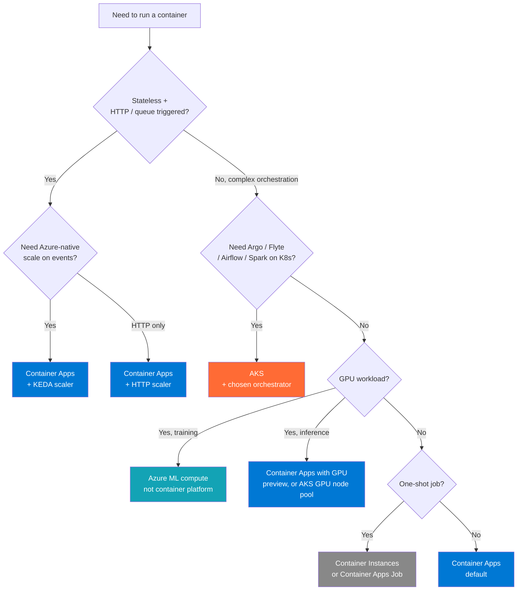

# Pattern — AKS & Container Apps for Data Workloads

> **TL;DR:** **Container Apps** for stateless / event-driven / KEDA-scaled data workloads (the new default). **AKS** when you need: Argo / Flyte / dbt-Airflow / Spark on K8s / GPU pools / pod-level networking control / multi-tenant isolation. Avoid AKS for "we just need to run a container" — Container Apps is simpler.

## Problem

Modern data platforms have workloads that don't fit neatly into Synapse / Databricks / Functions:

- Stream consumers that scale on queue depth (KEDA)
- Bioinformatics pipelines (Nextflow, WDL, Snakemake)
- Spark on K8s for cost optimization vs Databricks
- Argo Workflows for DAG orchestration
- dbt + Airflow / Dagster orchestration
- Custom ML training that doesn't fit Azure ML
- Long-running stateful agents (multi-step LLM workflows)

You have three Azure container platforms: **Container Instances** (simplest), **Container Apps** (managed serverless), **AKS** (full Kubernetes). Choose right.

## Decision tree



## Pattern 1: KEDA-driven stream consumer (Container Apps)

For Event Hubs / Service Bus / Cosmos change feed consumers that should scale to zero when idle:

```bicep
resource consumer 'Microsoft.App/containerApps@2024-03-01' = {
  name: 'eh-consumer'
  properties: {
    configuration: {
      ingress: null  // No HTTP ingress, internal only
      secrets: [
        {
          name: 'eh-conn'
          keyVaultUrl: 'https://kv.../secrets/eh-conn'
          identity: 'system'
        }
      ]
    }
    template: {
      containers: [
        {
          name: 'consumer'
          image: 'mcr.microsoft.com/yourorg/eh-consumer:1.0'
          env: [
            { name: 'EH_CONNECTION', secretRef: 'eh-conn' }
            { name: 'EH_NAME', value: 'orders' }
          ]
          resources: { cpu: 0.5, memory: '1Gi' }
        }
      ]
      scale: {
        minReplicas: 0
        maxReplicas: 30
        rules: [
          {
            name: 'eh-scaler'
            custom: {
              type: 'azure-eventhub'
              metadata: {
                eventHubName: 'orders'
                consumerGroup: 'consumer-group'
                unprocessedEventThreshold: '1000'
              }
              auth: [{ secretRef: 'eh-conn', triggerParameter: 'connection' }]
            }
          }
        ]
      }
    }
  }
}
```

Container Apps + KEDA = **scale to zero** when no events, **scale to N** when queue grows.

## Pattern 2: AKS for Argo Workflows (DAG orchestration)

When ADF / Fabric Data Pipelines / dbt-airflow aren't a fit (bioinformatics, complex retry/branching, file-based DAGs):

```yaml
# aks-cluster.bicep summary
apiVersion: argoproj.io/v1alpha1
kind: Workflow
metadata:
    name: variant-calling-
spec:
    entrypoint: variant-pipeline
    templates:
        - name: variant-pipeline
          steps:
              - - name: align
                  template: bwa
              - - name: call-variants
                  template: gatk
              - - name: annotate
                  template: vep

        - name: bwa
          container:
              image: biocontainers/bwa:latest
              command: [bwa, mem, ...]
              resources:
                  requests: { memory: 16Gi, cpu: "8" }
```

AKS + Argo gives you K8s-native DAG orchestration with bioinformatics container ecosystem.

## Pattern 3: AKS for Spark on K8s

Cost-optimization alternative to Databricks for Spark workloads:

- Spot node pools (60-90% discount)
- Per-second billing, no DBU markup
- Full control over Spark config
- Kubernetes-native scheduling

Trade-offs:

- You operate it (vs Databricks managing for you)
- No Photon (Databricks-proprietary)
- No managed Unity Catalog
- More YAML, more breakage

**Use only when**: cost is the dominant driver, Spark expertise is in-house, and you have K8s ops capacity.

## Pattern 4: Container Apps Jobs for batch

For one-shot batch jobs (e.g., nightly aggregation, data quality scan):

```bicep
resource job 'Microsoft.App/jobs@2024-03-01' = {
  name: 'nightly-dq-scan'
  properties: {
    configuration: {
      triggerType: 'Schedule'
      scheduleTriggerConfig: {
        cronExpression: '0 2 * * *'  // 2am daily
        parallelism: 1
      }
    }
    template: {
      containers: [{
        image: 'mcr.../dq-scanner:1.0'
        resources: { cpu: 1, memory: '2Gi' }
      }]
    }
  }
}
```

Cheaper than running a Container App 24/7. Better than Functions when execution time can exceed Functions limits.

## When NOT to use containers

| Workload                          | Better choice                                         |
| --------------------------------- | ----------------------------------------------------- |
| Spark jobs at scale               | Databricks (managed) or Synapse Spark                 |
| Functions / event handlers <10min | Azure Functions                                       |
| ML training                       | Azure ML compute clusters                             |
| Stored procs / SQL transforms     | Synapse / Fabric / Databricks SQL — not in containers |
| Long-running stateful (>24h)      | AKS only; stateful sets aren't a Container Apps fit   |

## Cost comparison (rough, 2026)

| Platform                     | $/cpu-hour                 | Notes                                    |
| ---------------------------- | -------------------------- | ---------------------------------------- |
| Container Instances          | ~$0.045                    | Simplest, no orchestration               |
| Container Apps (Consumption) | ~$0.04 + per-request       | Free idle                                |
| Container Apps (Dedicated)   | ~$0.05                     | Fixed capacity, no scale-to-zero penalty |
| AKS (B2ms node)              | ~$0.025 (with bin-packing) | You manage cluster ops                   |
| AKS (Spot D4s_v5)            | ~$0.01 (varies)            | Eviction risk; great for batch           |
| AKS (GPU NC6s_v3)            | ~$3.06                     | Always rounded to full GPU               |

AKS is cheaper per CPU when you bin-pack well; Container Apps wins on operational simplicity and scale-to-zero.

## Common pitfalls

| Pitfall                                                           | Mitigation                                              |
| ----------------------------------------------------------------- | ------------------------------------------------------- |
| Choosing AKS "for flexibility" without ops capacity               | Container Apps unless you have a real reason            |
| Container Apps for long-stateful workloads                        | Use AKS StatefulSets                                    |
| Spark on K8s without Photon expectations met                      | If perf matters, Databricks is faster despite cost      |
| GPU on AKS without GPU node pool taint/toleration                 | Pods schedule on CPU nodes, training silently CPU-bound |
| KEDA scaler with low min-replicas + cold-start sensitive workload | Keep min=1 to avoid cold starts on first event          |
| Not using node taints for spot pools                              | Critical workloads land on spot, get evicted, fail      |

## Related

- [Reference Architecture — Hub-Spoke](../reference-architecture/hub-spoke-topology.md) (where AKS / Container Apps fit)
- [Pattern — Streaming & CDC](streaming-cdc.md) (KEDA-scaled consumers)
- [Best Practices — Cost Optimization](../best-practices/cost-optimization.md)
- [Industries — Manufacturing](../industries/manufacturing.md) (bioinformatics-style pipelines)
- Azure Container Apps docs: https://learn.microsoft.com/azure/container-apps/
- AKS Production Baseline: https://learn.microsoft.com/azure/architecture/reference-architectures/containers/aks/baseline-aks
