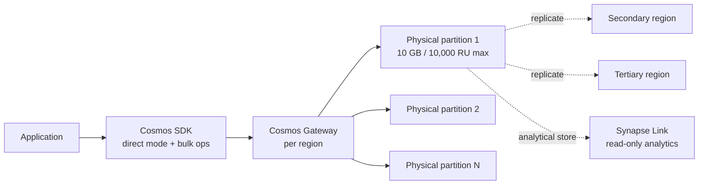

# Pattern — Cosmos DB

> **TL;DR:** Pick **NoSQL API** for greenfield, **MongoDB / Cassandra / PostgreSQL** APIs only when migrating those workloads. Use **autoscale RU/s** for spiky traffic, **provisioned RU/s** for predictable. Get the **partition key right the first time** — you can't change it without recreating the container. Enable **Synapse Link** if you need analytics over the same data without copying it.

## Problem

Cosmos DB is the right choice when you need **single-digit millisecond latency at any scale**, **multi-region writes**, or **flexible schema** for high-cardinality / heterogeneous workloads. But it's expensive when designed wrong, and the wrong partition-key decision is **permanent**.

## Architecture



## Pattern: pick the right API

| API                    | Use for                                                                                      |
| ---------------------- | -------------------------------------------------------------------------------------------- |
| **NoSQL** (default)    | Greenfield workloads. Best perf, best feature set, native to Cosmos                          |
| **MongoDB API**        | Migrating MongoDB apps. Drop-in for most MongoDB drivers; some perf trade-offs               |
| **Cassandra API**      | Migrating Cassandra apps. Good for time-series and wide-column patterns                      |
| **PostgreSQL** (Citus) | Distributed PostgreSQL. Different product really — choose for HTAP / multi-tenant SaaS       |
| **Gremlin** (graph)    | Graph traversal workloads. Often supplanted by GraphRAG patterns over a relational store now |
| **Table**              | Migrating Azure Table Storage. Better consistency + perf than Table Storage                  |

## Pattern: partition key design

The single most important decision. Goals:

1. **High cardinality** (millions+ distinct values)
2. **Even access distribution** (no hot partition)
3. **Stable** (doesn't change after creation — you cannot update a partition key value)
4. **Aligned with your read pattern** (most queries should target one partition)

### Examples

| Workload                                          | Good partition key                             | Bad partition key                             |
| ------------------------------------------------- | ---------------------------------------------- | --------------------------------------------- |
| User events / activity                            | `userId`                                       | `eventType` (low cardinality)                 |
| Multi-tenant SaaS                                 | `tenantId` (if tenants are similar size)       | `region` (low cardinality)                    |
| IoT sensor readings                               | `deviceId`                                     | `sensorType`                                  |
| Order management                                  | `customerId` (if reads are by customer)        | `orderStatus` (small cardinality, hot status) |
| Time-series at extreme scale                      | Synthetic: `${deviceId}-${dayBucket}`          | `timestamp` (hot recent partition)            |
| Mixed multi-tenant where tenants vary 1M× in size | Hierarchical: `tenantId/userId` (subpartition) | `tenantId` alone (mega-tenant becomes hot)    |

If you can't find a good single-key, use a **synthetic key** (`region#date`, `customerId#year`) or **hierarchical partitioning** (preview).

## Pattern: consistency level

| Level                 | Latency     | Use for                                                           |
| --------------------- | ----------- | ----------------------------------------------------------------- |
| **Strong**            | Highest     | Financial transactions, anything requiring strict linearizability |
| **Bounded staleness** | Medium-high | Most workloads where you want predictable max staleness window    |
| **Session** (default) | Medium      | User-facing apps; "read your own writes" within a session token   |
| **Consistent prefix** | Low         | Append-only logs, event streams                                   |
| **Eventual**          | Lowest      | Analytics, aggregations, anywhere staleness doesn't matter        |

**Default is Session** — start there. Tighten only when you have a real consistency requirement; loosen only when you've proven you can tolerate it.

## Pattern: throughput model

| Model                        | Use for                                                               |
| ---------------------------- | --------------------------------------------------------------------- |
| **Autoscale RU/s** (default) | Spiky workloads, dev environments, anything where peak ≠ steady-state |
| **Provisioned RU/s**         | Predictable steady-state where autoscale's 10x range is wasteful      |
| **Serverless**               | Dev, low-volume workloads (<5,000 RU/s peak), sandbox                 |

**Autoscale costs ~50% more per RU than provisioned** — but pays for itself if your peak/avg ratio >2×.

## Pattern: TTL for cost control

```json
{
    "id": "session-12345",
    "userId": "user-7890",
    "data": "...",
    "ttl": 86400 // expires in 24 hours
}
```

Setting `ttl` on documents is **free** and **automatic** (no RU cost for deletes). Use it for:

- Session data
- Cache documents
- Streaming events past their analytical window
- Soft-deleted records (set TTL to grace period)

## Pattern: Synapse Link (HTAP)

Cosmos has an **analytical store** that's a separate columnar copy auto-synced from the transactional store. Pros:

- Zero-RU impact on transactional workload
- Auto-synced (~2 minute lag)
- Queryable from Synapse Spark / Synapse SQL Serverless
- Eliminates "ETL Cosmos to lakehouse for analytics"

Enable when:

- You want analytics over current Cosmos data without copying
- Daily sync is fine (don't need sub-second analytical fresh)
- Cost is acceptable (analytical store has its own storage cost; queries cost from Synapse)

## Pattern: change feed → Event-driven

Cosmos has a **change feed** (CDC built in). Use it for:

- Materialized views (write to Cosmos → change feed → derived view in Cosmos)
- Event-driven downstream (change feed → Function → Event Hubs → consumer)
- Cache invalidation (change feed → invalidate Redis)

Better than polling. Cheaper than CDC tools. Use the **Change Feed Processor library** (Java, .NET, Python) or **Azure Functions Cosmos Trigger**.

## Cost optimization checklist

- [ ] Right consistency level (Session is the default for a reason)
- [ ] Autoscale only for spiky workloads
- [ ] TTL on time-bounded documents
- [ ] **Indexing policy tuned** — exclude paths you never query (default indexes everything → expensive)
- [ ] Use Synapse Link instead of cross-Cosmos analytics queries
- [ ] Avoid cross-partition queries in user-facing paths (always include partition key)
- [ ] Bulk operations for inserts (10x cheaper than individual inserts)
- [ ] Reserved capacity for predictable workloads (significant discount)

## Common pitfalls

| Pitfall                                           | Mitigation                                                                              |
| ------------------------------------------------- | --------------------------------------------------------------------------------------- |
| Wrong partition key picked at design time         | **Cannot be changed** — recreate container with right key, migrate data via change feed |
| Default indexing policy on a write-heavy workload | Tune indexing policy; exclude unused paths                                              |
| Cross-partition queries in user-facing paths      | Always include partition key in WHERE clause                                            |
| Strong consistency by default                     | Use Session unless you have a specific reason                                           |
| Cosmos for analytics workloads                    | Use Synapse Link OR copy to ADLS Delta nightly                                          |
| Multi-region writes for "DR"                      | Multi-region writes is for active-active, not DR. For DR, use single-write + failover   |
| Single physical partition (>10K RU/s for >10GB)   | Will get throttled — repartition with better key                                        |

## Related

- [Reference Architecture — Data Flow](../reference-architecture/data-flow-medallion.md) (where Cosmos fits in the medallion)
- [Pattern — Streaming & CDC](streaming-cdc.md) (Cosmos change feed integration)
- [Best Practices — Performance Tuning](../best-practices/performance-tuning.md)
- [Best Practices — Cost Optimization](../best-practices/cost-optimization.md)
- Cosmos modeling docs: https://learn.microsoft.com/azure/cosmos-db/nosql/modeling-data
- Cosmos partitioning docs: https://learn.microsoft.com/azure/cosmos-db/partitioning-overview
