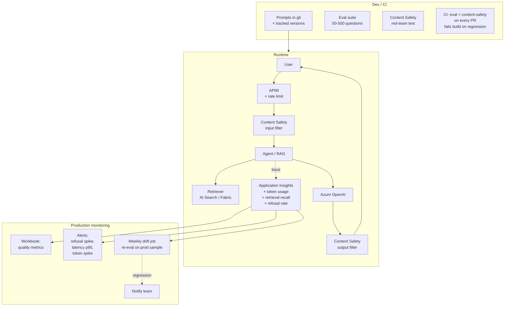

# Pattern — LLMOps & Evaluation

> **TL;DR:** Treat your prompts, retrievers, and agents like code: **version-controlled**, **eval-on-PR**, **content-safety-guarded**, **drift-monitored** in production. The platform pattern is **Azure AI Content Safety in front**, **eval suite in CI**, **Application Insights telemetry**, **periodic drift detection** against a holdout set.

## Problem

LLM features fail differently from traditional ML:

- Prompts work in dev, fail in prod with real distributions
- Models change underneath you (Azure OpenAI version updates)
- Retrievers go stale as the corpus changes
- Agents loop, hallucinate, refuse legitimate requests, comply with adversarial ones
- "It works for the demo" ≠ "it works for 10,000 users / day"

LLMOps is **MLOps + content safety + retrieval health + agent observability** — and most teams underinvest until production breaks.

## Architecture



## Pattern: prompts in git

Treat prompts like SQL — version-controlled, code-reviewed, tested:

```
prompts/
  triage/
    v1.txt              # initial
    v2.txt              # current
    eval/
      questions.jsonl   # 100 representative inputs + expected_topic
      adversarial.jsonl # 50 prompt-injection / jailbreak attempts
```

Don't store prompts in app config or environment variables — they belong in git with PR review.

## Pattern: eval-on-PR

Every PR that touches a prompt, retriever, or model selection runs:

```yaml
# .github/workflows/llm-evals.yml
name: LLM Evals
on:
  pull_request:
    paths: ['prompts/**', 'apps/copilot/**']

jobs:
  eval:
    steps:
      - run: |
          python -m apps.copilot.evals.runner \
            --prompts prompts/triage/v2.txt \
            --questions prompts/triage/eval/questions.jsonl \
            --baseline reports/triage-baseline.json \
            --threshold 0.85 \
            --output reports/triage-pr.json

      - run: |
          python -m apps.copilot.evals.compare \
            --baseline reports/triage-baseline.json \
            --candidate reports/triage-pr.json \
            --max-regression 0.05  # fail if quality drops >5%
```

The baseline is committed to the repo and updated when a PR is merged with intentional improvements.

See [`apps/copilot/evals/`](https://github.com/fgarofalo56/csa-inabox/tree/main/apps/copilot/evals) for the platform's eval framework.

## Pattern: eval framework choice

| Framework | Use for |
|-----------|---------|
| **Azure AI Evaluation** (Foundry) | Native Azure integration, GPT-as-judge metrics, RAI evaluation |
| **Promptfoo** | Lightweight, YAML-based, great for local + CI iteration |
| **DeepEval** | Python-native, pytest integration, robust assertions |
| **RAGAS** | RAG-specific metrics (faithfulness, context precision/recall) |
| **TruLens** | RAG + agent observability with feedback functions |
| **Custom (in-platform)** | When metric is domain-specific and standardized frameworks miss it |

The platform ships a custom framework under `apps/copilot/evals/` because docs-Q&A has specific metrics (citation quality, refusal calibration). Most teams should use **Promptfoo + Azure AI Evaluation** as the starting combo.

## Pattern: content safety in front and behind

Both input AND output go through Azure AI Content Safety:

```python
from azure.ai.contentsafety import ContentSafetyClient

cs = ContentSafetyClient(...)

def chat(user_input: str) -> str:
    # 1. Input filter — block obvious adversarial / harmful
    in_check = cs.analyze_text(user_input)
    if max(in_check.categories.values()) >= "Medium":
        return "I can't help with that."

    # 2. Generate
    response = aoai.chat_completions.create(...)

    # 3. Output filter — block harmful generation (rare but happens)
    out_check = cs.analyze_text(response)
    if max(out_check.categories.values()) >= "Medium":
        log_filtered_output(...)
        return "Let me try that again. [refusal]"

    return response
```

For RAG / agent surfaces, also add **prompt injection detection** (Azure AI Content Safety includes this) on retrieved context.

## Pattern: retrieval health monitoring

For RAG systems, the retriever is half the quality story. Monitor:

| Metric | Why | Healthy threshold |
|--------|-----|-------------------|
| **Recall@K** on eval set | "Does it find the right docs?" | >0.8 for K=5 |
| **Citation precision** | "Of cited docs, how many were actually used?" | >0.7 |
| **Empty retrieval rate** | "How often does it return nothing relevant?" | <5% |
| **Latency p95** | UX | <300ms for retrieval |
| **Index freshness** | Stale indexes degrade quality silently | Match SLA per corpus |

When recall drops, you usually need: **better embeddings**, **better chunking**, **hybrid search (vector + keyword)**, or **reranking**.

## Pattern: production telemetry

Every chat / agent invocation emits a structured trace to Application Insights:

```json
{
  "request_id": "req-abc123",
  "user_id_hash": "...",
  "input_tokens": 250,
  "output_tokens": 180,
  "model": "gpt-4o-mini",
  "model_version": "2024-07-18",
  "retrieved_doc_ids": ["doc-1", "doc-7"],
  "retrieved_doc_count": 2,
  "latency_ms": 1240,
  "content_safety_input_severity": "safe",
  "content_safety_output_severity": "safe",
  "agent_iterations": 1,
  "tools_called": ["search_docs"],
  "outcome": "success",
  "user_thumbs": null  // populated on feedback
}
```

This telemetry powers:
- Cost dashboards (token spend by feature / user)
- Quality dashboards (thumbs up/down rate, refusal rate)
- Drift detection (refusal-rate increase = something changed)
- Incident investigation (full trace per request_id)

## Pattern: drift detection

Weekly job re-runs your eval suite against a sample of **production traces** (not just curated dev questions):

```
1. Sample 200 prod requests from last week
2. Re-score them with same eval framework
3. Compare scores to baseline (last week, last month, all-time)
4. Alert if median score drops >5% week-over-week
```

Drift causes:
- Azure OpenAI model version updated
- Corpus changed (silver/gold tables refreshed; index stale)
- User input distribution shifted (new product, new market)
- Adversarial users probing

## Anti-patterns

| Anti-pattern | What to do instead |
|--------------|--------------------|
| Prompts in environment variables | Git, with PR review |
| "It works for the demo" | Run eval suite of 50+ representative inputs |
| One-shot eval at launch, never re-run | Eval-on-PR + weekly drift job |
| Blind trust in AOAI defaults | Configure content filters explicitly per deployment |
| No telemetry | Application Insights structured trace per request |
| Tuning prompts blind | Track every change; A/B in production with feature flags |
| Bigger model = better | Often a better retriever + smaller model wins |

## Related

- [ADR 0007 — Azure OpenAI over Self-Hosted](../adr/0007-azure-openai-over-self-hosted-llm.md)
- [ADR 0017 — RAG Service Layer](../adr/0017-rag-service-layer.md)
- [ADR 0021 — Two Rate Limiters](../adr/0021-two-rate-limiters-not-duplicates.md)
- [ADR 0022 — Copilot Surfaces vs Docs Widget](../adr/0022-copilot-surfaces-vs-docs-widget.md)
- [Tutorial 06 — AI Analytics with Azure AI Foundry](../tutorials/06-ai-analytics-foundry/README.md)
- [Tutorial 07 — AI Agents with Semantic Kernel](../tutorials/07-agents-foundry-sk/README.md)
- [Tutorial 08 — RAG with AI Search](../tutorials/08-rag-vector-search/README.md)
- [Example — AI Agents](../examples/ai-agents.md)
- [Example — Fabric Data Agent](../examples/fabric-data-agent.md)
- Azure AI Content Safety: https://learn.microsoft.com/azure/ai-services/content-safety/
- Azure AI Evaluation: https://learn.microsoft.com/azure/ai-studio/concepts/evaluation-approach-gen-ai
