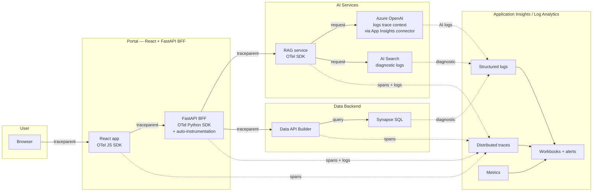

# Pattern — Observability with OpenTelemetry

> **TL;DR:** **OpenTelemetry SDK** in every service, **Application Insights** as the backend, **W3C Trace Context** propagated end-to-end, **structured logs** with correlation IDs everywhere, **dashboards in Azure Workbooks**, **SLI/SLO + error budgets** to drive engineering effort. Don't roll your own.

## Problem

A modern data platform spans a dozen services per request — portal → BFF → AI service → vector search → AOAI → response. Without distributed tracing, debugging a "this one request was slow" report means hunting through 6 separate log streams hoping timestamps line up. With OpenTelemetry, every log line and every span carries the same trace ID, and one click in App Insights shows you the full request waterfall.

## Architecture



## Pattern: end-to-end trace propagation

Every service:

1. Reads incoming `traceparent` header (W3C Trace Context)
2. Creates a child span for its work
3. Adds business-relevant attributes (`user.id`, `tenant.id`, `request_id`, `model`, `tokens`)
4. Propagates `traceparent` on outbound calls
5. Emits structured logs that include `trace_id` + `span_id`

### Python (FastAPI)

```python
from opentelemetry import trace
from opentelemetry.instrumentation.fastapi import FastAPIInstrumentor
from azure.monitor.opentelemetry import configure_azure_monitor

# One-line setup — auto-instruments FastAPI, requests, urllib3, sqlalchemy, etc.
configure_azure_monitor(
    connection_string=os.environ["APPLICATIONINSIGHTS_CONNECTION_STRING"]
)

app = FastAPI()
FastAPIInstrumentor.instrument_app(app)

tracer = trace.get_tracer(__name__)

@app.post("/chat")
async def chat(req: ChatRequest):
    with tracer.start_as_current_span("rag-grounding") as span:
        span.set_attributes({
            "user.id_hash": hash_user(req.user_id),
            "tenant.id": req.tenant_id,
            "rag.corpus": req.corpus,
        })
        # ... do work
        span.set_attribute("rag.docs_retrieved", len(docs))
```

### TypeScript (React)

```ts
import { WebTracerProvider } from "@opentelemetry/sdk-trace-web";
import { AzureMonitorTraceExporter } from "@azure/monitor-opentelemetry-exporter";
import { registerInstrumentations } from "@opentelemetry/instrumentation";
import { FetchInstrumentation } from "@opentelemetry/instrumentation-fetch";

const provider = new WebTracerProvider();
provider.addSpanProcessor(
    new BatchSpanProcessor(
        new AzureMonitorTraceExporter({
            connectionString: import.meta.env
                .VITE_APPINSIGHTS_CONNECTION_STRING,
        }),
    ),
);
provider.register();

registerInstrumentations({
    instrumentations: [
        new FetchInstrumentation({
            propagateTraceHeaderCorsUrls: [/api\.mycompany\.com/],
        }),
    ],
});
```

## Pattern: structured logging with correlation

Every log line includes the trace ID:

```python
import structlog
from opentelemetry import trace

def add_trace_context(logger, method_name, event_dict):
    span = trace.get_current_span()
    if span:
        ctx = span.get_span_context()
        event_dict['trace_id'] = format(ctx.trace_id, '032x')
        event_dict['span_id'] = format(ctx.span_id, '016x')
    return event_dict

structlog.configure(processors=[
    add_trace_context,
    structlog.processors.JSONRenderer(),
])

log = structlog.get_logger()
log.info("rag_retrieved", docs_count=len(docs), user_id_hash=hash_user(uid))
```

In App Insights you can join logs to traces by `trace_id`.

## Pattern: SLI / SLO / error budget

Define what "working" means as numbers:

| Service      | SLI                                 | SLO                 | Error budget                     |
| ------------ | ----------------------------------- | ------------------- | -------------------------------- |
| Portal API   | success rate (HTTP 2xx/3xx / total) | 99.9% over 30 days  | 43 minutes / month               |
| Portal API   | latency p95                         | <500ms over 30 days | 5% of requests can exceed        |
| RAG service  | retrieval recall@5 (eval)           | >0.85               | 15% of queries can be sub-recall |
| AOAI surface | refusal rate                        | <2%                 | spike = drift, not error budget  |

When you blow your error budget, **engineering work shifts from features to reliability** until you're back inside budget. This forces honest conversations.

## Pattern: dashboards in Azure Workbooks

Don't reinvent. Workbooks ship a few good templates and the platform extends them:

- **Service Health** — uptime, error rate, latency p50/p95/p99 per service
- **Trace Explorer** — slowest 100 traces, filter by service / operation / error
- **AOAI Cost** — token usage by deployment / day / feature, $ trend
- **RAG Quality** — recall, citation precision, refusal rate over time
- **Drift** — weekly eval scores vs baseline

Workbook JSON lives under `deploy/bicep/shared/modules/workbooks/` (planned — see roadmap). Until then, Workbook templates can be exported from the portal and committed.

## Pattern: alerts that don't page-fatigue

| Alert                                | Threshold     | Severity                    |
| ------------------------------------ | ------------- | --------------------------- |
| Service down (ping >3 fails in 5min) | 0% success    | Sev 1 page                  |
| Error rate >5% over 5min             | >5%           | Sev 2 page                  |
| Latency p95 >2x baseline for 10min   | 2× baseline   | Sev 3 ticket                |
| AOAI throttled >10% over 1hr         | >10% throttle | Sev 3 ticket                |
| AOAI cost >2x daily baseline         | 2× daily      | Sev 3 ticket (cost control) |
| Refusal rate >5% sustained 1hr       | >5%           | Sev 3 ticket (drift)        |
| Eval score regression in CI          | >5% drop      | block PR                    |

**Rules of thumb**:

- Sev 1 wakes someone up. Reserve for "service is down."
- Sev 2 ticks during business hours. "Significant degradation."
- Sev 3 is a ticket for next-day investigation. "Something's off."
- More than 1-2 Sev 1 pages / week → recalibrate; alerts are too noisy.

## Pattern: correlation across the boundary

For a chat request:

```
trace_id = 4bf92f3577b34da6a3ce929d0e0e4736

[browser]   span: page-load               trace_id=4bf9... duration=200ms
  [browser]   span: HTTP POST /chat       trace_id=4bf9... duration=1240ms
    [BFF]      span: chat handler         trace_id=4bf9... duration=1230ms
      [BFF]      span: rate-limit check   trace_id=4bf9... duration=2ms
      [BFF]      span: rag.grounding      trace_id=4bf9... duration=850ms
        [RAG]      span: retrieve         trace_id=4bf9... duration=120ms
        [RAG]      span: aoai-completion  trace_id=4bf9... duration=720ms
      [BFF]      span: response-build     trace_id=4bf9... duration=10ms
```

Click any span in App Insights → see the full waterfall + every log line associated with each span.

## Anti-patterns

| Anti-pattern                           | What to do                                  |
| -------------------------------------- | ------------------------------------------- |
| Each service has its own trace ID      | Propagate `traceparent` end-to-end          |
| Logs as freeform text                  | JSON structured with trace_id + span_id     |
| Alert on everything                    | Alert on SLO violations only                |
| Workbooks built once, never updated    | Treat as code; commit JSON; review with PRs |
| App Insights connection string in code | Key Vault reference, MI auth                |
| OTel SDK + custom telemetry library    | Pick one — OTel is the standard             |

## Related

- [ADR 0020 — Portal Observability and Rate Limiting](../adr/0020-portal-observability-and-rate-limiting.md)
- [ADR 0021 — Two Rate Limiters](../adr/0021-two-rate-limiters-not-duplicates.md)
- [Best Practices — Monitoring & Observability](../best-practices/monitoring-observability.md)
- [LOG_SCHEMA.md](../LOG_SCHEMA.md)
- [Compliance — SOC 2 Type II](../compliance/soc2-type2.md) (CC7 Monitoring)
- Azure Monitor OpenTelemetry: https://learn.microsoft.com/azure/azure-monitor/app/opentelemetry-overview
