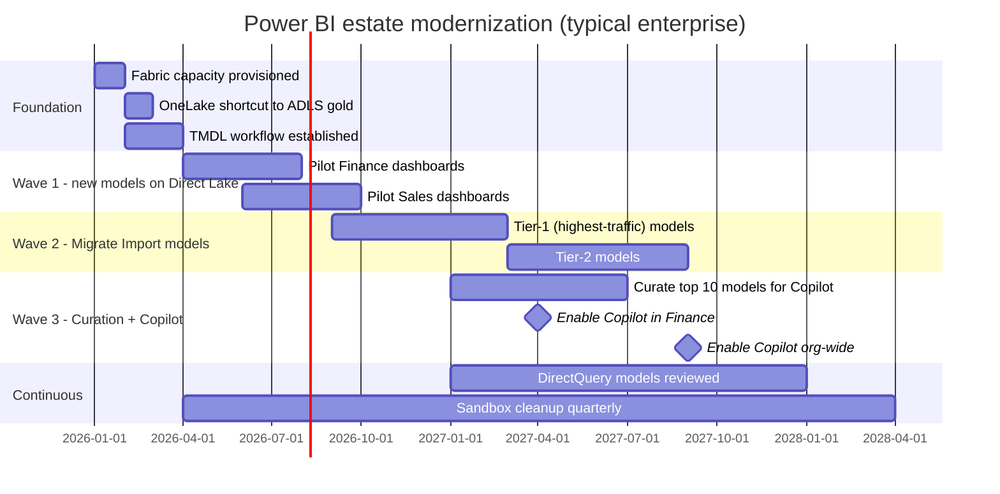

# Pattern — Power BI & Fabric Roadmap

> **TL;DR:** Move new semantic models to **Fabric Direct Lake** as the default. Keep existing **Import** models on Power BI Premium until next major schema change. **Avoid DirectQuery** for performance-sensitive workloads. Build a **TMDL-first development workflow** so semantic models are version-controlled like code.

## Problem

Power BI is the dominant BI consumer in Microsoft-aligned organizations, but it's evolving quickly:

- **Direct Lake** (Fabric) — new storage mode with import-tier performance and DirectQuery-tier freshness
- **TMDL / fabric-cli** — semantic models as code, finally
- **Semantic-link / SemPy** — Python notebook access to semantic models
- **Copilot in Power BI** — natural-language exploration over models

Most organizations have a sprawling Power BI estate built over 5-10 years that doesn't take advantage of any of this. The roadmap to modernize is real and worth investment.

## Storage modes — pick the right one

| Mode | When | Pros | Cons |
|------|------|------|------|
| **Import** | <100 GB model, batch refresh OK, complex DAX | Fastest queries; works without Fabric | Refresh latency; memory limits; long refresh windows |
| **DirectQuery** | Real-time freshness required | Always current; no refresh | Per-query backend hits; aggregations needed for perf |
| **Direct Lake** (Fabric only) | Modern lakehouse data, BI-first workloads | Import-tier performance + DQ-tier freshness; no refresh | Fabric-only; some complex DAX patterns don't work yet |
| **Composite (DQ + Import)** | Mix of dimension (Import) + fact (DQ) | Best of both for some workloads | Complex; user-defined aggregations needed |

### Default by 2026
- **Net-new model**: **Direct Lake** if data is in OneLake / shortcut-able to OneLake
- **Existing Import**: stay on Import until next major schema change, then evaluate Direct Lake
- **DirectQuery**: avoid except for true real-time requirements

## Pattern: TMDL-first development

Old workflow:
- Open Power BI Desktop, edit semantic model in UI, publish PBIX
- Source of truth is binary PBIX; no diffs, no PR review

New workflow:
- Semantic model defined in **TMDL** (`.tmdl` files) under git
- Edited in Power BI Desktop OR Visual Studio Code with TMDL extension
- Reviewed in PRs like any code
- Deployed via **Fabric REST API** or `fabric-cli`

```
my-semantic-model/
├── .gitignore
├── definition.pbism                    # bindings, mode
├── model.tmdl                          # model-level config
├── tables/
│   ├── dim_customer.tmdl
│   ├── dim_product.tmdl
│   ├── fact_sales.tmdl
│   └── _measures.tmdl                  # measures separate file
├── relationships.tmdl
├── perspectives/
│   └── exec_view.tmdl
└── translations/
    ├── en-US.tmdl
    └── es-ES.tmdl
```

Diff a measure change in PR review. **Finally.**

## Pattern: medallion alignment

| Lakehouse layer | Power BI artifact |
|-----------------|-------------------|
| Gold tables (star schema) | Direct Lake semantic model — 1:1 mapping |
| Gold aggregates | Pre-built aggregation tables in semantic model |
| Silver | Reference for ad-hoc Power BI Datamarts (rare in production) |
| Bronze | Never queried by Power BI directly |

Each gold table maps to one fact or dimension. Star schema in gold = fast Direct Lake performance.

## Pattern: workspace + capacity governance

Don't put all semantic models in one workspace. Pattern:

```
Workspaces:
├── Finance / Production (F64 capacity)
├── Finance / Development (F8 capacity)
├── Sales / Production (F32 capacity)
├── Sales / Development (F4 capacity)
├── Shared / Production (F128 capacity, hosts org-wide models)
└── Sandbox / All users (PPU licenses, no capacity)
```

- One workspace per LOB per environment
- Capacity sized for workspace's workload
- Sandbox for self-service exploration; never source-of-truth
- Promotion via **Fabric Deployment Pipelines** (Dev → Test → Prod)

## Pattern: Copilot in Power BI

Available for any model on F64+ capacity. Treats your semantic model as a metadata corpus:

- Users ask questions in natural language → Copilot generates DAX
- Quality is **proportional to model quality** — bad column names, missing descriptions, ambiguous measures = bad Copilot
- **Investment in model curation** (descriptions, synonyms, hidden columns, sample questions) is now ROI-positive

Roadmap step: pick 5-10 highest-value models, **curate them properly**, enable Copilot, train users.

## Pattern: external tools / DAX optimization

Even with Direct Lake, DAX matters. Tools:

- **DAX Studio** — query trace, server timings, query plan
- **Tabular Editor** — power editing for Import models, calc groups, perspectives
- **Best Practice Analyzer** — automated rule checking on semantic models

Use as part of CI: lint TMDL with BPA before merging PRs.

## Migration roadmap (typical enterprise)



## Anti-patterns

| Anti-pattern | What to do |
|--------------|-----------|
| Edit PBIX, publish, no source control | TMDL in git |
| One huge workspace for everything | LOB workspaces, dev/test/prod separation |
| Direct Lake for non-star data | Build a star in gold first |
| DirectQuery to operational DB | Build a Direct Lake semantic model on a gold mirror |
| Copilot enabled on poorly-curated models | Curate first; Copilot only as good as the model |
| Aggregations as an afterthought | Plan aggregations during model design |
| Manual deployment portal-clicking | Fabric Deployment Pipelines + git PR reviews |
| Trying to migrate every Excel report ever | Inventory; archive ones not used in 90 days |

## Trade-offs

✅ **Why modernize**
- Direct Lake is genuinely better than Import for large models
- TMDL + git is finally a real dev experience
- Copilot value scales with curation investment
- One platform (Fabric) for storage + semantic + BI = simpler ops

⚠️ **Why be patient**
- Curation takes time; rushing produces bad Copilot experiences
- Some DAX patterns don't yet work in Direct Lake
- Capacity sizing for Fabric is a learning curve
- Existing Import models work — don't migrate just for fashion

## Related

- [Reference Architecture — Fabric vs Synapse vs Databricks](../reference-architecture/fabric-vs-synapse-vs-databricks.md)
- [Reference Architecture — Data Flow (Medallion)](../reference-architecture/data-flow-medallion.md)
- [ADR 0010 — Fabric Strategic Target](../adr/0010-fabric-strategic-target.md)
- [Migration — Databricks to Fabric](../migrations/databricks-to-fabric.md)
- [Use Case — Unified Analytics on Fabric](../use-cases/fabric-unified-analytics.md)
- TMDL: https://learn.microsoft.com/analysis-services/tmdl/tmdl-overview
- Fabric Direct Lake: https://learn.microsoft.com/fabric/get-started/direct-lake-overview
- Tabular Editor: https://tabulareditor.com/
