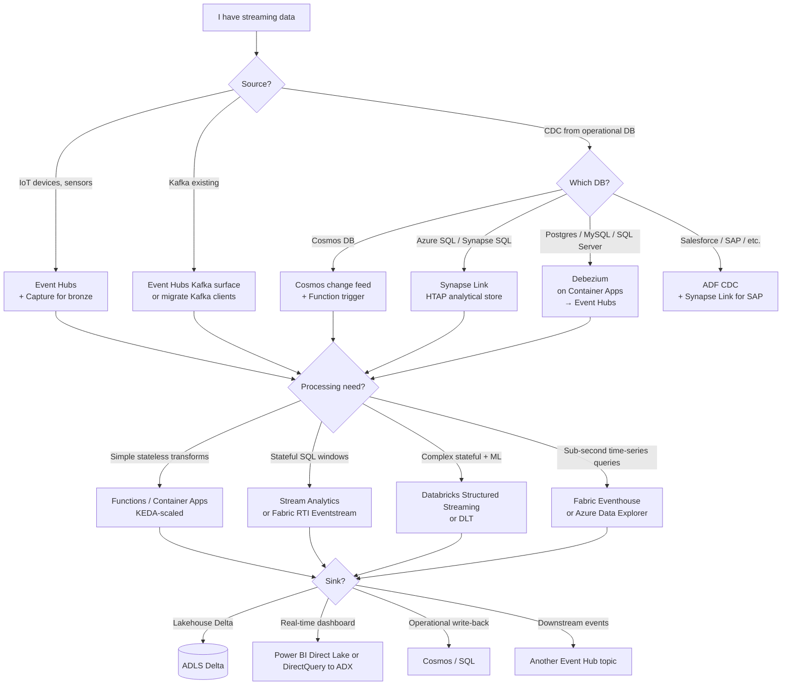
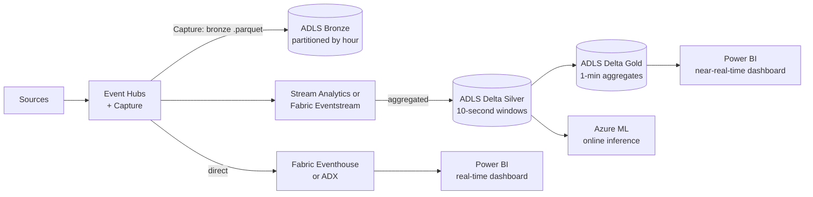

# Pattern — Streaming & CDC

> **TL;DR:** **Event Hubs** for ingestion (Kafka-compatible), **Stream Analytics** or **Fabric RTI** for stateful streaming SQL, **Databricks Structured Streaming** for complex stateful with ML, **Eventhouse / ADX** for sub-second time-series queries. **Synapse Link** for Cosmos / SQL CDC; **Debezium on Container Apps** for other DBs.

## Problem

"Streaming" covers wildly different needs: sub-second IoT telemetry, near-real-time dashboards, CDC from operational DBs, event-driven microservices, fraud scoring, log enrichment. No single Azure service is best at all of these. Picking the wrong combination produces years of regret.

## Decision tree



## Pattern: ingestion choice

| Source                           | Recommended ingestion                                                            |
| -------------------------------- | -------------------------------------------------------------------------------- |
| Few high-rate streams            | **Event Hubs Standard / Premium** + Capture                                      |
| Massive multi-tenant (>1M msg/s) | **Event Hubs Dedicated**                                                         |
| Existing Kafka clients           | **Event Hubs Kafka surface** (no client changes)                                 |
| MQTT IoT devices                 | **IoT Hub** → Event Hubs                                                         |
| HTTP webhook                     | **Event Grid** or **Functions HTTP trigger**                                     |
| File drops (S3, GCS, SFTP)       | **ADF copy** or **Logic Apps** — not really streaming, but often confused for it |

## Pattern: processing choice

| Need                                              | Service                                                                    |
| ------------------------------------------------- | -------------------------------------------------------------------------- |
| **Stateless filter / enrich / route**             | Functions (HTTP/Event trigger) or Container Apps (KEDA)                    |
| **Tumbling / hopping window aggregations in SQL** | Stream Analytics or Fabric Eventstream                                     |
| **Stateful joins, late-data, watermarks, ML**     | Databricks Structured Streaming or Delta Live Tables                       |
| **Sub-second time-series queries**                | Fabric Eventhouse / Azure Data Explorer (querying side, not processing)    |
| **Complex event processing (CEP)**                | Stream Analytics with referenced data, or Flink (Confluent Cloud on Azure) |

## Pattern: CDC from operational databases

### Cosmos DB — change feed (built-in, free)

```python
# Functions Cosmos trigger
@app.cosmos_db_trigger(
    arg_name="documents",
    container_name="orders",
    database_name="ecommerce",
    connection="CosmosConnection",
)
def main(documents: func.DocumentList):
    for doc in documents:
        publish_to_event_hub(doc)
```

### Azure SQL / Synapse SQL — Synapse Link (built-in, separate analytical store)

Enable on the source table; Synapse SQL Serverless can query the analytical store with no impact on OLTP. Lag ~2 minutes.

### SAP — Synapse Link for SAP (or Operational Data Provisioning)

For SAP S/4HANA + ECC. Reads SAP CDS views or ODP queues; lands in ADLS Delta. Better than ADF SAP Table connector for high-volume tables.

### Postgres / MySQL / SQL Server (other) — Debezium

Run Debezium connectors as Container Apps:

```yaml
# Container App for Debezium PostgreSQL connector
env:
    - DATABASE_HOSTNAME: pg-primary.privatelink.postgres.database.azure.com
    - DATABASE_USER: debezium
    - DATABASE_PASSWORD: !KeyVaultRef pg-debezium-pwd
    - TABLE_INCLUDE_LIST: public.orders,public.customers
    - TOPIC_PREFIX: pg-prod
    - KAFKA_BOOTSTRAP_SERVERS: ehns-prod.servicebus.windows.net:9093
    - KAFKA_SASL_MECHANISM: PLAIN
```

Debezium publishes change events to Event Hubs (Kafka surface). Downstream consumers process from Event Hubs.

### Other DBs

- **DynamoDB**: DynamoDB Streams → AWS Lambda → cross-cloud Event Grid → Event Hubs (rare; usually source moves to Cosmos)
- **Mainframe (DB2 z/OS)**: third-party (Qlik Replicate, IBM Data Replication) → Event Hubs
- **Salesforce**: Salesforce Change Data Capture → ADF or Logic Apps → Event Hubs

## Pattern: streaming medallion

Real-time medallion has the same layering, faster cadence:



Bronze = Capture-output Parquet (immutable). Silver = Delta tables with watermarks. Gold = Delta aggregates. Eventhouse / ADX = fast-query layer for dashboards.

## Pattern: at-least-once vs exactly-once

| Need                               | Approach                                                                                                                         |
| ---------------------------------- | -------------------------------------------------------------------------------------------------------------------------------- |
| At-least-once (default)            | Idempotent consumers; deduplicate on consumer side using natural keys                                                            |
| Exactly-once on a single sink      | Use a sink that supports it (Delta with merge keys, Cosmos with upsert)                                                          |
| Exactly-once across multiple sinks | Hard. Usually solved with **outbox pattern** (write event + sink record in one DB transaction; relay reads outbox and publishes) |

Don't claim exactly-once unless you've designed for it explicitly. Most "exactly-once" production systems are "at-least-once with idempotent consumers."

## Pattern: late data + watermarks

In Structured Streaming or Stream Analytics:

```python
# Spark Structured Streaming — drop late data >5 min
df.withWatermark("event_time", "5 minutes") \
  .groupBy(window("event_time", "1 minute"), "device_id") \
  .agg(avg("temp").alias("avg_temp"))
```

Pick a watermark that matches your data's latency reality. Too tight = drop legitimate data. Too loose = aggregations never finalize, state grows.

## Cost guidance

| Tier                            | When                                            |
| ------------------------------- | ----------------------------------------------- |
| Event Hubs Standard             | Most workloads up to ~50 MB/s                   |
| Event Hubs Premium              | Better latency, dedicated bandwidth, geo-DR     |
| Event Hubs Dedicated            | >1M msg/s sustained, predictable cost           |
| Stream Analytics                | Per Streaming Unit (SU); minimum 1 SU = ~$80/mo |
| Databricks Structured Streaming | Per DBU; minimum cluster usually $200+/mo       |
| Fabric RTI / Eventstream        | Bundled in Fabric capacity (F-SKU)              |
| Azure Data Explorer             | Per-cluster (D11_v2 starts ~$300/mo)            |
| Fabric Eventhouse               | Bundled in Fabric capacity                      |

## Anti-patterns

| Anti-pattern                                                             | What to do                                         |
| ------------------------------------------------------------------------ | -------------------------------------------------- |
| Polling DB every 5 seconds                                               | Use CDC (change feed, Synapse Link, Debezium)      |
| Stream Analytics for stateful ML                                         | Use Databricks; ASA SQL stateful is limited        |
| Trying to use Synapse SQL for sub-second time-series queries on TB-scale | Use ADX / Eventhouse                               |
| Custom Kafka cluster on AKS for new workloads                            | Event Hubs Kafka surface — no clusters to operate  |
| Functions for high-volume stream processing                              | Container Apps with KEDA scales better and cheaper |
| Bronze without Capture                                                   | You'll regret it the first time you need to replay |
| Single Event Hub for all topics                                          | Per-topic per-domain — easier ops, RBAC, retention |

## Related

- [ADR 0005 — Event Hubs over Kafka](../adr/0005-event-hubs-over-kafka.md)
- [ADR 0018 — Fabric RTI Adapter](../adr/0018-fabric-rti-adapter.md)
- [Decision — Batch vs Streaming](../decisions/batch-vs-streaming.md)
- [Decision — Kafka vs Event Hubs vs Service Bus](../decisions/kafka-vs-eventhubs-vs-servicebus.md)
- [Reference Architecture — Data Flow (Medallion)](../reference-architecture/data-flow-medallion.md)
- [Pattern — AKS & Container Apps for Data](aks-container-apps-for-data.md)
- [Pattern — Cosmos DB](cosmos-db-patterns.md)
- [Tutorial 05 — Streaming Lambda](../tutorials/05-streaming-lambda/README.md)
- [Example — IoT Streaming](../examples/iot-streaming.md)
- [Example — Streaming](../examples/streaming.md)
