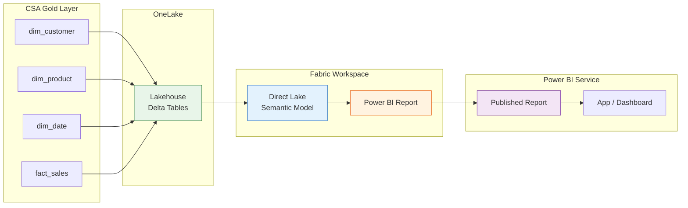

# BI Developer Quickstart — Your First Report in 30 Minutes

> **Estimated time:** 30 minutes | **Difficulty:** Beginner | **What you'll
> build:** A Power BI report connected to the CSA Gold layer through a Direct
> Lake semantic model, with three interactive visuals — a bar chart, a KPI card,
> and a detail table — published to the Power BI Service for team consumption.

---

## Prerequisites

Before you begin, make sure the following are in place:

- [ ] **Power BI Desktop** installed (latest monthly release recommended)
- [ ] **Microsoft Fabric capacity** (F2 or higher) or an active Fabric trial —
      Direct Lake requires Fabric
- [ ] **Gold layer data available** — the dbt pipeline must have run at least
      once (see [QUICKSTART.md](../QUICKSTART.md))
- [ ] **Workspace member** or Contributor role on the target Fabric workspace
- [ ] **Network access** to the Power BI Service and OneLake endpoints

---

## Architecture



**Data flows left to right:** Gold-layer Delta tables land in a Fabric
Lakehouse via OneLake. A Direct Lake semantic model reads columns directly
from Parquet files -- no data copy, no scheduled refresh. Reports consume the
semantic model and are shared through the Power BI Service.

---

## Step 1 — Access the Fabric Workspace

1. Open [https://app.fabric.microsoft.com](https://app.fabric.microsoft.com)
   and sign in with your organizational account.
2. In the left navigation, select **Workspaces** and locate the CSA-in-a-Box
   workspace (or the workspace your admin has designated for BI development).
3. Verify that the workspace is assigned to a **Fabric capacity** (F2+) or
   a trial capacity. The capacity name appears under the workspace settings
   gear icon.

> **No Fabric capacity?** You can start a 60-day Fabric trial from the
> Account Manager in the top-right corner of the portal. Direct Lake is not
> available on shared (Pro-only) capacity.

---

## Step 2 — Create a Lakehouse and Verify Gold Tables

If a lakehouse already exists with the Gold tables, skip to Step 3.

1. In the workspace, click **+ New item** and select **Lakehouse**.
2. Name it `csa_gold_lakehouse` and click **Create**.
3. In the lakehouse explorer, click **Get data > New shortcut** to create
   shortcuts to the Gold-layer Delta tables in ADLS Gen2.
4. For each table (`fact_sales`, `dim_customer`, `dim_product`, `dim_date`),
   create an **Azure Data Lake Storage Gen2** shortcut:
    - **URL:** `https://<storage-account>.dfs.core.windows.net`
    - **Container:** `gold`
    - **Sub-path:** the folder name matching the table
5. After creating the shortcuts, verify that all four tables appear under
   the **Tables** section of the lakehouse.

<details>
<summary>Expected result</summary>

The lakehouse explorer shows:

```
Tables/
  dim_customer
  dim_date
  dim_product
  fact_sales
```

Each table should display a row count and column list when selected.

</details>

---

## Step 3 — Create a Direct Lake Semantic Model

1. From the lakehouse view, click **New semantic model** in the top ribbon.
2. Name the model `CSA Sales Model`.
3. Select all four tables: `fact_sales`, `dim_customer`, `dim_product`,
   `dim_date`.
4. Click **Confirm**. Fabric creates the semantic model and opens the model
   view.

### Define Relationships

In the model diagram, create the following relationships (Fabric may
auto-detect some):

| From (Fact)               | To (Dimension)              | Cardinality | Cross-filter |
| ------------------------- | --------------------------- | ----------- | ------------ |
| `fact_sales.customer_key` | `dim_customer.customer_key` | Many-to-One | Single       |
| `fact_sales.product_key`  | `dim_product.product_key`   | Many-to-One | Single       |
| `fact_sales.date_key`     | `dim_date.date_key`         | Many-to-One | Single       |

Drag from the fact column to the dimension column to create each relationship.
Verify cardinality is set to **Many-to-One** and cross-filter direction is
**Single**.

<details>
<summary>Expected result</summary>

The model diagram shows a classic star schema with `fact_sales` in the center
and three dimension tables connected by solid lines. Each relationship line
displays a `*` on the fact side and a `1` on the dimension side.

</details>

---

## Step 4 — Define DAX Measures

Open the semantic model and select the `fact_sales` table. Add the following
measures using **New measure** in the ribbon.

### Measure 1 — Total Revenue

```dax
Total Revenue =
SUM( fact_sales[total_amount] )
```

Format as **Currency** with 2 decimal places.

### Measure 2 — YoY Growth %

```dax
YoY Growth % =
VAR _CurrentYear = [Total Revenue]
VAR _PriorYear =
    CALCULATE(
        [Total Revenue],
        SAMEPERIODLASTYEAR( dim_date[full_date] )
    )
RETURN
    IF(
        NOT ISBLANK( _PriorYear ),
        DIVIDE( _CurrentYear - _PriorYear, _PriorYear )
    )
```

Format as **Percentage** with 1 decimal place.

### Measure 3 — Running Total

```dax
Running Total =
CALCULATE(
    [Total Revenue],
    FILTER(
        ALL( dim_date[full_date] ),
        dim_date[full_date] <= MAX( dim_date[full_date] )
    )
)
```

Format as **Currency** with 2 decimal places.

### Measure 4 — Average Order Value

```dax
Avg Order Value =
DIVIDE(
    [Total Revenue],
    DISTINCTCOUNT( fact_sales[sale_id] )
)
```

Format as **Currency** with 2 decimal places.

<details>
<summary>Expected result</summary>

The `fact_sales` table in the model now shows four measures (indicated by a
calculator icon): Total Revenue, YoY Growth %, Running Total, and Avg Order
Value.

</details>

---

## Step 5 — Build the Report in Power BI Desktop

### Connect to the Semantic Model

1. Open **Power BI Desktop**.
2. Select **Home > Get Data > Power BI semantic models** (or
   **Dataverse > Power BI semantic models**).
3. Choose `CSA Sales Model` from the workspace and click **Connect**.
4. Power BI Desktop opens in **Live Connection** mode — all tables and
   measures from the semantic model are available in the Fields pane.

### Visual 1 — Revenue by Product Category (Bar Chart)

1. From the **Visualizations** pane, select **Clustered bar chart**.
2. Drag `dim_product[category_name]` to the **Y-axis**.
3. Drag `Total Revenue` to the **X-axis**.
4. Sort descending by Total Revenue (click the ellipsis on the visual,
   **Sort axis > Total Revenue**, then **Sort descending**).

### Visual 2 — KPI Card

1. Select **Card** from the Visualizations pane.
2. Drag `Total Revenue` into the **Fields** well.
3. Duplicate the card (Ctrl+D) and replace the field with `YoY Growth %`.
4. Duplicate again and use `Avg Order Value`.
5. Arrange the three cards in a row at the top of the report canvas.

### Visual 3 — Sales Detail Table

1. Select **Table** from the Visualizations pane.
2. Add the following columns:
    - `dim_date[full_date]`
    - `dim_customer[customer_name]`
    - `dim_product[product_name]`
    - `fact_sales[quantity]`
    - `Total Revenue`
3. Set conditional formatting on `Total Revenue` — select the column,
   open **Format > Cell elements > Background color**, and apply a
   gradient from white to your accent color.

<details>
<summary>Expected result</summary>

The report canvas shows:

- **Top row:** Three KPI cards displaying Total Revenue, YoY Growth %, and
  Average Order Value.
- **Left half:** A clustered bar chart with product categories ranked by
  revenue, highest at the top.
- **Right half:** A detail table showing individual transactions with a
  color gradient on the revenue column.

</details>

---

## Step 6 — Apply Formatting and CSA Theme

Apply a consistent visual style across the report.

1. Go to **View > Themes > Browse for themes**.
2. If your team has a CSA theme JSON file, import it. Otherwise, create a
   minimal theme:

```json
{
    "name": "CSA-in-a-Box",
    "dataColors": [
        "#1565C0",
        "#2E7D32",
        "#E65100",
        "#6A1B9A",
        "#C62828",
        "#00838F"
    ],
    "background": "#FFFFFF",
    "foreground": "#212121",
    "tableAccent": "#1565C0",
    "visualStyles": {
        "*": {
            "*": {
                "title": [
                    {
                        "fontFamily": "Segoe UI Semibold",
                        "fontSize": 12
                    }
                ]
            }
        }
    }
}
```

3. Save this as `csa-theme.json` and import it via **Browse for themes**.
4. Adjust the report title: insert a text box at the top with the text
   **CSA-in-a-Box Sales Dashboard** using your theme's primary color.

---

## Step 7 — Publish to Power BI Service and Share

1. In Power BI Desktop, click **Home > Publish**.
2. Select the CSA-in-a-Box workspace and click **Select**.
3. Wait for the publish confirmation dialog, then click **Open in Power BI**
   to view the report in the browser.
4. To share with colleagues:
    - **Quick share:** Click **Share** on the report toolbar and enter email
      addresses.
    - **App:** In the workspace, click **Create app** to bundle the report
      into a distributable Power BI App with its own permissions boundary.
    - **Teams:** Click **Chat in Teams** or embed the report in a Teams tab
      for real-time collaboration.

<details>
<summary>Expected result</summary>

The report appears in the Power BI Service with all three visuals rendering
live data from the Direct Lake semantic model. Filters and slicers respond
instantly because Direct Lake reads columnar data directly from OneLake
Parquet files — no import refresh needed.

</details>

---

## Performance Tips

### Direct Lake Fallback

Direct Lake can fall back to DirectQuery if a query exceeds engine limits.
Monitor fallback events in the **Capacity Metrics** app.

| Scenario                                | What Happens                       | Mitigation                                                 |
| --------------------------------------- | ---------------------------------- | ---------------------------------------------------------- |
| Query exceeds memory framing limit      | Falls back to DirectQuery (slower) | Reduce columns in the semantic model; remove unused tables |
| Table has more than 1 billion rows (F2) | Fallback triggered                 | Use a higher SKU or pre-aggregate in the Gold layer        |
| Unsupported DAX pattern                 | Fallback per query                 | Simplify complex iterator measures                         |

### Visual Count and Aggregations

Keep visuals per page under **15-20** to avoid slow page loads and capacity
throttling. For very large fact tables, build pre-aggregated Gold tables in
dbt (for example, `fact_sales_monthly_agg`) and add them to the semantic model
to reduce query volume.

### Refresh Behavior

Direct Lake models do not need a scheduled refresh. When Delta tables are
updated (after a dbt run), the model **frames** the new data automatically on
the next query, or you can trigger framing via the XMLA endpoint:

```powershell
Invoke-ProcessTable -Server "powerbi://api.powerbi.com/v1.0/myorg/<workspace>" `
    -Database "CSA Sales Model" -Table "fact_sales" -RefreshType "Automatic"
```

---

## Troubleshooting

| Symptom                                     | Likely Cause                                          | Resolution                                                                                           |
| ------------------------------------------- | ----------------------------------------------------- | ---------------------------------------------------------------------------------------------------- |
| Semantic model creation grayed out          | Workspace is not on Fabric capacity                   | Assign the workspace to an F-SKU or start a trial                                                    |
| Tables not visible in lakehouse             | Shortcuts not pointing to correct ADLS path           | Re-create shortcuts; verify container and subfolder names                                            |
| Relationship auto-detect missed a join      | Column names differ between fact and dimension        | Manually drag-and-drop the relationship in model view                                                |
| `YoY Growth %` returns blank                | `dim_date[full_date]` is not marked as a date table   | In the model, right-click `dim_date` > **Mark as date table** and set `full_date` as the date column |
| Report shows "Unable to connect" in Service | Semantic model credentials expired or gateway missing | Direct Lake does not need a gateway; verify workspace capacity is running                            |
| Visual falls back to DirectQuery            | Query exceeds framing limits                          | Check Capacity Metrics; reduce visual complexity or model size                                       |
| Publish fails with permission error         | User lacks Contributor role on the workspace          | Ask a workspace admin to grant Contributor or Member role                                            |
| Cards show 0 or blank                       | Measure references a column that was renamed          | Open the semantic model and fix the measure formula to match current column names                    |

---

## What's Next

- **Power BI deep dive** -- Connectivity modes, RLS, paginated reports:
  [guides/power-bi.md](../guides/power-bi.md)
- **Fabric migration roadmap** -- Transitioning to Direct Lake:
  [patterns/power-bi-fabric-roadmap.md](../patterns/power-bi-fabric-roadmap.md)
- **Fabric end-to-end example** -- Lakehouse-to-report walkthrough:
  [examples/fabric-e2e.md](../examples/fabric-e2e.md)
- **Data governance** -- Sensitivity labels, Purview, RLS:
  [tutorials/02-data-governance](../tutorials/02-data-governance/README.md)
