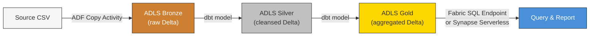

[Home](../../README.md) > [Docs](../) > [Quickstarts](./) > **Data Engineer**

# Data Engineer Quickstart -- Your First Pipeline in 30 Minutes

> **Estimated time:** 30 minutes
> **Difficulty:** Beginner
> **What you'll build:** An end-to-end batch pipeline that ingests a CSV file
> into the bronze layer via Azure Data Factory, transforms it through the
> medallion architecture with dbt, and exposes a query-ready gold table through
> a Fabric SQL endpoint.

---

## Prerequisites

- [ ] An active Azure subscription with **Contributor** role on the target resource group
- [ ] [Azure CLI](https://learn.microsoft.com/cli/azure/install-azure-cli) 2.50+ (`az version`)
- [ ] [Bicep CLI](https://learn.microsoft.com/azure/azure-resource-manager/bicep/install) 0.25+ (`az bicep version`)
- [ ] [Python](https://www.python.org/downloads/) 3.10+ (`python --version`)
- [ ] [dbt-core](https://docs.getdbt.com/docs/core/installation-overview) 1.7+ with the `dbt-databricks` adapter (`dbt --version`)
- [ ] [VS Code](https://code.visualstudio.com/) with the Azure and dbt extensions (recommended)
- [ ] Git 2.x and the CSA-in-a-Box repository cloned locally

```bash
# Validate all prerequisites at once:
bash scripts/deploy/validate-prerequisites.sh
```

---

## Architecture Overview

The pipeline follows the **medallion architecture** -- raw data lands in
bronze, is cleansed into silver, and aggregated into gold.



Each layer is stored as Delta tables in Azure Data Lake Storage Gen2. dbt
handles all transformation logic, and ADF orchestrates the execution.

---

## Step 1: Set Up Your Environment

Clone the repo and authenticate:

```bash
git clone https://github.com/your-org/csa-inabox.git
cd csa-inabox
az login
az account set --subscription "<YOUR_SUBSCRIPTION_ID>"
```

Install dbt and its dependencies:

```bash
cd domains/shared/dbt
pip install dbt-core dbt-databricks
dbt deps
```

Create or update `~/.dbt/profiles.yml` with your Databricks connection:

```yaml
csa_inabox:
    target: dev
    outputs:
        dev:
            type: databricks
            catalog: main
            schema: dev_shared
            host: "{{ env_var('DBX_HOST') }}"
            http_path: "{{ env_var('DBX_HTTP_PATH') }}"
            token: "{{ env_var('DBX_TOKEN') }}"
            threads: 4
```

Set the required environment variables:

```bash
export DBX_HOST="adb-xxxxxxxxxxxx.azuredatabricks.net"
export DBX_HTTP_PATH="/sql/1.0/warehouses/xxxxxxxxxxxxxxxx"
export DBX_TOKEN="dapi-xxxxxxxxxxxxxxxxxxxxxxxxxxxxxxxx"
```

---

## Step 2: Deploy Foundation Resources

If you have not yet deployed the platform infrastructure, follow
[Tutorial 01 -- Foundation Platform](../tutorials/01-foundation-platform/README.md)
to provision the Azure Landing Zone, Data Management Landing Zone, and Data
Landing Zone.

If your environment is already deployed, verify the key resources exist:

```bash
az group show --name rg-csa-dlz-dev --query "{name:name, location:location}" -o table
az storage account show --name stcsadlzdev --query "{name:name, kind:kind}" -o table
az datafactory show --name adf-csa-dlz-dev --resource-group rg-csa-dlz-dev \
  --query "{name:name, provisioningState:provisioningState}" -o table
```

---

## Step 3: Create a Bronze Landing Zone

Create the ADLS container, prepare a sample CSV, and upload it:

```bash
# Create the landing container
az storage container create \
  --account-name stcsadlzdev \
  --name landing \
  --auth-mode login

# Prepare sample data
mkdir -p temp
cat > temp/sample_customers.csv << 'EOF'
customer_id,first_name,last_name,email,signup_date,region
1,Alice,Johnson,alice.johnson@example.com,2024-01-15,East
2,Bob,Smith,bob.smith@example.com,2024-02-20,West
3,Carol,Williams,carol.williams@example.com,2024-03-10,Central
4,David,Brown,david.brown@example.com,2024-04-05,East
5,Eve,Davis,eve.davis@example.com,2024-05-12,West
EOF

# Upload to ADLS
az storage blob upload \
  --account-name stcsadlzdev \
  --container-name landing \
  --name customers/sample_customers.csv \
  --file temp/sample_customers.csv \
  --auth-mode login
```

---

## Step 4: Configure the ADF Pipeline

In ADF Studio (or via the deployed Bicep artifacts), configure a linked
service, datasets, and a copy activity. If you deployed via Bicep, the linked
service `ls_adls_csadlz` already exists -- see
[ADF Setup Guide](../ADF_SETUP.md) for the full artifact inventory.

**Linked service** -- points to your ADLS storage account:

```json
{
    "name": "ls_adls_csadlz",
    "type": "AzureBlobFS",
    "typeProperties": {
        "url": "https://stcsadlzdev.dfs.core.windows.net/"
    }
}
```

**Copy activity pipeline** -- ingests CSV from the `landing` container into the
`bronze` container as Parquet:

```json
{
    "name": "pl_ingest_customers_to_bronze",
    "properties": {
        "activities": [
            {
                "name": "CopyCustomersToBronze",
                "type": "Copy",
                "inputs": [{ "referenceName": "ds_landing_csv" }],
                "outputs": [{ "referenceName": "ds_bronze_delta" }],
                "typeProperties": {
                    "source": { "type": "DelimitedTextSource" },
                    "sink": { "type": "ParquetSink" }
                }
            }
        ]
    }
}
```

Trigger the pipeline manually from ADF Studio, or via CLI:

```bash
az datafactory pipeline create-run \
  --resource-group rg-csa-dlz-dev \
  --factory-name adf-csa-dlz-dev \
  --name pl_ingest_customers_to_bronze
```

---

## Step 5: Write Your First dbt Model

### 5.1 Create the Silver Model

Create `domains/shared/dbt/models/silver/slv_customers.sql`:

```sql
{{ config(materialized='table') }}

with source as (
    select * from {{ source('bronze', 'customers') }}
),

cleaned as (
    select
        cast(customer_id as int)       as customer_id,
        trim(first_name)               as first_name,
        trim(last_name)                as last_name,
        lower(trim(email))             as email,
        cast(signup_date as date)      as signup_date,
        upper(trim(region))            as region,
        current_timestamp()            as _loaded_at
    from source
    where customer_id is not null
)

select * from cleaned
```

### 5.2 Create the Gold Model

Create `domains/shared/dbt/models/gold/gld_customers_by_region.sql`:

```sql
{{ config(materialized='table') }}

with customers as (
    select * from {{ ref('slv_customers') }}
)

select
    region,
    count(*)                           as customer_count,
    min(signup_date)                   as earliest_signup,
    max(signup_date)                   as latest_signup,
    current_timestamp()                as _aggregated_at
from customers
group by region
```

### 5.3 Add a Schema Test

Add the following to `domains/shared/dbt/models/silver/schema.yml`:

```yaml
models:
    - name: slv_customers
      description: "Cleansed customer records from the bronze layer."
      columns:
          - name: customer_id
            tests: [unique, not_null]
          - name: email
            tests: [unique, not_null]
```

### 5.4 Run dbt

```bash
cd domains/shared/dbt
dbt run --select slv_customers gld_customers_by_region
dbt test --select slv_customers
```

<details>
<summary>Expected output</summary>

```
Running with dbt=1.7.x
Found 2 models, 4 tests, 1 source

1 of 2 OK created sql table model dev_shared.slv_customers ......... [OK in 3.21s]
2 of 2 OK created sql table model dev_shared.gld_customers_by_region [OK in 2.45s]

Done. PASS=2 WARN=0 ERROR=0 SKIP=0 TOTAL=2

1 of 4 PASS not_null_slv_customers_customer_id ..................... [PASS in 1.02s]
2 of 4 PASS not_null_slv_customers_email ........................... [PASS in 1.05s]
3 of 4 PASS unique_slv_customers_customer_id ....................... [PASS in 1.10s]
4 of 4 PASS unique_slv_customers_email ............................. [PASS in 1.08s]

Done. PASS=4 WARN=0 ERROR=0 SKIP=0 TOTAL=4
```

</details>

---

## Step 6: Query the Gold Layer

### Option A: Fabric SQL Endpoint

If Microsoft Fabric is configured, open the SQL endpoint for your lakehouse:

```sql
SELECT region, customer_count, earliest_signup, latest_signup
FROM dev_shared.gld_customers_by_region
ORDER BY customer_count DESC;
```

### Option B: Synapse Serverless SQL

```sql
SELECT *
FROM OPENROWSET(
    BULK 'https://stcsadlzdev.dfs.core.windows.net/gold/customers_by_region/**',
    FORMAT = 'DELTA'
) AS gold_data
ORDER BY customer_count DESC;
```

<details>
<summary>Expected query results</summary>

```
region   | customer_count | earliest_signup | latest_signup
---------|----------------|-----------------|---------------
EAST     | 2              | 2024-01-15      | 2024-04-05
WEST     | 2              | 2024-02-20      | 2024-05-12
CENTRAL  | 1              | 2024-03-10      | 2024-03-10
```

</details>

---

## Step 7: Validate and Next Steps

You now have a working end-to-end pipeline:

1. **Bronze** -- Raw CSV data ingested via ADF Copy Activity into ADLS Gen2
2. **Silver** -- Cleansed and typed records produced by a dbt model with schema tests
3. **Gold** -- Region-level aggregation ready for BI consumption

### Suggested Next Steps

- **Add a schedule trigger** to run the ADF pipeline on a recurring basis.
  See [ADF Setup Guide -- Trigger Configuration](../ADF_SETUP.md).
- **Add more domains** by creating new dbt projects under `domains/`. See
  existing domains like `sales`, `finance`, and `inventory` for patterns.
- **Set up data quality gates** with dbt tests and Great Expectations.
  See [Great Expectations Tutorial](../tutorials/great-expectations.md).
- **Explore streaming** for near-real-time ingestion.
  See [Tutorial 05 -- Streaming Lambda](../tutorials/05-streaming-lambda/README.md).
- **Register assets in Purview** for governance and lineage tracking.
  See [Purview Guide](../guides/purview.md).

---

## Troubleshooting

| Symptom                                  | Cause                             | Fix                                                                  |
| ---------------------------------------- | --------------------------------- | -------------------------------------------------------------------- |
| `az datafactory: command not found`      | ADF CLI extension not installed   | Run `az extension add --name datafactory`                            |
| dbt `SCHEMA_NOT_FOUND` error             | Target schema missing in catalog  | Run `CREATE SCHEMA IF NOT EXISTS dev_shared` in Databricks           |
| ADF copy activity fails with 403         | Storage RBAC not configured       | Assign **Storage Blob Data Contributor** to the ADF managed identity |
| dbt test `unique` fails                  | Duplicate rows in source CSV      | De-duplicate the source or add `distinct` in the silver model        |
| `ConnectionError` in dbt                 | Wrong `DBX_HOST` or expired token | Verify env vars match your workspace; regenerate the token           |
| OPENROWSET returns 0 rows                | Delta log path mismatch           | Confirm `BULK` path matches the dbt materialization folder           |
| Upload `AuthorizationPermissionMismatch` | Missing RBAC on ADLS              | Assign **Storage Blob Data Contributor** to your user                |

---

## Related

- [Full Quick Start Guide (60-90 min end-to-end)](../QUICKSTART.md)
- [Tutorial 01 -- Foundation Platform](../tutorials/01-foundation-platform/README.md)
- [ADF Setup Guide](../ADF_SETUP.md)
- [Databricks Guide](../DATABRICKS_GUIDE.md)
- [dbt Shared Domain Models](../../domains/shared/dbt/models/)
- [Role-Based Quickstart Index](index.md)
