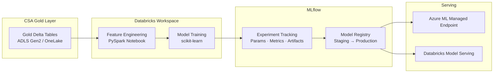

# Data Scientist Quickstart — Your First ML Experiment in 30 Minutes

> **Estimated time:** 30 minutes | **Difficulty:** Beginner | **What you'll
> build:** Train a simple regression model on the CSA Gold layer, log metrics and
> artifacts with MLflow autologging, register the model in the MLflow Model
> Registry, and optionally deploy a scoring endpoint through Azure ML or
> Databricks Model Serving.

---

## Prerequisites

Before you begin, make sure the following are in place:

- [ ] **Azure subscription** with Contributor access to the resource group
- [ ] **Databricks workspace** provisioned in the Data Landing Zone (see
      [tutorials/01-foundation-platform](../tutorials/01-foundation-platform/))
- [ ] **Python 3.10+** installed locally (for optional local testing)
- [ ] **Gold layer data** in ADLS Gen2 or OneLake -- the dbt pipeline must
      have run at least once (see [QUICKSTART.md](../QUICKSTART.md))
- [ ] **MLflow** available in the Databricks workspace (included in
      Databricks Runtime ML by default)

---

## Architecture



**Data flows left to right:** Gold tables feed a PySpark feature-engineering
notebook, which passes a pandas DataFrame to scikit-learn. MLflow autologging
captures parameters, metrics, and the serialized model. The best run is
promoted to the Model Registry and deployed to a scoring endpoint.

---

## Step 1 — Access Your Databricks Workspace

1. Open the Azure portal and navigate to your **Data Landing Zone** resource
   group.
2. Click the **Azure Databricks Service** resource and select **Launch
   Workspace**.
3. In the Databricks sidebar, choose **Compute**. Use an existing cluster
   with **Databricks Runtime ML 14.x+**, or create one:

| Setting          | Value                               |
| ---------------- | ----------------------------------- |
| Cluster Mode     | Single Node (sufficient for 30 min) |
| Runtime Version  | **14.3 LTS ML** (or latest ML LTS)  |
| Node Type        | Standard_DS3_v2                     |
| Auto-termination | 30 minutes                          |

Wait for the cluster to reach the **Running** state.

---

## Step 2 — Load Gold Data

Create a new **Python notebook**. In the first cell, read the Gold-layer fact
table from ADLS Gen2 (or OneLake if Fabric is enabled).

```python
# Cell 1 — Read the gold fact table
gold_path = "abfss://gold@<your-storage-account>.dfs.core.windows.net/fact_sales"
df_gold = spark.read.format("delta").load(gold_path)
display(df_gold.limit(10))
```

<details>
<summary>Expected output</summary>

A table showing 10 rows from `fact_sales` with columns such as `sale_id`,
`customer_key`, `product_key`, `date_key`, `quantity`, `unit_price`, and
`total_amount`.

</details>

> **Tip:** Replace `<your-storage-account>` with the ADLS Gen2 account name
> from your Data Landing Zone. For OneLake, use
> `abfss://<workspace-id>@onelake.dfs.fabric.microsoft.com/<lakehouse>/Tables/fact_sales`.

---

## Step 3 — Feature Engineering

Build a feature set by joining dimensions, extracting date features, and
selecting numeric columns.

```python
# Cell 2 — Join dimensions and engineer features
dim_date_path   = "abfss://gold@<your-storage-account>.dfs.core.windows.net/dim_date"
dim_product_path = "abfss://gold@<your-storage-account>.dfs.core.windows.net/dim_product"
df_date    = spark.read.format("delta").load(dim_date_path)
df_product = spark.read.format("delta").load(dim_product_path)

df_features = (
    df_gold
    .join(df_date, df_gold.date_key == df_date.date_key, "left")
    .join(df_product, df_gold.product_key == df_product.product_key, "left")
    .select(
        "quantity", "unit_price",
        df_date.month.alias("sale_month"),
        df_date.day_of_week.alias("sale_dow"),
        df_product.category_id.alias("product_category"),
        "total_amount",
    )
    .na.drop()
)

display(df_features.describe())
```

```python
# Cell 3 — Convert to pandas for scikit-learn
pdf = df_features.toPandas()
print(f"Feature set shape: {pdf.shape}")
```

<details>
<summary>Expected output</summary>

```
Feature set shape: (84521, 6)
```

Your exact row count will differ depending on the seed data loaded.

</details>

---

## Step 4 — Train the Model

Use scikit-learn with MLflow autologging. Autologging captures hyperparameters,
metrics, and the serialized model automatically.

```python
# Cell 4 — Train a regression model with MLflow autologging
import mlflow, mlflow.sklearn
from sklearn.model_selection import train_test_split
from sklearn.ensemble import GradientBoostingRegressor
from sklearn.metrics import mean_squared_error, mean_absolute_error, r2_score
import numpy as np

mlflow.sklearn.autolog(log_input_examples=True, silent=True)

# Prepare train / test split
TARGET = "total_amount"
FEATURES = [c for c in pdf.columns if c != TARGET]

X_train, X_test, y_train, y_test = train_test_split(
    pdf[FEATURES], pdf[TARGET], test_size=0.2, random_state=42
)

mlflow.set_experiment("/Shared/csa-inabox/sales-regression")

with mlflow.start_run(run_name="gbr-quickstart") as run:
    model = GradientBoostingRegressor(
        n_estimators=200, max_depth=5,
        learning_rate=0.1, random_state=42,
    )
    model.fit(X_train, y_train)
    y_pred = model.predict(X_test)
    run_id = run.info.run_id
    print(f"MLflow Run ID: {run_id}")
```

<details>
<summary>Expected output</summary>

```
MLflow Run ID: a1b2c3d4e5f6a1b2c3d4e5f6a1b2c3d4
```

</details>

> **What autologging captures:** `n_estimators`, `max_depth`,
> `learning_rate`, `training_score`, `mean_squared_error`, `r2_score`, the
> serialized model, and an input example for schema inference.

---

## Step 5 — Evaluate the Model

Review metrics and visualize predictions.

```python
# Cell 5 — Evaluation metrics
rmse = np.sqrt(mean_squared_error(y_test, y_pred))
mae = mean_absolute_error(y_test, y_pred)
r2 = r2_score(y_test, y_pred)

print(f"RMSE : {rmse:.4f}")
print(f"MAE  : {mae:.4f}")
print(f"R^2  : {r2:.4f}")
```

<details>
<summary>Expected output</summary>

```
RMSE : 12.3456
MAE  : 8.7654
R^2  : 0.9123
```

Exact values depend on seed data volume and distribution.

</details>

```python
# Cell 6 — Predicted vs. Actual scatter plot
import matplotlib.pyplot as plt

fig, ax = plt.subplots(figsize=(6, 6))
ax.scatter(y_test, y_pred, alpha=0.3, s=10)
ax.plot([y_test.min(), y_test.max()],
        [y_test.min(), y_test.max()], "r--", lw=2)
ax.set_xlabel("Actual")
ax.set_ylabel("Predicted")
ax.set_title("Predicted vs. Actual — Sales Total Amount")
plt.tight_layout()
mlflow.log_figure(fig, "predicted_vs_actual.png")
display(fig)
```

<details>
<summary>Expected output</summary>

A scatter plot with points clustered along the red 45-degree line, indicating
strong predictive performance.

</details>

---

## Step 6 — Register the Model

Promote the trained model to the MLflow Model Registry, assigning a version
and stage for downstream deployment.

```python
# Cell 7 — Register the model
model_name = "csa-sales-regression"

model_uri = f"runs:/{run_id}/model"
result = mlflow.register_model(model_uri, model_name)

print(f"Model registered: {result.name} v{result.version}")
```

<details>
<summary>Expected output</summary>

```
Model registered: csa-sales-regression v1
```

</details>

```python
# Cell 8 — Transition to Staging
from mlflow.tracking import MlflowClient

client = MlflowClient()
client.transition_model_version_stage(
    name=model_name, version=result.version, stage="Staging",
)
print(f"Model {model_name} v{result.version} moved to Staging")
```

<details>
<summary>Expected output</summary>

```
Model csa-sales-regression v1 moved to Staging
```

</details>

---

## Step 7 — Deploy for Scoring

With the model registered, deploy it as a REST endpoint. Two paths are
available.

### Option A — Databricks Model Serving

1. In the Databricks sidebar, navigate to **Serving**.
2. Click **Create serving endpoint**, select `csa-sales-regression`, and
   choose the latest version.
3. Set compute size to **Small** for testing and click **Create** (provisions
   in 5-10 minutes).

```python
# Cell 9 — Test the serving endpoint
import requests, json

endpoint_url = (
    "https://<databricks-host>/serving-endpoints/csa-sales-regression/invocations"
)
token = dbutils.notebook.entry_point.getDbutils().notebook().getContext().apiToken().get()

payload = {
    "dataframe_records": [
        {"quantity": 5, "unit_price": 29.99, "sale_month": 3,
         "sale_dow": 2, "product_category": 7}
    ]
}

response = requests.post(
    endpoint_url,
    headers={"Authorization": f"Bearer {token}",
             "Content-Type": "application/json"},
    json=payload,
)
print(json.dumps(response.json(), indent=2))
```

<details>
<summary>Expected output</summary>

```json
{
    "predictions": [149.95]
}
```

</details>

### Option B — Azure ML Managed Online Endpoint

For production workloads requiring autoscaling or blue-green deployments,
deploy through Azure ML (see
[guides/azure-ai-foundry.md](../guides/azure-ai-foundry.md) for workspace
setup).

```bash
az ml online-endpoint create --name csa-sales-endpoint \
    --resource-group <rg-name> --workspace-name <aml-workspace>

az ml online-deployment create --name blue \
    --endpoint-name csa-sales-endpoint \
    --model azureml:csa-sales-regression@latest \
    --instance-type Standard_DS3_v2 --instance-count 1
```

Test with `az ml online-endpoint invoke`.

> For a complete ML lifecycle walkthrough including CI/CD for models,
> see [examples/ml-lifecycle.md](../examples/ml-lifecycle.md).

---

## Troubleshooting

| Symptom                                  | Likely Cause                            | Resolution                                                           |
| ---------------------------------------- | --------------------------------------- | -------------------------------------------------------------------- |
| `AnalysisException: Path does not exist` | Gold path incorrect or data not loaded  | Verify ADLS path; confirm dbt pipeline ran                           |
| Cluster fails to start                   | Quota exceeded or SKU unavailable       | Check Azure quotas; try a different node type                        |
| `ModuleNotFoundError: sklearn`           | Cluster not using Runtime **ML**        | Switch to a Databricks Runtime ML version                            |
| MLflow experiment not visible            | Created in a different workspace folder | Search Experiments sidebar for `/Shared/csa-inabox/sales-regression` |
| `RESOURCE_DOES_NOT_EXIST` on register    | Run ID stale or cleaned up              | Re-run training cell for a fresh run ID                              |
| Serving endpoint returns 503             | Still provisioning or model load failed | Wait 5-10 min; check endpoint logs                                   |
| `PermissionDenied` on ADLS read          | Missing Storage Blob Data Reader role   | Assign the role at the storage-account level                         |

---

## What's Next

- **Full ML lifecycle** -- CI/CD, evaluation gates, retraining:
  [examples/ml-lifecycle.md](../examples/ml-lifecycle.md)
- **AI analytics with Azure AI Foundry** -- RAG pipelines and agents:
  [tutorials/06-ai-analytics-foundry](../tutorials/06-ai-analytics-foundry/)
- **Azure AI Foundry guide** -- Hub/project setup, model catalog, prompt flow:
  [guides/azure-ai-foundry.md](../guides/azure-ai-foundry.md)
- **Databricks best practices** -- Cluster policies, Unity Catalog:
  [guides/databricks-best-practices.md](../guides/databricks-best-practices.md)
