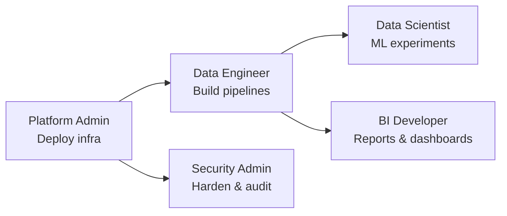

[Home](../../README.md) > [Docs](../) > [Quickstarts](./) > **Index**

# Role-Based Quickstarts -- Your First 30 Minutes

CSA-in-a-Box serves multiple personas across data engineering, analytics,
security, and platform operations. Pick the quickstart that matches your role
for the fastest path to value -- each guide walks you from zero to a working
deliverable in a single sitting.

---

## Pick Your Persona

| Role               | What You'll Build                      | Time   | Prerequisites                                          | Link                                   |
| ------------------ | -------------------------------------- | ------ | ------------------------------------------------------ | -------------------------------------- |
| **Data Engineer**  | First ADF + dbt pipeline (CSV to Gold) | 30 min | Azure subscription, VS Code, dbt CLI                   | [data-engineer.md](data-engineer.md)   |
| **Data Scientist** | First ML experiment on the lakehouse   | 30 min | Azure subscription, Python 3.10+, Databricks workspace | [data-scientist.md](data-scientist.md) |
| **BI Developer**   | First Power BI report over Gold layer  | 30 min | Power BI Desktop, Microsoft Fabric trial               | [bi-developer.md](bi-developer.md)     |
| **Security Admin** | Audit and harden the platform          | 30 min | Azure subscription, Purview access                     | [security-admin.md](security-admin.md) |
| **Platform Admin** | Deploy and manage full infrastructure  | 45 min | Azure subscription, Azure CLI 2.50+, Bicep CLI         | [platform-admin.md](platform-admin.md) |

> **Not sure where to start?** If you just want to deploy the platform and see
> data flow end-to-end, begin with the
> [Platform Admin](platform-admin.md) quickstart, then move to
> [Data Engineer](data-engineer.md).

---

## How the Quickstarts Fit Together



The **Platform Admin** quickstart provisions the foundation resources that every
other role depends on. If your environment is already deployed, skip straight to
your role-specific guide.

---

## Before You Begin

Every quickstart assumes that the CSA-in-a-Box repository has been cloned
locally and that you can authenticate to Azure:

```bash
git clone https://github.com/your-org/csa-inabox.git
cd csa-inabox
az login
az account set --subscription "<YOUR_SUBSCRIPTION_ID>"
```

If you are working in an Azure Government environment, append `--cloud AzureUSGovernment`
to the `az login` command. See the
[Azure Government quickstart section](../QUICKSTART.md) for details.

---

## What's Next After Your Quickstart

Once you have completed your 30-minute quickstart, continue with the full
tutorials and deep-dive guides:

| Completed Quickstart | Recommended Next Step                                                                 |
| -------------------- | ------------------------------------------------------------------------------------- |
| Data Engineer        | [Tutorial 01 -- Foundation Platform](../tutorials/01-foundation-platform/README.md)   |
| Data Engineer        | [ADF Setup Guide](../ADF_SETUP.md)                                                    |
| Data Engineer        | [Databricks Guide](../DATABRICKS_GUIDE.md)                                            |
| Data Scientist       | [Tutorial 06 -- AI Analytics Foundry](../tutorials/06-ai-analytics-foundry/README.md) |
| BI Developer         | [Power BI Guide](../guides/power-bi.md)                                               |
| BI Developer         | [Supercharge Microsoft Fabric — Direct Lake & Power BI Tutorial](https://fgarofalo56.github.io/Suppercharge_Microsoft_Fabric/tutorials/05-direct-lake-powerbi/) |
| Security Admin       | [Purview Guide](../guides/purview.md)                                                 |
| Security Admin       | [Security & Compliance Best Practices](../best-practices/security-compliance.md)      |
| Platform Admin       | [Architecture Overview](../ARCHITECTURE.md)                                           |
| Platform Admin       | [Cost Management](../COST_MANAGEMENT.md)                                              |
| Platform Admin       | [Production Checklist](../PRODUCTION_CHECKLIST.md)                                    |

---

## Related

- [Full Quick Start Guide (60-90 min end-to-end)](../QUICKSTART.md)
- [Developer Pathways](../DEVELOPER_PATHWAYS.md)
- [Tutorials Index](../tutorials/README.md)
- [Best Practices Index](../best-practices/index.md)
- [Use Cases Index](../use-cases/index.md)
- [Supercharge Microsoft Fabric](https://fgarofalo56.github.io/Suppercharge_Microsoft_Fabric/) — companion site with 37 Fabric tutorials and POC agendas
