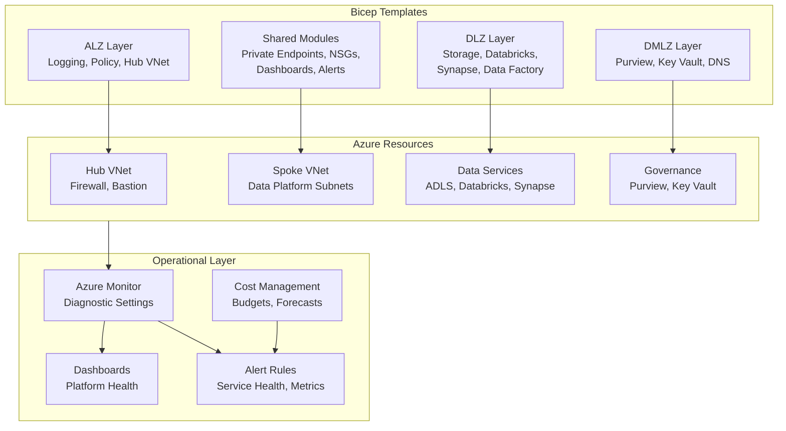

# Platform Admin Quickstart -- Deploy and Manage in 45 Minutes

> **Time:** 45 minutes
> **Difficulty:** Intermediate
> **What you'll do:** Deploy the CSA-in-a-Box foundation infrastructure using Bicep, configure monitoring and alerting, and set up cost management budgets and alerts so you can operate the platform from day one.

---

## Prerequisites

- [ ] **Azure subscription** with **Owner** role at the subscription level
- [ ] **Azure CLI** 2.50+ -- [Install guide](https://learn.microsoft.com/en-us/cli/azure/install-azure-cli)
- [ ] **Bicep CLI** 0.22+ (bundled with recent Azure CLI; verify with `az bicep version`)
- [ ] **Git** -- [git-scm.com](https://git-scm.com/)
- [ ] A target **Azure region** selected (e.g., `eastus2`, `usgovvirginia`)

```bash
az version --output table
az bicep version
az login
az account show --output table
```

---

## Architecture Diagram



---

## Step 1 -- Clone and Review Structure

```bash
git clone https://github.com/<org>/csa-inabox.git
cd csa-inabox
```

Bicep templates are organized under `deploy/bicep/`:

```
deploy/bicep/
  landing-zone-alz/     # Azure Landing Zone -- logging, policy, hub networking
    01_Logging/          # Log Analytics, diagnostic settings
    02_Policy/           # Azure Policy assignments and custom definitions
    03_Network/          # Hub VNet, Firewall, Bastion, VPN Gateway
    modules/             # Reusable ALZ modules
  DMLZ/                  # Data Management LZ -- Purview, Key Vault, DNS zones
  DLZ/                   # Data LZ -- Storage, Databricks, Synapse, Data Factory
  shared/                # Cross-cutting: networking, dashboards, alerts, security
  gov/                   # Azure Government variant modules
```

Deploy sequentially: ALZ first (foundation), then DMLZ (governance), then DLZ (data services).

---

## Step 2 -- Configure Parameters

Copy the sample parameter files and customize them for your environment.

### Key Parameters

| Parameter                 | Description                                  |
| ------------------------- | -------------------------------------------- |
| `location`                | Target Azure region                          |
| `environmentPrefix`       | Environment name prefix (e.g., `dev`, `prd`) |
| `hubVnetAddressPrefix`    | Hub VNet CIDR (e.g., `10.0.0.0/16`)          |
| `spokeVnetAddressPrefix`  | Spoke VNet CIDR (e.g., `10.1.0.0/16`)        |
| `logAnalyticsWorkspaceId` | Resource ID of the Log Analytics workspace   |
| `keyVaultName`            | Globally unique Key Vault name               |
| `storageAccountName`      | Globally unique storage account name         |
| `adminGroupObjectId`      | Entra ID group for platform admins           |

### Environment-Specific Overrides

```bash
cp deploy/bicep/landing-zone-alz/03_Network/samples/baseline.sample.bicep \
   deploy/bicep/landing-zone-alz/03_Network/dev.parameters.json
```

Replace all placeholder values (`<sub-id>`, `<region>`, `<prefix>`) with your environment specifics.

---

## Step 3 -- Deploy the Landing Zone

Deploy the three layers in order using `az deployment sub create`.

### Deploy ALZ Foundation

```bash
LOCATION="eastus2"
ENV_PREFIX="dev"

az deployment sub create \
  --name "alz-logging-${ENV_PREFIX}" \
  --location "$LOCATION" \
  --template-file deploy/bicep/landing-zone-alz/01_Logging/logging/logging.bicep \
  --parameters location="$LOCATION" environmentPrefix="$ENV_PREFIX"

az deployment sub create \
  --name "alz-policy-${ENV_PREFIX}" \
  --location "$LOCATION" \
  --template-file deploy/bicep/landing-zone-alz/02_Policy/main.bicep \
  --parameters location="$LOCATION" environmentPrefix="$ENV_PREFIX"

az deployment sub create \
  --name "alz-network-${ENV_PREFIX}" \
  --location "$LOCATION" \
  --template-file deploy/bicep/landing-zone-alz/03_Network/hubNetworking/hubNetworking.bicep \
  --parameters location="$LOCATION" environmentPrefix="$ENV_PREFIX"
```

### Deploy DMLZ and DLZ

```bash
az deployment sub create \
  --name "dmlz-${ENV_PREFIX}" \
  --location "$LOCATION" \
  --template-file deploy/bicep/DMLZ/main.bicep \
  --parameters location="$LOCATION" environmentPrefix="$ENV_PREFIX"

az deployment sub create \
  --name "dlz-${ENV_PREFIX}" \
  --location "$LOCATION" \
  --template-file deploy/bicep/DLZ/main.bicep \
  --parameters location="$LOCATION" environmentPrefix="$ENV_PREFIX"
```

For a complete walkthrough, see [Tutorial 01: Foundation Platform](../tutorials/01-foundation-platform/README.md).

---

## Step 4 -- Verify Deployment

### Check Resource Groups

```bash
az group list \
  --query "[?starts_with(name, '${ENV_PREFIX}')].{Name:name, Location:location, State:properties.provisioningState}" \
  --output table
```

Expected resource groups: `{prefix}-rg-logging`, `{prefix}-rg-network`, `{prefix}-rg-governance`, `{prefix}-rg-data`.

### Verify Networking

```bash
az network vnet peering list \
  --resource-group "${ENV_PREFIX}-rg-network" \
  --vnet-name "${ENV_PREFIX}-vnet-hub" \
  --query "[].{Peering:name, State:peeringState}" \
  --output table

az network private-dns zone list \
  --resource-group "${ENV_PREFIX}-rg-network" \
  --query "[].{Zone:name, RecordSets:numberOfRecordSets}" \
  --output table
```

Peering state should be `Connected`. Private DNS zones should exist for `privatelink.blob.core.windows.net`, `privatelink.dfs.core.windows.net`, and others.

### Test Private Endpoint Connectivity

```bash
# Verify private endpoint DNS resolves to private IP
nslookup ${ENV_PREFIX}datalake.blob.core.windows.net

az network private-endpoint list \
  --resource-group "${ENV_PREFIX}-rg-data" \
  --query "[].{Name:name, Status:privateLinkServiceConnections[0].privateLinkServiceConnectionState.status}" \
  --output table
```

---

## Step 5 -- Configure Monitoring

### Enable Diagnostic Settings

```bash
az monitor diagnostic-settings list \
  --resource "/subscriptions/<sub-id>/resourceGroups/${ENV_PREFIX}-rg-data/providers/Microsoft.Storage/storageAccounts/${ENV_PREFIX}datalake" \
  --query "[].{Name:name, Workspace:workspaceId}" \
  --output table

# If missing, create them
az monitor diagnostic-settings create \
  --name "send-to-loganalytics" \
  --resource "/subscriptions/<sub-id>/resourceGroups/${ENV_PREFIX}-rg-data/providers/Microsoft.Storage/storageAccounts/${ENV_PREFIX}datalake" \
  --workspace "/subscriptions/<sub-id>/resourceGroups/${ENV_PREFIX}-rg-logging/providers/Microsoft.OperationalInsights/workspaces/${ENV_PREFIX}-la" \
  --metrics '[{"category":"Transaction","enabled":true}]' \
  --logs '[{"category":"StorageRead","enabled":true},{"category":"StorageWrite","enabled":true}]'
```

### Deploy Dashboard and Alert Rules

```bash
az deployment group create \
  --resource-group "${ENV_PREFIX}-rg-logging" \
  --template-file deploy/bicep/shared/modules/dashboards/platformDashboard.bicep \
  --parameters workspaceId="/subscriptions/<sub-id>/resourceGroups/${ENV_PREFIX}-rg-logging/providers/Microsoft.OperationalInsights/workspaces/${ENV_PREFIX}-la"

az deployment group create \
  --resource-group "${ENV_PREFIX}-rg-logging" \
  --template-file deploy/bicep/shared/modules/alerts/serviceHealth.bicep \
  --parameters actionGroupId="/subscriptions/<sub-id>/resourceGroups/${ENV_PREFIX}-rg-logging/providers/Microsoft.Insights/actionGroups/platform-admins"

az deployment group create \
  --resource-group "${ENV_PREFIX}-rg-logging" \
  --template-file deploy/bicep/shared/modules/alerts/alertRules.bicep \
  --parameters workspaceId="/subscriptions/<sub-id>/resourceGroups/${ENV_PREFIX}-rg-logging/providers/Microsoft.OperationalInsights/workspaces/${ENV_PREFIX}-la"
```

### Verify Data Flowing to Log Analytics

```bash
az monitor log-analytics query \
  --workspace "${ENV_PREFIX}-la" \
  --analytics-query "Usage | summarize TotalMB=sum(Quantity) by DataType | order by TotalMB desc | take 10" \
  --output table
```

## Step 6 -- Set Up Cost Management

### Create a Monthly Budget

```bash
az consumption budget create \
  --budget-name "${ENV_PREFIX}-monthly-budget" \
  --amount 5000 \
  --time-grain Monthly \
  --start-date "2026-05-01" \
  --end-date "2027-04-30" \
  --resource-group "${ENV_PREFIX}-rg-data" \
  --category Cost
```

### Configure Cost Alert Thresholds

```bash
az consumption budget create \
  --budget-name "${ENV_PREFIX}-cost-alerts" \
  --amount 5000 \
  --time-grain Monthly \
  --start-date "2026-05-01" \
  --end-date "2027-04-30" \
  --category Cost \
  --notifications '{
    "Actual_50_Percent": {
      "enabled": true, "operator": "GreaterThan", "threshold": 50,
      "contactEmails": ["platform-team@contoso.com"], "thresholdType": "Actual"
    },
    "Actual_80_Percent": {
      "enabled": true, "operator": "GreaterThan", "threshold": 80,
      "contactEmails": ["platform-team@contoso.com","finance@contoso.com"], "thresholdType": "Actual"
    },
    "Forecasted_100_Percent": {
      "enabled": true, "operator": "GreaterThan", "threshold": 100,
      "contactEmails": ["platform-team@contoso.com","management@contoso.com"], "thresholdType": "Forecasted"
    }
  }'
```

### Review Current Spend and Tags

```bash
az costmanagement query \
  --type ActualCost --scope "subscriptions/<sub-id>" \
  --timeframe MonthToDate \
  --dataset-grouping name="ResourceGroup" type="Dimension" --output table
```

Ensure all resource groups carry cost-allocation tags:

```bash
az group list \
  --query "[?starts_with(name, '${ENV_PREFIX}')].{Name:name, CostCenter:tags.CostCenter, Owner:tags.Owner}" \
  --output table

az group update \
  --name "${ENV_PREFIX}-rg-data" \
  --tags CostCenter="DataPlatform" Owner="platform-team" Environment="$ENV_PREFIX"
```

## Step 7 -- Operational Readiness

### Verify DR and Backup

```bash
# Verify storage replication -- production should use GRS or RA-GRS
az storage account list \
  --query "[?starts_with(name, '${ENV_PREFIX}')].{Name:name, SKU:sku.name}" \
  --output table

# List backup policies
az backup policy list \
  --vault-name <vault-name> \
  --resource-group <rg-name> \
  --query "[].{Name:name, Type:properties.backupManagementType}" \
  --output table
```

### Verify Break-Glass Access and Lock Resources

```bash
az ad user list \
  --filter "startswith(displayName, 'BreakGlass')" \
  --query "[].{Name:displayName, UPN:userPrincipalName}" \
  --output table
```

Test break-glass access per the [Break-Glass Access Runbook](../runbooks/break-glass-access.md). Apply locks:

```bash
az lock create --name "protect-production" \
  --resource-group "${ENV_PREFIX}-rg-data" --lock-type CanNotDelete
az lock create --name "protect-governance" \
  --resource-group "${ENV_PREFIX}-rg-governance" --lock-type CanNotDelete
```

---

## Day-2 Operations Checklist

- [ ] **Daily:** Review Azure Service Health for active incidents
- [ ] **Weekly:** Review cost trends and compare against budget
- [ ] **Weekly:** Check Log Analytics ingestion volume
- [ ] **Weekly:** Review failed pipeline runs in Data Factory and Databricks
- [ ] **Monthly:** Run the [DR Drill Runbook](../runbooks/dr-drill.md)
- [ ] **Monthly:** Rotate secrets approaching expiry ([Key Rotation Runbook](../runbooks/key-rotation.md))
- [ ] **Monthly:** Review RBAC assignments for drift
- [ ] **Quarterly:** Review Azure Advisor recommendations
- [ ] **Quarterly:** Re-assess reserved instance coverage
- [ ] **Quarterly:** Conduct a tabletop security exercise
- [ ] **Annually:** Conduct a full Well-Architected Framework review

---

## Troubleshooting

| Symptom                                                   | Probable Cause                                         | Resolution                                                                                  |
| --------------------------------------------------------- | ------------------------------------------------------ | ------------------------------------------------------------------------------------------- |
| `az deployment sub create` fails with AuthorizationFailed | Missing Owner role at subscription scope               | Verify role with `az role assignment list --assignee <upn> --scope /subscriptions/<sub-id>` |
| Bicep compilation error on deploy                         | Bicep CLI version mismatch                             | Update with `az bicep upgrade` and verify minimum 0.22                                      |
| VNet peering stuck in `Initiated` state                   | Peering created in only one direction                  | Create the reciprocal peering from spoke to hub VNet                                        |
| Private DNS resolution returns public IP                  | Private DNS zone not linked to VNet                    | Link the zone: `az network private-dns link vnet create`                                    |
| Diagnostic settings show no data after 1 hour             | Resource provider not emitting for selected categories | Verify categories with `az monitor diagnostic-settings categories list --resource <id>`     |
| Budget creation fails with `InvalidTimeGrain`             | Start date is in the past or not first of month        | Use a future first-of-month date                                                            |
| Cost query returns empty results                          | Cost Management data has a 24-48 hour delay            | Wait for data to populate; use Portal for near-real-time estimates                          |
| `az consumption budget` command not found                 | Azure CLI `consumption` extension missing              | Install with `az extension add --name consumption`                                          |

---

## Related Resources

- [Architecture Overview](../ARCHITECTURE.md) -- full CSA-in-a-Box architecture
- [Tutorial 01: Foundation Platform](../tutorials/01-foundation-platform/README.md) -- detailed deployment walkthrough
- [IaC & CI/CD Best Practices](../IaC-CICD-Best-Practices.md) -- Bicep authoring patterns
- [Cost Optimization Best Practices](../best-practices/cost-optimization.md) -- cost optimization strategies
- [Monitoring & Observability](../best-practices/monitoring-observability.md) -- Log Analytics, dashboards, alerts
- [Disaster Recovery](../best-practices/disaster-recovery.md) -- RPO/RTO, failover, backup
- [Hub-Spoke Topology](../reference-architecture/hub-spoke-topology.md) -- network architecture
- [Break-Glass Access Runbook](../runbooks/break-glass-access.md) -- emergency access
- [Data Pipeline Failure Runbook](../runbooks/data-pipeline-failure.md) -- pipeline troubleshooting
- [DR Drill Runbook](../runbooks/dr-drill.md) -- DR exercise procedures
