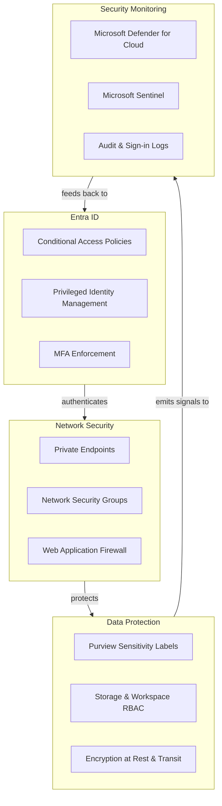

# Security Admin Quickstart -- Audit and Harden in 30 Minutes

> **Time:** 30 minutes
> **Difficulty:** Intermediate
> **What you'll do:** Audit your current security posture, enable key hardening controls across identity, network, and data layers, and verify compliance baselines against NIST 800-53 controls.

---

## Prerequisites

- [ ] **Azure subscription** with **Security Reader** role (Security Admin for write operations)
- [ ] **Microsoft Purview** access -- Data Reader role or above
- [ ] **Entra ID** -- Global Reader role (Conditional Access Administrator for write operations)
- [ ] **Azure CLI** 2.50+ installed and authenticated (`az login`)
- [ ] **Log Analytics workspace** deployed as part of the ALZ layer (see Tutorial 01)

```bash
az version --output table
az account show --output table
```

---

## Architecture Diagram



---

## Step 1 -- Review Entra ID Security

### Check MFA Registration Status

```bash
az rest --method GET \
  --uri "https://graph.microsoft.com/v1.0/reports/authenticationMethods/userRegistrationDetails" \
  --query "value[].{User:userPrincipalName, MFA:isMfaRegistered}" \
  --output table
```

Any user showing `MFA: false` must be remediated.

### List Conditional Access Policies

```bash
az rest --method GET \
  --uri "https://graph.microsoft.com/v1.0/identity/conditionalAccess/policies" \
  --query "value[].{Name:displayName, State:state, GrantControls:grantControls.builtInControls}" \
  --output table
```

Verify these policies exist and are `enabled`:

| Policy                              | Expected Grant Control |
| ----------------------------------- | ---------------------- |
| Require MFA for all users           | `mfa`                  |
| Block legacy authentication         | `block`                |
| Require compliant device for admins | `compliantDevice`      |
| Require MFA for Azure Management    | `mfa`                  |

### Verify PIM for Admin Roles

```bash
az rest --method GET \
  --uri "https://graph.microsoft.com/v1.0/roleManagement/directory/roleAssignments" \
  --query "value[].{RoleId:roleDefinitionId, PrincipalId:principalId}" \
  --output table
```

Confirm Global Administrator and high-privilege roles use **eligible** (not permanent) assignments. Permanent assignments outside break-glass accounts are a finding.

---

## Step 2 -- Audit Network Isolation

### 2.1 List Private Endpoints

```bash
az network private-endpoint list \
  --query "[].{Name:name, RG:resourceGroup, Status:privateLinkServiceConnections[0].privateLinkServiceConnectionState.status}" \
  --output table
```

Verify private endpoints exist for ADLS Gen2, Synapse, Databricks, Key Vault, Purview, and Data Factory.

### 2.2 Check for Public Network Access

```bash
# Storage accounts -- should show "Disabled" or "Deny"
az storage account list \
  --query "[].{Name:name, PublicAccess:publicNetworkAccess, DefaultAction:networkRuleSet.defaultAction}" \
  --output table

# Key Vaults
az keyvault list \
  --query "[].{Name:name, PublicAccess:properties.publicNetworkAccess}" \
  --output table
```

Any resource showing `Enabled` or `Allow` for public access is a **critical finding**.

### 2.3 Review NSG Rules

```bash
# Inspect a specific NSG for overly permissive inbound rules
az network nsg rule list \
  --nsg-name <nsg-name> \
  --resource-group <rg-name> \
  --query "[?access=='Allow' && direction=='Inbound'].{Rule:name, Priority:priority, Source:sourceAddressPrefix, DestPort:destinationPortRange}" \
  --output table
```

Flag any inbound rule with `sourceAddressPrefix` of `*` or `Internet` on ports other than 443.

---

## Step 3 -- Verify Data Protection

### Check Purview Sensitivity Labels

```bash
# List sensitivity labels applied across the Purview governance account
az rest --method GET \
  --uri "https://purview.azure.com/catalog/api/atlas/v2/search" \
  --headers "Content-Type=application/json" \
  --body '{"keywords": "*", "filter": {"classification": "Microsoft.Label.*"}, "limit": 25}'
```

Confirm labels such as **Confidential**, **Highly Confidential**, and **General** are applied to data assets in ADLS Bronze, Silver, and Gold zones.

### Verify RBAC Assignments on Storage

```bash
# List role assignments on the data lake storage account
az role assignment list \
  --scope "/subscriptions/<sub-id>/resourceGroups/<rg>/providers/Microsoft.Storage/storageAccounts/<storage>" \
  --query "[].{Principal:principalName, Role:roleDefinitionName}" \
  --output table
```

Ensure no individual users have **Storage Blob Data Owner** outside break-glass accounts, service principals use **Storage Blob Data Contributor** or narrower, and managed identities are preferred over secrets.

### Confirm Encryption at Rest

```bash
# Verify CMK (Customer-Managed Key) encryption on storage
az storage account show \
  --name <storage-name> \
  --resource-group <rg-name> \
  --query "{Encryption:encryption.keySource, KeyVaultUri:encryption.keyVaultProperties.keyVaultUri}" \
  --output table
```

For regulated environments, encryption key source should be `Microsoft.Keyvault` (CMK), not `Microsoft.Storage`.

---

## Step 4 -- Review Key Vault Access Policies

### Determine Access Model

```bash
# Check whether Key Vault uses Access Policies or RBAC
az keyvault list \
  --query "[].{Name:name, AccessModel:properties.enableRbacAuthorization}" \
  --output table
```

CSA-in-a-Box recommends **RBAC authorization** (`enableRbacAuthorization: true`). Access Policy model should be migrated.

### 4.2 Verify Key Rotation and Secret Expiry

```bash
# List keys and their expiry
az keyvault key list --vault-name <vault-name> \
  --query "[].{Name:name, Enabled:attributes.enabled, Expires:attributes.expires}" \
  --output table

# Check rotation policy on a specific key
az keyvault key rotation-policy show \
  --vault-name <vault-name> \
  --name <key-name>

# Audit secrets without expiry dates
az keyvault secret list --vault-name <vault-name> \
  --query "[].{Name:name, Expires:attributes.expires, Enabled:attributes.enabled}" \
  --output table
```

Keys should rotate automatically: 90 days for data-encryption keys, 365 days for root keys. All secrets should expire within 180 days.

---

## Step 5 -- Enable Defender for Cloud

```bash
# Enable Defender for SQL
az security pricing create --name SqlServers --tier Standard

# Enable Defender for Storage
az security pricing create --name StorageAccounts --tier Standard

# Enable Defender for Key Vault
az security pricing create --name KeyVaults --tier Standard

# Enable Defender for Containers (Databricks, AKS)
az security pricing create --name Containers --tier Standard

# Enable Defender for Resource Manager
az security pricing create --name Arm --tier Standard

# Verify all plans
az security pricing list \
  --query "[?pricingTier=='Standard'].{Plan:name, Tier:pricingTier}" \
  --output table
```

After enabling, allow up to 24 hours for the first security recommendations to appear. Configure a security contact for alert notifications:

```bash
az security contact create \
  --name "default" \
  --email "security-team@contoso.com" \
  --alert-notifications on \
  --alerts-to-admins on
```

---

## Step 6 -- Set Up Audit Logging

### Configure Diagnostic Settings

Send Entra ID sign-in and audit logs to the central Log Analytics workspace.

```bash
LA_WORKSPACE=$(az monitor log-analytics workspace show \
  --resource-group <alz-rg> \
  --workspace-name <workspace-name> \
  --query id -o tsv)

az monitor diagnostic-settings create \
  --name "entra-to-loganalytics" \
  --resource "/providers/Microsoft.aadiam/diagnosticSettings" \
  --workspace "$LA_WORKSPACE" \
  --logs '[
    {"category":"SignInLogs","enabled":true},
    {"category":"AuditLogs","enabled":true},
    {"category":"NonInteractiveUserSignInLogs","enabled":true},
    {"category":"ServicePrincipalSignInLogs","enabled":true},
    {"category":"ManagedIdentitySignInLogs","enabled":true},
    {"category":"RiskyUsers","enabled":true}
  ]'
```

### Alert on Failed Authentication Attempts

```kql
SigninLogs
| where TimeGenerated > ago(1h)
| where ResultType != "0"
| summarize FailedAttempts = count(), DistinctUsers = dcount(UserPrincipalName)
    by IPAddress, bin(TimeGenerated, 5m)
| where FailedAttempts > 20
| order by FailedAttempts desc
```

### Create Azure Monitor Alert Rule

```bash
az monitor scheduled-query create \
  --name "high-failed-auth" \
  --resource-group <alz-rg> \
  --scopes "$LA_WORKSPACE" \
  --condition "count > 20" \
  --condition-query "SigninLogs | where ResultType != '0' | summarize count() by IPAddress, bin(TimeGenerated, 5m)" \
  --window-size 5m \
  --evaluation-frequency 5m \
  --severity 2 \
  --action-groups "/subscriptions/<sub-id>/resourceGroups/<rg>/providers/Microsoft.Insights/actionGroups/<ag-name>"
```

---

## Step 7 -- Generate Compliance Report

### Export Defender Secure Score

```bash
az security secure-score list \
  --query "[].{Control:displayName, Current:current, Max:max, Percentage:percentage}" \
  --output table
```

### NIST 800-53 Control Mapping

| NIST Control | Category           | What to Check                         | Status |
| ------------ | ------------------ | ------------------------------------- | ------ |
| AC-2         | Account Mgmt       | PIM enabled, no permanent admin roles |        |
| AC-6         | Least Privilege    | RBAC scoped to resource groups        |        |
| AU-2         | Audit Events       | Diagnostic settings enabled           |        |
| AU-6         | Audit Review       | Sentinel workbooks deployed           |        |
| CM-7         | Least Function     | Unused services disabled              |        |
| IA-2         | MFA                | MFA enforced for all users            |        |
| IA-5         | Authenticator Mgmt | Key/secret rotation configured        |        |
| SC-7         | Boundary Protect   | Private endpoints, no public access   |        |
| SC-8         | Transmission Conf  | TLS 1.2 minimum enforced              |        |
| SC-12        | Key Mgmt           | CMK with Key Vault, rotation policies |        |
| SC-28        | Data at Rest       | Encryption enabled on all storage     |        |
| SI-4         | Monitoring         | Defender for Cloud plans enabled      |        |

Fill in the **Status** column (`Pass`, `Fail`, `Partial`) based on Steps 1-6. Any `Fail` or `Partial` entry becomes a remediation item.

### Export Regulatory Compliance Assessment

```bash
az security regulatory-compliance-standards list \
  --query "[].{Standard:name, State:state, PassedControls:passedControls, FailedControls:failedControls}" \
  --output table
```

---

## Security Hardening Checklist

Use this checklist as a post-audit summary.

- [ ] MFA enforced for 100% of user accounts
- [ ] Conditional Access blocks legacy authentication protocols
- [ ] PIM enabled -- no permanent Global Admin or Owner assignments
- [ ] Break-glass accounts documented and excluded from Conditional Access
- [ ] All data-plane resources use private endpoints
- [ ] No storage accounts, Key Vaults, or SQL pools allow public access
- [ ] NSGs restrict inbound to port 443 from known CIDRs only
- [ ] Purview sensitivity labels applied to Bronze, Silver, and Gold zones
- [ ] RBAC on storage follows least privilege
- [ ] CMK encryption enabled for all storage accounts
- [ ] Key Vault uses RBAC authorization model (not access policies)
- [ ] Key rotation policies configured (90 days DEKs, 365 days KEKs)
- [ ] All secrets have expiry dates within 180 days
- [ ] Defender for Cloud enabled for SQL, Storage, Key Vault, Containers, ARM
- [ ] Diagnostic settings send Entra ID logs to Log Analytics
- [ ] NIST 800-53 gap analysis documented with remediation owners

---

## Troubleshooting

| Symptom                                          | Probable Cause                                    | Resolution                                                                      |
| ------------------------------------------------ | ------------------------------------------------- | ------------------------------------------------------------------------------- |
| `az security pricing create` returns 403         | Insufficient role -- requires Security Admin      | Ask a subscription Owner to grant you the Security Admin role                   |
| MFA registration report returns empty results    | Graph `Reports.Read.All` permission not consented | Consent the permission in the Azure Portal                                      |
| Private endpoint status shows `Pending`          | DNS or approval not completed                     | Approve the connection and verify private DNS zone is linked to the VNet        |
| Diagnostic settings fail with `InvalidWorkspace` | Log Analytics workspace ID is incorrect           | Verify the workspace resource ID with `az monitor log-analytics workspace show` |
| KQL query returns no `SigninLogs` data           | Diagnostic settings were just enabled             | Wait 15-30 minutes for initial data ingestion                                   |
| Defender recommendations not appearing           | Plans were just enabled                           | Allow up to 24 hours for the first assessment cycle                             |

---

## Related Resources

- [Security & Compliance Best Practices](../best-practices/security-compliance.md) -- defense-in-depth patterns and Zero Trust
- [NIST 800-53 Rev 5 Compliance Mapping](../compliance/nist-800-53-rev5.md) -- full control family mapping
- [FedRAMP Moderate Compliance](../compliance/fedramp-moderate.md) -- FedRAMP-specific controls
- [Security Incident Response Runbook](../runbooks/security-incident.md) -- incident detection, containment, and recovery
- [Key Rotation Runbook](../runbooks/key-rotation.md) -- step-by-step key and secret rotation
- [Identity & Secrets Flow](../reference-architecture/identity-secrets-flow.md) -- identity, Key Vault, and managed identity flows
- [Break-Glass Access Runbook](../runbooks/break-glass-access.md) -- emergency access procedures
