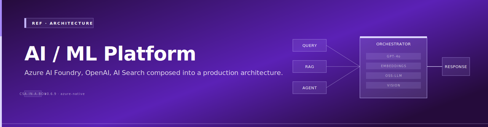
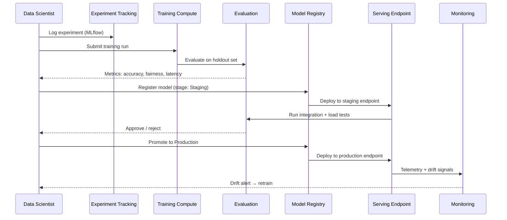
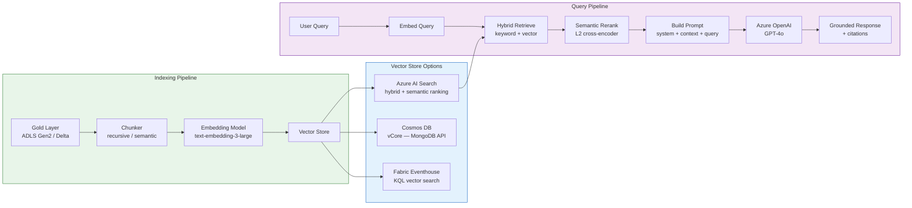
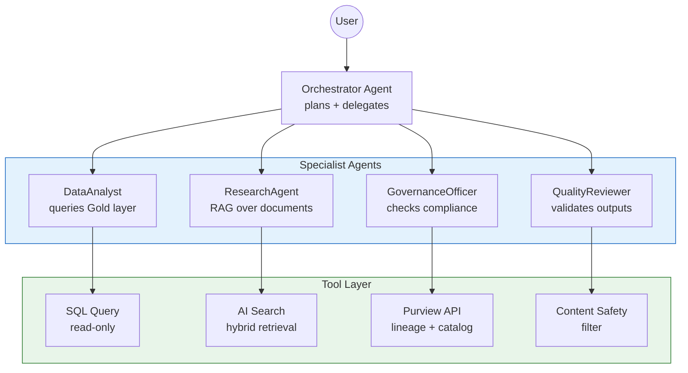
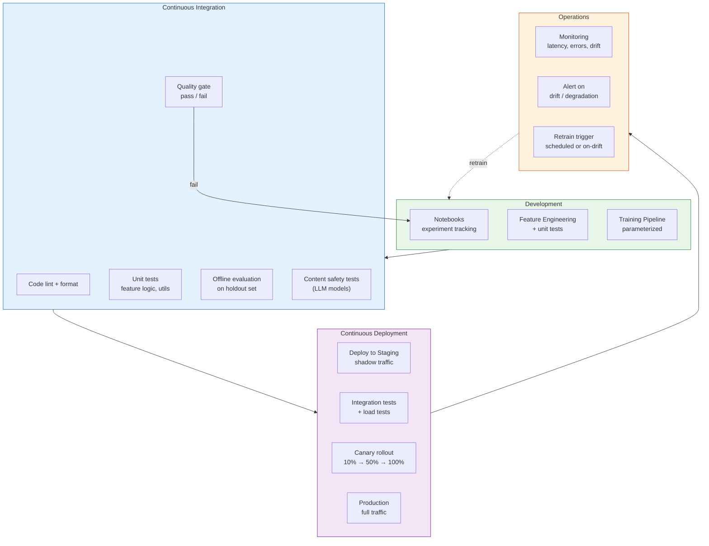

# AI/ML Platform Architecture — Azure AI at Enterprise Scale

{ .architecture-hero loading="eager" }

> **TL;DR:** CSA-in-a-Box provides a production-grade AI/ML platform combining Azure AI Foundry, Azure OpenAI, Databricks ML, and Fabric AI capabilities. This document maps the full stack — from feature engineering through model serving and monitoring — and shows how each component wires into the platform's medallion lakehouse, identity fabric, and governance layer.

## The problem

Enterprise AI projects fail not because the model is bad but because the platform around it is missing. Teams need a unified answer for: Where do features live? How do models get from notebook to endpoint? Who approved this deployment? What happens when the model drifts? How do we stop it from saying something harmful?

CSA-in-a-Box answers these questions with an opinionated stack that maps Azure AI services onto the existing data landing zone — same networking, same identity, same governance, same IaC.

---

## Architecture overview

```mermaid
flowchart TB
    subgraph Sources["Data Sources"]
        OLTP["OLTP Databases"]
        SAAS["SaaS APIs"]
        STREAM["Event Hubs / IoT"]
        FILES["File Drops<br/>CSV, PDF, images"]
    end

    subgraph Ingest["Ingestion"]
        ADF["Azure Data Factory<br/>batch + CDC"]
        EH["Event Hubs<br/>streaming"]
    end

    subgraph Lakehouse["Medallion Lakehouse"]
        BRONZE["Bronze<br/>raw / immutable"]
        SILVER["Silver<br/>cleaned / conformed"]
        GOLD["Gold<br/>business-ready"]
    end

    subgraph FeatureEng["Feature Engineering"]
        DBXFE["Databricks<br/>Feature Store"]
        FABFE["Fabric<br/>Feature Tables"]
    end

    subgraph Training["Model Training"]
        AML["Azure ML<br/>Compute Clusters"]
        DBXTR["Databricks<br/>MLflow Experiments"]
        FOUNDRY["AI Foundry<br/>Prompt Flow"]
    end

    subgraph Registry["Model Registry"]
        MLFLOW["MLflow<br/>Model Registry"]
        AMLREG["Azure ML<br/>Model Catalog"]
    end

    subgraph Serving["Model Serving"]
        AMLEP["Azure ML<br/>Managed Endpoints"]
        DBXSERV["Databricks<br/>Model Serving"]
        AOAI["Azure OpenAI<br/>GPT-4o / embeddings"]
        SERVERLESS["Serverless<br/>MaaS Endpoints"]
    end

    subgraph Monitoring["Monitoring & Governance"]
        AZMON["Azure Monitor<br/>+ App Insights"]
        DRIFT["Data / Model<br/>Drift Detection"]
        PURVIEW["Microsoft Purview<br/>Lineage + Catalog"]
    end

    subgraph RAI["Responsible AI — spans all stages"]
        SAFETY["Content Safety"]
        FAIRNESS["Fairness Metrics"]
        EXPLAIN["Explainability"]
        REDTEAM["Red-Teaming"]
    end

    Sources --> Ingest
    Ingest --> BRONZE --> SILVER --> GOLD
    GOLD --> FeatureEng
    FeatureEng --> Training
    Training --> Registry
    Registry --> Serving
    Serving --> Monitoring
    Monitoring -.->|retrain trigger| Training
    RAI -.->|governance layer| Training
    RAI -.->|governance layer| Serving
    RAI -.->|governance layer| Monitoring

    style Sources fill:#fff3e0,stroke:#e65100
    style Ingest fill:#e3f2fd,stroke:#1565c0
    style Lakehouse fill:#e8f5e9,stroke:#2e7d32
    style FeatureEng fill:#f3e5f5,stroke:#6a1b9a
    style Training fill:#fce4ec,stroke:#c62828
    style Registry fill:#e0f2f1,stroke:#00695c
    style Serving fill:#e8eaf6,stroke:#283593
    style Monitoring fill:#fff8e1,stroke:#f57f17
    style RAI fill:#fbe9e7,stroke:#bf360c
```

---

## Model lifecycle

Every model — whether a classical ML classifier or a fine-tuned LLM — follows the same lifecycle. Skipping a stage is how models break production.

**Key gates:**

| Gate               | What it checks                        | Blocks promotion if           |
| ------------------ | ------------------------------------- | ----------------------------- |
| **Offline eval**   | Accuracy, F1, AUC on holdout set      | Metric regresses vs. baseline |
| **Fairness check** | Demographic parity, equalized odds    | Disparity exceeds threshold   |
| **Latency test**   | P50 / P95 / P99 inference latency     | P95 > SLA target              |
| **Content safety** | Red-team prompt suite (LLMs only)     | Any category fails            |
| **Approval gate**  | Human review in Azure DevOps / GitHub | Not approved by model owner   |

---

## RAG patterns

Retrieval-Augmented Generation grounds LLM responses in your own data. It is the default pattern for domain Q&A in CSA-in-a-Box because it avoids fine-tuning cost, updates at ingest cadence, and produces citable answers.

### When to use RAG

- The knowledge base changes weekly or more frequently
- Answers must cite sources for auditability
- The corpus is broad or growing (fine-tuning struggles here)
- You need multi-domain retrieval across Gold data products

### Architecture

### Chunking strategies

| Strategy           | Chunk size      | Overlap    | Best for                                  |
| ------------------ | --------------- | ---------- | ----------------------------------------- |
| **Fixed-size**     | 512 tokens      | 50 tokens  | Uniform docs (CSV descriptions, metadata) |
| **Recursive**      | 512-1024 tokens | 100 tokens | Structured docs (Markdown, HTML, code)    |
| **Semantic**       | Variable        | --         | Long-form reports, legal filings          |
| **Document-level** | Full doc        | --         | Short docs under 512 tokens               |

### Vector store comparison

| Store                 | Hybrid search               | Semantic reranking     | Integrated vectorization | Best for                                 |
| --------------------- | --------------------------- | ---------------------- | ------------------------ | ---------------------------------------- |
| **Azure AI Search**   | Keyword + vector + semantic | Yes (L2 cross-encoder) | Yes                      | Primary RAG store — richest retrieval    |
| **Cosmos DB vCore**   | Vector only                 | No                     | No                       | Transactional apps needing vector search |
| **Fabric Eventhouse** | KQL + vector                | No                     | No                       | Analytics-heavy RAG over real-time data  |

### GraphRAG

For knowledge-dense corpora where entities and relationships matter more than raw text similarity, GraphRAG builds a knowledge graph from the corpus and traverses it during retrieval. This excels at multi-hop questions ("Which agencies referenced by the DOJ filing also appear in the EPA dataset?") where flat vector search returns irrelevant chunks.

See [Tutorial 09 — GraphRAG Knowledge Graphs](../tutorials/09-graphrag-knowledge/README.md) for the hands-on lab.

---

## Agent orchestration

Agents combine LLM reasoning with tool calling to perform multi-step tasks. CSA-in-a-Box standardizes on **Semantic Kernel** as the primary framework, with **AutoGen** available for multi-agent research workflows.

### Multi-agent patterns

### Framework comparison

| Framework           | Strengths                                                                          | When to use                                               |
| ------------------- | ---------------------------------------------------------------------------------- | --------------------------------------------------------- |
| **Semantic Kernel** | First-party Microsoft, native Azure OpenAI + AI Search plugins, C# and Python SDKs | Production agents with bounded tool sets                  |
| **AutoGen**         | Multi-agent conversations, code execution sandbox, research-oriented               | Exploratory analysis, multi-agent debate workflows        |
| **LangChain**       | Broad ecosystem, many integrations                                                 | Prototyping, teams with existing LangChain investment     |
| **Prompt Flow**     | Visual DAG authoring, built-in eval, AI Foundry native                             | Deterministic pipelines where you want each step explicit |

### Agent safety guardrails

Every agent in CSA-in-a-Box operates under these constraints:

1. **Read-only by default** — write actions require explicit human approval gates
2. **Tool allowlisting** — agents can only call registered, audited tools (3-10 per agent)
3. **Content safety filter** — all LLM inputs and outputs pass through Azure AI Content Safety
4. **Tamper-evident logging** — every tool call is logged with input, output, and caller identity
5. **Circuit breaker** — agent loops exceeding a configurable step limit (default: 15) are terminated

See [Tutorial 07 — AI Agents with Semantic Kernel](../tutorials/07-agents-foundry-sk/README.md) and the [AI Agents example](../examples/ai-agents.md) for implementation details.

---

## Fine-tuning vs RAG vs Agents

This expands on the [decision tree](../decisions/rag-vs-finetune-vs-agents.md) with a detailed comparison matrix.

| Dimension               | RAG                                                | Fine-tuning                                    | Agents                                         |
| ----------------------- | -------------------------------------------------- | ---------------------------------------------- | ---------------------------------------------- |
| **Best for**            | Domain Q&A over changing knowledge                 | Persistent style/syntax shift on stable corpus | Multi-step tool-using workflows                |
| **Knowledge freshness** | Updates at ingest cadence (minutes to hours)       | Frozen at training time                        | Depends on grounding (RAG or tools)            |
| **Cost profile**        | Embedding + vector store + LLM per query           | Training ($$$) + custom inference              | Multiple LLM calls per task ($$$)              |
| **Latency**             | 2-5 seconds (retrieve + generate)                  | Same as base model                             | Seconds to minutes (multi-step)                |
| **Auditability**        | High — citations from retrieved docs               | Low — learned behavior is opaque               | Medium — tool calls are logged                 |
| **Compliance**          | Data residency via Azure OpenAI + Search           | Training data residency must be proven         | Tool-use must be tamper-evident                |
| **Skill required**      | Python + embedding SDKs + eval discipline          | Training data curation + eval                  | Highest — orchestration + tool design          |
| **When NOT to use**     | One-shot transforms the base model already handles | Knowledge that changes (use RAG)               | When a single RAG + structured output suffices |

**Decision shortcut:** Default to **RAG**. Move to **Agents** when the task requires taking actions across systems. Move to **Fine-tuning** only when you have a stable, narrow corpus and need a persistent shift in model behavior that few-shot prompting cannot achieve.

---

## Feature stores

Feature stores bridge the gap between data engineering and model training by providing a single source of truth for feature definitions, computation, and serving.

### Databricks Feature Store

| Capability                | Detail                                                               |
| ------------------------- | -------------------------------------------------------------------- |
| **Feature tables**        | Delta tables with a primary key, registered in Unity Catalog         |
| **Online store**          | Publishes features to Cosmos DB or Azure SQL for low-latency serving |
| **Offline store**         | Reads directly from Delta Lake for batch training                    |
| **Point-in-time lookups** | Prevents data leakage by joining features as-of the label timestamp  |
| **Feature lineage**       | Tracked in Unity Catalog — who created it, what models consume it    |

### Fabric feature engineering

Fabric's Data Engineering experience supports feature computation via Spark notebooks and Dataflows Gen2. Features materialize as Delta tables in OneLake, consumable by both Fabric ML models and Azure ML.

### Online vs offline

| Dimension     | Offline store                                 | Online store                            |
| ------------- | --------------------------------------------- | --------------------------------------- |
| **Purpose**   | Batch training, backfill, historical analysis | Real-time inference                     |
| **Latency**   | Seconds to minutes                            | Single-digit milliseconds               |
| **Storage**   | Delta Lake (ADLS Gen2 / OneLake)              | Cosmos DB, Azure SQL, Redis             |
| **Freshness** | Updated on schedule (hourly, daily)           | Updated on write or near-real-time sync |
| **Cost**      | Low (storage only)                            | Higher (dedicated compute + storage)    |

---

## MLOps

MLOps is CI/CD for machine learning. Without it, models rot in notebooks and never reach production — or reach production and nobody knows when they break.

### Pipeline architecture

### Model versioning

Every model artifact is versioned in MLflow or Azure ML Model Registry with:

- **Metrics snapshot** — the evaluation scores at registration time
- **Input schema** — the expected feature vector (prevents silent schema drift)
- **Lineage** — which training data, feature store version, and code commit produced it
- **Stage** — None → Staging → Production → Archived

### Deployment strategies

| Strategy       | How it works                                                      | Risk                      | Best for                                           |
| -------------- | ----------------------------------------------------------------- | ------------------------- | -------------------------------------------------- |
| **Blue/green** | Two identical endpoints; swap traffic atomically                  | Low — instant rollback    | Batch-serving models, APIs with hard SLAs          |
| **Canary**     | Route a small percentage of traffic to the new model              | Medium — partial exposure | Real-time endpoints with high request volume       |
| **Shadow**     | New model receives production traffic but responses are discarded | Lowest — no user impact   | Validating a new model version before any exposure |
| **A/B test**   | Split traffic deliberately to compare model versions              | Medium                    | When you need statistically significant comparison |

### Drift detection

| Drift type        | What changes                                     | Detection method                                            | Action                                    |
| ----------------- | ------------------------------------------------ | ----------------------------------------------------------- | ----------------------------------------- |
| **Data drift**    | Input feature distributions shift                | Population Stability Index (PSI), KS test                   | Alert → investigate → retrain if causal   |
| **Concept drift** | Relationship between features and target changes | Monitor prediction distribution, ground-truth feedback loop | Retrain on new labeled data               |
| **Model drift**   | Model performance degrades over time             | Track live accuracy / F1 vs. baseline                       | Retrain when metric drops below threshold |

---

## Responsible AI

Every AI workload deployed through CSA-in-a-Box must pass through the Responsible AI layer. This is not optional — it is an architecture requirement enforced in CI/CD and runtime.

### Content safety

Azure AI Content Safety filters apply to all Azure OpenAI deployments. CSA-in-a-Box keeps the default filters active and adds custom blocklists for domain-specific terms.

| Filter                     | Default level | Applies to          |
| -------------------------- | ------------- | ------------------- |
| Hate and fairness          | Medium        | Prompt + completion |
| Sexual                     | Medium        | Prompt + completion |
| Violence                   | Medium        | Prompt + completion |
| Self-harm                  | Medium        | Prompt + completion |
| Prompt shields (jailbreak) | On            | Prompt only         |
| Protected material         | On            | Completion only     |

### Fairness and bias

For classical ML models, CSA-in-a-Box integrates Fairlearn to compute fairness metrics during evaluation:

- **Demographic parity** — prediction rates across protected groups
- **Equalized odds** — true positive and false positive rates across groups
- **Calibration** — predicted probabilities match observed outcomes per group

### Explainability

| Tool                                  | Model type       | Output                                               |
| ------------------------------------- | ---------------- | ---------------------------------------------------- |
| **SHAP**                              | Any model        | Feature importance values per prediction             |
| **InterpretML**                       | Glass-box models | Global and local explanations                        |
| **Azure ML Responsible AI dashboard** | Azure ML models  | Interactive fairness, explainability, error analysis |
| **Prompt Flow evaluators**            | LLM flows        | Groundedness, relevance, coherence scores            |

### Red-teaming

Before any LLM feature reaches production:

1. Run the Azure AI red-team prompt suite (adversarial prompts across all harm categories)
2. Run domain-specific red-team tests (prompt injection via retrieved documents, role-play attacks)
3. Gate deployment on zero high-severity failures
4. Log all red-team results for audit trail

---

## Cost considerations

### Azure OpenAI pricing

| Deployment type                  | Billing                        | Best for                                   | Commit      |
| -------------------------------- | ------------------------------ | ------------------------------------------ | ----------- |
| **Pay-As-You-Go (PAYG)**         | Per 1K tokens                  | Dev, spiky workloads, < 50K TPM            | None        |
| **Provisioned Throughput (PTU)** | Monthly per PTU                | Production steady-state, > 50K TPM         | 1 month min |
| **Serverless MaaS**              | Per 1K tokens (model-specific) | Open-source models (Phi-4, Llama, Mistral) | None        |

**Rule of thumb:** Start with PAYG. Measure steady-state TPM for 2-4 weeks. If consistently above 50K TPM, a PTU reservation will be cheaper and more predictable. Use the [Azure OpenAI PTU Calculator](https://oai.azure.com/portal/calculator) to size.

### GPU instance sizing for training

| Workload             | Instance series | GPUs | Use case                           |
| -------------------- | --------------- | ---- | ---------------------------------- |
| Small experiments    | NC-series (T4)  | 1    | Prototyping, small datasets        |
| Medium training      | NC A100-series  | 1-4  | Fine-tuning, mid-size models       |
| Large-scale training | ND A100 v4      | 8    | Distributed training, large models |
| Inference            | NC A10-series   | 1    | Real-time serving of custom models |

### Cost optimization tactics

| Tactic                          | Savings                           | Trade-off                               |
| ------------------------------- | --------------------------------- | --------------------------------------- |
| **Spot instances for training** | Up to 80% vs. on-demand           | Jobs can be preempted — must checkpoint |
| **Low-priority compute**        | Up to 80% in Azure ML             | Queue times increase during peak        |
| **Serverless endpoints**        | Pay only during inference         | Cold start latency (seconds)            |
| **Reduce embedding dimensions** | 50% storage savings (3072 → 1536) | Minimal recall loss in practice         |
| **Incremental enrichment**      | Avoid re-embedding unchanged docs | Requires knowledge store config         |
| **Auto-shutdown**               | 100% off-hours savings            | Compute unavailable until restart       |

---

## CSA-in-a-Box AI components

The platform wires all of the above into a deployable, governed whole. Here is how the pieces connect.

### Bicep modules for AI services

CSA-in-a-Box ships Bicep modules for each AI service, following the same patterns as the rest of the IaC:

| Module                     | Deploys                            | Key config                                     |
| -------------------------- | ---------------------------------- | ---------------------------------------------- |
| `ai-foundry-hub.bicep`     | AI Foundry Hub                     | Managed network, Key Vault, storage, ACR links |
| `ai-foundry-project.bicep` | AI Foundry Project                 | Hub association, connections, compute          |
| `azure-openai.bicep`       | Azure OpenAI account + deployments | Model, version, capacity (PAYG or PTU)         |
| `ai-search.bicep`          | Azure AI Search                    | Tier, replicas, partitions, semantic config    |
| `content-safety.bicep`     | Azure AI Content Safety            | Region, SKU                                    |

All modules enforce:

- Managed identity (no API keys in production)
- Private endpoints via the hub-spoke network
- Diagnostic settings → Log Analytics
- RBAC at minimum scope

### Portal AI chat

The CSA-in-a-Box portal includes an AI chat surface that uses the RAG pipeline against Gold-layer data products. It is built on Semantic Kernel with Azure AI Search retrieval and Azure OpenAI generation, following the patterns in Tutorial 08.

### Copilot integration

The platform exposes data products as Copilot-compatible data sources through:

- **Microsoft 365 Copilot connectors** — Gold-layer summaries surfaced in Teams and Word
- **Fabric Copilot** — natural-language queries over lakehouse tables
- **Custom Copilot surfaces** — the portal chat and API endpoints act as domain-specific copilots

See [ADR-0022 — Copilot Surfaces vs Docs Widget](../adr/0022-copilot-surfaces-vs-docs-widget.md) for the design decision.

---

## Trade-offs

### What this gives you

- **Single platform** — one networking, identity, and governance model for all AI workloads, not a shadow IT stack
- **Medallion-grounded AI** — models and RAG pipelines consume governed Gold-layer data, not raw dumps
- **Production MLOps** — CI/CD, drift detection, and canary deployments from day one
- **Responsible AI by default** — content safety, fairness checks, and red-teaming baked into the pipeline, not bolted on
- **Cost control** — clear guidance on PTU vs PAYG, spot instances, and serverless to avoid runaway GPU spend
- **Compliance-ready** — managed identity, private endpoints, Purview lineage, and tamper-evident agent logging satisfy FedRAMP, CMMC, and SOC 2 requirements

### What you give up

- **Flexibility** — the opinionated stack (Semantic Kernel over LangChain, MLflow over W&B, AI Search over Pinecone) limits choice; teams with existing investments may face migration effort
- **Complexity** — the full platform has many moving parts; small teams may not need feature stores, multi-agent orchestration, or canary deployments on day one
- **Azure lock-in** — deep integration with Azure AI Foundry, Azure OpenAI, and Fabric means this stack does not lift-and-shift to other clouds
- **Upfront investment** — standing up the full MLOps pipeline, content safety gates, and monitoring takes weeks before the first model ships; teams wanting to "just deploy a model" will feel slowed down

---

## Related

### Tutorials

- [Tutorial 06 — AI-First Analytics with Azure AI Foundry](../tutorials/06-ai-analytics-foundry/README.md)
- [Tutorial 07 — Building AI Agents with Semantic Kernel](../tutorials/07-agents-foundry-sk/README.md)
- [Tutorial 08 — RAG with Azure AI Search](../tutorials/08-rag-vector-search/README.md)
- [Tutorial 09 — GraphRAG Knowledge Graphs](../tutorials/09-graphrag-knowledge/README.md)

### Examples

- [AI Agents](../examples/ai-agents.md)
- [ML Lifecycle](../examples/ml-lifecycle.md)
- [Fabric Data Agent](../examples/fabric-data-agent.md)

### Decision guides

- [RAG vs Fine-Tuning vs Agents](../decisions/rag-vs-finetune-vs-agents.md)

### Service guides

- [Azure AI Foundry](../guides/azure-ai-foundry.md)
- [Azure AI Search](../guides/azure-ai-search.md)
- [Databricks Best Practices](../guides/databricks-best-practices.md)

### Patterns

- [LLMOps & Evaluation](../patterns/llmops-evaluation.md)

### Architecture decisions

- [ADR-0007 — Azure OpenAI over Self-Hosted LLM](../adr/0007-azure-openai-over-self-hosted-llm.md)
- [ADR-0017 — RAG Service-Layer Extraction](../adr/0017-rag-service-layer.md)
- [ADR-0022 — Copilot Surfaces vs Docs Widget](../adr/0022-copilot-surfaces-vs-docs-widget.md)

### Other reference architectures

- [Hub-Spoke Topology](hub-spoke-topology.md)
- [Data Flow (Medallion)](data-flow-medallion.md)
- [Identity & Secrets Flow](identity-secrets-flow.md)
