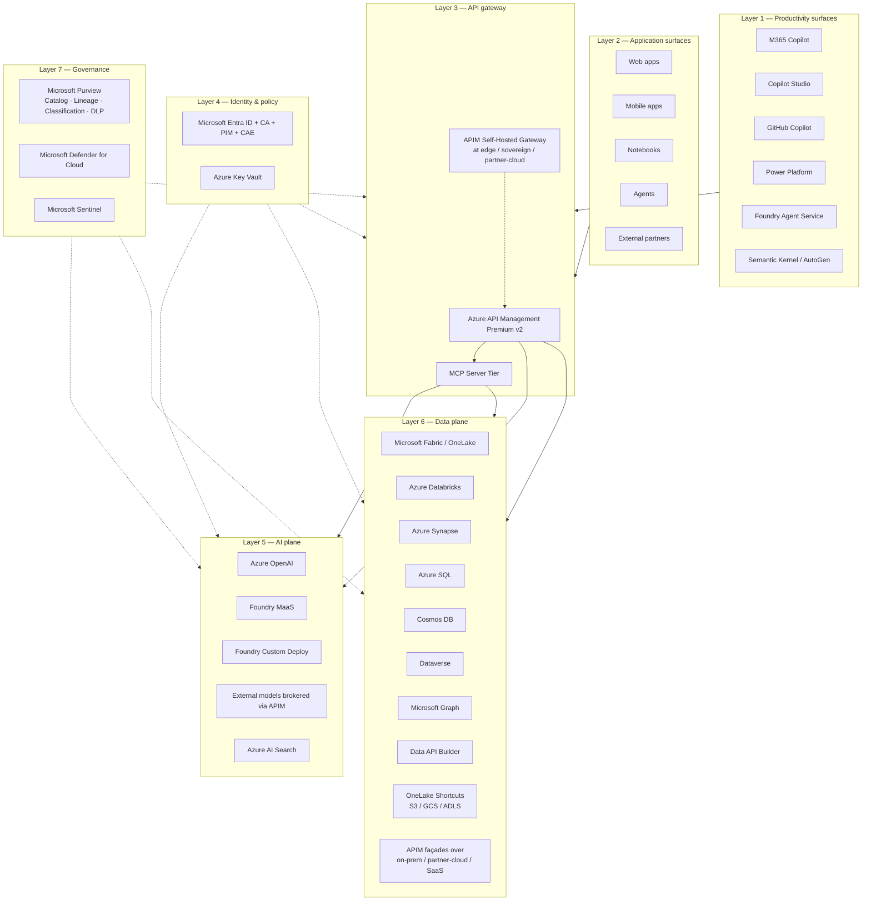
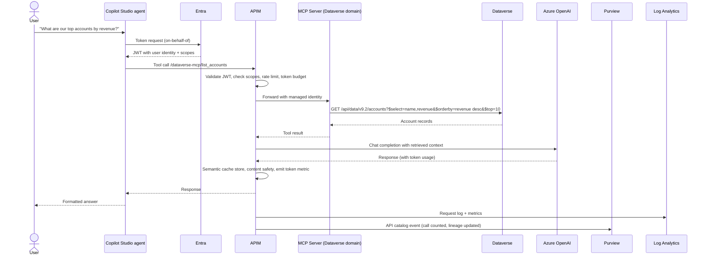
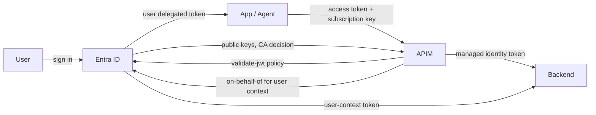
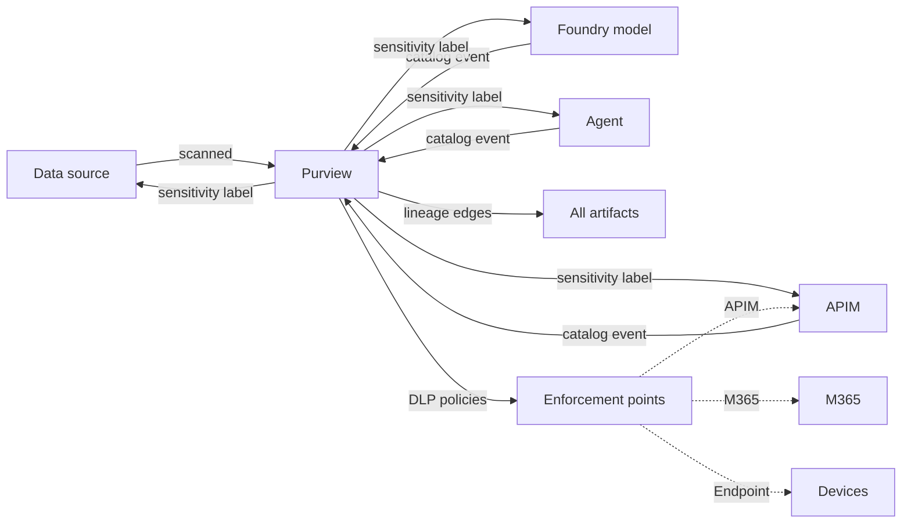

# Reference Architecture — API-First Multi-Model AI Ecosystem

## Purpose

This is the canonical Azure reference architecture for an organization that:

- Operates a heterogeneous AI estate (multiple models, multiple vendors, multiple clouds)
- Has data physically distributed across regions, boundaries, on-prem, and partner clouds
- Cannot move data freely (residency, compliance, sovereignty, cost)
- Requires identity-grounded zero-trust access for every API call
- Needs unified governance across data, APIs, and AI artifacts
- Operates productivity surfaces (Microsoft 365) where the workforce actually works
- Must integrate with existing investments — "least burden"

The architecture works in Azure Commercial, Azure Government, GCC High, and DoD IL5 / select IL6.

---

## High-level architecture

The architecture has **seven horizontal layers**:

| Layer | What lives here |
|---|---|
| 1. Productivity surfaces | Where the workforce works |
| 2. Application surfaces | Apps, agents, partner consumers |
| 3. API gateway | APIM + MCP tier — the integration seam |
| 4. Identity & policy | Entra, Key Vault, Conditional Access, PIM, CAE |
| 5. AI plane | Models, model gateway, search index |
| 6. Data plane | Lakehouse, warehouse, OLTP, business data, M365, shortcuts |
| 7. Governance | Purview, Defender, Sentinel |

Every API call traverses Layers 3, 4, and 7 — gateway, identity, governance — regardless of which combination of Layer 5 (AI) and Layer 6 (data) it touches.

---

## Component inventory

### Layer 1 — Productivity surfaces

| Component | Purpose |
|---|---|
| **Microsoft 365 Copilot** | AI assistant in Outlook, Teams, Word, Excel, PowerPoint, OneDrive |
| **Copilot Studio** | No-code authoring of conversational agents with declarative connectors |
| **GitHub Copilot / Copilot Workspace** | Developer productivity, code generation, repo Q&A |
| **Power Apps / Power Automate / Power Pages** | Low-code app building, workflow automation, external web portals |
| **Foundry Agent Service** | Pro-code agent deployment with full lifecycle management |
| **Semantic Kernel / AutoGen** | Code-first agent orchestration libraries |
| **Sales / Service / Finance Copilots** | Role-specific copilots over Dynamics + Graph |

### Layer 2 — Application surfaces

| Component | Purpose |
|---|---|
| **Web apps** | Custom UIs (React / Angular / Vue) |
| **Mobile apps** | iOS / Android with MSAL |
| **Notebooks** | Databricks / Fabric / Jupyter |
| **Agents** | Pro-code agents (Foundry Agent Service / SK / AutoGen) |
| **External partner consumers** | B2B-federated callers |

### Layer 3 — API gateway

| Component | Purpose |
|---|---|
| **APIM Premium v2** | Managed gateway in primary region(s) |
| **APIM Self-Hosted Gateway** | Data plane container at edge, partner cloud, on-prem, sovereign boundary |
| **MCP Server Tier** | Domain-scoped MCP servers behind APIM exposing tools + resources |
| **Front Door / Application Gateway** | Public surface + WAF |

### Layer 4 — Identity & policy

| Component | Purpose |
|---|---|
| **Microsoft Entra ID (or Entra ID Government)** | Identity issuance, Conditional Access, PIM, CAE |
| **Azure Key Vault** | Certificates, secrets, customer-managed encryption keys |
| **Managed identities** | Workload identity for Azure-hosted callers |
| **Federated identity credentials** | Workload identity for K8s, GitHub Actions, etc. |

### Layer 5 — AI plane

| Component | Purpose |
|---|---|
| **Azure OpenAI** | Frontier models (GPT-4o, GPT-4.1, o-series, embeddings) |
| **Foundry Models-as-a-Service** | Open-weight (Llama, Mistral, Phi, DeepSeek) and partner models |
| **Foundry custom deployments** | Fine-tuned and domain-specific models |
| **Azure AI Search** | Vector + keyword + hybrid retrieval for RAG |
| **Azure AI Content Safety** | Inline content safety policies |
| **External models brokered via APIM** | Bedrock, Vertex, sovereign LLMs |

### Layer 6 — Data plane

| Component | Purpose |
|---|---|
| **Microsoft Fabric / OneLake** | Unified lakehouse, lake-warehouse-mart, shortcuts |
| **Azure Databricks** | Spark / Delta / Unity Catalog / ML lifecycle |
| **Azure Synapse** | Serverless SQL (OPENROWSET), dedicated pools |
| **Azure SQL / SQL Managed Instance** | OLTP, mission databases |
| **Cosmos DB** | Globally distributed NoSQL, document, graph, vector |
| **Dataverse** | Power Platform / Dynamics business data |
| **Microsoft Graph** | M365 productivity data |
| **Data API Builder** | REST + GraphQL over SQL / Cosmos / PostgreSQL |
| **OneLake Shortcuts** | Read-only logical references to S3, GCS, ADLS, on-prem |
| **APIM façades over on-prem / partner-cloud / SaaS** | EAM, ERP, mainframe, third-party fabrics |

### Layer 7 — Governance

| Component | Purpose |
|---|---|
| **Microsoft Purview** | Catalog, lineage, classification, DLP for data + APIs + AI |
| **Microsoft Defender for Cloud** | Posture management, CSPM, CWPP, security recommendations |
| **Microsoft Sentinel** | SIEM, threat detection, automated response |
| **Microsoft Information Protection** | Sensitivity labels propagating across data, M365, APIs |

---

## Data flow — a typical agent call

A representative agent call traverses the architecture:

Properties:

- Identity preserved end-to-end (user → agent → APIM → MCP → DV; the user is in the Dataverse audit log)
- No data movement (Dataverse responds in place)
- Cached for similar future requests
- Cost emitted with user / agent / tool dimensions
- Audit trail in Log Analytics; lineage in Purview

---

## Identity flow

Three patterns coexist:

1. **Pure managed identity** — APIM asserts its own identity to the backend; user context lost; appropriate for system-to-system
2. **On-Behalf-Of** — APIM exchanges its token for one with user context preserved; appropriate for user-attributable operations
3. **Pass-through** — APIM forwards the user's token; appropriate when backend understands Entra natively

The choice per API is documented and consistent.

---

## Governance flow

One catalog, one lineage graph, one classification system, one set of DLP rules — applied everywhere data, APIs, and AI surfaces meet users.

---

## Deployment topology

### Single boundary, single region

For development and small production deployments:

- One APIM Premium v2 (one unit)
- One Entra tenant
- One Purview account
- Backends regional
- Front Door + WAF in front

### Single boundary, multi-region

For HA production:

- APIM Premium v2 in two regions (active-active)
- Front Door across regions
- Backends regionally replicated (Cosmos geo-replication, SQL active geo-replication)
- Purview cross-region catalog
- Cache regional (Redis); cold-start tolerated on failover

### Multi-boundary

For federal mission deployments crossing accreditation boundaries:

- One APIM per boundary
- Cross-boundary federation via Entra B2B and APIM-to-APIM trust
- Purview per boundary; lineage stitched at the catalog layer
- Self-hosted gateway at edge / partner-cloud / on-prem
- No network bridges between boundaries — federation is at the application layer

---

## Bicep starter

A minimal but production-shaped Bicep starter for this architecture is in [`examples/apim-api-first-starter/`](../solution-store/index.md). It deploys:

- APIM Premium v2 with VNet integration
- Entra app registration patterns
- AOAI deployment with LLM policy set applied
- Key Vault with managed identity binding
- Log Analytics + App Insights
- Foundry hub + project scaffolding
- Purview account
- Sample MCP server in Container Apps

---

## Related material

- [Whitepaper — API-first data strategy on Azure](../research/api-first-data-strategy-whitepaper.md)
- [Use case — API-first multi-model AI ecosystem](../use-cases/api-first-multi-model-ai-ecosystem.md)
- [Use case — Cross-platform integration](../use-cases/cross-platform-integration-fabric.md)
- [Best practice — API-first data strategy](../best-practices/api-first-data-strategy.md)
- [Best practice — Multi-model AI orchestration](../best-practices/multi-model-ai-orchestration.md)
- [Guide — APIM as the universal API gateway](../guides/apim-universal-gateway.md)
- [Guide — APIM + MCP layered orchestration](../guides/apim-mcp-layered-orchestration.md)
- [ADR-0023 — APIM as the integration fabric](../adr/0023-apim-as-integration-fabric.md)
- [Solution Store — Azure API-first accelerators](../solution-store/index.md)
