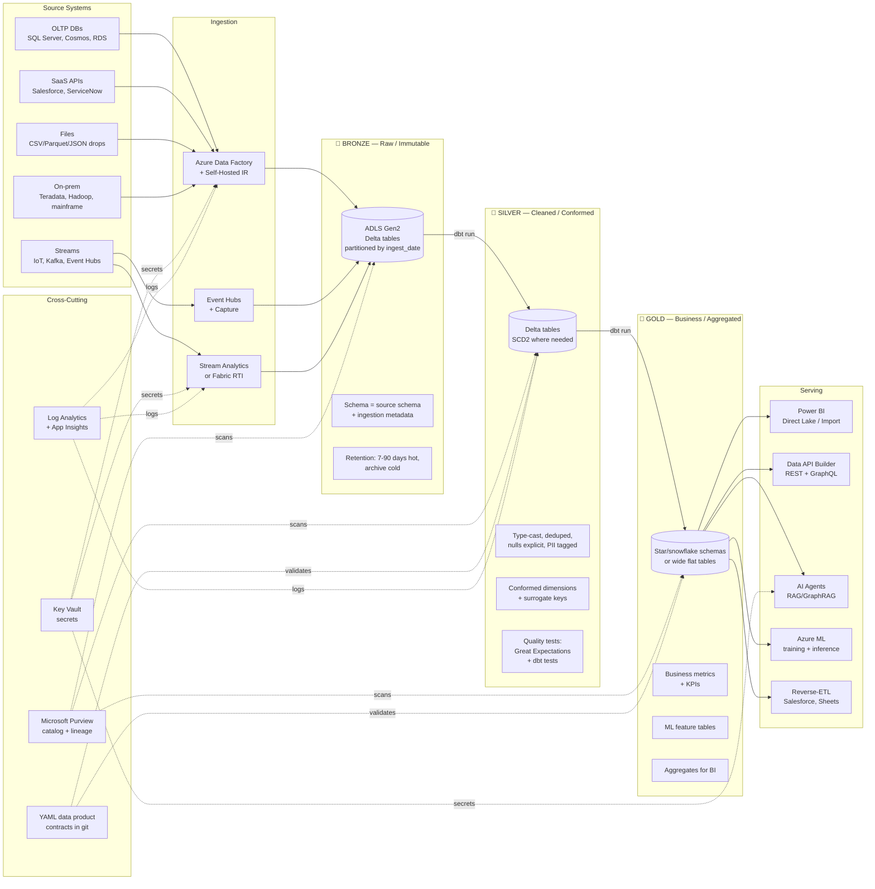

# Reference Architecture — Data Flow (Medallion)

> **TL;DR:** Bronze stores raw, silver stores cleaned-and-conformed, gold stores business-ready. Every transition is a **dbt** (or Spark) job with tests, version control, and lineage to Purview. Don't skip layers; don't denormalize bronze.

## The problem

A real analytics platform ingests from dozens of source systems with different schemas, qualities, freshnesses, and retention requirements — and serves dozens of consumer surfaces (BI, APIs, ML, AI agents, regulators) with conflicting needs. Without a strict **layered** approach, you end up with a god-mode pipeline that nobody can reason about and a single bad deploy breaks every dashboard.

## Architecture

## Layer rules

### Bronze (raw / immutable)

| Rule                                                                                                 | Why                                                                |
| ---------------------------------------------------------------------------------------------------- | ------------------------------------------------------------------ |
| **Schema = source schema, plus 4 metadata cols** (`_ingest_ts`, `_source`, `_batch_id`, `_file_uri`) | If source changes, you have what you need to replay                |
| **Append-only**, never updated in place                                                              | Bronze is your backup-of-record; deletes/updates compromise replay |
| **Partitioned by ingest_date** (not source date)                                                     | Operational pruning matches operational queries                    |
| **Stored as Delta** (not raw Parquet/CSV)                                                            | ACID + time travel + cheap scans                                   |
| **No PII redaction at this layer**                                                                   | Source-system fidelity; redaction happens entering silver          |
| **Lifecycle**: 7-90 days hot tier, then cool/archive                                                 | Hot Bronze is expensive; most queries hit silver/gold              |

### Silver (cleaned / conformed)

| Rule                                                                    | Why                                                                    |
| ----------------------------------------------------------------------- | ---------------------------------------------------------------------- |
| **Types are correct** (no string-encoded ints, no `null` strings)       | Downstream code can trust the schema                                   |
| **Nulls are explicit and modeled** (`is_known`, `unknown_reason`)       | Telling "missing" from "actively unknown" matters for ML and reporting |
| **PII is tagged** (Purview classification or column-level tag)          | Compliance can audit access                                            |
| **SCD2 where business semantics demand it** (customers, products, orgs) | Historical reporting works                                             |
| **Conformed dimensions** (one canonical `dim_customer`, not 5)          | Joining across domains is possible                                     |
| **Surrogate keys** generated, natural keys preserved                    | Schema changes upstream don't break downstream joins                   |
| **Quality tests are mandatory** (not "we'll add them later")            | Silver is what gold trusts                                             |

### Gold (business / aggregated)

| Rule                                                                             | Why                                                             |
| -------------------------------------------------------------------------------- | --------------------------------------------------------------- |
| **Business-friendly column names**, not source-system jargon                     | Analysts reading SQL shouldn't need a dictionary                |
| **Wide flat or star schema**, optimized for the consumer                         | Direct Lake / Power BI prefers star; ML often prefers wide flat |
| **Definitions match official metric definitions** (and link to them in dbt docs) | "Revenue" means the same thing in every dashboard               |
| **Aggregations are explicit** (`daily_sales_by_region`, not `sales`)             | Naming reveals the grain                                        |
| **Slowly-changing where business semantics demand**, snapshotted otherwise       | Predictable rebuild semantics                                   |
| **Each gold table maps to ≥ 1 published data product contract**                  | Consumers can rely on schema + SLA                              |

## Where each Azure service fits

| Service                            | Layer                                                       | Purpose                                                               |
| ---------------------------------- | ----------------------------------------------------------- | --------------------------------------------------------------------- |
| **Azure Data Factory**             | Sources → Bronze                                            | Batch ingestion, orchestration, self-hosted IR for on-prem            |
| **Event Hubs + Capture**           | Sources → Bronze                                            | Streaming ingestion with auto-archive to ADLS                         |
| **Stream Analytics / Fabric RTI**  | Sources → Bronze (or directly to Silver for streaming gold) | Stream processing, windowing, anomaly detection                       |
| **ADLS Gen2**                      | Bronze, Silver, Gold                                        | Object store for all Delta tables                                     |
| **Delta Lake**                     | Bronze, Silver, Gold                                        | Storage format — ACID + time travel + Z-order                         |
| **Databricks**                     | Silver, Gold                                                | Spark-based dbt runs, complex transformations, ML feature engineering |
| **Synapse Spark / Serverless SQL** | Silver, Gold                                                | Alternative compute, especially for ad-hoc analyst SQL over Bronze    |
| **Microsoft Fabric Lakehouse**     | Silver, Gold                                                | Strategic forward path — Direct Lake for BI, KQL for streaming        |
| **Microsoft Purview**              | Cross-cutting                                               | Catalog + lineage + classification + access                           |
| **Key Vault**                      | Cross-cutting                                               | Secrets — never in pipelines or notebooks                             |
| **Log Analytics + App Insights**   | Cross-cutting                                               | Pipeline runs, query perf, error rates                                |
| **Power BI / Fabric**              | Gold → Serve                                                | BI dashboards, semantic models                                        |
| **Data API Builder**               | Gold → Serve                                                | Auto-generated REST + GraphQL over gold tables                        |
| **Azure OpenAI + AI Search**       | Gold → Serve                                                | RAG / agents grounded in gold                                         |

## Lineage

Every transformation runs in **dbt** (with the exception of Spark-only workloads which run in Databricks notebooks). dbt + Purview together give you:

- Column-level lineage from bronze → silver → gold
- "What does this column mean" docs auto-generated from `meta` and `description`
- Upstream/downstream impact analysis when planning a schema change
- Data freshness SLAs automated as `dbt source freshness`

See [ADR 0013 — dbt as Canonical Transformation](../adr/0013-dbt-as-canonical-transformation.md) for the rationale.

## Trade-offs

✅ **Why this pattern wins**

- Each layer has one job → easier to reason about, easier to debug
- Bronze immutability = full replay any time
- Silver conformance = downstream consumers trust their inputs
- Gold business definitions = "the report says X" matches "the API returns X"
- dbt + tests + Purview = real lineage, not Confluence diagrams

⚠️ **What you give up**

- Three layers means **3× storage**. Mitigate with tier'd lifecycle on bronze.
- Latency from raw to gold can be **15-60 minutes** for batch. For sub-minute, use a separate streaming-gold path (Fabric RTI / KQL DB).
- Initial setup is heavier than "one giant ETL job." Pays back at scale 2; doesn't pay back at scale 0.5.
- **Discipline is required**. Skipping silver "just for one report" creates the spaghetti you tried to avoid.

## Variants

| Scenario                   | Variant                                                                                                                                                 |
| -------------------------- | ------------------------------------------------------------------------------------------------------------------------------------------------------- |
| **Streaming-first**        | Bronze becomes Event Hub Capture; silver/gold built in Fabric RTI (Eventhouse / KQL DB). See [Patterns — Streaming & CDC](../patterns/streaming-cdc.md) |
| **CDC-heavy**              | Add a CDC service (Debezium → Event Hubs, or Synapse Link for SQL) before Bronze; bronze stores the changelog as Delta CDC                              |
| **ML-heavy**               | Add a Feature Store (Databricks FS or Azure ML FS) between Silver and Gold; ML training reads from the feature store, not gold directly                 |
| **AI-heavy**               | Gold tables get vectorized into AI Search indexes; agents/RAG read from indexes, not gold tables directly                                               |
| **Regulated (HIPAA, PCI)** | Same pattern; add encryption-at-rest with CMK, column-level encryption for sensitive cols, separate "PII silver" with stricter RBAC                     |

## Related

- [Best Practices — Medallion Architecture](../best-practices/medallion-architecture.md) (the long version)
- [Best Practices — Data Engineering](../best-practices/data-engineering.md)
- [ADR 0001 — ADF + dbt over Airflow](../adr/0001-adf-dbt-over-airflow.md)
- [ADR 0003 — Delta Lake over Iceberg/Parquet](../adr/0003-delta-lake-over-iceberg-and-parquet.md)
- [ADR 0013 — dbt as Canonical Transformation](../adr/0013-dbt-as-canonical-transformation.md)
- [Reference Architecture — Fabric vs Synapse vs Databricks](fabric-vs-synapse-vs-databricks.md)
- [Patterns — Streaming & CDC](../patterns/streaming-cdc.md)
