# Architecture Diagram Gallery — CSA-in-a-Box Visual Reference

Presentation-ready Mermaid diagrams for architects, engineers, and stakeholders. Every diagram diffs cleanly in git, renders natively in MkDocs Material, and can be customized to match your organization's naming conventions, regions, or service selections. Copy any diagram into a design document, architecture decision record, or slide deck and adjust the labels to fit your context.

---

## Platform Overview

End-to-end CSA-in-a-Box platform from source systems through consumption. Use this when presenting the full solution to executive sponsors or during initial architecture reviews.

```mermaid
flowchart LR
    subgraph Sources[Data Sources]
        OLTP[OLTP DBs]
        SaaS[SaaS APIs]
        Files[Files]
        IoT[IoT]
    end
    subgraph Ingestion[Ingestion]
        ADF[Data Factory]
        EH[Event Hubs]
    end
    subgraph Storage[Storage]
        ADLS[(ADLS Gen2)]
        OneLake[(OneLake)]
    end
    subgraph Processing[Processing]
        DBX[Databricks / dbt]
        FabricSpark[Fabric Spark]
        SA[Stream Analytics]
    end
    subgraph Serving[Serving]
        SynSQL[Synapse SQL]
        Cosmos[(Cosmos DB)]
    end
    subgraph Consumption[Consumption]
        PBI[Power BI]
        APIs[APIs / APIM]
        Portal[Data Portal]
    end
    subgraph CrossCutting[Cross-Cutting]
        Purview[Purview]
        KV[Key Vault]
        Entra[Entra ID]
        Monitor[Monitor]
    end
    Sources --> Ingestion --> Storage --> Processing --> Serving --> Consumption
    CrossCutting -.->|governs| Storage
    CrossCutting -.->|secures| Processing
    CrossCutting -.->|monitors| Serving
    classDef source fill:#e3f2fd,stroke:#1565c0,color:#0d47a1
    classDef ingest fill:#fff3e0,stroke:#e65100,color:#bf360c
    classDef store fill:#e8f5e9,stroke:#2e7d32,color:#1b5e20
    classDef process fill:#f3e5f5,stroke:#6a1b9a,color:#4a148c
    classDef serve fill:#fce4ec,stroke:#c62828,color:#b71c1c
    classDef consume fill:#e0f7fa,stroke:#00838f,color:#006064
    classDef cross fill:#f5f5f5,stroke:#616161,color:#212121
    class OLTP,SaaS,Files,IoT source
    class ADF,EH ingest
    class ADLS,OneLake store
    class DBX,FabricSpark,SA process
    class SynSQL,Cosmos serve
    class PBI,APIs,Portal consume
    class Purview,KV,Entra,Monitor cross
```

## Landing Zone Topology

Management group hierarchy with hub-spoke networking. Use this when presenting your subscription and governance layout to platform teams or during Azure landing zone workshops.

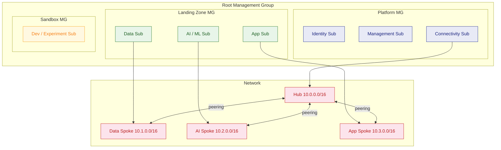

## Network Architecture

Hub-spoke network with firewall, gateways, private endpoints, and DNS zones. Use this during network design reviews or when explaining connectivity to security teams.

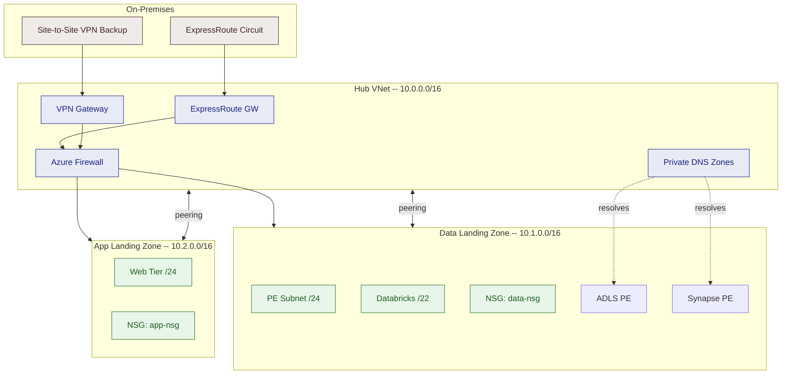

## Security Zones

Trust boundary model showing traffic flow from the public internet through progressively restricted zones. Use this during threat modeling sessions and security architecture reviews.

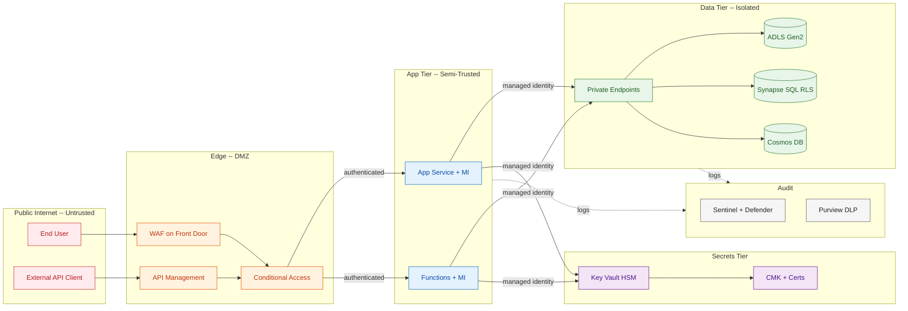

---

## Medallion Data Flow

Bronze-silver-gold architecture with specific Azure services at each layer. Use this to explain the data transformation pipeline to data engineers and business stakeholders.

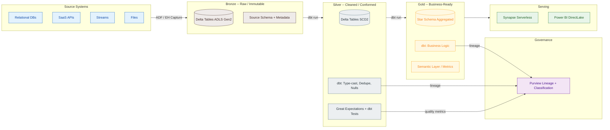

---

## AI/ML Pipeline

End-to-end machine learning lifecycle from data preparation to production monitoring. Use this when presenting ML platform architecture to data science teams or reviewing MLOps maturity.

```mermaid
flowchart LR
    subgraph Data[Data Preparation]
        GoldLayer[(Gold Layer)]
        FeatureEng[Feature Engineering]
        FeatureStore[(Feature Store)]
    end
    subgraph Training[Training]
        Notebooks[Notebooks Databricks / Fabric]
        AzureML[Azure ML]
    end
    subgraph Registry[Registry]
        MLflow[MLflow Dev / Staging / Prod]
        Validation[Validation Gates]
    end
    subgraph Deployment[Deployment]
        Managed[Online Endpoints]
        Batch[Batch Endpoints]
    end
    subgraph Monitoring[Monitoring]
        DataDrift[Data Drift]
        ModelPerf[Performance]
        AzMon[Azure Monitor]
        Feedback[Retrain Trigger]
    end
    GoldLayer --> FeatureEng --> FeatureStore
    FeatureStore --> Notebooks & AzureML
    Notebooks & AzureML --> MLflow --> Validation
    Validation --> Managed & Batch
    Managed --> DataDrift
    Batch --> ModelPerf
    DataDrift & ModelPerf --> AzMon --> Feedback -->|retrain| Notebooks
    classDef data fill:#e8f5e9,stroke:#2e7d32,color:#1b5e20
    classDef train fill:#e3f2fd,stroke:#1565c0,color:#0d47a1
    classDef registry fill:#fff3e0,stroke:#e65100,color:#bf360c
    classDef deploy fill:#f3e5f5,stroke:#6a1b9a,color:#4a148c
    classDef monitor fill:#fce4ec,stroke:#c62828,color:#b71c1c
    class GoldLayer,FeatureEng,FeatureStore data
    class Notebooks,AzureML train
    class MLflow,Validation registry
    class Managed,Batch deploy
    class DataDrift,ModelPerf,AzMon,Feedback monitor
```

---

## Real-Time Streaming

Event-driven architecture for near-real-time analytics and alerting. Use this when designing streaming workloads or presenting real-time capabilities to stakeholders.

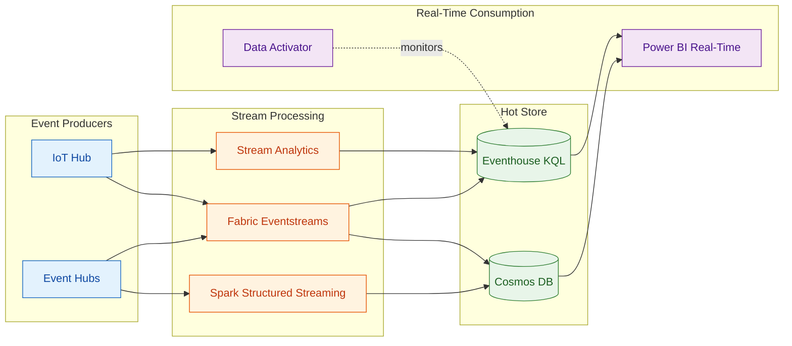

---

## Multi-Tenant Isolation

Shared infrastructure with per-tenant data and access boundaries. Use this when designing SaaS-style deployments or explaining tenant isolation to compliance reviewers.

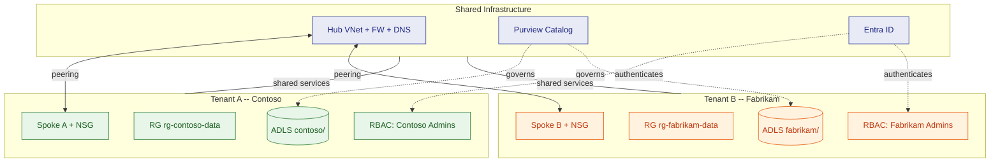

---

## Data Mesh Federation

Domain-oriented data ownership with federated governance through a global catalog. Use this when presenting a data mesh strategy or explaining how autonomous domain teams share data products.

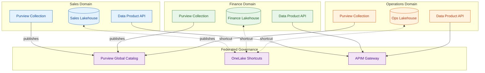

---

## CI/CD Pipeline

End-to-end deployment pipeline from developer commit through production validation. Use this during DevOps reviews or when onboarding engineers to the deployment process.

```mermaid
flowchart LR
    subgraph Dev[Developer Workflow]
        DevLocal[Local Dev Feature Branch]
        Commit[Git Commit + Push]
    end
    subgraph PR[Pull Request Validation]
        Lint[Lint: Bicep / Python / SQL]
        UnitTest[Unit Tests: pytest / jest]
        SecScan[Security: Trivy + Checkov]
        PRReview[Code Review]
    end
    subgraph Staging[Staging Deploy]
        WhatIf[Bicep What-If]
        StageDeploy[Deploy to Staging]
    end
    subgraph Approval[Approval Gate]
        ManualApproval[Tech Lead Approval]
    end
    subgraph Prod[Production Deploy]
        ProdDeploy[Deploy to Production]
        PostVal[Post-Deploy Validation]
        Rollback[Rollback Plan]
    end
    subgraph Monitor2[Monitoring]
        Alerts[Azure Monitor Alerts]
        Dashboards[Grafana / PBI]
    end
    DevLocal --> Commit --> Lint --> UnitTest --> SecScan --> PRReview
    PRReview -->|merge| WhatIf --> StageDeploy
    StageDeploy --> ManualApproval --> ProdDeploy
    ProdDeploy --> PostVal --> Alerts --> Dashboards
    ProdDeploy -.->|on failure| Rollback
    classDef dev fill:#e3f2fd,stroke:#1565c0,color:#0d47a1
    classDef pr fill:#fff3e0,stroke:#e65100,color:#bf360c
    classDef stage fill:#e8f5e9,stroke:#2e7d32,color:#1b5e20
    classDef approve fill:#fff8e1,stroke:#f9a825,color:#f57f17
    classDef prod fill:#f3e5f5,stroke:#6a1b9a,color:#4a148c
    classDef mon fill:#fce4ec,stroke:#c62828,color:#b71c1c
    class DevLocal,Commit dev
    class Lint,UnitTest,SecScan,PRReview pr
    class WhatIf,StageDeploy stage
    class ManualApproval approve
    class ProdDeploy,PostVal,Rollback prod
    class Alerts,Dashboards mon
```

---

## Disaster Recovery

Active-passive cross-region architecture with RPO/RTO targets. Use this during business continuity planning and DR tabletop exercises.

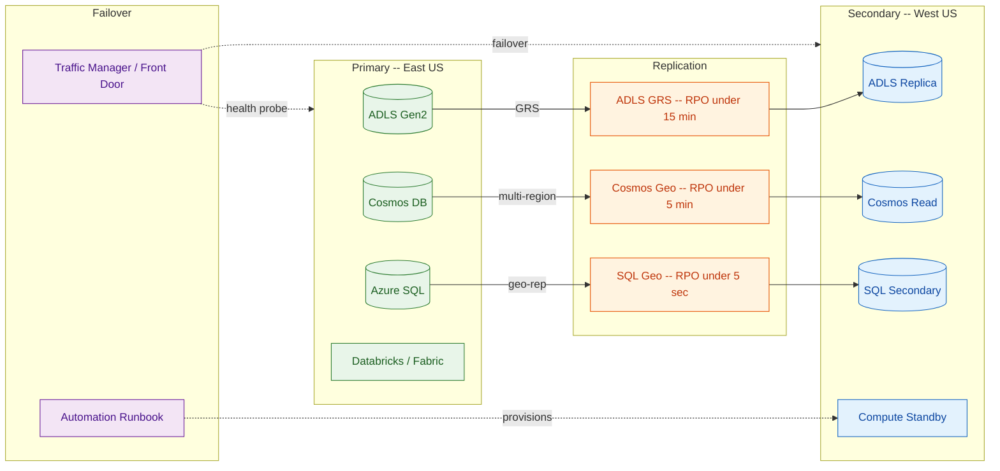

---

## Identity & Access Flow

Token-based authentication and authorization from user login through data access. Use this when explaining identity architecture to security reviewers or onboarding developers to the auth model.

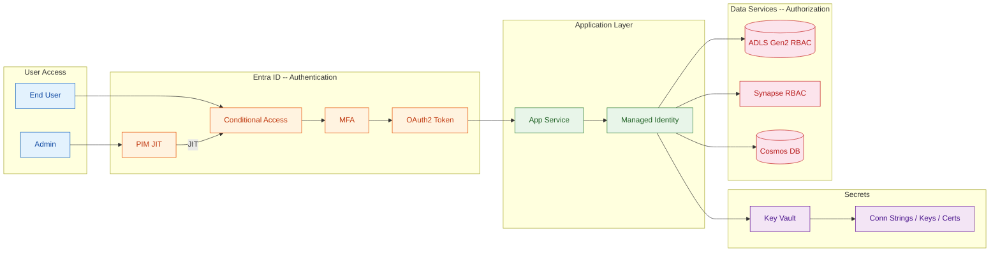

---

## Related

These diagrams correspond to the deep-dive documentation across the CSA-in-a-Box reference library. Use the links below to move from the visual overview to detailed implementation guidance.

| Diagram                | Reference Architecture                                                | Patterns                                                            | Best Practices                                                        |
| ---------------------- | --------------------------------------------------------------------- | ------------------------------------------------------------------- | --------------------------------------------------------------------- |
| Platform Overview      | [Fabric vs Synapse vs Databricks](fabric-vs-synapse-vs-databricks.md) |                                                                     |                                                                       |
| Landing Zone Topology  | [Hub-Spoke Topology](hub-spoke-topology.md)                           | [Networking & DNS Strategy](../patterns/networking-dns-strategy.md) |                                                                       |
| Network Architecture   | [Hub-Spoke Topology](hub-spoke-topology.md)                           | [Networking & DNS Strategy](../patterns/networking-dns-strategy.md) | [Security & Compliance](../best-practices/security-compliance.md)     |
| Security Zones         | [Identity & Secrets Flow](identity-secrets-flow.md)                   |                                                                     | [Security & Compliance](../best-practices/security-compliance.md)     |
| Medallion Data Flow    | [Data Flow Medallion](data-flow-medallion.md)                         |                                                                     | [Medallion Architecture](../best-practices/medallion-architecture.md) |
| AI/ML Pipeline         |                                                                       | [LLMOps Evaluation](../patterns/llmops-evaluation.md)               |                                                                       |
| Real-Time Streaming    |                                                                       | [Streaming & CDC](../patterns/streaming-cdc.md)                     |                                                                       |
| Multi-Tenant Isolation |                                                                       |                                                                     | [Security & Compliance](../best-practices/security-compliance.md)     |
| Data Mesh Federation   |                                                                       |                                                                     | [Data Governance](../best-practices/data-governance.md)               |
| CI/CD Pipeline         |                                                                       |                                                                     | [IaC & CI/CD](../best-practices/iac-cicd.md)                          |
| Disaster Recovery      |                                                                       |                                                                     | [Disaster Recovery](../best-practices/disaster-recovery.md)           |
| Identity & Access      | [Identity & Secrets Flow](identity-secrets-flow.md)                   |                                                                     | [Security & Compliance](../best-practices/security-compliance.md)     |
