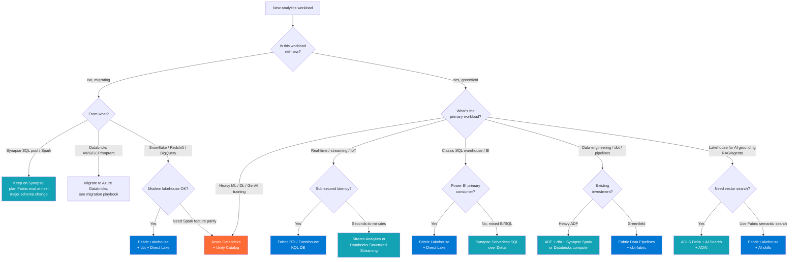
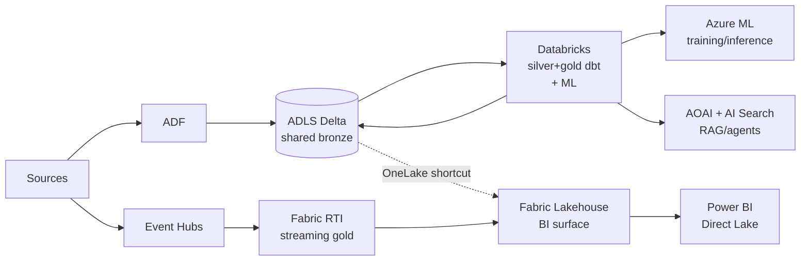
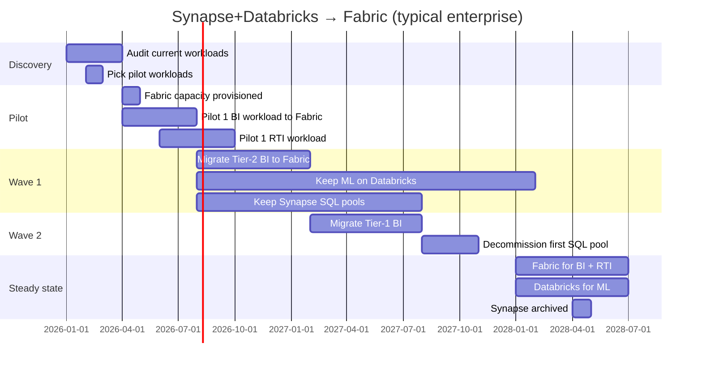

# Reference Architecture — Fabric vs Synapse vs Databricks

> **TL;DR (2026):** **Synapse + Databricks** is the production backbone today; **Fabric** is the strategic forward path for new workloads, especially **Real-Time Intelligence** and **Direct Lake** semantic models. The right answer is usually "both, sequenced over 18–36 months." Don't pick one universally; pick per-workload using the decision tree below.

## The decision

## Side-by-side

| Dimension | Fabric | Synapse | Databricks |
|-----------|--------|---------|------------|
| **Deployment model** | SaaS (capacity SKU F2-F2048) | PaaS (workspaces + pools) | PaaS (workspaces + clusters) |
| **Primary storage** | OneLake (single namespace) | ADLS Gen2 (you bring) | ADLS Gen2 (you bring) + Unity Catalog |
| **Primary table format** | Delta Lake (auto-optimized) | Delta Lake or Parquet | Delta Lake (with Liquid Clustering) |
| **SQL engine** | Lakehouse SQL endpoint, Warehouse | Serverless SQL, Dedicated SQL Pool | Databricks SQL warehouses |
| **Spark engine** | Fabric Spark (forked from OSS) | Synapse Spark | Databricks Runtime (forked, optimized) |
| **Streaming** | Real-Time Intelligence (Eventhouse / KQL) | Structured Streaming, ASA bridge | Structured Streaming, Delta Live Tables |
| **BI integration** | Power BI Direct Lake (best in class) | Power BI Import/DirectQuery | Power BI Import/DirectQuery, Genie |
| **Notebooks** | Yes (Fabric notebooks) | Yes (Synapse notebooks) | Yes (Databricks notebooks — original UX) |
| **ML platform** | Fabric Data Science (preview) | Azure ML integration | MLflow native (best in class for ML) |
| **Governance** | Built-in (OneLake catalog) + Purview | Purview integration | Unity Catalog + Purview |
| **Cost model** | Capacity-based (F SKU $/hr, smoothed) | Per-pool (DWU) + per-query (serverless) | Per-cluster (DBU/hr) + storage |
| **Auto-pause** | Capacity is always on (smoothed) | Yes — pause SQL pool, autoscale Spark | Yes — auto-terminate clusters |
| **Multi-cloud** | Azure-only (AWS S3 read via shortcut) | Azure-only | AWS, Azure, GCP |
| **Azure Government** | **Pre-GA**, no MAG production yet | GA | GA |
| **Maturity (2026)** | GA but rapidly evolving | Mature, stable | Mature, stable |
| **Best for** | New BI workloads, RTI/IoT, Direct Lake semantic models, Power BI-first orgs | Existing Synapse investments, mixed SQL/Spark, federal/Gov | Heavy ML/DL/GenAI, multi-cloud, Spark experts |

## Cost comparison (rough, 2026)

For a typical **medium analytics workload** (~5 TB Delta, 20 dbt models, daily refresh, BI to 200 users):

| Platform | Monthly cost (USD, dev) | Monthly cost (USD, prod) | Notes |
|----------|------------------------|---------------------------|-------|
| **Fabric** | $260 (F2 8h/day) | $5,200 (F64 24/7) | Capacity is shared across BI + Lakehouse + RTI; smoothing helps |
| **Synapse** | $400 (Serverless + small Spark) | $4,800 (DW100c + Spark XS) | Serverless wins for spiky workloads; Dedicated wins for predictable |
| **Databricks** | $500 (Standard, auto-terminate) | $6,500 (Premium SKU + Photon) | DBU pricing varies a LOT by SKU and Photon usage |

These are **order-of-magnitude estimates**. Actual costs depend on query patterns, idle time, region, and reserved-capacity discounts. Always model with the real Azure Pricing Calculator before committing.

## When to combine (not pick one)

This is the most common production answer:

- **Databricks** does the heavy lifting for transformations and ML
- **Fabric** is the BI presentation layer (Direct Lake reads the same Delta files via OneLake shortcut, no duplication)
- **Fabric RTI** handles the streaming gold for real-time dashboards
- **Synapse** is conspicuously absent from this picture for **new** workloads; it remains a strong choice for existing workloads and Azure Gov where Fabric isn't GA

## Workload-fit matrix

| Workload | Best | Acceptable | Avoid |
|----------|------|------------|-------|
| Power BI dashboards (large semantic models) | Fabric Direct Lake | Synapse + Import | Databricks SQL alone |
| Heavy Spark ML / GenAI training | Databricks | Synapse Spark | Fabric Spark (immature) |
| Real-time IoT (sub-second) | Fabric RTI / Eventhouse | Stream Analytics | Synapse Spark Streaming |
| Real-time analytics (seconds) | Fabric RTI, Databricks DLT | Synapse Spark Streaming | Synapse SQL |
| Ad-hoc analyst SQL over Delta | Synapse Serverless, Databricks SQL | Fabric Lakehouse SQL | Fabric Warehouse (preview-feel) |
| Federal / Gov workloads (today) | Synapse + Databricks | Synapse only | Fabric (pre-GA in MAG) |
| Multi-cloud (AWS/GCP source) | Databricks | Fabric (S3 shortcuts) | Synapse |
| Cost-sensitive POC | Synapse Serverless | Databricks Standard | Fabric F-SKU (capacity always on) |
| Net-new BI-first org | Fabric | Synapse | Databricks-only |

## Migration sequencing (real-world)

If you have an existing Synapse + Databricks investment, the typical 18–36 month path is:

The point is **don't try to forklift**. Move workloads when they're already in flight (schema change, cost optimization, new feature) — never just because of platform fashion.

## Trade-offs summary

✅ **Why Fabric** — Best Power BI integration, OneLake unifies storage, RTI is genuinely good, simpler ops model (one capacity)
⚠️ **Why not Fabric (yet)** — Pre-GA in Gov, immature ML, capacity model can be expensive for spiky workloads, Spark is forked-OSS not Photon

✅ **Why Synapse** — Mature, Gov GA, Serverless SQL is brilliant for ad-hoc, Dedicated SQL Pool is a real DW
⚠️ **Why not Synapse** — Microsoft's investment focus is on Fabric; Synapse is in maintenance mode; new features land in Fabric first

✅ **Why Databricks** — Best Spark/ML/GenAI runtime, Unity Catalog is excellent, multi-cloud, Photon is fast, MLflow native
⚠️ **Why not Databricks** — Pricier than Fabric for BI-only workloads, separate identity model adds complexity, Power BI integration is good but not Direct Lake-class

## Related

- [ADR 0010 — Fabric Strategic Target](../adr/0010-fabric-strategic-target.md)
- [ADR 0002 — Databricks over OSS Spark](../adr/0002-databricks-over-oss-spark.md)
- [ADR 0018 — Fabric RTI Adapter](../adr/0018-fabric-rti-adapter.md)
- [Decision — Fabric vs Databricks vs Synapse](../decisions/fabric-vs-databricks-vs-synapse.md) (the quick-pick version)
- [Migration — Databricks to Fabric](../migrations/databricks-to-fabric.md)
- [Use Case — Unified Analytics on Fabric](../use-cases/fabric-unified-analytics.md)
- [Patterns — Power BI & Fabric Roadmap](../patterns/power-bi-fabric-roadmap.md)
