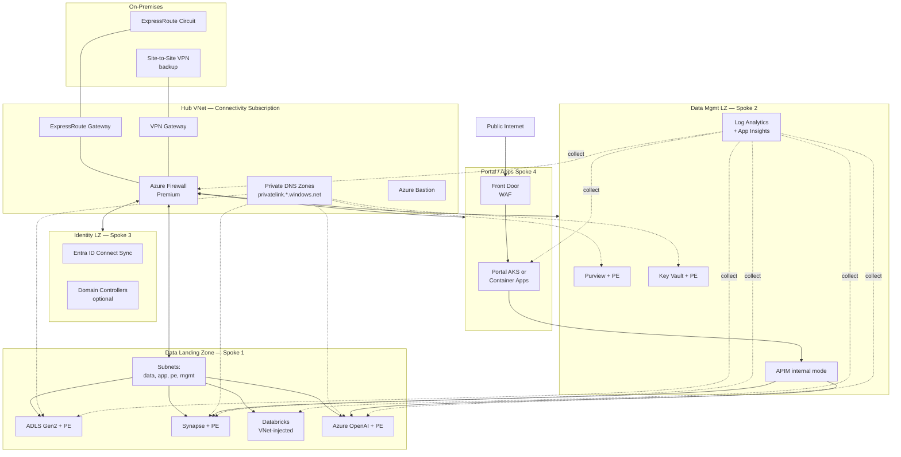

# Reference Architecture — Hub-Spoke Topology for Analytics

> **TL;DR:** Use **hub-spoke** for everything up to ~5 spokes/regions. Use **Virtual WAN** above that, or when you have global / cross-region transitive routing needs. Default to hub-spoke for analytics workloads — the routing is simpler and the management plane is one fewer thing to break.

## The problem

An enterprise analytics platform connects to:

- **Producers**: source systems on-prem, in other clouds, or in other Azure subs
- **Consumers**: BI tools, downstream apps, partner APIs
- **Operators**: developers, SREs, data engineers, on-call
- **Compliance**: audit logging, security tooling, IDS/IPS
- **Shared services**: DNS, AD, monitoring, secrets

All of these need network reachability into the **landing zone subscription** that holds the data — but not into each other. The pattern that solves this for the typical Fortune 500 / federal-mid scale is **hub-spoke**.

## Architecture

## Component responsibilities

| Component | Subscription / RG | Purpose |
|-----------|-------------------|---------|
| **ExpressRoute / VPN** | Connectivity sub | Private connectivity from on-prem |
| **Hub VNet + Azure Firewall Premium** | Connectivity sub | Single point of egress + east-west inspection |
| **Private DNS zones** | Connectivity sub | `privatelink.*` zones linked to all spokes — single source of truth |
| **Bastion** | Connectivity sub | RDP/SSH to spokes without public IPs |
| **DLZ (Data Landing Zone)** | Per-domain | The actual data + compute (Storage, Synapse, Databricks, AOAI) — see [`deploy/bicep/DLZ/`](https://github.com/fgarofalo56/csa-inabox/tree/main/deploy/bicep/DLZ) |
| **DMLZ (Data Mgmt LZ)** | Shared | Cross-cutting governance: Purview, Key Vault, Log Analytics, APIM — see [`deploy/bicep/DMLZ/`](https://github.com/fgarofalo56/csa-inabox/tree/main/deploy/bicep/DMLZ) |
| **Identity LZ** | Shared | Entra ID Connect, optional domain controllers if you need traditional AD on Azure |
| **Portal / Apps LZ** | Per-app | User-facing apps (React portal, Power Apps, custom) — internet-facing via Front Door + WAF |

## Subnets per spoke (DLZ example)

| Subnet | Purpose | Min size |
|--------|---------|----------|
| `snet-data` | Storage account private endpoints, Cosmos PE | /27 |
| `snet-app` | Synapse SQL on-demand workers, Function App VNet integration | /26 |
| `snet-pe` | All other private endpoints (Key Vault, AOAI, AI Search, etc.) | /26 |
| `snet-mgmt` | Bastion-reachable mgmt VMs, self-hosted IR | /27 |
| `snet-databricks-public` | Databricks public subnet | /26 (Databricks min) |
| `snet-databricks-private` | Databricks private subnet | /26 (Databricks min) |
| `snet-aks` (optional) | Portal AKS nodes if not using Container Apps | /22 |

**Total**: a single DLZ spoke needs roughly a **/22** worth of address space (1024 IPs) to be comfortable. Plan address allocation accordingly — RFC 1918 exhaustion is a real problem at the 10-spoke mark.

## Key design decisions

### Why hub-spoke and not Virtual WAN?

- Hub-spoke routing is **explicit and simple** — every packet hits the firewall, no transitive surprises
- vWAN is better when you have **>5 regions** or need **transit through Microsoft backbone** between branches
- For analytics workloads (typically 1–3 regions, with on-prem ingest) hub-spoke wins on operational simplicity

If you're at >5 regions, see the Microsoft [Virtual WAN reference](https://learn.microsoft.com/azure/virtual-wan/) and re-evaluate.

### Why one DLZ per domain (not one giant DLZ)?

- **Blast radius**: a bad deploy in one DLZ doesn't break others
- **RBAC scope**: each domain team owns its subscription, no cross-team accidents
- **Cost allocation**: one subscription = one bill, no chargeback math
- **Compliance scope**: a HIPAA workload can be in its own DLZ without dragging the whole org into HIPAA scope

The DMLZ stays shared because Purview / Log Analytics / Key Vault are most useful when consolidated.

### Why Azure Firewall Premium and not NVA?

- Built-in IDPS, TLS inspection, URL filtering — no licensing math
- First-class Bicep / CLI support
- We've never had a customer regret choosing AzFW Premium for analytics workloads
- If you need vendor-specific NVA features (Palo, Fortinet), put it as a **second hop** in front of AzFW, not instead of it

### Why Private DNS zones in the hub?

- One zone per Azure service privatelink (`privatelink.dfs.core.windows.net`, `privatelink.openai.azure.com`, etc.)
- Linked to **every** spoke VNet — name resolution works the same everywhere
- Avoids the "every spoke has its own zone" anti-pattern that breaks cross-spoke private endpoints
- See the [Networking & DNS Strategy pattern](../patterns/networking-dns-strategy.md) for the full DNS strategy

## Trade-offs

✅ **What this gives you**
- Single egress chokepoint for compliance and inspection
- Consistent identity / DNS / monitoring across all data domains
- Independent blast radius per domain
- Simple mental model: "spokes never talk directly, always through hub"

⚠️ **What you give up**
- Hub firewall is a **single point of failure** — must deploy redundantly (zone-redundant in single region, paired-region for DR)
- Hub firewall is a **bandwidth bottleneck** — AzFW Premium tops out at ~30 Gbps per region, plan accordingly
- Hub VNet must be sized correctly the **first time** — resizing requires recreating peerings
- Cross-spoke traffic incurs **two firewall hops** (each direction) — latency-sensitive workloads should colocate

## Variants

| Scenario | Variant |
|----------|---------|
| **Azure Government** | Identical pattern, but check service availability per region — see [Government Service Matrix](../GOV_SERVICE_MATRIX.md) |
| **Single-subscription dev/POC** | Skip the hub — put everything in one VNet with subnet-level NSGs. Don't ship to production this way. |
| **Multi-region active-active** | Each region gets its own hub + DLZs; hubs peer to each other (or via vWAN). See [Multi-Region](../MULTI_REGION.md) |
| **Air-gapped / sovereign** | Hub-spoke still applies; Internet egress replaced with explicit allow-listed proxy. See [Compliance — FedRAMP](../compliance/fedramp-moderate.md) |

## Related

- [`deploy/bicep/landing-zone-alz/`](https://github.com/fgarofalo56/csa-inabox/tree/main/deploy/bicep/landing-zone-alz) — Microsoft ALZ fork that builds the hub
- [`deploy/bicep/DLZ/modules/network/`](https://github.com/fgarofalo56/csa-inabox/tree/main/deploy/bicep/DLZ/modules/network) — DLZ network module
- [Patterns — Networking & DNS Strategy](../patterns/networking-dns-strategy.md)
- [Best Practices — Security & Compliance](../best-practices/security-compliance.md)
- [Multi-Region](../MULTI_REGION.md)
- [Multi-Tenant](../MULTI_TENANT.md)
