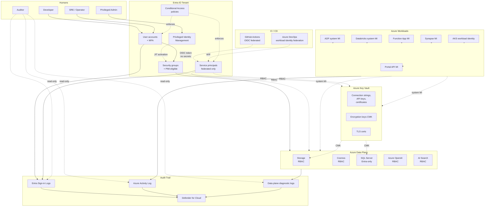
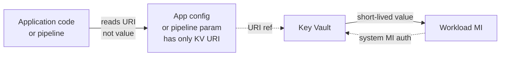
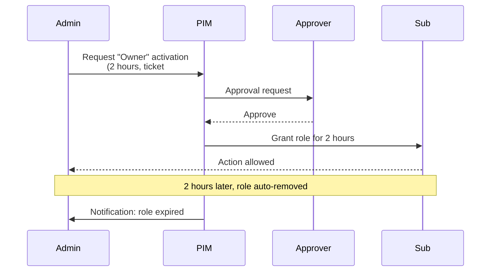

# Reference Architecture — Identity & Secrets Flow

> **TL;DR:** Humans authenticate to Entra ID and get RBAC; workloads use **managed identities** (never service principals with passwords); every secret lives in **Key Vault** and is referenced by URI; nothing — _nothing_ — has a static credential in code, config, or pipeline.

## The problem

Identity and secrets are the #1 source of compromise in cloud platforms. Service-principal secrets get checked into git, connection strings get pasted into ADF parameter files, and shared admin accounts make audit forensics impossible. The **only sustainable answer** is: workloads have _identity_, not _credentials_.

## Architecture



## Three identity types — when to use which

| Identity                                                                             | Use for                                                                                                     | Forbidden uses                               |
| ------------------------------------------------------------------------------------ | ----------------------------------------------------------------------------------------------------------- | -------------------------------------------- |
| **User account** (with MFA + Conditional Access)                                     | Humans logging into the portal, running `az` commands, accessing dashboards                                 | Workloads. Ever.                             |
| **Managed Identity** (system-assigned preferred, user-assigned for shared workloads) | Every Azure workload (ADF, Functions, Databricks, Synapse, AKS, Portal API) accessing other Azure resources | Cross-tenant scenarios (use federated SP)    |
| **Service Principal** (federated identity only — **no client secret**)               | CI/CD pipelines (GitHub Actions OIDC, Azure DevOps WIF), cross-tenant access                                | Anything where a managed identity would work |

**Service principals with client secrets** are an anti-pattern. Period. If you find one, rotate it, replace it with federated credentials, and write a runbook entry about why it existed.

## Secrets: Key Vault is the only answer



- **Connection strings** → Key Vault → workload reads via MI
- **API keys** → Key Vault → workload reads via MI
- **TLS certs** → Key Vault Certificates → auto-rotation enabled
- **Encryption keys (CMK)** → Key Vault → CMK on Storage / SQL / Cosmos
- **Database passwords** → don't have them — use Entra-only auth on SQL, Cosmos, Postgres

**App settings reference Key Vault by URI**, e.g.:

```
DB_CONNECTION_STRING = @Microsoft.KeyVault(VaultName=kv-csa-prod;SecretName=db-conn)
```

The workload's MI must have `Key Vault Secrets User` on the vault. Rotation in Key Vault is picked up automatically (cached ~10 min).

## Privilege escalation — PIM, not standing access

Standing `Owner` / `Contributor` access is the bug, not the feature:



Configure PIM-eligible (not active) for:

- Subscription Owner / Contributor
- Key Vault Administrator
- User Access Administrator
- Any role with `*/write` on production resources

Standing access is for **read-only** roles only.

## CI/CD — federated, never client-secret

GitHub Actions:

```yaml
- uses: azure/login@v2
  with:
      client-id: ${{ secrets.AZURE_CLIENT_ID }} # SP app ID, not a secret
      tenant-id: ${{ secrets.AZURE_TENANT_ID }}
      subscription-id: ${{ secrets.AZURE_SUBSCRIPTION_ID }}
      # No client-secret. OIDC token issued by GitHub, validated by Entra.
```

The SP has a **federated credential** trust configured for the specific repo + branch (`repo:fgarofalo56/csa-inabox:ref:refs/heads/main`). Tokens are short-lived (1 hour) and scoped to that trust.

This eliminates the entire class of "the SP secret leaked from CI" incidents.

## What goes in audit (and how long)

| Log                       | Source                                                         | Retention                         | Where it lands                    |
| ------------------------- | -------------------------------------------------------------- | --------------------------------- | --------------------------------- |
| Entra Sign-in Logs        | Every authentication                                           | 90 days free, longer with archive | Log Analytics + Storage archive   |
| Entra Audit Logs          | Every directory change                                         | 90 days free                      | Log Analytics + Storage archive   |
| Azure Activity Log        | Every control-plane action                                     | 90 days free                      | Log Analytics workspace           |
| Resource diagnostic logs  | Every data-plane action (Storage reads, KV reads, SQL queries) | Configurable per resource         | Log Analytics + Storage archive   |
| Defender for Cloud alerts | Threat detection                                               | 90 days hot                       | Log Analytics + Sentinel optional |

Auditors get **read-only** Log Analytics + Storage archive access. They never get write access to anything.

## Trade-offs

✅ **What this gives you**

- Zero static credentials in code or pipelines
- Every action traceable to a human or workload identity
- Privilege escalation requires JIT activation + approval + reason
- Secret rotation is a Key Vault config change, not a code deploy
- Compliance auditors get a clean story

⚠️ **What you give up**

- More upfront setup (PIM config, federated SP setup, Key Vault wiring)
- Workloads need MI — adds a Bicep dependency on `Microsoft.ManagedIdentity` for every workload
- PIM activation has a 0–5 minute delay; on-call gets used to it
- A Key Vault outage (rare, but possible) takes down everything that reads secrets at startup. Mitigate with **regional KV pairs** + cached secrets at workload startup.

## Variants

| Scenario                                | Variant                                                                                          |
| --------------------------------------- | ------------------------------------------------------------------------------------------------ |
| **Cross-tenant** (e.g., partner access) | Federated SPs with cross-tenant federation, scoped to specific resource groups                   |
| **Air-gapped / sovereign**              | Same pattern; Key Vault is regional and CMK uses Managed HSM rather than software-protected keys |
| **Hybrid** (on-prem AD + Entra)         | Entra Connect Sync; on-prem accounts get Entra identity; same RBAC model                         |
| **Workload identity for AKS**           | AKS workload identity (OIDC) instead of pod-managed-identity; same trust model as GH Actions     |

## Related

- [Best Practices — Security & Compliance](../best-practices/security-compliance.md)
- [Runbook — Key Rotation](../runbooks/key-rotation.md)
- [Runbook — Break-Glass Access](../runbooks/break-glass-access.md)
- [Runbook — Security Incident](../runbooks/security-incident.md)
- [ADR 0014 — MSAL BFF Auth Pattern](../adr/0014-msal-bff-auth-pattern.md)
- [Compliance — NIST 800-53 r5](../compliance/nist-800-53-rev5.md) (IA, AC families)
- [Compliance — FedRAMP Moderate](../compliance/fedramp-moderate.md)
