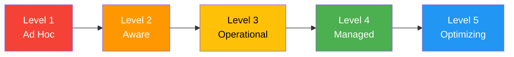
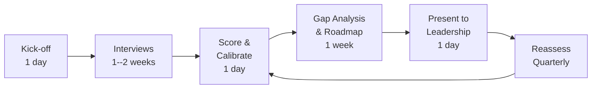

# AI Readiness Assessment Framework

> Organizational maturity model for AI adoption covering data readiness, infrastructure, skills, governance, and use case prioritization. Provides a structured assessment across eight dimensions, each scored 1--5, with an aggregate maturity level that maps directly to Azure services and CSA-in-a-Box components.

---

## Purpose

Enterprises routinely over-invest in model experimentation and under-invest in the surrounding platform: data quality, MLOps, governance, and culture. The result is a graveyard of Jupyter notebooks that never reach production. This framework gives leadership and architecture teams a repeatable, score-based tool to answer three questions before committing budget:

1. **Where are we today?** -- current maturity across eight dimensions.
2. **What must we fix first?** -- the weakest dimensions that will block production AI.
3. **What Azure services and CSA-in-a-Box components close the gap?** -- concrete platform mapping.

The framework is intentionally opinionated toward Azure PaaS and the CSA-in-a-Box reference architecture. Organizations using other clouds or on-premises tooling can adapt the dimension definitions while retaining the scoring model.

---

## Maturity Model

Five levels describe an organization's overall AI posture. The aggregate level is derived from the eight dimension scores described in the next section.

### Level 1 -- Ad Hoc

No formal AI strategy exists. Individual teams run isolated experiments in personal notebooks or shadow-IT compute. Data is accessed on an ad-hoc basis, often through manual exports. There is no model registry, no deployment pipeline, and no governance review. Success depends entirely on individual heroics, and learnings are not shared across teams.

**Typical signals:** Jupyter notebooks on local machines, CSV files emailed between teams, no budget line item for ML infrastructure, models are "deployed" by handing a pickle file to an engineer.

### Level 2 -- Aware

The organization has recognized AI as strategically important. An AI strategy or charter exists, even if it is aspirational. Pilot projects have been identified and scoped. A dedicated data science team -- or at least a cross-functional working group -- is forming. Initial tooling decisions are being made, but end-to-end pipelines are not yet in place. Data access is still largely manual but cataloging has started.

**Typical signals:** executive sponsor identified, first pilot in a sandbox environment, initial Databricks or Azure ML workspace provisioned, data catalog effort underway.

### Level 3 -- Operational

Production ML models exist and serve business workloads. An MLOps pipeline covers at least one project end-to-end: feature engineering, training, validation, deployment, and basic monitoring. Data quality checks run before training. Infrastructure is provisioned through IaC rather than portal clicks. The organization can answer "what models are in production and who owns them."

**Typical signals:** at least one model behind an API endpoint, CI/CD pipeline for model training, model registry in use (MLflow or Azure ML), scheduled retraining, basic drift alerting.

### Level 4 -- Managed

AI governance is formalized. A responsible-AI review board or process gates model deployments. Model risk management covers bias testing, explainability, and adversarial robustness. Multiple business units consume AI capabilities through shared platform services. Cost attribution for GPU compute is tracked. Data contracts ensure upstream changes do not silently break downstream models.

**Typical signals:** responsible-AI checklist enforced before production promotion, model cards published for every production model, GPU spend attributed to business units via tags, data contracts validated in CI, model monitoring dashboards reviewed weekly.

### Level 5 -- Optimizing

AI is embedded in the organization's operating model. Continuous improvement loops feed production model performance back into data quality and feature engineering. Autonomous systems (agents, closed-loop control) operate within well-defined guardrails. The platform team publishes internal SLAs for model serving latency, availability, and freshness. New AI use cases are evaluated against a portfolio framework with clear ROI thresholds.

**Typical signals:** AI-first product decisions, automated retraining triggered by drift detection, agent architectures in production, internal AI platform has an SLA, FinOps for AI is mature.



---

## Assessment Dimensions

Eight dimensions capture the breadth of capabilities required for sustainable AI adoption. Each dimension is scored 1--5 using the rubrics below. The aggregate maturity level is the floor of the average score, ensuring that severe weakness in any single dimension pulls the overall rating down.

**Aggregate formula:** `floor(mean(D1, D2, ..., D8))`

### Dimension 1 -- Data Readiness

Data is the foundation. Without high-quality, discoverable, fresh data, every model is built on sand.

| Score | Criteria                                                                                                                                            |
| ----- | --------------------------------------------------------------------------------------------------------------------------------------------------- |
| 1     | Data lives in silos. No catalog. Quality is unknown. Manual CSV exports are common.                                                                 |
| 2     | Central data lake exists but is poorly organized. Basic metadata available. Quality checks are manual.                                              |
| 3     | Medallion architecture (Bronze/Silver/Gold) enforced. Automated quality checks in Silver-to-Gold promotion. Data catalog covers core datasets.      |
| 4     | Data contracts between producers and consumers. Freshness SLAs defined and monitored. Lineage tracked automatically. Classification labels applied. |
| 5     | Data marketplace operational. Self-service discovery. Automated anomaly detection on data quality. Real-time and batch pipelines unified.           |

### Dimension 2 -- Infrastructure

AI workloads demand compute, storage, and networking patterns that general-purpose cloud landing zones do not provide out of the box.

| Score | Criteria                                                                                                                               |
| ----- | -------------------------------------------------------------------------------------------------------------------------------------- |
| 1     | No dedicated ML infrastructure. Data scientists use personal machines or unmanaged VMs.                                                |
| 2     | Shared Databricks workspace or Azure ML workspace provisioned. No GPU. Manual scaling.                                                 |
| 3     | IaC-provisioned compute clusters. GPU available for training. Autoscaling configured. Dev/staging/prod separation.                     |
| 4     | Dedicated training clusters with spot/preemptible instances. Model serving on managed endpoints with autoscale. Cost tagging per team. |
| 5     | Multi-region serving. Automated capacity planning. Edge deployment supported. FinOps for AI mature with chargeback.                    |

### Dimension 3 -- Skills and Talent

Technology without skilled people is shelfware. This dimension assesses the depth and breadth of AI-related skills.

| Score | Criteria                                                                                                                                                         |
| ----- | ---------------------------------------------------------------------------------------------------------------------------------------------------------------- |
| 1     | No dedicated data science or ML engineering roles. AI is a side project for software engineers.                                                                  |
| 2     | Small data science team (1--3 people). Skills concentrated in model training, not deployment.                                                                    |
| 3     | Data science and ML engineering roles distinct. Team can build and deploy models end-to-end. Basic AI literacy training for business stakeholders.               |
| 4     | Specialized roles: ML platform engineers, responsible-AI reviewers, feature engineers. Ongoing training program. Internal community of practice.                 |
| 5     | AI literacy across the organization. Business teams can self-serve common ML tasks (AutoML, pre-built models). Internal AI academy. Talent pipeline established. |

### Dimension 4 -- Governance and Ethics

Responsible AI is not optional. Governance ensures models are fair, explainable, and auditable.

| Score | Criteria                                                                                                                                                                        |
| ----- | ------------------------------------------------------------------------------------------------------------------------------------------------------------------------------- |
| 1     | No governance. Models deployed without review. No bias testing. No explainability.                                                                                              |
| 2     | Awareness of responsible-AI principles. Ad-hoc bias checks on some models. No formal process.                                                                                   |
| 3     | Responsible-AI checklist applied to production models. Basic explainability (SHAP/LIME) generated. Model cards created.                                                         |
| 4     | Formal review board gates production deployment. Bias testing automated in CI. Explainability reports published for stakeholders. Adversarial testing for high-risk models.     |
| 5     | Continuous fairness monitoring in production. Automated alerts on bias drift. Regulatory compliance (EU AI Act, NIST AI RMF) mapped and auditable. Public transparency reports. |

### Dimension 5 -- Use Case Portfolio

Not every problem should be solved with AI. This dimension assesses how the organization identifies, prioritizes, and tracks AI use cases.

| Score | Criteria                                                                                                                                                                                                          |
| ----- | ----------------------------------------------------------------------------------------------------------------------------------------------------------------------------------------------------------------- |
| 1     | No portfolio view. Use cases emerge bottom-up without coordination. No ROI tracking.                                                                                                                              |
| 2     | Use case backlog exists. High-level feasibility assessment performed. ROI estimated but not tracked post-deployment.                                                                                              |
| 3     | Portfolio scored on impact, feasibility, data availability, and risk. Prioritization reviewed quarterly. Post-deployment ROI tracked for major projects.                                                          |
| 4     | Portfolio management integrated with enterprise strategy. AI investments compete for capital alongside non-AI projects using consistent criteria. Kill criteria defined for underperforming models.               |
| 5     | Continuous intake process. Automated feasibility screening (data availability, model complexity). Portfolio performance dashboards visible to leadership. Lessons learned feed back into prioritization criteria. |

### Dimension 6 -- MLOps Maturity

MLOps is the bridge between notebook experiments and production value.

| Score | Criteria                                                                                                                                                                                  |
| ----- | ----------------------------------------------------------------------------------------------------------------------------------------------------------------------------------------- |
| 1     | No MLOps. Models are trained manually and deployed via ad-hoc scripts. No versioning.                                                                                                     |
| 2     | Experiment tracking in place (MLflow/Weights & Biases). Model artifacts versioned. Deployment is manual but documented.                                                                   |
| 3     | CI/CD pipeline for model training and deployment. Automated testing (unit tests for feature engineering, integration tests for inference). Model registry with promotion stages.          |
| 4     | Automated retraining triggered by schedule or drift detection. A/B testing or canary deployments for model rollout. Feature store operational. Pipeline orchestration (Airflow/ADF).      |
| 5     | Fully automated ML pipelines from data ingestion to production serving. Self-healing pipelines (auto-rollback on quality regression). Multi-model orchestration. Platform SLAs published. |

### Dimension 7 -- Security and Compliance

AI introduces novel security and compliance challenges: model poisoning, prompt injection, data leakage through model outputs, and regulatory requirements specific to automated decision-making.

| Score | Criteria                                                                                                                                                                                                  |
| ----- | --------------------------------------------------------------------------------------------------------------------------------------------------------------------------------------------------------- |
| 1     | No AI-specific security controls. Models access data through personal credentials. No audit trail.                                                                                                        |
| 2     | Service principals used for model access. Basic network isolation. Audit logs exist but are not reviewed.                                                                                                 |
| 3     | Models run in private-endpoint environments. Data access controlled by RBAC. Training data lineage tracked. Compliance requirements identified.                                                           |
| 4     | Model security testing (adversarial inputs, prompt injection for LLMs) in CI. Data privacy controls (differential privacy, PII masking) applied to training data. Audit trails reviewed regularly.        |
| 5     | Red-team exercises for AI systems. Automated compliance checks against regulatory frameworks (NIST AI RMF, EU AI Act). Model access governed by data classification. Zero-trust applied to model serving. |

### Dimension 8 -- Organizational Culture

Technology and process are necessary but not sufficient. Culture determines whether AI investments deliver lasting value.

| Score | Criteria                                                                                                                                                                             |
| ----- | ------------------------------------------------------------------------------------------------------------------------------------------------------------------------------------ |
| 1     | AI is viewed with skepticism or hype. No executive sponsorship. Fear of job displacement dominates.                                                                                  |
| 2     | Executive sponsor identified. Willingness to experiment. Limited understanding of AI capabilities and limitations among business leaders.                                            |
| 3     | Cross-functional collaboration between data science and business. Experimentation is encouraged. Failures are treated as learning opportunities. Change management program in place. |
| 4     | AI champions embedded in business units. Data-driven decision-making is the norm. Innovation time allocated. Internal AI success stories shared widely.                              |
| 5     | AI-first mindset. Every business process is evaluated for AI augmentation potential. Continuous learning culture. External thought leadership (publications, conference talks).      |

---

## Assessment Questionnaire

Use the following questions to guide scoring conversations with stakeholders. For each dimension, average the question scores to produce the dimension score.

### Data Readiness

1. Can a new team member discover and access the data they need for a model within one business day, without filing a ticket? (1 = no catalog; 5 = self-service marketplace with instant access)
2. What percentage of your analytical data has automated quality checks running before it reaches the Gold layer? (1 = 0%; 5 = >90%)
3. Do data producers publish freshness SLAs, and are those SLAs monitored with alerts? (1 = no SLAs; 5 = SLAs monitored with automated escalation)

### Infrastructure

1. How long does it take to provision a GPU-enabled training environment for a new project? (1 = weeks/manual; 5 = minutes/self-service IaC)
2. Is model serving infrastructure autoscaled and cost-optimized (spot instances, scale-to-zero)? (1 = no serving infra; 5 = fully automated with cost attribution)
3. Do you have separate environments (dev/staging/prod) for ML workloads with identical IaC definitions? (1 = single environment; 5 = parity across all environments)

### Skills and Talent

1. Do you have dedicated ML engineering roles (distinct from data science) responsible for productionizing models? (1 = no; 5 = mature ML platform team)
2. What percentage of business stakeholders have completed AI literacy training? (1 = 0%; 5 = >80%)
3. Is there a structured career path for AI/ML roles in your organization? (1 = no; 5 = well-defined with mentorship)

### Governance and Ethics

1. Is there a mandatory review gate before any model reaches production? (1 = no review; 5 = formal board with documented criteria)
2. Do you test for bias and fairness as part of your model validation pipeline? (1 = never; 5 = automated in CI for every model)
3. Can you explain to a regulator how any production model makes its decisions? (1 = no; 5 = explainability reports auto-generated and archived)
4. Do you have a process for ongoing monitoring of fairness metrics in production? (1 = no; 5 = automated alerts on bias drift)

### Use Case Portfolio

1. Is there a central registry of all AI/ML use cases (active, planned, retired)? (1 = no; 5 = portfolio dashboard with ROI tracking)
2. Do you have a scoring framework for prioritizing new AI use cases? (1 = ad-hoc; 5 = formalized criteria reviewed quarterly)
3. Are underperforming models actively retired, or do they linger? (1 = linger indefinitely; 5 = kill criteria enforced automatically)

### MLOps Maturity

1. Can you retrain and redeploy a model without any manual steps? (1 = fully manual; 5 = fully automated with rollback)
2. Do you monitor model performance (accuracy, latency, drift) in production? (1 = no monitoring; 5 = dashboards with automated alerts)
3. Is your feature engineering code tested and versioned alongside model code? (1 = no; 5 = shared feature store with CI/CD)

### Security and Compliance

1. Do models access data through service principals with least-privilege RBAC, or through personal credentials? (1 = personal creds; 5 = managed identity with JIT)
2. Have you tested your AI systems against adversarial attacks (prompt injection, data poisoning)? (1 = never; 5 = regular red-team exercises)
3. Can you produce an audit trail showing who deployed which model version, when, and with what data? (1 = no; 5 = immutable audit log)

### Organizational Culture

1. Does your executive team include AI/ML outcomes in their OKRs or performance goals? (1 = no; 5 = AI outcomes are key results)
2. When an ML experiment fails, is it treated as a learning opportunity or a career risk? (1 = career risk; 5 = expected and celebrated)
3. Do business units have embedded AI champions who translate between technical and business language? (1 = no; 5 = in every major BU)

---

## Scoring Summary

Use the following table to record dimension scores and compute the aggregate maturity level.

| #   | Dimension                     | Score (1--5) | Key Gap | Priority Action |
| --- | ----------------------------- | :----------: | ------- | --------------- |
| 1   | Data Readiness                |              |         |                 |
| 2   | Infrastructure                |              |         |                 |
| 3   | Skills and Talent             |              |         |                 |
| 4   | Governance and Ethics         |              |         |                 |
| 5   | Use Case Portfolio            |              |         |                 |
| 6   | MLOps Maturity                |              |         |                 |
| 7   | Security and Compliance       |              |         |                 |
| 8   | Organizational Culture        |              |         |                 |
|     | **Aggregate (floor of mean)** |              |         |                 |

```mermaid
radar
    title "AI Readiness Radar"
    "Data Readiness" : 0
    "Infrastructure" : 0
    "Skills & Talent" : 0
    "Governance" : 0
    "Use Cases" : 0
    "MLOps" : 0
    "Security" : 0
    "Culture" : 0
```

---

## Action Plan Template

Based on the aggregate maturity level, the following actions are recommended. Focus first on dimensions scoring below the aggregate -- these are the bottlenecks.

### Moving from Level 1 to Level 2

**Goal:** Establish foundations and executive alignment.

| Dimension      | Recommended Actions                                                                            | Timeline    |
| -------------- | ---------------------------------------------------------------------------------------------- | ----------- |
| Data Readiness | Deploy a data lake with Bronze/Silver/Gold zones. Start cataloging top 10 datasets in Purview. | 0--3 months |
| Infrastructure | Provision a shared Databricks workspace and Azure ML workspace via IaC.                        | 0--2 months |
| Skills         | Hire or designate 2--3 data scientists. Begin AI literacy workshops for leadership.            | 0--6 months |
| Governance     | Draft a responsible-AI policy. Identify high-risk use cases.                                   | 1--3 months |
| Use Cases      | Build a prioritized backlog of 5--10 candidate use cases. Run feasibility assessments.         | 0--3 months |
| MLOps          | Set up MLflow for experiment tracking. Document manual deployment steps.                       | 1--3 months |
| Security       | Move from personal credentials to service principals. Enable audit logging.                    | 0--2 months |
| Culture        | Secure executive sponsor. Communicate AI vision to the organization.                           | 0--1 month  |

### Moving from Level 2 to Level 3

**Goal:** Achieve first production ML workload with repeatable processes.

| Dimension      | Recommended Actions                                                                          | Timeline    |
| -------------- | -------------------------------------------------------------------------------------------- | ----------- |
| Data Readiness | Enforce medallion architecture. Automate quality checks in dbt or Great Expectations.        | 0--6 months |
| Infrastructure | Add GPU clusters for training. Implement autoscaling. Separate dev/staging/prod.             | 0--4 months |
| Skills         | Hire ML engineers. Establish data science and ML engineering as distinct roles.              | 0--6 months |
| Governance     | Implement responsible-AI checklist. Generate SHAP/LIME explainability for production models. | 2--6 months |
| Use Cases      | Build a scoring framework for use-case prioritization. Track post-deployment ROI.            | 1--4 months |
| MLOps          | Build CI/CD pipeline for at least one model. Deploy model registry with promotion stages.    | 0--6 months |
| Security       | Deploy models in private-endpoint networks. Implement RBAC on model endpoints.               | 1--4 months |
| Culture        | Launch cross-functional AI working groups. Celebrate first production model publicly.        | 0--3 months |

### Moving from Level 3 to Level 4

**Goal:** Scale AI across the organization with governance guardrails.

| Dimension      | Recommended Actions                                                                                       | Timeline     |
| -------------- | --------------------------------------------------------------------------------------------------------- | ------------ |
| Data Readiness | Implement data contracts. Deploy freshness SLA monitoring. Full lineage in Purview.                       | 0--9 months  |
| Infrastructure | Optimize with spot instances. Deploy cost attribution per team. Multi-workspace federation.               | 0--6 months  |
| Skills         | Create specialized roles (platform engineer, responsible-AI reviewer). Launch community of practice.      | 0--12 months |
| Governance     | Stand up formal review board. Automate bias testing in CI. Publish model cards for all production models. | 0--9 months  |
| Use Cases      | Integrate AI portfolio with enterprise strategy. Define kill criteria.                                    | 0--6 months  |
| MLOps          | Automate retraining on drift. Implement canary deployments. Deploy feature store.                         | 0--9 months  |
| Security       | Add adversarial testing to CI. Apply differential privacy to sensitive training data.                     | 0--9 months  |
| Culture        | Embed AI champions in business units. Allocate innovation time.                                           | 0--12 months |

### Moving from Level 4 to Level 5

**Goal:** AI-first culture with autonomous systems and continuous optimization.

| Dimension      | Recommended Actions                                                                          | Timeline     |
| -------------- | -------------------------------------------------------------------------------------------- | ------------ |
| Data Readiness | Data marketplace with self-service provisioning. Automated anomaly detection.                | 0--12 months |
| Infrastructure | Multi-region serving. Edge deployment. Automated capacity planning.                          | 0--12 months |
| Skills         | AI literacy across the organization. Internal AI academy. External thought leadership.       | 0--18 months |
| Governance     | Continuous fairness monitoring. Map to NIST AI RMF / EU AI Act. Public transparency reports. | 0--12 months |
| Use Cases      | Automated feasibility screening. Portfolio performance dashboards. Continuous intake.        | 0--9 months  |
| MLOps          | Self-healing pipelines. Multi-model orchestration. Platform SLAs published.                  | 0--12 months |
| Security       | Regular red-team exercises. Zero-trust for model serving. Classification-gated model access. | 0--12 months |
| Culture        | AI-first product decisions. Every process evaluated for AI augmentation.                     | 0--18 months |

---

## Azure Platform Mapping

Each dimension maps to specific Azure services. This table helps teams translate assessment gaps into procurement and provisioning actions.

| Dimension               | Azure Services                                                                                   | Purpose                                                                                  |
| ----------------------- | ------------------------------------------------------------------------------------------------ | ---------------------------------------------------------------------------------------- |
| Data Readiness          | ADLS Gen2, Azure Data Factory, Microsoft Purview, dbt Core, Azure Data Explorer                  | Medallion lake, ingestion orchestration, cataloging, transformation, real-time analytics |
| Infrastructure          | Databricks (with GPU clusters), Azure ML Compute, Azure Kubernetes Service, Azure Container Apps | Training compute, model serving, autoscaling, edge inference                             |
| Skills and Talent       | Microsoft Learn, GitHub Copilot, Azure ML AutoML                                                 | Training resources, productivity tooling, democratized ML                                |
| Governance and Ethics   | Azure ML Responsible AI dashboard, Purview sensitivity labels, Azure Policy                      | Fairness assessment, explainability, classification enforcement                          |
| Use Case Portfolio      | Azure DevOps / GitHub Projects, Power BI                                                         | Portfolio tracking, ROI dashboards                                                       |
| MLOps                   | Azure ML Pipelines, Databricks Workflows, MLflow, GitHub Actions                                 | Pipeline orchestration, experiment tracking, CI/CD for ML                                |
| Security and Compliance | Microsoft Entra ID, Azure Key Vault, Private Link, Microsoft Defender for Cloud, Azure Monitor   | Identity, secrets, network isolation, threat detection, audit                            |
| Organizational Culture  | Microsoft Viva, Power BI dashboards                                                              | Learning platforms, AI outcome visibility                                                |

---

## CSA-in-a-Box Component Mapping

CSA-in-a-Box provides reference implementations that accelerate readiness improvement across every dimension. The table below maps each dimension to the specific repo components that address it.

| Dimension               | CSA-in-a-Box Component                                                                                                                                     | How It Helps                                                                                                                                     |
| ----------------------- | ---------------------------------------------------------------------------------------------------------------------------------------------------------- | ------------------------------------------------------------------------------------------------------------------------------------------------ |
| Data Readiness          | Medallion lakehouse (`domains/*/dbt/`), Purview bootstrap (`csa_platform/governance/purview/`), data contracts (`domains/*/data-products/*/contract.yaml`) | Pre-built Bronze/Silver/Gold pipelines, automated catalog registration, contract-validated data products                                         |
| Infrastructure          | Bicep IaC (`deploy/bicep/`), Databricks workspace provisioning, ADF metadata framework                                                                     | Repeatable, auditable infrastructure provisioned in minutes                                                                                      |
| Skills and Talent       | Documentation site (`docs/`), examples (`examples/`), guided walkthroughs                                                                                  | Working reference implementations that teams learn from directly                                                                                 |
| Governance and Ethics   | Purview governance framework (`csa_platform/governance/`), sensitivity labels, compliance mappings (`docs/compliance/`)                                    | Pre-mapped NIST 800-53, FedRAMP, CMMC controls; responsible-AI patterns in [AI/ML Architecture](../reference-architecture/ai-ml-architecture.md) |
| Use Case Portfolio      | Nine vertical examples (`docs/examples/`), use-case white papers (`docs/use-cases/`)                                                                       | Proven patterns for federal and enterprise scenarios that accelerate business case development                                                   |
| MLOps                   | ML lifecycle example (`examples/ml-lifecycle/`), Databricks Workflows, MLflow integration                                                                  | End-to-end training-to-serving pipeline with experiment tracking and model registry                                                              |
| Security and Compliance | Zero-trust networking (`docs/best-practices/security-compliance.md`), Private Link, managed identities, compliance frameworks                              | Defense-in-depth security pre-configured for federal workloads                                                                                   |
| Organizational Culture  | Architecture documentation (`docs/ARCHITECTURE.md`), ADRs (`docs/adr/`), decision guides (`docs/decisions/`)                                               | Transparent decision-making that builds organizational understanding and buy-in                                                                  |

---

## Assessment Process

The assessment is most effective when conducted as a facilitated workshop with representation from data engineering, data science, ML engineering, security, compliance, and business leadership. A typical engagement follows this flow:



1. **Kick-off** -- align on scope, identify stakeholders, distribute pre-read materials.
2. **Interviews** -- use the questionnaire above with each stakeholder group. Collect evidence (dashboards, pipeline configs, governance docs) to calibrate scores.
3. **Score and calibrate** -- convene the full group to discuss and agree on dimension scores. Resolve disagreements with evidence, not hierarchy.
4. **Gap analysis and roadmap** -- identify the lowest-scoring dimensions, map them to the action plan template, and assign owners and timelines.
5. **Present to leadership** -- use the radar chart and action plan to secure budget and sponsorship.
6. **Reassess quarterly** -- track progress and adjust the roadmap. Celebrate dimension-level improvements.

---

## Interpreting Results

**Balanced profiles** (all dimensions within 1 point of each other) indicate healthy, well-rounded AI capability. **Spiked profiles** (one or two dimensions far ahead of others) indicate investment imbalance -- the advanced dimensions will be throttled by the lagging ones.

Common patterns and their implications:

| Pattern                                 | Interpretation                                                      | Risk                                                                  |
| --------------------------------------- | ------------------------------------------------------------------- | --------------------------------------------------------------------- |
| High Infrastructure, Low Data Readiness | "We bought GPUs but have no clean data."                            | Wasted compute spend; models trained on garbage data.                 |
| High Skills, Low MLOps                  | "Our data scientists are brilliant but nothing reaches production." | Talent attrition; business loses faith in AI.                         |
| High Governance, Low Culture            | "We have policies but nobody follows them."                         | Governance becomes a bottleneck; shadow AI proliferates.              |
| High Use Cases, Low Infrastructure      | "We have great ideas but nowhere to run them."                      | Analysis paralysis; competitors ship while you plan.                  |
| High Security, Low Skills               | "We locked everything down and nobody can work."                    | Data scientists leave for organizations where they can be productive. |

---

## Related

- [AI/ML Platform Architecture](../reference-architecture/ai-ml-architecture.md) -- production reference architecture for the Azure AI stack
- [Azure AI Foundry Guide](../guides/azure-ai-foundry.md) -- deployment and operational guide for AI Foundry within CSA-in-a-Box
- [ML Lifecycle Example](../examples/ml-lifecycle.md) -- end-to-end training-to-serving walkthrough
- [Data Governance Best Practices](../best-practices/data-governance.md) -- Purview-centric governance patterns
- [Security and Compliance Best Practices](../best-practices/security-compliance.md) -- defense-in-depth controls
- [Platform Research Report](CSA-Platform-Research-Report.md) -- strategic platform analysis and competitive landscape
- [ADR-0007 Azure OpenAI](../adr/0007-azure-openai-over-self-hosted-llm.md) -- decision rationale for Azure OpenAI over self-hosted LLMs
- [Compliance Frameworks](../compliance/README.md) -- NIST 800-53, FedRAMP, CMMC, HIPAA, SOC 2 mappings
