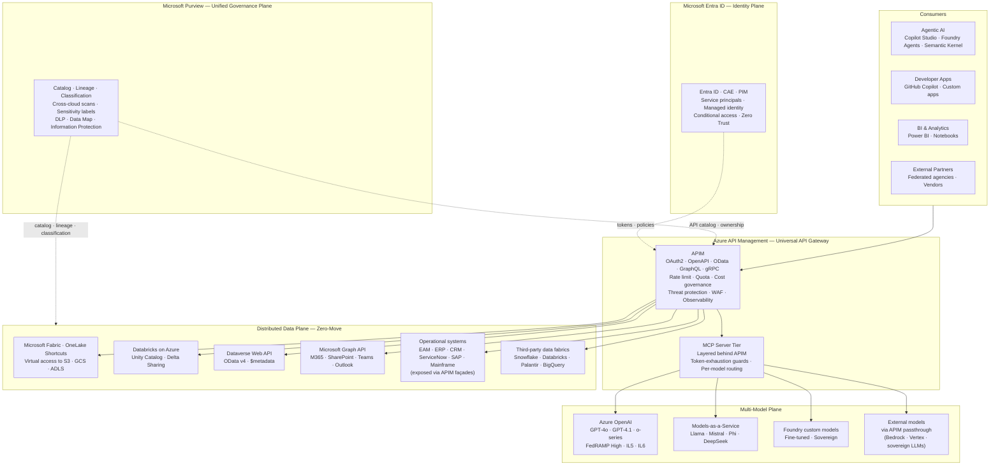
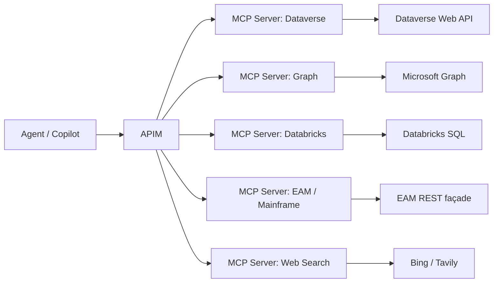

# API-First Data Strategy on Azure

## The Interoperability Layer for Multi-Model, Multi-Vendor AI Ecosystems

> **Thesis.** Large organizations are not buying "one AI." They are building AI **ecosystems** — multiple models, multiple vendors, data physically distributed across regions, clouds, and mission boundaries. Ecosystems generate four hard problems: **orchestration, governance, integration, lifecycle**. The vendor that solves those four problems wins the long arc — regardless of which model wins the headline. This paper argues that Microsoft is the only vendor that solves all four today, and that **Azure API Management plus the wider Microsoft platform constitutes a more complete API-first foundation than MuleSoft Anypoint Platform or the AWS API stack**.

---

## The strategic frame — an ecosystem, not one AI

The modern enterprise — federal mission agency, regulated financial institution, global manufacturer, healthcare network — is not standardizing on one AI vendor. It is composing an **ecosystem**. The job of the platform vendor is no longer to win the model. It is to be the **secure interoperability layer** that connects the ecosystem.

Ecosystems create four durable-leverage categories. These are exactly the categories Microsoft is built to solve, and they are the spine of this paper:

<div class="grid cards" markdown>

-   :material-graph-outline:{ .lg .middle } **Orchestration**

    ---

    Coordinating multiple models, multiple agents, and multi-step workflows across distributed centers and clouds — with consistent identity, cost governance, and observability.

-   :material-shield-check:{ .lg .middle } **Governance**

    ---

    Discovery, security, identity, retention, auditability, and compliance applied uniformly across data, APIs, models, and agents — not bolted on per system.

-   :material-vector-link:{ .lg .middle } **Integration**

    ---

    Standardized APIs that bind heterogeneous systems together — Azure-native, AWS, GCP, on-prem, mainframe, SaaS, sovereign — so the ecosystem composes instead of fragments.

-   :material-refresh:{ .lg .middle } **Lifecycle**

    ---

    End-to-end management of models, agents, APIs, and data products from authoring through deployment, monitoring, retirement — with versioning, rollback, and chargeback.

</div>

These categories compound. Whichever vendor owns them earns increasing leverage over time, regardless of which frontier model is in fashion this quarter. The remainder of this paper is the technical case for why Microsoft owns all four.

---

## The five pillars of an API-first AI reality

Architecture teams building this kind of ecosystem — federal mission, regulated commercial enterprise, sovereign-cloud operator — converge on the same five architectural pillars. Any platform proposal must answer to all five.

<div class="grid cards" markdown>

-   :material-numeric-1-circle:{ .lg .middle } **Multi-Model Future**

    ---

    Evaluating multiple AI systems simultaneously — frontier, sovereign, open-weight, fine-tuned, small task models — **not** standardizing on one.

-   :material-numeric-2-circle:{ .lg .middle } **Distributed Data**

    ---

    Data spans multiple regional centers, sovereign clouds, partner clouds, on-prem systems, and SaaS — **not** a single repository.

-   :material-numeric-3-circle:{ .lg .middle } **API-First Mandate**

    ---

    Everything must be machine-readable. RESTful API for all data, all models, all systems — with OpenAPI / OData metadata so the surface is discoverable.

-   :material-numeric-4-circle:{ .lg .middle } **Zero-Move Data**

    ---

    Zero-move, zero-copy architecture — compute travels to the data. Materialization only when freshness, governance, and cost analysis justify it.

-   :material-numeric-5-circle:{ .lg .middle } **Interoperability**

    ---

    Strong emphasis on eliminating silos across the enterprise. Heterogeneous tools, models, and clouds must compose through standard protocols.

</div>

These five pillars are not aspirational — they are the **architectural requirements** that procurement and security teams now write into RFPs and authority-to-operate packages. Any vendor whose answer requires data movement, custom connectors, or single-model lock-in fails the requirements gate.

---

## Executive summary

An API-first data strategy treats every dataset, model, and system as a **machine-readable, governed, discoverable endpoint**. Data is queried where it lives. Models are called through a uniform gateway. Identity, policy, and audit are enforced once, at the edge — not re-implemented per system.

Microsoft is uniquely positioned because it ships the **full stack of integration primitives natively as one integrated platform**:

- **API gateway** — Azure API Management (APIM)
- **Identity plane** — Microsoft Entra ID with Conditional Access, PIM, and Continuous Access Evaluation
- **Data plane** — Microsoft Fabric / OneLake / Synapse / Databricks-on-Azure
- **AI plane** — Azure AI Foundry + Azure OpenAI + Foundry Models-as-a-Service
- **Governance plane** — Microsoft Purview
- **Productivity surfaces** — M365 Copilot, Copilot Studio, GitHub Copilot, Power Platform
- **Universal data tier** — Microsoft Graph API + Dataverse Web API + Data API Builder

MuleSoft has APIs and connectors. AWS has APIs, models, and lakes. **Neither has the identity-grounded, productivity-integrated, FedRAMP-High, multi-model, governance-first stack that Microsoft ships as a single integrated platform.**

This paper is the technical brief that backs that claim, with side-by-side comparisons against MuleSoft Anypoint Platform and the AWS API stack (API Gateway + EventBridge + AppFlow + Step Functions + Bedrock).

---

## 1. Why these five pillars are non-negotiable now

The pillars above are the architecture you implement. The forces below are why those pillars became mandatory rather than aspirational over the last 24 months.

| Force | What changed | Consequence |
|---|---|---|
| **Multi-model is the new normal** | No single model wins every task; frontier, sovereign, open-weight, and small task-specific models all coexist | Architecture must abstract the model. Hardcoded clients to a single LLM lose all option value. |
| **Data movement is becoming illegal — or uneconomic** | Data residency regulations, sovereign cloud mandates, classified data handling, and petabyte-scale economics | Zero-move is the default. Materialization requires justification, not the other way around. |
| **Ecosystem composability beats walled gardens** | Enterprises operate Databricks + Snowflake + SAP + ServiceNow + SharePoint + mainframe + 3 LLM vendors simultaneously | Any platform demanding rip-and-replace is dead on arrival. Minimum-disruption integration is now a procurement gate. |
| **Agentic AI requires machine-readable surfaces** | Agents discover and call tools at runtime; they cannot operate against undocumented APIs or screen-scraping | API-first stops being a developer preference and becomes the foundation for the agent layer. |
| **Identity and audit are AI-safety requirements** | Token-level attribution is the only viable defence against prompt-injection, data-exfiltration, and chargeback disputes | Identity-grounded gateways are mandatory for any agentic deployment beyond prototype. |

The pillars are the WHAT. The forces are the WHY. The Microsoft / Azure architecture below is the HOW.

---

## 2. The reference architecture

The diagram below shows the complete reference architecture for an API-first, multi-model, zero-move data ecosystem on Azure. The same shape applies to a regulated commercial enterprise or a federal mission agency operating in Azure Government with FedRAMP High accredited services.



### Three principles encoded in the picture

1. **One gateway, many backends.** APIM brokers every API call regardless of where the backend lives — Azure-native, AWS, GCP, on-prem, mainframe, SaaS, or sovereign cloud. Consumers integrate against one URL, one auth pattern, one OpenAPI catalog.
2. **One identity, every system.** Entra ID is the universal token issuer. Every API call carries a JWT validated at the gateway, mapped to backend roles, and audited end-to-end. No re-authentication. No per-system credentials.
3. **One governance plane.** Purview catalogs every data asset and every API. Lineage flows from source system through API to consuming model. Sensitivity labels propagate through the chain. DLP applies at exit, not just at ingest.

The MuleSoft equivalent provides #1 only. The AWS equivalent provides #1 and a weaker version of #3 (Lake Formation tags do not equal Purview classification). Only Azure provides all three as one integrated stack.

---

## 3. Why Azure API Management is a more complete gateway

This section answers two questions directly:

- **Q1.** Why APIM over **AWS API Gateway** (REST + HTTP + WebSocket APIs, with EventBridge / AppFlow / Step Functions for orchestration)?
- **Q2.** Why APIM over **MuleSoft Anypoint Platform** (API Manager + Runtime Manager + DataWeave + Anypoint MQ + Composer)?

### 3.1 Gateway capability matrix

| Capability | Azure API Management | AWS API Gateway + adjacents | MuleSoft Anypoint Platform |
|---|---|---|---|
| **REST + GraphQL + WebSocket + gRPC** | REST, GraphQL, WebSocket, gRPC (preview) all in one product | REST + HTTP + WebSocket; GraphQL via AppSync (separate product); no gRPC | REST, GraphQL, SOAP; no native gRPC |
| **OpenAPI-native** | Import OpenAPI 3.x; export updated specs; round-trip | Imports OpenAPI; weaker round-trip | Imports OpenAPI / RAML |
| **Policy engine** | XML policy DSL — 60+ built-in policies, custom expressions, JWT/OAuth/CORS/cache/rate-limit/transform | JSON / Lambda authorizers; per-policy Lambda invocation has cost + latency penalty | DataWeave + Mule flows; powerful but proprietary |
| **Multi-cloud backends** | Any HTTP(S) backend in any cloud or on-prem; first-class private link to Azure backends | Easy for AWS; cross-cloud requires NAT + VPN + custom auth | Designed for multi-cloud but each connector licensed separately |
| **Built-in developer portal** | Customizable Markdown portal, OpenAPI try-it, subscription self-service | None native — bring-your-own or 3rd-party | Anypoint Exchange (strong) |
| **AI/LLM gateway features** | Built-in: token-quota policy, semantic-cache policy, AI content-safety policy, LLM emit-token-usage policy | None native; integrate via Bedrock guardrails (limited) | None native |
| **Identity integration** | Native Microsoft Entra ID; works with any OIDC IdP | Native AWS IAM + Cognito; OIDC supported | Anypoint identity + external IdPs |
| **Observability** | App Insights + Log Analytics + KQL out-of-box | CloudWatch + X-Ray | Anypoint Monitoring + 3rd-party APM |
| **Self-hosted gateway** | Yes — Linux container, runs anywhere (edge, AKS, on-prem, AWS, GCP) | No — managed only | Mule runtime — yes, but heavyweight |
| **FedRAMP High / IL5 / IL6** | Azure Gov: APIM is FedRAMP High; IL4/IL5 in DoD regions | AWS GovCloud: FedRAMP High | MuleSoft Gov Cloud: FedRAMP High (recent) |
| **Pricing model** | Tiered (Consumption, Developer, Basic, Standard, Premium, Premium v2); call-based at Consumption; capacity-based at Premium | Per-request + data transfer; cheap at low volume, expensive at scale | Per-core + per-API + per-environment; among the most expensive in market |
| **Hybrid / on-prem reach** | Self-hosted gateway + ExpressRoute + Private Link | API Gateway is cloud-only; on-prem reach via Direct Connect + custom | Mule runtime designed for hybrid |
| **Caching** | Internal cache + external Azure Cache for Redis | Throughput-priced cache add-on | Object Store v2 |
| **Versioning** | Versions + Revisions (zero-downtime) | Stage variables (less elegant) | API versioning per environment |
| **Native MCP support** | MCP-aware patterns (token quotas, model routing); first-class with Foundry | No native MCP | No native MCP |

### 3.2 Where APIM specifically wins for AI workloads

APIM has shipped **AI-gateway-specific policies** that no other gateway has natively:

- **`llm-token-limit`** — per-subscription token budgets that throttle independent of HTTP request count. This solves the #1 production problem of LLM economics: one bad agent loop draining $40k of tokens overnight.
- **`llm-semantic-cache-lookup` / `llm-semantic-cache-store`** — vector-based cache hit on semantically similar prompts. Cuts cost 30–70% on FAQ-style traffic.
- **`llm-emit-token-metric`** — first-class Prometheus / App Insights emission of prompt and completion tokens with subscription / model dimensions. Underpins chargeback.
- **`llm-content-safety`** — inline Azure AI Content Safety check on prompt and response, with policy-driven block / log / annotate.
- **Backend pool with circuit-breakers across Azure OpenAI deployments** — multiple AOAI regional deployments behind one logical model, with priority and weight; the gateway routes around quota-exhausted backends.

Together these policies make APIM not just an API gateway but a **multi-model LLM router** — the equivalent of a "LiteLLM proxy" but enterprise-grade, with identity, observability, and governance built in.

### 3.3 Where AWS API Gateway falls short

- **Lambda authorizer tax.** Anything beyond basic JWT or IAM auth becomes a Lambda authorizer, which adds 30–80 ms of cold-start latency and per-invocation cost. APIM's XML policies execute in-process.
- **No native LLM gateway features.** Token budgets, semantic cache, content-safety, and emit-token-metric are all you-build-it on AWS. Bedrock has guardrails but they are not exposed at the gateway layer.
- **No native developer portal.** Customers either pay for Postman / Stoplight / Backstage or build one. APIM ships one.
- **Cross-cloud backends are second-class.** Connecting to non-AWS backends generally means VPC peering + custom IAM + Direct Connect. APIM treats any HTTPS backend as a first-class citizen.
- **Multi-product complexity.** Equivalent capability requires API Gateway + Cognito + EventBridge + AppFlow + Step Functions + Lake Formation + CloudWatch. Six products vs one APIM instance.

### 3.4 Where MuleSoft Anypoint falls short

- **Cost.** Anypoint pricing is per-core per-environment. A modest production deployment frequently exceeds $300k/year before any connectors. APIM Premium starts an order of magnitude lower and Consumption tier is pennies per million calls.
- **DataWeave lock-in.** Powerful but proprietary. Engineering teams build mission-critical transformation logic in a DSL that runs nowhere except inside Mule.
- **Connector pricing.** Premium connectors (SAP, mainframe, AS400) are individually licensed. The connector library is broad but the bill scales with breadth.
- **No native AI gateway.** No token-budget policy, no semantic cache, no model routing. Customers bolt these on with Mule flows — at runtime cost.
- **Weak observability without add-ons.** Anypoint Monitoring is functional but most customers pay extra for Splunk / Datadog / New Relic anyway. APIM ships App Insights and KQL for free.
- **No tight identity integration with M365 / Entra.** OIDC works, but Entra-conditional-access, PIM, and CAE chain natively into APIM in a way Anypoint cannot match.
- **No native MCP, no native Copilot Studio integration, no native Graph API connector tier with sensitivity-label propagation.** MuleSoft is an integration platform. Azure is an integration platform **plus an AI platform plus a productivity platform** — and APIM is the seam where they meet.

### 3.5 The honest counter-argument

MuleSoft remains stronger in three areas, and an honest competitive pitch acknowledges this:

1. **Anypoint Exchange** — the developer portal and asset catalog is more mature than APIM's, particularly for organizations with thousands of internal APIs and reusable assets. APIM's portal is good; Anypoint's is excellent.
2. **DataWeave for complex transformations** — for genuinely complex schema mediation (especially against SOAP / EDI / mainframe), DataWeave is more expressive than APIM's policy DSL. Azure addresses this by offloading complex transformation to Logic Apps, Functions, or dbt — but it is a multi-product story.
3. **CloudHub managed runtime** — for organizations that explicitly do not want to manage compute, CloudHub is fully managed in a way APIM Self-Hosted Gateway is not (APIM managed instances exist but the comparison is apples-to-oranges).

These are real strengths. The Microsoft answer is: **the cost delta funds the engineering work to address them, and the platform breadth (M365, Copilot, Foundry, Fabric) compensates many times over.**

---

## 4. Dataverse as a first-class API surface

A frequent and entirely fair question from customer architects is: **"How would Dataverse be connected via a RESTful API? How do you know what's in the API?"**

The answer is more complete than most architects realize.

### 4.1 The Dataverse Web API

Dataverse exposes a fully **OData v4-compliant Web API** at `https://{org}.api.crm.dynamics.com/api/data/v9.2/` (or the appropriate sovereign-cloud endpoint for Government / GCC High / DoD). Every Dataverse table, column, choice set, and relationship is reachable through this endpoint.

| Operation | Pattern | Notes |
|---|---|---|
| List entities | `GET /accounts` | Returns paged collection; supports `$filter`, `$select`, `$expand`, `$top`, `$orderby` |
| Retrieve one | `GET /accounts({id})` | UUID-keyed |
| Create | `POST /accounts` with JSON body | Returns 204 + `OData-EntityId` header |
| Update | `PATCH /accounts({id})` | Partial update |
| Delete | `DELETE /accounts({id})` | Soft / hard depending on table configuration |
| Bound action | `POST /accounts({id})/Microsoft.Dynamics.CRM.Merge` | Strongly typed actions |
| Custom API | `POST /custom_action_name` | Author your own server-side endpoints |
| Batch | `POST /$batch` | Multi-operation transactions |

### 4.2 Metadata discovery — answering "how do you know what's in the API?"

This is the part that wins technical credibility. Dataverse's API is **fully introspectable**:

```http
GET https://{org}.api.crm.dynamics.com/api/data/v9.2/$metadata
Authorization: Bearer {token}
Accept: application/xml
```

Returns the **CSDL document** — an XML manifest describing every entity, attribute, relationship, choice set, and bound action available in the environment. This is the OData equivalent of an OpenAPI document, generated automatically and always current.

For programmatic discovery in code:

```http
# All entity definitions
GET /api/data/v9.2/EntityDefinitions?$select=LogicalName,DisplayName,EntitySetName

# Attribute definitions for one entity
GET /api/data/v9.2/EntityDefinitions(LogicalName='account')/Attributes

# Relationships
GET /api/data/v9.2/RelationshipDefinitions
```

Every shape, type, picklist value, and security role-applicability is discoverable at runtime. A consuming application — whether an agent, a notebook, or a third-party system — can introspect the environment without anyone hand-writing documentation.

### 4.3 Authentication patterns

| Pattern | When to use | Token flow |
|---|---|---|
| **User delegated (OAuth 2.0 auth-code + PKCE)** | Interactive apps acting on behalf of a user | Auth code → access + refresh tokens; user permissions enforced |
| **Service principal (client credentials)** | Server-to-server, no user context | Client ID + secret/cert → app-only token; app user must exist in Dataverse |
| **Managed identity** | Azure-hosted callers (Functions, App Service, AKS, Databricks) | No secrets in code; identity assigned to the resource |
| **On-behalf-of (OBO)** | Middle-tier service calling Dataverse on behalf of authenticated user | First token → OBO exchange → downstream token with user context preserved |

For zero-trust environments, **managed identity + APIM front-door** is the recommended pattern. APIM validates the upstream caller's Entra token, then asserts its own managed identity to Dataverse — no shared secrets touch the consuming application.

### 4.4 A working example — Databricks reading Dataverse

```python
# From a Databricks notebook in the same Entra tenant
from azure.identity import ManagedIdentityCredential
import httpx

cred = ManagedIdentityCredential()
token = cred.get_token("https://yourorg.api.crm.dynamics.com/.default").token

url = "https://yourorg.api.crm.dynamics.com/api/data/v9.2/accounts"
params = {
    "$select": "name,accountnumber,industrycode,revenue",
    "$filter": "revenue gt 1000000",
    "$top": 5000,
}
headers = {
    "Authorization": f"Bearer {token}",
    "OData-MaxVersion": "4.0",
    "OData-Version": "4.0",
    "Accept": "application/json",
    "Prefer": 'odata.include-annotations="*"',
}

with httpx.Client() as client:
    resp = client.get(url, params=params, headers=headers, timeout=60)
    resp.raise_for_status()
    df = spark.createDataFrame(resp.json()["value"])
df.write.format("delta").mode("overwrite").saveAsTable("bronze.accounts_from_dataverse")
```

Zero data movement. The data lives in Dataverse. Databricks reads it on demand. The Entra token carries identity all the way through. The same pattern works from an agent in Copilot Studio, a Power Automate flow, a Python script in Foundry, or any external system that can make an HTTPS call with a bearer token.

### 4.5 Where Dataverse fits in an API-first catalog

In a properly governed catalog, Dataverse is one of several **endpoint patterns** that data products expose:

- **Dataverse Web API** — for structured, transactional, user-curated data with rich security
- **SharePoint Lists / Graph API** — for content, files, and M365-grounded data
- **Data API Builder** (DAB) — for arbitrary SQL backends exposed as REST + GraphQL
- **OneLake SQL endpoint** — for warehouse / lakehouse queries
- **Bring-your-own REST** — wrapped by APIM for legacy systems, mainframe, SAP, EAM, etc.

All of them flow through APIM. All of them inherit the same identity model, the same rate limits, the same observability, the same Purview catalog entry.

---

## 5. The multi-model AI layer

API-first is the access pattern; multi-model is the consumption pattern. The two compose at the gateway.

### 5.1 The model portfolio

A realistic federal or regulated-commercial deployment has at least four model categories in production simultaneously:

| Tier | Examples | Hosting | Typical use |
|---|---|---|---|
| **Frontier general** | GPT-4o, GPT-4.1, o3-mini, Claude (via Foundry MaaS where available) | Azure OpenAI / Foundry MaaS | Reasoning, code, agentic, broad NL |
| **Open-weight / sovereign** | Llama 3.x, Mistral Large, Phi-4, DeepSeek-V3 | Foundry MaaS or Foundry custom deployment | Sovereign data boundaries, fine-tuning base |
| **Domain fine-tunes** | Customer-tuned models on internal data | Foundry custom-deployment | Specialized tasks (legal, scientific, mission) |
| **Small task models** | Phi-4-mini, distilled classifiers | Foundry / containerized | High-volume cheap inference, edge |

Most environments also include **external models** that need to keep operating — Bedrock for AWS-hosted workloads, sovereign-cloud LLMs accredited under FedRAMP High by third parties. APIM brokers those too: the gateway abstracts the model, the consumer sees one endpoint.

### 5.2 MCP — the protocol layer behind the gateway

Model Context Protocol (MCP) servers expose **tools** (callable functions) and **resources** (readable data) to model clients over a uniform interface. The architecture that works in production is:



This pattern delivers three critical wins:

1. **Token-exhaustion guards.** APIM's `llm-token-limit` policy applies per-subscription budgets across all MCP servers behind it — a single runaway agent cannot drain the budget.
2. **Per-tool authorization.** Entra tokens carry scope; APIM maps scopes to which MCP servers are reachable. An agent cannot enumerate tools it shouldn't see.
3. **One observability lens.** Every tool call shows up in App Insights with the same dimensions — agent identity, tool name, latency, token cost. Lineage is end-to-end.

This pattern is uniquely cheap and uniquely well-instrumented on Azure because APIM is already in the path, Entra is already issuing tokens, and App Insights is already collecting telemetry. On AWS the same architecture is buildable but requires API Gateway + Cognito + Lambda + DynamoDB + CloudWatch as separate billed services with separate IAM models.

### 5.3 Routing and fallback

Production agentic systems route between models based on cost, latency, capability, and quota. APIM's backend-pool feature with circuit-breaker policies implements this natively:

```xml
<policies>
  <inbound>
    <set-backend-service backend-id="aoai-pool" />
    <azure-openai-token-limit
        counter-key="@(context.Subscription.Id)"
        tokens-per-minute="100000"
        estimate-prompt-tokens="true"
        remaining-tokens-header-name="x-ratelimit-remaining-tokens" />
    <azure-openai-semantic-cache-lookup
        score-threshold="0.85"
        embeddings-backend-id="aoai-embeddings"
        ignore-system-messages="true" />
  </inbound>
  <backend>
    <forward-request />
  </backend>
  <outbound>
    <azure-openai-semantic-cache-store duration="3600" />
    <azure-openai-emit-token-metric>
      <dimension name="subscription-id" />
      <dimension name="model-id" />
    </azure-openai-emit-token-metric>
  </outbound>
</policies>
```

The same fragment is the production-grade answer to four hard problems at once: rate limiting, cost control, semantic caching, and chargeback telemetry. No equivalent exists on AWS API Gateway. No equivalent exists on MuleSoft.

---

## 6. The productivity dimension — what only Microsoft has

API-first competitive positioning that stops at "gateway versus gateway" misses the most important Microsoft asymmetry: **only Microsoft owns the productivity surface that consumes the APIs**.

| Surface | What it consumes | Why it matters |
|---|---|---|
| **Microsoft 365 Copilot** | Graph API, SharePoint, Outlook, Teams, OneDrive | The default tenant data — where users actually work |
| **Copilot Studio** | Connectors over APIM, Dataverse, Power Platform connectors, custom MCP | Low-code agent authoring — citizen developers wire APIs into business workflows |
| **GitHub Copilot** | Repo context, custom skills | Developer productivity grounded in the same identity |
| **Power Platform (Apps, Automate, Pages)** | Dataverse + 1,000+ connectors | Business-process automation with the same auth |
| **Azure AI Foundry Agent Service** | MCP, OpenAPI tools, Foundry models | Pro-code agent deployment with enterprise governance |
| **Agent 365** | Cross-tenant agent identity and lifecycle | The control plane for agentic workloads (preview-to-GA path) |

A competing API-first story on AWS reaches as far as the API. The Microsoft story reaches all the way to the human's email inbox, their team chat, their developer IDE, and their no-code app builder — with the same identity, same governance, and same audit trail.

This is the **"ecosystem connective tissue"** position. Microsoft does not need to be the only AI in the environment. Microsoft is positioned as the layer that makes the ecosystem work — and the layer that connects that ecosystem to where the workforce actually does its job.

---

## 7. Federal posture — FedRAMP High, IL5, IL6

The architecture above runs in Azure Commercial and **all four sovereign cloud boundaries**:

| Boundary | Status | Key services available |
|---|---|---|
| **Azure Commercial** | GA | All services |
| **Azure Government (GCC High / FedRAMP High)** | GA | APIM, AOAI (most models), Foundry (subset), Dataverse, Fabric (in-flight), Purview, Databricks, Synapse |
| **DoD IL5** | GA | APIM, AOAI (subset), Dataverse, Databricks |
| **DoD IL6** | GA / select | APIM, select AOAI deployments, sovereign Foundry path |

The architectural pattern is identical across boundaries. The list of available models and adjacent services varies. The same Bicep templates deploy in any boundary with cloud-environment parameters.

For agencies operating with **FedRAMP High reciprocity** on partner products (sovereign LLM gateways, specialized model platforms, mission analytics fabrics), APIM is the integration point that brokers between those partner products and Microsoft's own services without crossing accreditation boundaries. APIM's self-hosted gateway runs inside the accredited boundary; APIM's managed control plane stays in Azure Government.

---

## 8. The displacement plays

### 8.1 Displacing MuleSoft

The displacement sequence that works in practice:

1. **Co-exist first.** Stand up APIM alongside Anypoint. Migrate one greenfield API to APIM. Prove the cost delta and the AI-gateway features.
2. **Move the AI gateway.** All net-new LLM-touching APIs go to APIM regardless of where the broader gateway is. Token quotas, semantic cache, and content safety are uniquely APIM features.
3. **Move connectors selectively.** APIM + Logic Apps connectors replace MuleSoft connectors for SAP, ServiceNow, Salesforce, SharePoint at significant license-fee savings.
4. **Migrate APIs in waves.** Versioning + revisions in APIM allow zero-downtime cutover. Self-hosted gateway covers the on-prem reach use cases that previously justified Mule.
5. **Retire DataWeave to dbt / Logic Apps / Functions.** This is the multi-quarter work. Plan for it. Most transformations are simpler than DataWeave allows; the rest move to Logic Apps or Functions on Azure.

Typical ROI: **40–70% reduction in integration platform spend** over 24 months, plus elimination of premium-connector line items.

### 8.2 Displacing the AWS API stack

When the incumbent is API Gateway + Cognito + EventBridge + Step Functions + AppFlow + Lake Formation + Bedrock:

1. **Lead with the AI gateway gap.** AWS does not have a native LLM gateway. APIM is the lift that wins the AI workload.
2. **Lead with identity.** Cognito is functional. Entra is enterprise. Conditional Access + PIM + CAE are not buildable on Cognito.
3. **Lead with productivity.** AWS has no answer to M365 Copilot, Copilot Studio, Power Platform, or GitHub Copilot in the same identity / governance graph.
4. **Lead with governance.** Lake Formation is table-level. Purview is enterprise data + API + AI governance with sensitivity-label propagation through the chain.
5. **Coexist on data.** Leave data in S3 / Redshift. Use OneLake shortcuts and APIM to reach it. Zero-move keeps the AWS sunk costs whole.

An AWS-anchored environment does not need to delete AWS to adopt Azure. Azure is added where it is decisively better — and the AI / identity / productivity gaps are where Azure is decisively better.

---

## 9. Migration paths — minimum disruption

The single most important architectural constraint for any large existing estate is: **the architecture must work with what is already deployed, with minimum disruption.** No rip-and-replace. No data movement. No re-credentialing.

The Azure pattern honors this on three axes:

| Axis | Pattern | Burden on customer |
|---|---|---|
| **Existing data** | OneLake shortcuts + APIM façades over existing systems | Zero — data stays where it is |
| **Existing identity** | Entra B2B / B2C federations into existing IdPs; service principals for legacy systems | Low — federation is configured once |
| **Existing APIs** | Import OpenAPI specs into APIM; APIM becomes the front door without re-implementation | Low — import and overlay policy |
| **Existing models** | Brokered through APIM as backends; consumers don't change | Zero — the gateway abstracts the model |
| **Existing AI tooling** | Co-exists; APIM brokers; gradually consolidates as cost / capability advantages prove out | Low — staged co-existence |

This is the Microsoft posture in one sentence: **show up with substance, integrate with what exists, prove cost and capability, then let the ecosystem effects compound.**

---

## 10. What success looks like — a 12-month roadmap

| Quarter | Objective | Deliverables |
|---|---|---|
| **Q1** | Foundation | APIM Premium v2 deployed; Entra tenant integration; Purview registered; first AOAI deployment behind APIM with token-quota policy; one OpenAPI catalogued |
| **Q2** | First mission use case | One business-critical API exposed through APIM (e.g., EAM / facilities); one agent in Copilot Studio using it; semantic cache + chargeback live |
| **Q3** | Multi-model layer | MCP server tier behind APIM; Foundry MaaS routing; second model family in production; per-subscription cost dashboard |
| **Q4** | Ecosystem reach | OneLake shortcuts to two non-Azure data stores; cross-cloud lineage in Purview; agent surfaces in M365 Copilot + Copilot Studio + Foundry |

Outcomes at the end of year one:

- **Unified API catalog** with OpenAPI, ownership, lineage, and SLA
- **Identity-grounded zero-trust** across every API call
- **Cost governance** with per-subscription chargeback and token budgets
- **Multi-model routing** with fallback, caching, and content safety
- **Reach** to data in any cloud, any region, any boundary — without moving it

---

## 11. The one-page summary

> An API-first data strategy is the only architecture that survives multi-model, multi-vendor, multi-region, sovereign-cloud, regulated reality.
>
> Azure ships the most complete API-first stack on the market today. Azure API Management is a more feature-rich gateway than AWS API Gateway or MuleSoft Anypoint Platform, and it is the only gateway with native LLM features: token quotas, semantic caching, content safety, model routing, and token-emit metrics. Microsoft Entra ID is the only enterprise identity plane that grounds APIs, agents, M365 productivity, and developer tooling in one trust fabric. Microsoft Purview is the only governance plane that catalogs data, APIs, and AI artifacts together with cross-cloud reach. Dataverse, Graph API, and Data API Builder give Azure the deepest set of native machine-readable data endpoints of any cloud. Copilot Studio, M365 Copilot, GitHub Copilot, Power Platform, and Foundry Agent Service are the productivity surfaces no competitor can match.
>
> Together this is not a gateway product. It is a **secure interoperability layer** for the multi-model AI ecosystem the modern enterprise is actually building. That is the architectural answer, and it is the displacement answer for both MuleSoft and AWS.

---

## Related reading in this repo

- [Azure vs MuleSoft Anypoint Platform — 1-for-1 capability map](../comparison/azure-vs-mulesoft.md)
- [Azure vs AWS API stack — 1-for-1 capability map](../comparison/azure-vs-aws-api-stack.md)
- [Reference architecture: API-first multi-model AI ecosystem](../reference-architecture/api-first-multi-model-ecosystem.md)
- [Use case: API-first multi-model AI ecosystem for a federal mission agency](../use-cases/api-first-multi-model-ai-ecosystem.md)
- [Use case: Dataverse API integration](../use-cases/dataverse-api-integration.md)
- [Use case: Enterprise asset management exposed through APIM](../use-cases/enterprise-asset-management-apim.md)
- [Use case: Cross-platform integration with Microsoft as the connective tissue](../use-cases/cross-platform-integration-fabric.md)
- [Best practice: API-first data strategy](../best-practices/api-first-data-strategy.md)
- [Best practice: Zero-move data architecture](../best-practices/zero-move-data-architecture.md)
- [Best practice: Multi-model AI orchestration](../best-practices/multi-model-ai-orchestration.md)
- [Guide: APIM as the universal API gateway](../guides/apim-universal-gateway.md)
- [Guide: APIM + MCP layered orchestration](../guides/apim-mcp-layered-orchestration.md)
- [Guide: Zero-trust API governance for federal mission environments](../guides/zero-trust-api-governance-federal.md)
- [Solution Store — Azure API-first accelerators](../solution-store/index.md)
- [ADR-0025 — APIM as the integration fabric](../adr/0025-apim-as-integration-fabric.md)
