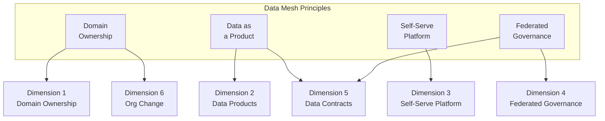
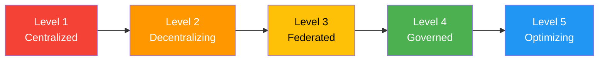
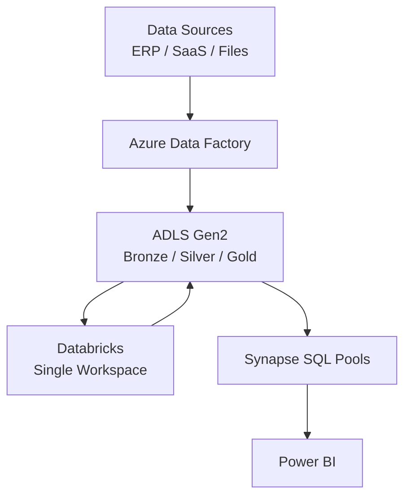
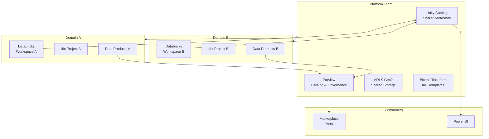
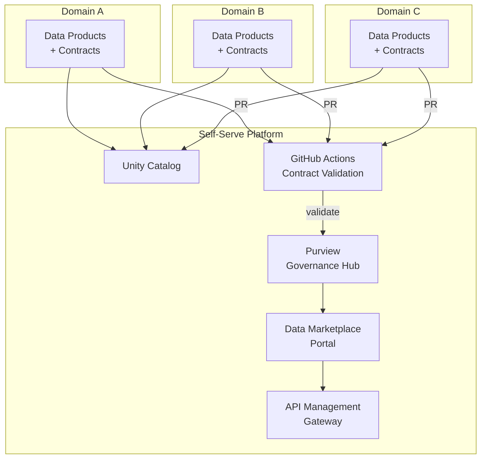
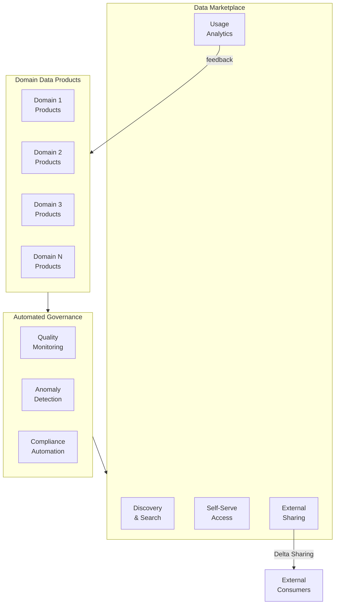

# Data Mesh Maturity Model

> Maturity model for data mesh adoption covering domain ownership, federated governance, self-serve platform, and data products. Provides a structured assessment across six dimensions scored 1--5, with anti-patterns, Azure implementation guidance, and migration paths for each level.

---

## Purpose

Data mesh is an organizational and architectural paradigm, not a product you install. Adopting it requires simultaneous changes to team structure, governance, infrastructure, and culture. Most organizations attempt the transition as a "big bang" and stall at a half-centralized, half-federated state that combines the disadvantages of both models.

This maturity model gives platform teams and data leadership a structured approach to:

1. **Assess current state** -- where the organization sits on the centralized-to-federated spectrum.
2. **Identify next steps** -- concrete changes needed to advance one level at a time.
3. **Avoid anti-patterns** -- failure modes observed at each maturity level.
4. **Map to Azure services** -- which services to deploy at each level.
5. **Align with CSA-in-a-Box** -- how the repo's architecture supports data mesh adoption.

The model is tailored to Azure-native organizations using the CSA-in-a-Box reference architecture. The principles and anti-patterns apply to any cloud, but the implementation guidance is Azure-specific.

---

## Data Mesh Principles

Zhamak Dehghani's four principles provide the theoretical foundation. Each principle maps to one or more assessment dimensions.

**Domain ownership.** Analytical data is owned by the team that produces it, not by a central data engineering team. The producing domain is responsible for data quality, freshness, and discoverability.

**Data as a product.** Domains expose their analytical data as products with clear interfaces, SLAs, documentation, and quality guarantees -- the same rigor applied to software products.

**Self-serve data infrastructure.** A platform team provides shared infrastructure (compute, storage, governance, catalog) that domains consume without filing tickets. The platform lowers the cognitive load of owning data products.

**Federated computational governance.** Governance is encoded as automated policies (data contracts, classification rules, interoperability standards) that domains must satisfy, rather than as manual approvals by a central team.

---

## Maturity Model

Five levels describe the progression from centralized monolith to optimized data mesh.

### Level 1 -- Centralized

A single data engineering team owns all analytical data. Business domains submit requests through tickets. The central team builds ETL pipelines, manages the warehouse, and produces reports. Domains have no ownership of their analytical data and no visibility into pipeline health. Lead times for new datasets are measured in weeks or months.

**Typical signals:** one Synapse or Databricks workspace for the entire organization, a JIRA backlog of 50+ data requests, data engineers who cannot explain the business meaning of the tables they maintain.

### Level 2 -- Decentralizing

The organization recognizes the bottleneck and begins distributing responsibility. Domain teams are identified and start defining their data products -- at least conceptually. Initial experiments with domain-owned pipelines begin, but shared infrastructure is not yet mature enough to support them without significant platform team involvement. Governance is still centralized and manual.

**Typical signals:** a data mesh strategy document exists, two to three pilot domains designated, domain teams have started writing dbt models, but deployment and infrastructure remain centralized.

### Level 3 -- Federated

Domain teams own and operate their data products. Each domain publishes data products with defined schemas, SLAs, and quality expectations. A platform team provides shared infrastructure -- compute, storage, catalog, governance tooling -- that domains consume as self-service. Governance is shifting from manual review to automated policy enforcement, but gaps remain.

**Typical signals:** multiple Databricks workspaces or domain-scoped schemas in Unity Catalog, data products registered in Purview, contract files in the repository, CI validates contracts on PR.

### Level 4 -- Governed

Federated governance is fully operational. Data contracts are enforced automatically in CI/CD. Interoperability standards ensure data products compose across domains. The self-serve platform is mature: domains can provision infrastructure, publish data products, and manage access without platform team intervention for routine operations. Classification, lineage, and quality are tracked automatically.

**Typical signals:** zero-touch data product publication (commit to main, CI validates, Purview registers, marketplace lists), data contracts block breaking changes, cross-domain joins documented and tested, platform team focuses on platform improvement rather than domain support.

### Level 5 -- Optimizing

The data mesh is a competitive advantage. A data marketplace enables discovery and consumption across the organization and potentially with external partners. Automated quality monitoring detects anomalies before consumers notice. Domains continuously improve their data products based on consumption metrics. The platform evolves based on domain feedback loops.

**Typical signals:** internal data marketplace with usage analytics, automated data quality anomaly detection, domains retire unused data products proactively, external data sharing via Delta Sharing, platform team publishes SLAs.

---

## Assessment Dimensions

Six dimensions capture the organizational and technical capabilities required for data mesh. Each is scored 1--5.

**Aggregate formula:** `floor(mean(D1, D2, ..., D6))`

### Dimension 1 -- Domain Ownership

Who owns the analytical data? This dimension measures the clarity and operational reality of domain ownership over data assets.

| Score | Criteria                                                                                                                                           |
| ----- | -------------------------------------------------------------------------------------------------------------------------------------------------- |
| 1     | Central data team owns all data. Domains submit tickets. No domain-level data ownership.                                                           |
| 2     | Domains identified on paper. Ownership matrix drafted. Central team still builds and operates most pipelines.                                      |
| 3     | Domains own their dbt models and pipeline definitions. Domain PRs require domain-owner approval (CODEOWNERS). Central team handles infrastructure. |
| 4     | Domains own end-to-end: schema design, pipeline code, quality checks, incident response. Platform team supports infrastructure only.               |
| 5     | Domains independently release data products. Per-domain release cadence. Domain teams have embedded data engineers.                                |

### Dimension 2 -- Data Products

Are analytical data assets treated as products with the same rigor as software products?

| Score | Criteria                                                                                                                                                               |
| ----- | ---------------------------------------------------------------------------------------------------------------------------------------------------------------------- |
| 1     | No concept of data products. Tables are internal artifacts of the data team. No documentation, no SLAs.                                                                |
| 2     | Initial data product definitions exist. Some documentation. No formal schema or SLA commitments.                                                                       |
| 3     | Data products have published schemas, owners, and basic quality expectations. Registered in a catalog (Purview). Discoverable by consumers.                            |
| 4     | Data products have SLAs (freshness, availability, quality). Quality is measured and reported. Consumers can self-serve access requests. Usage metrics tracked.         |
| 5     | Data marketplace operational. Products versioned with backward compatibility guarantees. Deprecation policy enforced. Consumption analytics drive product improvement. |

### Dimension 3 -- Self-Serve Platform

Does the platform team provide infrastructure that domains can consume without filing tickets?

| Score | Criteria                                                                                                                                                                 |
| ----- | ------------------------------------------------------------------------------------------------------------------------------------------------------------------------ |
| 1     | No platform team. Infrastructure provisioned ad-hoc through portal clicks or tickets to IT.                                                                              |
| 2     | Shared infrastructure exists (central Databricks, ADLS) but domains cannot self-serve. Changes require platform team involvement.                                        |
| 3     | Platform provides IaC templates for domain infrastructure. Domain workspaces provisioned through parameterized Bicep/Terraform. Some manual steps remain.                |
| 4     | Fully self-serve: domains provision compute, storage, and catalog entries through CLI or PR-driven workflows. Platform publishes an internal developer portal.           |
| 5     | Platform as a product: SLAs published, feedback loops active, continuous improvement based on domain satisfaction surveys. Platform abstracts cloud complexity entirely. |

### Dimension 4 -- Federated Governance

Is governance automated and federated, or manual and centralized?

| Score | Criteria                                                                                                                                                                         |
| ----- | -------------------------------------------------------------------------------------------------------------------------------------------------------------------------------- |
| 1     | Governance is informal or nonexistent. No data classification. No lineage. No access policies beyond "ask the DBA."                                                              |
| 2     | Central governance team defines policies. Manual reviews gate data product changes. Policies documented but not enforced automatically.                                          |
| 3     | Governance policies encoded as CI checks (contract validation, classification requirements). Catalog (Purview) tracks lineage and classification. Some manual exceptions remain. |
| 4     | Fully automated governance. Data contracts validated in CI. Classification applied automatically. Lineage computed from pipeline metadata. No manual gates for routine changes.  |
| 5     | Governance is a product: domain teams contribute governance rules. Interoperability standards enforce cross-domain composability. Governance metrics dashboarded and reviewed.   |

### Dimension 5 -- Data Contracts

Are the interfaces between data producers and consumers formalized, tested, and enforced?

| Score | Criteria                                                                                                                                                                               |
| ----- | -------------------------------------------------------------------------------------------------------------------------------------------------------------------------------------- |
| 1     | No contracts. Schema changes break downstream consumers without warning.                                                                                                               |
| 2     | Informal agreements ("don't change column X"). Some documentation of expected schemas. No automated enforcement.                                                                       |
| 3     | Contract files exist in the repository (`contract.yaml`). CI validates schema, metadata, and required fields. Breaking changes detected on PR.                                         |
| 4     | Contracts include SLAs, quality rules, classification, and lineage declarations. Schema evolution policies (backward/forward compatibility) enforced. Contract violations block merge. |
| 5     | Contract testing across producer-consumer boundaries. Consumer-driven contract testing. Automated impact analysis for schema changes. Contract registry with versioning.               |

### Dimension 6 -- Organizational Change

Has the organization adapted its structure, incentives, and culture to support data mesh?

| Score | Criteria                                                                                                                                                               |
| ----- | ---------------------------------------------------------------------------------------------------------------------------------------------------------------------- |
| 1     | Traditional structure: central data team, business units consume reports. No incentive for domains to own data.                                                        |
| 2     | Data mesh vision communicated. Pilot domains selected. Change management plan drafted. Resistance from central team and/or domains.                                    |
| 3     | Pilot domains operating. Data engineers embedded in domain teams (or domain teams upskilled). Leadership supports the transition. KPIs include data product metrics.   |
| 4     | Most domains own data products. Central team has fully transitioned to platform role. Incentive structures reward data product quality and adoption.                   |
| 5     | Data mesh is the default operating model. New domains onboard with minimal friction. Culture of data product thinking is self-sustaining. External sharing is routine. |

---

## Scoring Summary

| #   | Dimension                     | Score (1--5) | Key Gap | Priority Action |
| --- | ----------------------------- | :----------: | ------- | --------------- |
| 1   | Domain Ownership              |              |         |                 |
| 2   | Data Products                 |              |         |                 |
| 3   | Self-Serve Platform           |              |         |                 |
| 4   | Federated Governance          |              |         |                 |
| 5   | Data Contracts                |              |         |                 |
| 6   | Organizational Change         |              |         |                 |
|     | **Aggregate (floor of mean)** |              |         |                 |

---

## Anti-Patterns

Every maturity level has characteristic failure modes. Recognizing them early prevents stalling or regressing.

| Level | Anti-Pattern                   | Description                                                                                                                                | Remedy                                                                                |
| ----- | ------------------------------ | ------------------------------------------------------------------------------------------------------------------------------------------ | ------------------------------------------------------------------------------------- |
| 1     | **Ticket Treadmill**           | Central team drowns in data requests. Backlog grows faster than capacity. Domains resort to shadow data pipelines.                         | Begin decentralization. Identify pilot domains with capable engineers.                |
| 1     | **Copy-Paste ETL**             | Same transformation logic duplicated across multiple pipelines because there is no shared model layer.                                     | Introduce dbt or equivalent modeling layer before distributing ownership.             |
| 2     | **Strategy Without Execution** | Beautiful slide deck, no running code. Data mesh remains a PowerPoint exercise for quarters.                                               | Set a 90-day deadline for the first domain to publish one data product.               |
| 2     | **Premature Federation**       | Distributing ownership before the platform is ready. Domains flounder without tooling.                                                     | Invest in self-serve platform capabilities before asking domains to own data.         |
| 3     | **Platform Neglect**           | Platform team is understaffed or unfunded. Domains build workarounds. Drift between domain implementations grows.                          | Fund the platform team proportionally to the number of domains it supports.           |
| 3     | **Governance Vacuum**          | Domains own data but nobody enforces interoperability. Cross-domain joins fail silently.                                                   | Implement automated contract validation before scaling beyond pilot domains.          |
| 4     | **Over-Governance**            | Every change requires contract review, slowing velocity. Governance becomes the new bottleneck.                                            | Automate governance in CI. Reserve human review for breaking changes only.            |
| 4     | **Catalog Graveyard**          | Catalog is populated but nobody uses it. Consumers still ask Slack for data locations.                                                     | Integrate catalog into the developer workflow (IDE plugins, CLI search, marketplace). |
| 5     | **Metric Theater**             | Beautiful dashboards tracking vanity metrics (number of data products) rather than business outcomes (consumer adoption, decision impact). | Track consumption metrics and business outcomes, not just publication counts.         |
| 5     | **Innovation Fatigue**         | Continuous improvement becomes continuous churn. Domains cannot keep up with platform changes.                                             | Establish stability contracts for the platform. Version platform APIs.                |

---

## Azure Implementation by Level

Each maturity level maps to a characteristic Azure architecture. Organizations should match their infrastructure investment to their current maturity -- over-provisioning creates shelfware; under-provisioning creates bottlenecks.

### Level 1--2: Centralized Foundation

At these levels, the organization runs a centralized data platform. The focus is on building solid foundations that will later be federated.

| Service                       | Role                                                |
| ----------------------------- | --------------------------------------------------- |
| ADLS Gen2                     | Single data lake with Bronze/Silver/Gold containers |
| Azure Data Factory            | Centralized ingestion orchestration                 |
| Databricks (single workspace) | Shared compute for all transformation workloads     |
| Synapse SQL Pools             | Centralized serving layer for BI                    |
| Power BI                      | Reporting and dashboards                            |

Deploy Purview even at Level 1 -- cataloging established early makes federation dramatically easier. Use dbt from the start; its project structure maps naturally to domain boundaries later.

### Level 3: Federated Operations

Domains own their data products. The platform team provides shared infrastructure. Unity Catalog provides the governance layer across domain-scoped workspaces.

**Key Azure services:**

| Service                            | Role                                                                                 |
| ---------------------------------- | ------------------------------------------------------------------------------------ |
| Databricks (per-domain workspaces) | Domain-owned compute and transformation                                              |
| Unity Catalog                      | Shared metastore across all workspaces; three-level namespace (catalog.schema.table) |
| Purview                            | Cross-domain catalog, classification, lineage                                        |
| ADLS Gen2                          | Shared storage with domain-scoped containers                                         |
| Bicep                              | IaC templates for domain workspace provisioning                                      |

### Level 4: Governed Federation

Governance is automated. Data contracts are enforced in CI. The platform is fully self-serve.

**Key Azure services added at this level:**

| Service            | Role                                                             |
| ------------------ | ---------------------------------------------------------------- |
| API Management     | Unified gateway for data product APIs; per-domain rate limiting  |
| dbt contracts      | Schema and quality enforcement in CI                             |
| GitHub Actions     | Contract validation workflow; blocks merge on violation          |
| Purview (advanced) | Automated classification, sensitivity labels, data quality rules |
| Marketplace portal | Self-service discovery and access request workflow               |

### Level 5: Optimized Mesh

The mesh operates as a marketplace with automated quality, consumption analytics, and external sharing.

**Key Azure services added at this level:**

| Service                           | Role                                                  |
| --------------------------------- | ----------------------------------------------------- |
| Delta Sharing                     | Cross-organization data sharing without data movement |
| Azure Monitor + custom dashboards | Consumption analytics and quality monitoring          |
| Azure ML / AI anomaly detection   | Automated data quality anomaly detection              |
| Power BI embedded                 | Self-service analytics within the marketplace portal  |

---

## CSA-in-a-Box Data Mesh Alignment

CSA-in-a-Box implements a contract-first, monorepo-based data mesh as described in [ADR-0012](../adr/0012-data-mesh-federation.md). The following table maps CSA-in-a-Box components to data mesh dimensions.

| Dimension             | CSA-in-a-Box Component                                            | Implementation Detail                                                                                                                                                                          |
| --------------------- | ----------------------------------------------------------------- | ---------------------------------------------------------------------------------------------------------------------------------------------------------------------------------------------- |
| Domain Ownership      | `domains/<domain>/` directory structure, `.github/CODEOWNERS`     | Each domain has its own directory with dbt models, data products, and tests. CODEOWNERS enforces per-domain approval. Path-triggered CI scopes builds to changed domains.                      |
| Data Products         | `domains/<domain>/data-products/<product>/contract.yaml`          | Contract files declare schema, SLA, classification, owner, and quality rules. Products are the unit of publication.                                                                            |
| Self-Serve Platform   | `deploy/bicep/`, `csa_platform/`, portal marketplace              | Bicep IaC provisions infrastructure. The platform layer (`csa_platform/`) provides shared governance and catalog services. The portal marketplace surfaces data products to consumers.         |
| Federated Governance  | `csa_platform/governance/`, Purview bootstrap, contract validator | Governance is encoded as CI checks. `contract_validator.py` validates contracts on every PR. Purview bootstrap registers products on merge. Sensitivity labels applied from contract metadata. |
| Data Contracts        | `contract.yaml`, `.github/workflows/validate-contracts.yml`       | Contracts are validated in CI. Required fields: `apiVersion`, `kind`, `metadata`, `schema`, `sla`, `quality_rules`. Breaking changes block merge.                                              |
| Organizational Change | Documentation, ADRs, guided examples                              | Architecture decisions documented in ADRs. Working examples reduce onboarding friction. The contract-first approach allows incremental adoption without organizational restructuring.          |

The contract-first, in-monorepo approach (ADR-0012 Option 2) provides mesh semantics without the churn of a full subrepo split. Domains that mature to the point of needing independent release cadence can be promoted to subrepos without changing the contract/Purview/marketplace pipeline.

---

## Migration Path

Moving between levels requires coordinated changes across technology, governance, and organization. The following steps are ordered to minimize risk and maximize early value.

### Level 1 to Level 2

**Focus:** Build foundations and select pilots.

1. **Identify 2--3 pilot domains** with capable engineers, well-understood data, and motivated leadership.
2. **Deploy Purview** and begin scanning existing data sources. Catalog the top 20 datasets.
3. **Introduce dbt.** Organize models by domain even within a single dbt project -- natural seams for later decomposition.
4. **Draft data product definitions.** Write `contract.yaml` files for 1--2 products per pilot domain, even before CI enforcement.
5. **Communicate the vision** to all stakeholders. Address central-team concerns about their evolving role.

### Level 2 to Level 3

**Focus:** Operationalize domain ownership.

1. **Provision per-domain workspaces** using Bicep or Terraform. CSA-in-a-Box `deploy/bicep/` templates provide a starting point.
2. **Enable CODEOWNERS** with branch protection requiring domain-owner approval for `domains/<domain>/` paths.
3. **Implement contract validation** via `validate-contracts.yml`. Start with warnings, then switch to blocking.
4. **Connect Purview.** Automate catalog registration from contract files on merge to main.
5. **Launch the marketplace** portal to make data products discoverable.

### Level 3 to Level 4

**Focus:** Automate governance and make the platform self-serve.

1. **Enforce contracts strictly** -- switch from warning to merge-blocking.
2. **Automate classification** using Purview sensitivity labels derived from contract metadata.
3. **Build self-serve provisioning** so domains can create environments through parameterized IaC.
4. **Implement cross-domain testing** for data products that compose across domain boundaries.
5. **Deploy API Management** as the unified gateway ([APIM Data Mesh Gateway guide](../guides/apim-data-mesh-gateway.md)).

### Level 4 to Level 5

**Focus:** Build the marketplace and optimize continuously.

1. **Add consumption analytics** -- track usage by product, consumer, and channel; feed data back to domains.
2. **Implement anomaly detection** for freshness violations, distribution drift, and volume anomalies.
3. **Enable external sharing** via Delta Sharing with classification-gated access controls.
4. **Establish platform SLAs** for compute availability, catalog freshness, and CI pipeline latency.
5. **Retire stale products** -- flag products with zero consumption for 90 days; enforce deprecation policy.

---

## Assessment Questionnaire

Use these questions to guide scoring conversations. Average the scores within each dimension.

| Dimension            | Question                                                                             | 1 (Low)                  | 5 (High)                          |
| -------------------- | ------------------------------------------------------------------------------------ | ------------------------ | --------------------------------- |
| Domain Ownership     | Can you identify the owning team for a Gold-layer quality issue within five minutes? | No ownership clarity     | Ownership registry with on-call   |
| Domain Ownership     | Do domain teams write their own transformation logic or does a central team?         | Central team             | Domain teams, end-to-end          |
| Domain Ownership     | Do domain PRs require domain-owner approval?                                         | No review gates          | CODEOWNERS with branch protection |
| Data Products        | Can a new consumer discover data products without asking a person?                   | No catalog               | Searchable marketplace            |
| Data Products        | Do data products have published freshness and availability SLAs?                     | No SLAs                  | SLAs monitored with alerting      |
| Data Products        | Are downstream consumers notified before schema changes land?                        | No notification          | Automated impact analysis         |
| Self-Serve Platform  | How long to provision a new workspace or compute cluster?                            | Weeks via ticket         | Minutes via self-serve IaC        |
| Self-Serve Platform  | Does the platform team publish templates domains can use independently?              | No docs                  | Internal developer portal         |
| Self-Serve Platform  | Does the platform team publish SLAs?                                                 | No SLAs                  | SLAs with incident postmortems    |
| Federated Governance | Are governance policies enforced automatically in CI?                                | Manual review            | Fully automated                   |
| Federated Governance | Is data lineage tracked automatically source-to-consumer?                            | No lineage               | Purview auto-computed             |
| Federated Governance | Can a compliance officer produce a classification report within an hour?             | Impossible               | Automated from catalog            |
| Data Contracts       | Do contract files exist for every product, validated in CI?                          | No contracts             | CI blocks merge on violation      |
| Data Contracts       | Do contracts include schema evolution policies?                                      | No                       | Evolution policy enforced         |
| Data Contracts       | Are consumers involved in contract definition?                                       | Producer-only            | Consumer input formalized         |
| Org Change           | Have data engineers been embedded in domain teams?                                   | Central pool             | Embedded with domain expertise    |
| Org Change           | Do domain KPIs include data product quality and adoption?                            | No                       | Data product health is a team OKR |
| Org Change           | Is the former central team now operating as a platform team?                         | Still building pipelines | Fully transitioned to platform    |

---

## Interpreting Results

**Balanced profiles** indicate that the organization is progressing evenly across all dimensions. **Imbalanced profiles** indicate specific bottlenecks.

| Pattern                                            | Interpretation                                                                                                    | Risk                                                                         |
| -------------------------------------------------- | ----------------------------------------------------------------------------------------------------------------- | ---------------------------------------------------------------------------- |
| High Domain Ownership, Low Self-Serve Platform     | Domains own data but lack tooling. Engineers waste time on infrastructure instead of data products.               | Burnout and shadow-IT infrastructure.                                        |
| High Data Contracts, Low Organizational Change     | Contracts exist but nobody maintains them. They were written by the central team, not the domain.                 | Contracts become stale and ignored.                                          |
| High Self-Serve Platform, Low Federated Governance | Beautiful platform with no guardrails. Domains build incompatible data products.                                  | Interoperability failures. Cross-domain analytics impossible.                |
| High Federated Governance, Low Domain Ownership    | Automated governance but no domain teams to govern. Central team runs everything through the governance pipeline. | Over-engineering. Governance overhead without distributed ownership benefit. |

---

## Related

- [ADR-0012 Data Mesh Federation](../adr/0012-data-mesh-federation.md) -- the contract-first, in-monorepo federation model adopted by CSA-in-a-Box
- [APIM as Data Mesh Gateway](../guides/apim-data-mesh-gateway.md) -- architecture guide for the unified API gateway layer
- [Databricks Unity Catalog Guide](../guides/databricks-unity-catalog.md) -- governance layer for Databricks workspaces
- [Microsoft Purview Guide](../guides/purview.md) -- data catalog, classification, and lineage
- [Data Governance Best Practices](../best-practices/data-governance.md) -- operational governance patterns
- [Platform Research Report](CSA-Platform-Research-Report.md) -- strategic platform analysis covering data mesh and data fabric architectures
- [Architecture](../ARCHITECTURE.md) -- overall CSA-in-a-Box architecture reference
- [AI Readiness Assessment Framework](ai-readiness-framework.md) -- companion maturity model for AI adoption
