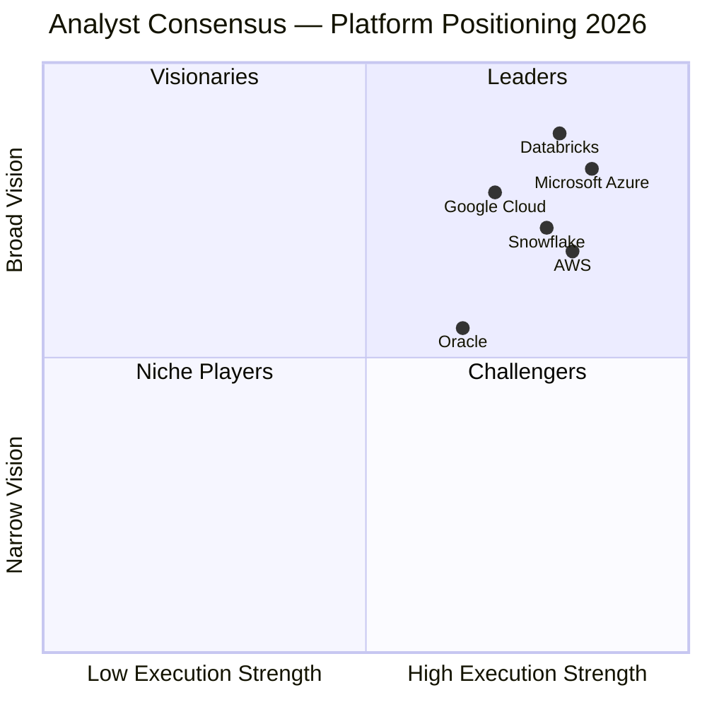
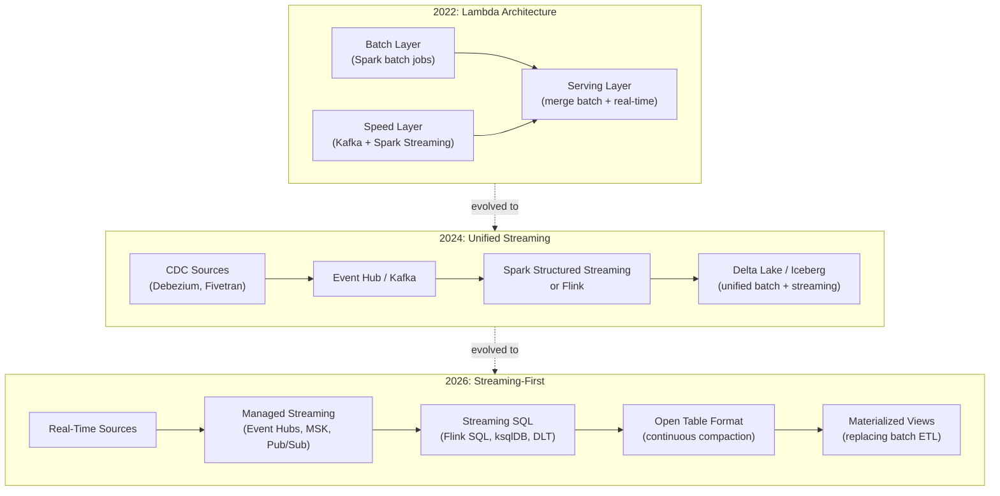
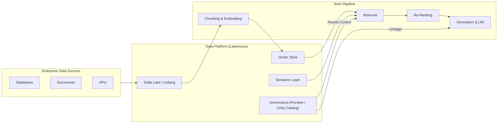
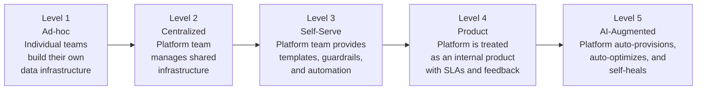

[Home](../../README.md) > [Docs](../index.md) > [Research](index.md) > **Enterprise Data Platforms 2026**

# Enterprise Data Platforms — 2026 State of the Market

!!! info "Comparative positioning note"
    This document is written from the
    perspective of Microsoft Azure, Cloud Scale Analytics, and CSA Loom. Any
    description of third-party or competing products, services, pricing, or
    capabilities is derived from **publicly available documentation and sources**
    believed accurate at the time of writing, and is provided for **general
    comparison only**. We do not claim expertise in, or authority over, any
    non-Microsoft product or service; the respective vendor's official
    documentation is the authoritative source for their offerings, which may
    change over time. Nothing here is intended to disparage any vendor — where a
    competing product has genuine advantages, we aim to note them honestly.
    Verify all third-party details against the vendor's current official
    documentation before making decisions.

> **TL;DR:** The enterprise data platform market has consolidated around the lakehouse paradigm, with open table formats (Iceberg, Delta Lake) becoming the default storage layer. AI is no longer an adjacent workload -- it is the primary forcing function for platform architecture decisions. Microsoft Fabric, Databricks, and Snowflake are locked in a three-way battle for the unified analytics platform, while AWS and GCP compete on breadth and integration. Governance has shifted from afterthought to first-class platform primitive, driven by regulatory pressure and the operational demands of RAG and agentic AI. Cost optimization has matured from ad-hoc tagging exercises into automated FinOps disciplines. Organizations that fail to converge on a lakehouse-first, governance-embedded architecture will find themselves unable to operationalize AI at scale.

**Date:** 2026-04-30
**Purpose:** Market analysis and strategic positioning for CSA-in-a-Box as an open-source enterprise data platform.

---

## 1. Executive Summary

The enterprise data platform market in 2026 looks fundamentally different from even two years ago. The most significant shift is convergence: the boundaries between data lakes, data warehouses, and AI/ML platforms have dissolved. Every major vendor now sells a "unified" platform that combines storage, compute, governance, and AI capabilities under a single control plane. The lakehouse architecture -- pioneered by Databricks and now adopted by every serious competitor -- has won the architectural debate decisively. No new enterprise data platform is being built on a pure data warehouse or pure data lake pattern.

AI is the dominant force shaping platform architecture decisions in 2026. Specifically, generative AI workloads (RAG pipelines, agentic systems, fine-tuning workflows) have exposed critical gaps in data quality, metadata management, and governance that traditional analytics workloads tolerated for years. Organizations discovering that their AI outputs are only as good as their underlying data are investing heavily in data quality tooling, cataloging, and lineage -- not because a compliance officer demanded it, but because their AI applications produce garbage without it.

The lakehouse has become the default architecture for new deployments. Open table formats -- Apache Iceberg and Delta Lake primarily -- provide the storage layer, while vendor-specific compute engines optimize query performance on top. The debate is no longer "lakehouse vs. warehouse" but "which lakehouse implementation." Iceberg has gained significant momentum as the vendor-neutral option, with Snowflake, AWS, Google, and even Databricks (through UniForm) supporting it. Delta Lake retains its stronghold in the Databricks and Microsoft ecosystems.

Governance has undergone a philosophical transformation. It is no longer a separate layer bolted onto data platforms after the fact. In 2026, governance is a platform primitive -- baked into storage formats (row-level security in Iceberg), compute engines (Unity Catalog, Purview), and even AI frameworks (model cards, prompt guardrails, output attribution). This shift was accelerated by EU AI Act enforcement beginning in August 2025 and the proliferation of US state privacy laws that now cover the majority of the American population.

Cost optimization has matured significantly. The days of "lift and shift to the cloud and figure out costs later" are over. FinOps practices are now table stakes for any enterprise data platform deployment. Serverless compute options have become the default for variable workloads, reserved capacity is standard for predictable baselines, and automated rightsizing tools are built into every major platform. The total cost conversation has also shifted from raw infrastructure cost to value-per-query and cost-per-insight metrics.

Finally, the multi-cloud reality has settled into a pragmatic middle ground. Most enterprises run workloads across two or more clouds, but very few are pursuing true multi-cloud data platforms. Instead, organizations pick a primary cloud for their data platform and use cross-cloud capabilities selectively -- typically for specific regulatory, acquisition-driven, or best-of-breed requirements.

---

## 2. Market Landscape

### 2.1 Major Platform Comparison

| Capability         | Azure (Fabric / Synapse / Databricks)       | AWS (Redshift / EMR / Athena / Glue)  | GCP (BigQuery / Dataproc / Dataflow) | Snowflake                | Databricks (Multi-Cloud)       |
| ------------------ | ------------------------------------------- | ------------------------------------- | ------------------------------------ | ------------------------ | ------------------------------ |
| **Lakehouse**      | OneLake (Fabric), ADLS + Delta Lake         | S3 + Iceberg (native), Lake Formation | BigLake + Iceberg                    | Iceberg-native (Polaris) | Delta Lake + UniForm           |
| **SQL Analytics**  | Fabric Warehouse, Synapse Serverless        | Redshift Serverless                   | BigQuery                             | Snowflake Warehouse      | Databricks SQL                 |
| **Spark Compute**  | Fabric Spark, Databricks                    | EMR, EMR Serverless, Glue             | Dataproc, Dataproc Serverless        | Snowpark (limited)       | Native Spark                   |
| **Streaming**      | Fabric Real-Time Intelligence, Event Hubs   | Kinesis, MSK                          | Dataflow, Pub/Sub                    | Snowpipe Streaming       | Structured Streaming           |
| **Governance**     | Purview, Unity Catalog                      | Lake Formation, Glue Data Catalog     | Dataplex, Data Catalog               | Horizon                  | Unity Catalog                  |
| **AI/ML**          | Azure OpenAI, Azure ML, Fabric Data Science | Bedrock, SageMaker                    | Vertex AI, Gemini                    | Cortex AI                | Mosaic AI                      |
| **ETL/ELT**        | ADF, Fabric Pipelines, dbt                  | Glue, Step Functions                  | Dataflow, Cloud Composer             | Snowpark, dbt            | Delta Live Tables, dbt         |
| **Semantic Layer** | Power BI Semantic Models                    | QuickSight Q                          | Looker Semantic                      | Cortex Analyst           | n/a (partner ecosystem)        |
| **Open Format**    | Delta Lake (primary), Iceberg (preview)     | Iceberg (primary), Delta, Hudi        | Iceberg (BigLake), Delta             | Iceberg (native)         | Delta Lake + Iceberg (UniForm) |
| **Federal/Gov**    | Azure Government (IL5+), FedRAMP High       | GovCloud (IL5), FedRAMP High          | FedRAMP High (limited IL)            | FedRAMP Moderate         | FedRAMP Moderate               |

### 2.2 Market Share and Growth

The cloud data platform market reached approximately $95 billion in 2025 and is growing at 22% CAGR. Key market dynamics:

- **Microsoft** holds the largest overall share when combining Azure data services, Fabric, and the Databricks-on-Azure footprint. Fabric adoption has accelerated sharply since GA, particularly among organizations already invested in the Microsoft 365 and Power BI ecosystem.
- **AWS** retains the largest pure IaaS market share but has lost ground in the managed analytics platform space. Redshift Serverless and the native Iceberg integration have stabilized their competitive position.
- **Snowflake** revenue growth decelerated from 30%+ to the low 20s, but the platform remains the most popular independent data warehouse. Cortex AI features are driving re-engagement with existing customers.
- **Databricks** crossed $2.5 billion ARR and continues growing faster than the market. The Unity Catalog and Mosaic AI story resonates strongly with data engineering teams.
- **Google Cloud** BigQuery remains the technical leader in serverless analytics but struggles with enterprise sales motion outside digital-native companies. Gemini integration is compelling but GCP market share gains are incremental.

### 2.3 Analyst Positioning

**Gartner Magic Quadrant for Cloud Database Management Systems (2025):**
Leaders quadrant includes Microsoft, AWS, Google, Snowflake, and Databricks. Oracle has maintained a Leaders position on the strength of its autonomous database capabilities. The primary differentiators are AI integration, governance maturity, and multi-workload support.

**Forrester Wave for Cloud Data Platforms (2025):**
Microsoft and Databricks are positioned as Leaders, with Snowflake and Google as Strong Performers. Forrester emphasizes the convergence of analytics and AI as the key evaluation criterion, favoring platforms with native LLM integration and governance automation.

---

## 3. Architecture Trends

### 3.1 Lakehouse as the Default

The lakehouse architecture has moved from "emerging pattern" to "assumed baseline." Three open table formats dominate:

| Format             | Primary Backer                 | Governance Support                 | Streaming Support                | Cross-Engine Compatibility | Adoption Trend                     |
| ------------------ | ------------------------------ | ---------------------------------- | -------------------------------- | -------------------------- | ---------------------------------- |
| **Delta Lake**     | Databricks, Microsoft          | Unity Catalog, row/column security | Native (Structured Streaming)    | Improving (UniForm)        | Stable, strong in Databricks/Azure |
| **Apache Iceberg** | Snowflake, AWS, Apple, Netflix | Polaris Catalog, fine-grained ACLs | Improving (Flink, Kafka Connect) | Excellent (vendor-neutral) | Rapidly growing                    |
| **Apache Hudi**    | Uber, AWS (partial)            | Basic                              | Strong (streaming-first design)  | Moderate                   | Declining relative to Iceberg      |

The convergence trend is best represented by Databricks UniForm, which writes Delta Lake tables that are simultaneously readable as Iceberg and Hudi. This pragmatic approach acknowledges that format wars matter less than interoperability. Organizations starting new platforms should default to either Delta Lake (if committed to Databricks/Azure) or Iceberg (if prioritizing vendor neutrality).

### 3.2 Data Mesh Adoption Patterns

Data mesh, now five years into mainstream adoption, has produced clear patterns of success and failure:

**Success factors:**

- Organizations that treated data mesh as an organizational design problem (not a technology problem) succeeded
- Domain teams with genuine data engineering capability delivered quality data products
- Centralized platform teams that built genuine self-serve infrastructure enabled scale
- Federated governance with automated policy enforcement prevented chaos

**Failure modes:**

- Treating data mesh as "let every team do their own thing" -- governance collapse
- No investment in self-serve platform -- domains lack tooling and capability
- Forcing data mesh onto organizations without domain maturity -- premature decentralization
- Confusing data mesh with organizational restructuring -- disruption without data improvement
- Underestimating the cultural shift: domain teams accustomed to "throw data over the wall" resist ownership
- Data product proliferation without consumption tracking: hundreds of products nobody uses

The consensus in 2026: data mesh principles are sound, but full organizational adoption requires at least 18-24 months and significant investment in platform engineering. Most successful implementations are hybrid -- centralized platform with federated domain ownership, not pure decentralization.

**Data mesh maturity by industry:**

| Industry           | Typical Maturity | Notes                                                                                |
| ------------------ | ---------------- | ------------------------------------------------------------------------------------ |
| Financial services | Level 3-4        | Regulatory pressure drives governance; strong domain boundaries                      |
| Technology         | Level 3-4        | Engineering culture supports platform thinking                                       |
| Healthcare         | Level 2-3        | Data sensitivity creates governance overhead; HIPAA complicates sharing              |
| Government         | Level 1-2        | Organizational silos resist domain ownership; emerging adoption in civilian agencies |
| Retail             | Level 2-3        | Clear domains (supply chain, customer, product) but limited platform engineering     |
| Manufacturing      | Level 2          | OT/IT divide complicates domain boundaries                                           |

### 3.3 Real-Time Analytics Shift

Streaming-first architectures have moved from aspiration to operational reality for a growing segment of enterprises. Key patterns:

- **Kappa architecture** (streaming-only) is gaining ground over Lambda (batch + streaming) for new deployments
- **Change Data Capture (CDC)** via Debezium, Fivetran, and native database connectors has become the standard ingestion pattern
- **Materialized views over streams** are replacing traditional batch ETL for many use cases
- **Real-time feature stores** for ML (Tecton, Feast, Databricks Feature Store) enable streaming ML inference

The infrastructure shift is from Event Hubs / Kafka for ingestion to Flink / Spark Structured Streaming for processing to Iceberg / Delta Lake for storage. The entire pipeline is now expressible in SQL for many use cases, dramatically lowering the skill barrier.

**Streaming architecture evolution:**

### 3.4 Semantic Layer Renaissance

The semantic layer -- a business-meaning abstraction between raw data and consumption tools -- has made a significant comeback:

- **dbt Metrics Layer** provides version-controlled metric definitions that multiple BI tools can consume
- **Power BI Semantic Models** (formerly datasets) serve as the de facto semantic layer in Microsoft environments
- **Looker Modeling Language (LookML)** remains strong in GCP environments
- **Cube.dev** and **AtScale** offer vendor-neutral semantic layers with caching

The driver behind this renaissance is AI: natural-language-to-SQL systems require a well-defined semantic layer to generate accurate queries. Without it, LLMs hallucinate column meanings and produce incorrect aggregations. Organizations investing in AI-powered analytics are finding that the semantic layer is not optional -- it is prerequisite infrastructure.

---

## 4. AI Impact on Data Platforms

### 4.1 GenAI as the Forcing Function for Data Quality

The single most transformative effect of generative AI on data platforms is not new AI features -- it is the sudden, urgent demand for better data quality. RAG applications that retrieve stale, duplicated, or poorly categorized data produce unreliable outputs. Agentic systems that operate on inconsistent data take incorrect actions. The tolerance for "good enough" data quality that analytics workloads afforded has evaporated.

Concrete impacts:

- Data quality monitoring has moved from quarterly reviews to continuous automated validation
- Metadata completeness (descriptions, tags, lineage) has become a measurable KPI
- Data freshness SLAs are now defined in minutes, not days
- Deduplication and entity resolution are no longer deferred -- they are prerequisites for AI deployment

### 4.2 RAG Architecture Patterns

Retrieval-Augmented Generation has become the standard pattern for enterprise AI applications. The data platform implications are significant:

Key platform requirements for RAG:

- **Vector search** integrated into the data platform (not a separate sidecar database)
- **Embedding pipelines** as first-class data engineering workflows
- **Access control propagation** from source data through to LLM responses
- **Lineage tracking** from generated answer back to source chunks

### 4.3 Agent-Based Analytics

Natural-language-to-SQL and agent-based analytics represent the next evolution beyond dashboards. Every major platform now offers some version:

| Platform         | Agent/NL-SQL Feature                    | Maturity | Approach                                     |
| ---------------- | --------------------------------------- | -------- | -------------------------------------------- |
| Microsoft Fabric | Copilot for Power BI, Fabric Data Agent | GA       | Tight integration with semantic models       |
| Databricks       | Genie, AI/BI Dashboards                 | GA       | SQL Warehouse + Unity Catalog metadata       |
| Snowflake        | Cortex Analyst                          | GA       | Semantic model + verified queries            |
| AWS              | QuickSight Q, Bedrock Agents            | GA       | Natural language tied to QuickSight datasets |
| Google           | Gemini in BigQuery, Looker              | GA       | BigQuery metadata + Gemini reasoning         |

The critical dependency for all of these is a well-maintained semantic layer and comprehensive metadata. Platforms with rich catalogs (Unity Catalog, Purview) produce significantly better agent outputs.

### 4.4 AI Governance Requirements

The EU AI Act (enforcement began August 2025) and emerging US state regulations have created concrete platform requirements:

- **Model lineage** -- tracking which data trained or grounded which model
- **Output attribution** -- tracing generated content back to source data
- **Bias detection** -- continuous monitoring of model outputs for demographic bias
- **Data provenance** -- proving that training data was legally and ethically obtained
- **Access audit trails** -- complete logs of who accessed what data for AI purposes
- **Right to explanation** -- ability to explain AI-driven decisions to affected individuals

These requirements are driving governance features directly into platform roadmaps. Unity Catalog now tracks ML model lineage alongside data lineage. Purview classifies AI training datasets with the same sensitivity labels applied to operational data.

**AI governance capability matrix by platform:**

| Capability                  | Purview + Azure ML            | Unity Catalog + Mosaic AI | Snowflake Horizon | AWS (SageMaker + Lake Formation) | GCP (Vertex AI + Dataplex) |
| --------------------------- | ----------------------------- | ------------------------- | ----------------- | -------------------------------- | -------------------------- |
| Model lineage               | Yes (Azure ML)                | Yes (native)              | Partial           | Yes (SageMaker)                  | Yes (Vertex AI)            |
| Training data provenance    | Yes (Purview labels)          | Yes (Unity Catalog)       | Partial           | Partial                          | Partial                    |
| Output attribution          | Preview                       | Yes                       | No                | No                               | Partial (Gemini)           |
| Bias monitoring             | Yes (Responsible AI)          | Yes (Mosaic AI)           | No                | Yes (Clarify)                    | Yes (Vertex AI)            |
| Prompt/guardrail management | Yes (Azure AI Content Safety) | Yes (Mosaic AI Gateway)   | Cortex Guard      | Bedrock Guardrails               | Vertex AI Safety           |
| Regulatory reporting        | Preview                       | Roadmap                   | No                | No                               | No                         |

### 4.5 Vector Databases and Embeddings

Vector search has transitioned from standalone specialty databases to a built-in platform capability:

- **Azure AI Search** provides vector search with hybrid (keyword + vector) retrieval
- **Databricks Vector Search** embeds directly into Unity Catalog
- **Snowflake Cortex Search** offers vector search within the Snowflake environment
- **BigQuery** added vector search and embedding functions natively
- **PostgreSQL (pgvector)** remains the open-source default for smaller deployments

The trend is clear: vector search is becoming a standard query capability alongside SQL, not a separate infrastructure tier. Organizations should avoid deploying standalone vector databases when their primary data platform offers integrated vector search.

**When standalone vector databases still make sense:**

- Ultra-low-latency requirements (sub-10ms) at massive scale (billions of vectors)
- Specialized indexing algorithms (HNSW, IVF-PQ) with fine-tuned parameters
- Multi-modal search (image + text + audio embeddings in a single query)
- Workloads that exceed the vector search limits of general-purpose platforms

For most enterprise RAG and search use cases, integrated vector search within the data platform is sufficient and dramatically simpler to operate and govern.

---

## 5. Vendor Deep Dives

### 5.1 Microsoft Azure

**Strategic bet: Microsoft Fabric.** Fabric represents Microsoft's most ambitious data platform play -- unifying Power BI, Synapse, Data Factory, and Real-Time Intelligence under OneLake, a single data lake that spans the entire organization. Since GA in November 2023, Fabric adoption has been significant among existing Microsoft customers.

**Strengths:**

- Deepest integration with the Microsoft 365 ecosystem (Teams, SharePoint, Excel, Copilot)
- OneLake eliminates data silos across analytics workloads with automatic Delta Lake format
- Power BI semantic models provide the most mature semantic layer for AI-powered analytics
- Azure Government and sovereign cloud offerings are unmatched for federal/public sector
- Azure OpenAI Service provides enterprise-grade LLM access with content filtering and private endpoints
- Copilot integration across Fabric, Power BI, and Azure services creates a cohesive AI experience

**Concerns:**

- Fabric pricing (capacity units) is complex and can lead to unexpected costs at scale
- Delta Lake lock-in: Fabric is Delta-first, and Iceberg support remains preview
- Synapse Analytics positioning is increasingly unclear alongside Fabric
- Migration path from existing Synapse/ADF deployments to Fabric is non-trivial

**Federal/Government position:** Azure remains the dominant cloud for US federal workloads, holding both IL5 and IL6 authorizations. The combination of Azure Government, Microsoft 365 GCC High, and Fabric creates a compelling end-to-end platform for government agencies.

### 5.2 Databricks

**Strategic bet: Unity Catalog as the universal governance layer.** Databricks has positioned Unity Catalog as far more than a Spark metastore -- it is a cross-platform governance system for data, AI models, and AI agents.

**Strengths:**

- Most mature lakehouse implementation with Delta Lake, Photon engine, and Delta Live Tables
- Unity Catalog provides the richest governance layer for data + ML + AI assets
- Mosaic AI (model training, serving, evaluation, and agent framework) is the most complete AI platform native to a data company
- Multi-cloud consistency: same APIs, same governance, same experience across Azure, AWS, and GCP
- Strong open-source credibility (Delta Lake, MLflow, Spark contributions)

**Concerns:**

- Premium pricing: Unity Catalog requires Premium tier, and Photon/serverless compute adds cost
- No native BI tool: relies on partners (Power BI, Tableau, Looker) for visualization
- Complexity: the platform surface area has grown significantly, creating a steep learning curve
- Dependence on cloud provider infrastructure (networking, storage) for each deployment

### 5.3 Snowflake

**Strategic bet: Cortex AI and platform extensibility.** Snowflake is evolving from a cloud data warehouse into an AI-capable data platform through Cortex (AI functions) and Snowpark (developer extensibility).

**Strengths:**

- Simplest operational model: near-zero administration, automatic scaling, separation of storage and compute
- Iceberg-native: Snowflake's adoption of Polaris (open-source Iceberg catalog) positions it as the Iceberg leader
- Cross-cloud data sharing via Snowflake Marketplace remains unique and powerful
- Cortex AI provides LLM functions (summarize, classify, sentiment) directly in SQL
- Snowpark allows Python, Java, and Scala execution without leaving the platform

**Concerns:**

- For complex AI workloads, its in-database AI functions are, based on publicly available documentation, narrower in scope than Azure OpenAI or Databricks Mosaic AI
- Streaming capabilities are, per public benchmarks, more limited than Databricks or dedicated streaming platforms
- Cost model (credit-based) can be difficult to predict for variable workloads
- Governance is, in complex enterprise environments, narrower than Unity Catalog or Purview per published comparisons

### 5.4 AWS

**Strategic position: breadth of services.** AWS does not offer a single unified platform like Fabric or Databricks but instead provides the broadest set of individual services that customers compose into custom architectures.

**Strengths:**

- Largest cloud market share provides scale and ecosystem advantages
- Redshift Serverless has significantly improved the cost and operational model
- Native Iceberg support across Athena, EMR, and Glue creates an open lakehouse stack
- SageMaker and Bedrock provide comprehensive ML/AI capabilities
- GovCloud with IL5 authorization for federal workloads

**Concerns:**

- No unified platform narrative: customers must architect their own integration layer
- Lake Formation governance is less mature than Unity Catalog or Purview
- Multiple overlapping services (Glue, EMR, Athena, Redshift) create decision paralysis
- AI story is fragmented across SageMaker, Bedrock, and individual service integrations

### 5.5 Google Cloud

**Strategic position: AI-first analytics.** GCP leads with BigQuery's serverless analytics and deep Gemini integration, targeting organizations that prioritize AI capabilities.

**Strengths:**

- BigQuery remains the most advanced serverless analytics engine (performance, scale, ease of use)
- BigQuery Omni enables cross-cloud queries against data in AWS and Azure
- Gemini integration in BigQuery provides the most natural AI-in-SQL experience
- Vertex AI is a mature, well-integrated ML platform
- Looker provides an opinionated, well-designed semantic layer and BI experience

**Concerns:**

- Enterprise sales motion lags behind Azure and AWS, particularly in regulated industries
- Government cloud offerings are less mature (no IL5 equivalent to Azure or AWS)
- Ecosystem lock-in: BigQuery's proprietary storage format creates migration friction
- Market share growth is incremental despite strong technology

---

## 6. Enterprise Adoption Patterns

### 6.1 Migration Trends

The dominant migration patterns in 2026:

| Migration Path                                              | Volume   | Primary Driver                     | Typical Timeline |
| ----------------------------------------------------------- | -------- | ---------------------------------- | ---------------- |
| On-prem warehouse to cloud lakehouse                        | High     | End-of-support, AI enablement      | 12-24 months     |
| Hadoop/Spark on-prem to managed Spark (Databricks/EMR)      | Moderate | Operational cost, talent           | 6-18 months      |
| Cloud warehouse to lakehouse (e.g., Redshift to Databricks) | Growing  | Open formats, AI capabilities      | 6-12 months      |
| Legacy BI to modern BI + AI (e.g., Cognos to Power BI)      | High     | AI-powered analytics, cost         | 6-12 months      |
| Multi-cloud consolidation (reduce from 3 clouds to 2)       | Emerging | Cost optimization, governance      | 12-36 months     |
| Teradata to cloud lakehouse (Databricks or Fabric)          | High     | License cost, scalability          | 12-24 months     |
| Oracle Exadata to cloud-native (Azure SQL, BigQuery)        | Moderate | Modernization, cloud-first mandate | 18-36 months     |
| SAS to Python/R on managed platforms                        | Moderate | License cost, talent availability  | 12-24 months     |

**Migration anti-patterns to avoid:**

- **Lift and shift without re-architecture** -- moving a star schema warehouse to a lakehouse without rethinking the data model wastes the opportunity
- **Big bang migration** -- attempting to migrate everything at once instead of domain-by-domain
- **Ignoring the semantic layer** -- migrating data without migrating business definitions and metrics
- **Underestimating CDC complexity** -- change data capture from legacy systems is consistently the hardest part of migration

### 6.2 Multi-Cloud Reality

The pragmatic multi-cloud pattern in 2026:

- **Primary cloud** hosts the data platform, AI workloads, and core applications (70-80% of spend)
- **Secondary cloud** hosts specific workloads driven by acquisitions, regulatory requirements, or best-of-breed needs (15-25% of spend)
- **Cross-cloud data access** via Iceberg catalogs, Snowflake sharing, or Databricks Unity Catalog federation (not data replication)

True multi-cloud data platforms (same stack across multiple clouds) remain rare outside of Databricks and Snowflake deployments. Most enterprises accept cloud-specific services on their primary platform and use cross-cloud query or data sharing for integration.

### 6.3 Platform Team Maturity Model

Most enterprises are at Level 2-3 in 2026. Level 4 (platform-as-product) is the target state for organizations pursuing data mesh. Level 5 is aspirational, with early adopters using AI to automate infrastructure provisioning and optimization.

### 6.4 Cost Management Evolution

Cost management has matured through three distinct phases:

1. **Visibility** (2020-2022): Tag resources, build dashboards, understand where money goes
2. **Optimization** (2022-2024): Right-size compute, use reserved instances, implement lifecycle policies
3. **Engineering** (2024-2026): Cost is a first-class engineering constraint -- cost-per-query budgets, automated scaling policies, workload-aware scheduling, and FinOps teams embedded in engineering organizations

Key cost practices in 2026:

- Serverless-first compute (pay per query, not per hour)
- Automated lifecycle tiering (hot to cool to archive based on access patterns)
- Workload isolation with cost attribution (chargeback to business units)
- Reserved capacity for baseline workloads, spot/preemptible for burst
- Continuous cost anomaly detection and alerting
- Query cost prediction before execution (Snowflake, BigQuery, Databricks SQL all support this)
- Department-level budget enforcement with automated throttling
- Storage format optimization (compaction, Z-ordering, partition pruning) tracked as cost reduction metrics

**Cost benchmarks by platform (illustrative, 10TB analytical workload):**

| Cost Component             | Azure Fabric     | Databricks on Azure | Snowflake        | AWS (Redshift Serverless + S3) | GCP BigQuery     |
| -------------------------- | ---------------- | ------------------- | ---------------- | ------------------------------ | ---------------- |
| Storage (monthly)          | $230             | $230                | $230             | $230                           | $230             |
| Compute (moderate queries) | $800-2,000       | $1,200-3,000        | $1,000-2,500     | $800-2,000                     | $500-1,500       |
| Governance                 | Included         | Premium tier req.   | Included         | Lake Formation (free)          | Dataplex ($)     |
| AI/ML add-on               | $500-2,000       | Included (Mosaic)   | $300-1,000       | SageMaker ($$$)                | Vertex AI ($$)   |
| **Total range**            | **$1,500-4,200** | **$1,900-5,200**    | **$1,500-3,700** | **$1,500-4,200**               | **$1,200-3,700** |

_Note: Costs are highly variable based on query patterns, concurrency, and optimization. These ranges are directional, not precise._

---

## 7. Predictions for 2027

| #   | Prediction                                                                                                                                             | Confidence   | Rationale                                                                                                                                 |
| --- | ------------------------------------------------------------------------------------------------------------------------------------------------------ | ------------ | ----------------------------------------------------------------------------------------------------------------------------------------- |
| 1   | Apache Iceberg becomes the default open table format for new deployments, surpassing Delta Lake in net-new adoption                                    | High (85%)   | Vendor-neutral positioning, Snowflake/AWS/GCP alignment, Databricks UniForm reducing switching cost                                       |
| 2   | At least one major cloud provider acquires or deeply partners with a semantic layer company (Cube, AtScale, or similar)                                | Medium (65%) | Semantic layers are critical infrastructure for AI-powered analytics but no hyperscaler has a strong independent offering beyond BI tools |
| 3   | Agentic AI workflows drive a new category of "data platform for agents" -- platforms optimized for AI agent access patterns rather than human analysts | High (80%)   | Agent-based systems require different access patterns (high-frequency, narrow queries) than traditional BI (low-frequency, wide queries)  |
| 4   | Fabric surpasses Synapse Analytics in active enterprise deployments on Azure, triggering formal Synapse deprecation announcements                      | Medium (70%) | Microsoft is clearly investing in Fabric as the successor; migration tooling is maturing                                                  |
| 5   | FinOps tooling becomes a standard platform feature rather than a third-party add-on, with cost budgets enforced at the query level                     | High (80%)   | Every platform is adding cost controls; the next step is query-level budget enforcement                                                   |
| 6   | Real-time data quality monitoring (not batch validation) becomes a standard capability in all major governance tools                                   | Medium (75%) | AI workloads demand continuous data quality; batch validation is insufficient for streaming pipelines                                     |
| 7   | At least 30% of new enterprise data platform deployments include a vector search capability as a core requirement, not an add-on                       | High (85%)   | RAG is now a standard enterprise AI pattern; vector search is prerequisite infrastructure                                                 |

**What these predictions mean for platform selection:**

Organizations evaluating data platforms in 2026-2027 should weight their selection criteria toward: (1) open format support and interoperability, (2) integrated AI/ML capabilities including vector search, (3) governance that spans data and AI assets, and (4) cost transparency and enforcement mechanisms. The days of selecting a platform purely on SQL query performance or raw storage cost are over. The winner will be the platform that best enables the full lifecycle from raw data to governed AI output.

---

## 8. Implications for CSA-in-a-Box

### 8.1 Strategic Positioning

CSA-in-a-Box is well-positioned against several market trends:

- **Open architecture**: The market is moving toward open table formats and composable platforms. CSA-in-a-Box's use of Delta Lake on ADLS Gen2 with modular Azure services aligns with this trend.
- **Governance-first**: The platform's emphasis on Purview, Unity Catalog, and policy-driven governance matches the market's shift toward governance as a first-class concern.
- **Federal/government strength**: Azure Government's IL5+ authorizations and CSA-in-a-Box's compliance-aware architecture address the largest underserved enterprise segment.
- **Fabric alternative**: As Microsoft consolidates around Fabric, CSA-in-a-Box provides a modular, transparent alternative for organizations that need more control over their architecture.

### 8.2 Recommended Roadmap Additions

Based on market direction, CSA-in-a-Box should prioritize:

1. **Iceberg support alongside Delta Lake** -- Add Apache Iceberg as an alternative table format to hedge against format consolidation and enable interoperability with Snowflake/AWS ecosystems.

2. **Vector search integration** -- Integrate Azure AI Search or Databricks Vector Search into the platform architecture for RAG-ready deployments.

3. **Semantic layer templates** -- Provide dbt metrics layer and Power BI semantic model templates that enable AI-powered analytics out of the box.

4. **AI governance module** -- Extend the governance layer to cover model lineage, training data provenance, and output attribution, addressing EU AI Act and emerging US requirements.

5. **FinOps automation** -- Add cost management templates including automated lifecycle policies, budget alerts, and cost anomaly detection.

6. **Streaming-first ingestion** -- Expand CDC and streaming patterns (Event Hubs + Structured Streaming) as the default ingestion architecture, with batch as the fallback.

7. **Platform team accelerator** -- Provide self-serve provisioning templates that enable domain teams to create data products without platform team involvement, supporting data mesh Level 3+ maturity.

### 8.3 Architecture Decisions Validated

The following CSA-in-a-Box architecture decisions are validated by 2026 market direction:

| Decision                                      | Market Validation                                                                           |
| --------------------------------------------- | ------------------------------------------------------------------------------------------- |
| Delta Lake as primary table format (ADR-0003) | Delta Lake remains strong on Azure; UniForm provides Iceberg escape hatch                   |
| Databricks over OSS Spark (ADR-0002)          | Databricks market position and Unity Catalog maturity confirm this choice                   |
| Purview for governance (ADR-0006)             | Governance as first-class concern validates investing in Purview early                      |
| Azure OpenAI over self-hosted LLMs (ADR-0007) | Enterprise AI requires managed, compliant LLM services                                      |
| dbt as canonical transformation (ADR-0013)    | dbt has become the industry standard for SQL transformation and metrics                     |
| Event Hubs over Kafka (ADR-0005)              | Managed streaming reduces operational burden; Kafka protocol support provides flexibility   |
| Bicep over Terraform (ADR-0004)               | Azure-first strategy validates Bicep; Terraform remains relevant for multi-cloud edge cases |

### 8.4 Risk Factors

- **Fabric convergence risk**: If Microsoft deprecates Synapse/ADF in favor of Fabric faster than expected, CSA-in-a-Box components that depend on Synapse Serverless SQL or standalone ADF may need accelerated migration paths.
- **Iceberg momentum**: If Iceberg overtakes Delta Lake as the dominant format, the platform should be ready with Iceberg-first templates.
- **Governance scope creep**: AI governance requirements are expanding rapidly. The governance layer must be designed for extensibility, not just current requirements.

---

## 9. Related CSA-in-a-Box Documentation

- [Platform Architecture](../ARCHITECTURE.md) -- Core platform architecture and component overview
- [Platform Services Reference](../PLATFORM_SERVICES.md) -- Service catalog and SKU recommendations
- [CSA Platform Research Report](./CSA-Platform-Research-Report.md) -- Foundational research on CSA architecture
- [Cost Management](../COST_MANAGEMENT.md) -- FinOps practices and cost optimization
- [Databricks Guide](../DATABRICKS_GUIDE.md) -- Databricks deployment and best practices
- [Fabric vs Synapse vs Databricks](../reference-architecture/fabric-vs-synapse-vs-databricks.md) -- Compute engine comparison
- [Data Flow Medallion](../reference-architecture/data-flow-medallion.md) -- Medallion architecture patterns
- [AI/ML Architecture](../reference-architecture/ai-ml-architecture.md) -- AI and ML platform architecture
- [Streaming & CDC Patterns](../patterns/streaming-cdc.md) -- Real-time ingestion patterns
- [Power BI & Fabric Roadmap](../patterns/power-bi-fabric-roadmap.md) -- BI and semantic layer strategy
- [LLMOps Evaluation](../patterns/llmops-evaluation.md) -- LLM operational patterns
- [Data Governance Best Practices](../best-practices/data-governance.md) -- Governance implementation guide
- [Databricks to Fabric Migration](../migrations/databricks-to-fabric.md) -- Fabric migration playbook
- [Snowflake Migration](../migrations/snowflake.md) -- Snowflake to Azure migration guide
- [AWS to Azure Migration](../migrations/aws-to-azure.md) -- Cross-cloud migration playbook
- [ADR-0003: Delta Lake over Iceberg](../adr/0003-delta-lake-over-iceberg-and-parquet.md) -- Table format decision
- [ADR-0010: Fabric Strategic Target](../adr/0010-fabric-strategic-target.md) -- Fabric positioning decision
- [ADR-0012: Data Mesh Federation](../adr/0012-data-mesh-federation.md) -- Data mesh approach

---

_This report reflects market conditions and analyst research as of April 2026. The enterprise data platform market evolves rapidly; key assertions should be validated against current vendor announcements and analyst publications before making architectural decisions._
